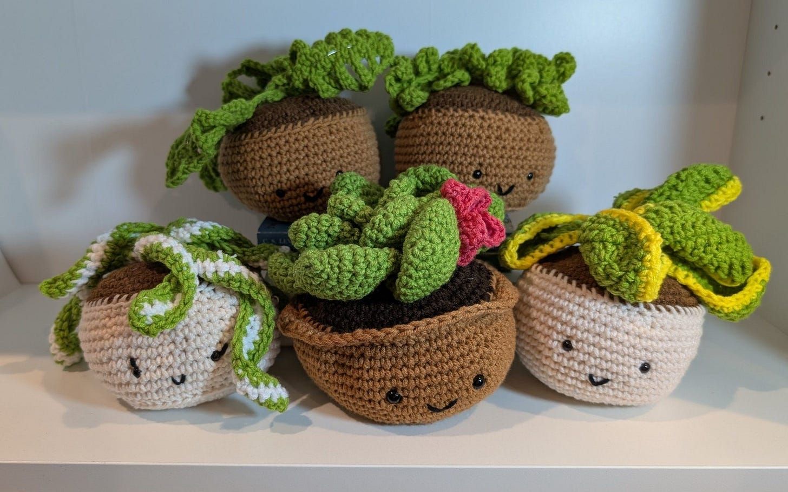

# Reading, Reading, and More Reading

*What I Have Been Reading Lately and Some Observations *

Note: I took the week off last week to recuperate from surgery. The procedure went smoothly, but I had to force myself to not do anything during recovery (I did however make the plants below) This also meant that I had a chance to do some reading (or audiobook listening!) while I was on enforced rest. Now that I’m back, though, books are on my mind!

my recovery plants

I love to read. I’ve spent years devouring books (I was a big fan of the Pizza Hut BOOK IT! program) . By now, David and I have a collection of over 500 books on our shelves—so many that I requested that we cull some before we move them all over to the new place. Instead, he bought four Billy Bookcases from Ikea and worked with Jonathan to assemble them so we would have space to store as many books as we want.

I traveled a lot over the past year, and during that time, I decided to reduce my podcast listening and try books. Podcasts still have a big place in my life, but books let you go much deeper on a subject and give you a better understanding of the author’s point of view. I like to read in multiple genres and see what various thought leaders have to say about a given topic. (You’ll see that I divide my recommendations by topic, along with my observations about each book.)

[Three years ago, I shared my reading list with you here](https://debliu.substack.com/p/on-my-bookshelf-what-i-am-reading). Now I’m excited to share what I have read since then that’s worth diving into.

## **On a Life Worth Living**

***[Four Thousand Weeks: Time Management for Mortals](https://amzn.to/41FbfEd)*** **[by Oliver Burkeman](https://amzn.to/41FbfEd)**: The basic premise of this title is, “Life is short. Don't waste it trying to multitask and life-hack your way through it.” Instead, decide what is important and meaningful and focus on those things. What you spend your time on is what ultimately makes up your life.

This book is less about time management and more about what you invest your most precious resource in. This will not make your life more efficient at doing more things, but it *will* make your time more meaningful.

***[The Good Life](https://amzn.to/43mrMOK)*** **[by Robert J. Waldinger and Marc Schulz](https://amzn.to/43mrMOK)**: Written by two researchers who are stewarding the 84-years-strong Harvard Study of Adult Development, this book asks the question, “What makes a good life?” Spoiler alert! The answer is relationships.

I was a bit surprised at the format of this book, which is more narrative-driven than data-driven, but because the stories are so vivid, they really bring color and compassion to the glimpses the authors share into lives of people we’ll never meet. I found it thought-provoking and a worthwhile investment of time as you think about what matters in life.

***[Die with Zero](https://amzn.to/4i3CaiC)*** **[by Bill Perkins](https://amzn.to/4i3CaiC)**: A friend of mine sold the company he spent nearly two decades building and recently stepped back to take time off. He was the one who told me I had to read this during my sabbatical year. I think he knows me too well. I am currently in the middle of it, and it is a wonderful contemplation of what is important in life.

There is a time in your life when your money is worth more than your time, and there is a time in your life when your time is worth more than your money. This book is a stark reminder of that fact as we wrap up our parents’ estates and what they left behind. We begged them to enjoy life and spend the fruits of their labor, but in the end, they left way too much money and spent way too little. I don’t want us to do the same.

***[Quit: The Power of Knowing When to Walk Away](https://amzn.to/3XqqU7O)*** **[by Annie Duke](https://amzn.to/3XqqU7O)**: I love the simplicity of this book. Knowing when to quit is a skill that not everyone has. This book is a reminder that it is not only okay to quit, but that doing so can unlock new possibilities. Annie Duke shares numerous examples of people and businesses who have to cut their losses, and how that freed them up to pursue new opportunities. We have a stubborn tendency to get overinvested and double down when sometimes, walking away is the best thing. It’s well worth a read for those contemplating a major change in their lives.

[Share](https://debliu.substack.com/p/reading-reading-and-more-reading?utm_source=substack&utm_medium=email&utm_content=share&action=share)

## **On Health and Longevity**

***[Outlive](https://amzn.to/3F54ra8)*** **[by Dr. Peter Attia](https://amzn.to/3F54ra8)**: The medical system is good at fixing what is broken, but not at preventing things from breaking in the first place. Attia argues that rather than treating symptoms, we should be addressing the sources of sickness and decline. His illustration of the Four Horsemen (cardiovascular disease, cancer, neurodegeneration, metabolic issues) and how to address them with lifestyle changes and prevention are important.

There is a lot of science in the book. Most importantly, though, it’s a reminder that life is not just about the years you live, but whether you are in good enough health to enjoy those years. This book led me to read many of the other books below, so I think of it as a “gateway drug for longevity,” if you will.

***[The China Study: The Expanded Edition](https://amzn.to/3DbWTBP)*** **[by Dr. T. Colin Campbell and Dr. Thomas M. Campbell](https://amzn.to/3DbWTBP)**: I started by reading another book by one of the same authors first, called *[Whole](https://amzn.to/4klm3P9)*, which suggested treating cancer only through diet. Given my recent cancer diagnosis, and having watched my parents die of it, I couldn’t continue the book past that section. But I *did* want to learn more about the original studies it cites, so I went back and picked up *The China Study,* which gives more of the science behind his thinking. He shares the thinking and advocacy behind the WFPB (Whole Food Plant-Based Diet), which is a diet that is largely vegan (no dairy, meat, or processed food) and low in protein. I read [several rebuttals to this book to get other takes](https://tim.blog/wp-content/uploads/2011/01/spotting-bad-science-103-the-china-study.pdf), such as [this one](https://deniseminger.com/2010/07/07/the-china-study-fact-or-fallac/), including Dr. Hyman (author of *Young Forever—*see below), who promotes eating a “Pegan” diet, which combines paleo and vegan: 75% plants and 25% protein. Interestingly, Dr. Kristi Funk (author of *Breasts*—see below) is on Dr. Campell’s side.

***[Young Forever](https://amzn.to/3F3svtW)*** **[by Dr. Mark Hyman](https://amzn.to/3F3svtW)**: This is in the same vein as *Outlive*, exploring how to stay healthy and young through diet, sleep, and exercise. It cites a lot of studies, which can get a bit overwhelming, but my main takeaway is that you have more control over your health than you think. Some simple but important lifestyle changes can make a world of difference.

Dr. Hyman backs his recommendations up with studies, and most of the suggestions are doable for those who are conscientious. He did a section on intermittent fasting that led me to a couple of books with deeper dives on the topic, which I am now practicing. (He does disagree with Dr. Campbell on protein. In fact, he is a big proponent of meat and fish as a protein source.) After reading *Young Forever,* I also read his books *[The Blood Sugar Solution](https://amzn.to/4kpYIeZ)**[10-Day Detox Diet](https://amzn.to/4kpYIeZ)* and *[Eat Fat, Get Thin](https://amzn.to/4km9jrr)* to get a better sense of his thinking. They cover similar themes.

***[Fast. Feast. Repeat.](https://amzn.to/4krJCpE)*** **[by Gin Stephens](https://amzn.to/4krJCpE)**: Unlike the first three authors in this section, this author is an educator, not a doctor. Her book is a useful guide for those who want to learn more about autophagy (cell recycling) and how intermittent fasting can help your body learn to burn fat instead of sugar. It starts out with more of the “why” of intermittent fasting and then ends up being a useful how-to guide. Stephens cites research from Dr. Jason Fung (author of *The Obesity Code—*see below), which led me to his books, as well.

I also read a few other books on fasting, including *[Fast Like a Girl](https://amzn.to/3DrwMqr)* (more focused on women) and *[Life in the Fasting Lane](https://amzn.to/41HSHmS)* (more general interest). I thought this one was the best of the three, perhaps because I read it first.

***[The Obesity Code](https://amzn.to/43sg1Gx)*** **[by Jason Fung](https://amzn.to/43sg1Gx)**: While I was not looking to lose weight per se, I did want to understand the mechanism behind how food is turned into energy. This book really delivered on that front. Dr. Fung also subscribes to the school of thought that not all calories are created equal, and simply cutting calories slows metabolism, stalling weight loss. The idea is that insulin resistance and high cortisol levels make it easier to gain weight and harder to lose it. Fung cites some interesting studies showing that just tasting something sweet can increase your body’s insulin response, even if it’s an artificial sweetener with no calories. He also talks about how ultra-processed foods affect your body and how a lack of sleep contributes to weight gain. The title of the book made me delay reading it, but I am glad I picked it up to learn more about how our bodies work.

***[How Not to Die](https://www.amazon.com/How-Not-Die-Discover-Scientifically/dp/1250066115)*** **and** ***[How Not to Age](https://amzn.to/4brCpS6)*** **[by Dr. Michael Greger](https://amzn.to/4brCpS6)**: I read both of these books back to back, and there is a great deal of similar advice in them, so I will write about them together.

Like Dr. Attia argues in *Outlive*, Dr. Greger believes that we are too focused on fixing things as they arise, not leveraging diet to address chronic disease. He cites studies where diet can positively impact health outcomes in *How Not to Die* and then expands on diet changes that can help you live longer and healthier in *How Not to Age.* There are a lot of detailed explanations about things like why taking turmeric every day can be useful, but the overarching theme is to eat more of a plant-based diet. *How Not to Age* also provides a long list of foods you can integrate into your diet for better health. It can be a lot to take in, so picking up a few positive habits (e.g. more berries and apples with skin on) may be the easiest way to incorporate his advice.

***[Why Calories Don't Count](https://amzn.to/43l4t7L)*** **[by Giles Yeo](https://amzn.to/43l4t7L)**: I found this book interesting and quirky. I saw it suggested to me when I was already pretty far down this reading rabbit hole, and I thought, why not?

This a well-researched book that debunks the “calories in, calories out” philosophy of energy. The argument is that not all calories are created equal, and sometimes it matters who is doing the eating. I found Yeo’s dive into the science and history of calories useful for understanding how we took something really complex and turned it into a number. (I do think calories count to some extent, but not in the ultra-simplified way we now use them.)

[Subscribe now](https://debliu.substack.com/subscribe?)

## **On Decluttering**

***[Decluttering at the Speed of Life](https://amzn.to/3XtMZ5w)*** **[by Dana K. White](https://amzn.to/3XtMZ5w)**: I have struggled with containing the clutter in our lives, [up until the moment we moved and took nearly nothing with us](https://debliu.substack.com/p/adding-not-subtracting-what-leaving). This book encapsulates the feeling I had that our things (and our parents' things, since they passed) were taking over our lives. It inspired us to abandon all of our stuff at the old house and move, and then slowly and intentionally move things over. I credit Dana’s insights on containers for how we learned to contain the mess in our lives.

***[Outer Order, Inner Calm](https://amzn.to/41FvFNg)*** **[by Gretchen Rubin](https://amzn.to/41FvFNg)**: Gretchen Rubin is known for her books on happiness. I read this one to get a sense of contrast after reading Dana K. White and Marie Kondo (author of *Kurashi at Home—*see below). It’s a quick read suggesting simple strategies you can put into action immediately. Rather than being a narrative book, it is more of a list of tips you can start applying as you go. I found it to be a good reminder of the things we forget in the middle of the chaos of life.

***[Kurashi at Home](https://amzn.to/4iohvWw)*** **[by Marie Kondo](https://amzn.to/4iohvWw)**: I read *The Life Changing-Magic of Tidying Up* about 10 years ago when my friend, Yuji Higaki, suggested it. While we still had a lot of clutter, we’ve kept our clothes folded and stored in the KonMari method ever since.

*Kurashi at Home* is more for a busy family. It is not about minimalism as much as it is a meditation on our relationship with space and our homes. Even Marie Kondo realized the limits of her own method when she had kids. *Kurashi at Home* is less of a system and more of a way to relate to your physical surroundings.

Other books I’ve read in this same vein are *[The Art of Enough](https://amzn.to/3F5583d)* and *[Cleanish](https://amzn.to/4ilb32m)*, which provide slightly different takes on the same themes.

[Leave a comment](https://debliu.substack.com/p/reading-reading-and-more-reading/comments)

## **Cancer**

***[Breasts: The Owner’s Manual](https://amzn.to/4koRbwX)*** **[by Dr. Kristi Funk](https://amzn.to/4koRbwX)**: After I was diagnosed, [Mauria](https://debliu.substack.com/p/drawing-the-cancer-card) had this book sent to me. My daughter was opening the Amazon packages when she asked why I got a book about breasts. I had not told her about the diagnosis yet, so I just grabbed it and took it to my room.

Until I read this book, I didn’t realize how little I knew about breasts. I guess it just wasn’t something I had thought a lot about in my life. When faced with a challenge, I decided to hit it head-on, doing tons of research and dedicating time to understanding the minutiae. It was the best way for me to gain a sense of control over the situation. I found Dr. Funk’s book reassuring and helpful at a scary time.

***[The Emperor of The Maladies](https://amzn.to/4hWGMXQ)*** **[by Siddhartha Mukherjee](https://amzn.to/4hWGMXQ)**: This is an older book that I started reading after my Dad had just passed from Stage IV cancer in 2012. I couldn’t finish it at the time, but this seemed like a good time to revisit it. Mukherjee’s book outlines how cancer has always been with us, as well as how far we have come since the early testing of chemotherapy. We had very few tools to fight cancer until the 1950s/1960s, when it came into wider use. Since then, the field has come a long way in prevention and treatment, and that gave me a lot of comfort and reassurance that there is much progress in the fight to come. It’s a worthwhile read, though at 600 pages, it is a commitment.

***[Not Fade Away: A Short Life Well Lived](https://amzn.to/4i5wWTM)*** **[by Peter Barton and Laurence Shames](https://amzn.to/4i5wWTM)**: I received this in the mail without much context from my friend, Ash. I had been diagnosed with cancer just before I received it, so I started reading it immediately. It’s the story of a man, Peter Barton, a successful cable TV executive, who had lived a life that by all definitions would have been considered a wild success, but was facing his imminent mortality. [He passed at age 51, before the book came out](https://www.nytimes.com/2002/09/13/business/peter-barton-51-a-founder-of-a-cable-television-giant.html). (The funny thing was that Ash didn’t know I had been diagnosed with cancer, and he later called me to apologize when he heard the news.) This book is a stark reminder that time is short, and you should live each day to the fullest.

---

This is just a short list of some of my favorites from several genres I read from. I have read tons more I have not yet included, and later this year, I will share those including books written by friends (some of my favorites), a group on social issues, and tons on business and leadership.

The books we read impact us in small ways and big. Sometimes it is a quote and other times it is an anecdote and still others change the way we see the world. Books are a treasure that we have the good fortune to engage with where we get to go deep into someone else’s point of view and learn something new. I hope you get a chance to dive in this month and learn something new!

[Share Perspectives](https://debliu.substack.com/?utm_source=substack&utm_medium=email&utm_content=share&action=share)