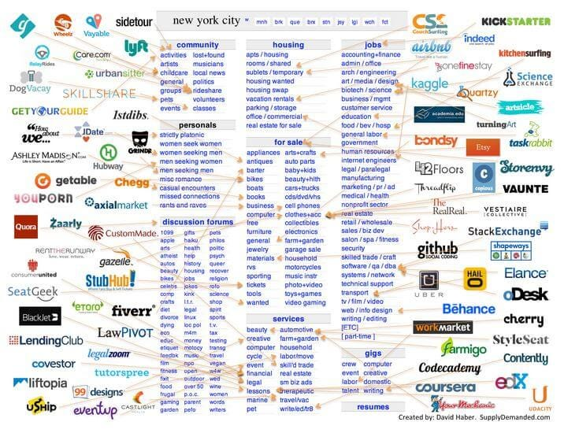
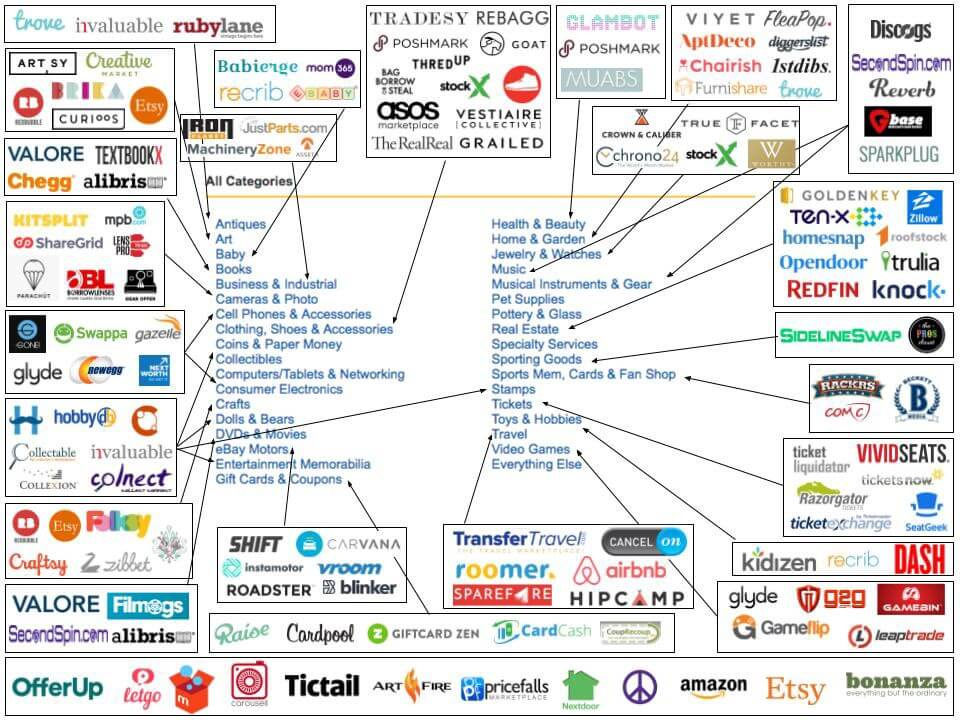
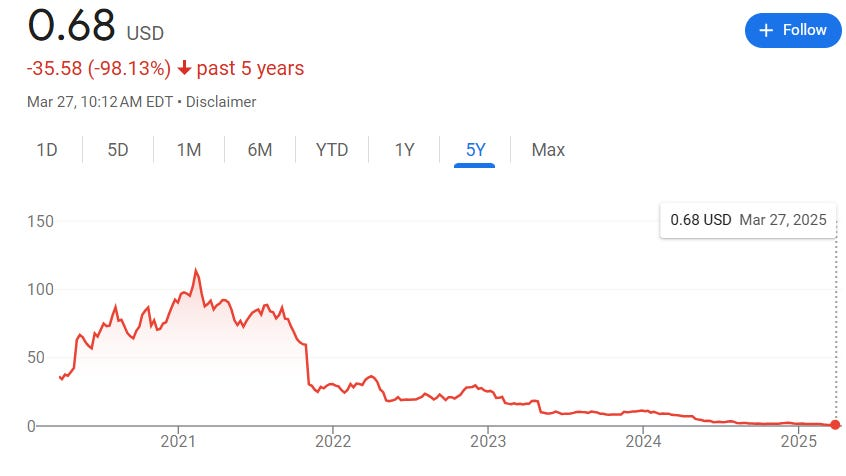

# The Magic of Marketplaces

* Understanding the Lessons of Buying and Selling in an AI World*

[Photo by Clement Souchet on Unsplash](https://unsplash.com/@windclems?utm_content=creditCopyText&utm_medium=referral&utm_source=unsplash)

Marketplaces have existed since 3000 BC. The early Sumerian cities of Ur and Uruk in modern-day Iraq had places where people gathered to exchange goods, livestock, and food. Likewise, in ancient Egypt, major cities had designated areas near town centers or temples where merchants and locals met to trade. Major civilizations in India, Greece, China, and the Middle East all developed marketplaces as gathering places for buyers and sellers. These spaces often served as political centers and fostered the exchange of ideas. They were the heart of early urban life, situated alongside trade routes, temples, and inns were merchants from distant lands came to hawk their wares.

Cultures evolved around marketplaces—from the Greek Agora to the Silk Road to the Turkish Bazaars of the Ottoman Empire. These spaces brought together people from all backgrounds, even those who didn't share a language or culture.

That’s why I’ve long loved marketplaces. I recently [gave a talk](https://www.youtube.com/watch?v=DVmREKa9J9s) with the founders at *[Everything Marketplaces](https://www.everythingmarketplaces.com/)*, hosted by Mike Williams, and it reminded me how much I enjoy the magic that lives within them. Someone commented that AI will eventually replace marketplaces, but I believe generative AI will actually enhance the category.

[Share](https://debliu.substack.com/p/the-magic-of-marketplaces?utm_source=substack&utm_medium=email&utm_content=share&action=share)

### **What Makes Marketplaces Special**

From the start, marketplaces were more than centers of commerce—they were community hubs, physical spaces where people could gather to get things done. Over time, these evolved in form but remained central to everyday life. Today, physical marketplaces take many shapes: malls, trade shows, and farmers' markets, among others. Some marketplaces don’t look like marketplaces at all—they use brokers or market makers to intermediate, such as stock markets, real estate, advertising, and talent agencies.

Even your attention is bought and sold in a marketplace. The ads marketplace has long existed, with agencies helping advertisers (buyers) acquire ad space—often booked upfront for the next season—from networks (sellers). The internet transformed this world: from static banner ads to programmatic ads and real-time bidding, all competing for your attention in milliseconds.

With the rise of the internet, early marketplaces like Craigslist and eBay connected buyers and sellers at scale. Over time came the unbundling of Craigslist and eBay, as individual verticals grew large enough to stand alone.

[Marketplace Pulse - craigslist](https://www.marketplacepulse.com/articles/unbundling-ebay)

[Marketplace Pulse - eBay](https://www.marketplacepulse.com/articles/unbundling-ebay)

I started my tech career at eBay. While in business school, I interned part-time in 2000 (yes, the year of the dot-com bust and rolling blackouts). My role in category management was to launch two new verticals. I drafted the strategies for the sports equipment and musical instrument categories, which were later built out. Each had a unique seller and buyer set, which I researched through interviews. Then I outlined how to bring them together. That experience gave me the marketplace bug.

Through it, I saw how online marketplaces were fundamentally reshaping commerce. What makes them powerful is their ability to level the playing field. Small upstarts can compete with giants. With the right strategy, a startup could enter previously closed markets, bypassing traditional gatekeepers and reshaping entire industries.

[Leave a comment](https://debliu.substack.com/p/the-magic-of-marketplaces/comments)

### **How They Evolve**

Every marketplace begins with a gap. eBay focused on collectibles and used auctions for items with unknown value. Amazon sold fixed-price catalog goods, starting with books. Etsy replaced craft fairs. Craigslist served local classifieds. Thumbtack tackled local services. Airbnb for rentals. Zillow for real estate. Uber for transportation. Shutterstock for images. Instacart for groceries. DoorDash for takeout. Chegg for study tools.

Some less traditional marketplaces include Google for web search, Roblox for kids’ games, Match for dating, and LinkedIn for jobs. At their core, marketplaces are about matching supply and demand—whatever form that takes.

Each addressed a pain point that wasn’t solved in the real world. While many started with liquidity and discovery, the winners eventually focused on trust, transparency, and facilitation. Their strength came from identifying a specific unmet need—their wedge—and building from there.

Today, lines are blurring as marketplaces enter adjacent categories. Amazon added auctions. eBay added fixed-price listings. Etsy allowed non-handmade goods. Uber added food delivery and partnered with Instacart for groceries. DoorDash moved into groceries from takeout. New vertical players emerged—GOAT and StockX for collectible shoes, for example—picking off high-value niches.

### **Laddering Up Your Marketplace**

Every successful marketplace begins with a kernel of value—an unmet need drawing people together to transact. When point-to-point solutions fail—due to distribution or discovery challenges—a marketplace can address that pain.

Marketplaces are either buyer-constrained or seller-constrained. Knowing which you are is crucial. Most are buyer-constrained: sellers will go where the buyers are, but the reverse is less often true.

Interestingly, Facebook Marketplace at launch in 2016 was supply-constrained. Many people browsed, but the right item at the right time was missing. Our strategy focused on solving this: we enabled sellers to cross-list items from Buy/Sell Groups into the new Marketplace Tab for several weeks, seeding supply before ramping up buyer traffic. When buyers arrived, they found value—encouraging them to return.

A thriving marketplace is dynamic—new supply appears frequently, creating a sense of serendipity for buyers. This dynamism is key to keeping buyers engaged.

[Share Perspectives](https://debliu.substack.com/?utm_source=substack&utm_medium=email&utm_content=share&action=share)

### **Connecting Buyers and Sellers**

Facebook Marketplace succeeded for three reasons:

1. Sellers were real people in the local community, building trust through mutual connections and account history.
2. Inventory was mostly exclusive—sellers didn’t cross-list widely.
3. Discovery was serendipitous, not search-based, surfacing relevant items passively.

Every great marketplace has this “special sauce.” eBay’s feedback system was innovative (though it later needed refinement due to retaliatory reviews). Airbnb had exclusive inventory. Uber had dense driver coverage. Amazon had strong affiliate and logistics networks.

At the core of all of this is trust. Buyers rely on marketplaces for trust signals they don’t get in direct transactions. They know there’s intermediation if something goes wrong—more than just a credit card dispute.

For sellers, marketplaces aggregate demand. Selling directly works if you can drive your own traffic via email, SEO, or ads. But marketplace fees (sometimes 10%–50%) buy access to buyers, trust, customer support, and marketing infrastructure.

### **How Marketplaces Will Change with AI**

Marketplaces trading purely in content are most at risk in the AI era—especially those selling digital goods. That’s why Chegg’s stock was hit recently. If public (or private) content can be scraped and summarized by LLMs, the need for that content source diminishes. Why read reviews when an LLM can tell you the best hotel for your needs? Why pay to list a job if the listings are already aggregated?

Just as online marketplaces disrupted offline ones, AI now threatens marketplaces with low barriers to entry—especially those with commodity inventory. Information or “thin” transaction marketplaces need to evolve quickly—deepening their functionality around transactions, trust, or exclusivity to remain defensible.

Yet, AI can also supercharge marketplaces. As Larry Page once said, “The ultimate search engine would understand exactly what you mean and give back exactly what you want.” Imagine that power in the hands of marketplaces doing the matching.

**Here are four ways AI can enhance marketplaces:**

1. **Enhanced Matching and Personalization**  
    AI can deliver sophisticated personalization, increasing conversion rates and retention while lowering acquisition costs
2. **Simplified Supply Activation**  
    AI tools reduce friction for suppliers, especially small businesses, by simplifying product listing and integration workflows.
3. **Reduced Service Costs**  
    AI can reduce buyer confusion and seller errors by capturing structured data and offering real-time support at low cost.
4. **Improved Fraud Detection**  
    AI can detect patterns of fraud—buyer, seller, or collusion—improving trust while freeing up resources to invest elsewhere.

   ---

Marketplaces are all around us, powering much of our lives without being visible. Those in the game will need to evolve their strategies in the coming AI era, focusing on deepening relationships with buyers and sellers through personalization, exclusive inventory, end-to-end service, and embedded trust. The deeper marketplaces integrate into transactions, the better they can withstand AI disruption while leveraging its benefits.

This evolution mirrors the journey marketplaces have taken since the dawn of civilization. As we enter the era of generative AI, successful marketplaces will embrace this technology not as a threat but as a tool to create more personalized experiences, secure exclusive inventory, and provide seamless service with embedded trust. By evolving from simple matching platforms to full transaction partners, these marketplaces will not only shield themselves from disruption but will harness AI's power to create experiences beyond our current imagination—just as the ancient Sumerian marketplaces evolved into today's digital platforms, tomorrow's AI-powered marketplaces will transform how we discover, connect, and exchange value in our world.

[Subscribe now](https://debliu.substack.com/subscribe?)