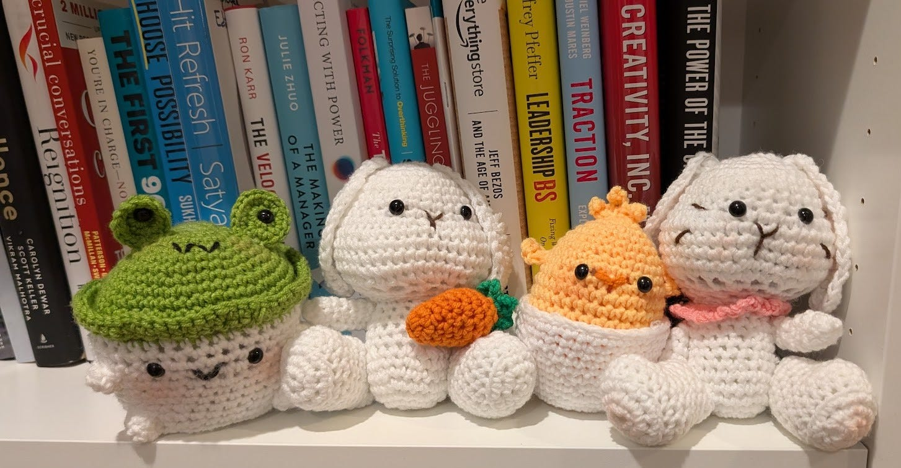

# What We Learn from Sickness

*"A healthy man wants a thousand things, a sick man only wants one." —Confucius*

The past couple of months have been a blur. After stepping down following four years at Ancestry, I went straight into surgery for early-stage breast cancer. This gave me a lot of time to contemplate deeply about health and sickness. Each time we get sick, we forget what it was like to feel well, yet when we are healthy, we forget how debilitating sickness can be.

During this recuperation period, I read a couple of books that ponder the nature of health and sickness: *[Being Mortal](https://amzn.to/3DICUuN)* by Atul Gawande and *[The Invisible Kingdom](https://amzn.to/43PCBZG)* by Meghan O'Rourke. Gawande speaks of how modern humans have a hard time wrestling with sickness, especially the decline of age, which is largely an irreversible march. Meanwhile, O'Rourke writes deeply about her struggle with mysterious chronic conditions for over a decade.

I spent most of my twenties sick. Not as sick as Meghan, but I had several conditions that deeply affected my life. I lived with severe allergies and made countless trips to the emergency room with bad migraines, back pain, and extremely painful periods. I felt crappy for many days a month, and I resigned myself to just push through each day by sheer will.

Whereas the other conditions were more routine, the migraines really debilitated me. They were particularly susceptible to changes in routine and were most acute whenever things in my life were out of sync. As a result, I spent more weekends than I could count huddled in a dark, quiet room, sleeping off the pain. I remember hearing my husband begging the kids not to run and play near our bedroom because "Mommy is not feeling good today." I wondered to myself how often he said that while I lay asleep in the dark.

[Share](https://debliu.substack.com/p/what-we-learn-from-sickness?utm_source=substack&utm_medium=email&utm_content=share&action=share)

Eventually, I was given a reprieve. After three kids, the changes in hormones from pregnancy, combined with a new mini pill, helped me manage the back pain and period issues. After failing multiple allergy treatments, I finally found a monthly shot—combined with two prescription medicines—that got my allergies under control. Years of lifestyle changes and evolutions brought the migraines from something that happened every couple of weeks to something that happened a few times a year: annoying, but no longer a big part of my life.

I spent the last decade enjoying good health beyond the occasional flu or bad cold. For the most part, I have been able to stay outside of the realm of sickness I had once inhabited. I worked out every day for the last 13 years, and I was much healthier after I reduced the amount of sugar I ate and started practicing intermittent fasting. Life was good during those years, so much so that the memories of those difficult days of sickness became a faint memory.

Being diagnosed with cancer was a wake-up call for me. After years of being free, I was terrified of going back to the days when I was sick, when my life was day after day of trying to pretend things were fine. Of wondering how I could make excuses to get out of doing things I could not physically get myself together to do. Of worrying how my inability to be there would affect the kids.

[Leave a comment](https://debliu.substack.com/p/what-we-learn-from-sickness/comments)

## **What we care about**

What we learn from sickness is what we care most about. When our health is taken away, our priorities crystallize. I had surgery on February 25th, and I had a lot of anxiety going into it. I hate the feeling of being dependent on others and feeling useless.

During my recovery, I realized how much I had taken for granted. I had to rely on others to do so many things for me that I had always done for others. I remember putting away the dishes one last time the night before the surgery, wondering when I would feel well enough to do it again.

Facing being sick and needing others strips away everything. What matters is focusing on getting better and finding meaning in each day. I discovered how much I valued my independence and not having to ask for help. At one point, I dropped my Pixel Pod case and the earbuds fell somewhere beneath the bed. I just had to leave them there until David had time between meetings to dig them out from where they had rolled.

Every time I asked for something, I was reminded of how much autonomy means to me, and how easily it can be taken away. But this time also allowed me to find so much meaning in small things that had once seemed trivial.

I love cooking for my family. The act of making something for them to enjoy was a big part of my place in the household. The day before I went into surgery, I made a huge pot of chicken pho in the Instant Pot. Danielle had shared how much she loved pho and wanted us to make it together at home. That was what we ate together the following week when I could no longer cook for us.

[Subscribe now](https://debliu.substack.com/subscribe?)

## **Who cares about us**

When I was 22 and just out of college, I had a surgical biopsy to remove two cysts (thankfully benign). I told no one about it other than David and my family. I remember our pastor chiding me for keeping it to myself and not letting others support me. I felt embarrassed to tell anyone, and I was new to the church, so I was hesitant to share.

This time, [I ended up telling the world](https://debliu.substack.com/p/drawing-the-cancer-card). I had promised my friend Mauria that I would get a mammogram, and I wanted everyone to know because it was her encouragement to get screened—and her openness about her own experience—that had led to the discovery of my cancer. Since I wrote openly about it, over three dozen women have reached out to tell me they’ve scheduled the screening.

I also unexpectedly experienced a huge outpouring of support. Though I didn't get a chance to respond to every message, it gave me a boost to know that someone was praying or supporting me. People I had not connected with in years reached out. Many friends had gone through similar experiences in their own lives, and their advice was invaluable. I found insight in the book suggestions, personal research, and stories of those who’d had to travel this path before. It was also wonderful to know how their journeys went and what it felt like on the other side of the diagnosis and treatment.

I found tremendous comfort in knowing that I didn't have to go through this alone.

## **What it means to slow down**

David likes to joke that I have two modes: on and off. He said he has a screensaver mode, which is sort of half-on, half-off. (For you young people, here’s a bit of trivia: When old CRT computer monitors would display the same image for too long, it would cause a phosphor burn-in. Screensavers were originally used to keep images from staying static, thus reducing the risk of screen burn.)

Since I don't really have a screensaver mode, I would always tend to stay on, pushing myself until I hit my limit. After surgery, my body could no longer push to the same limit, even though it had been my default mode just a few weeks before. David pointed out that I am a chronic “overdoer,” and I was forced to reckon with that, whether I wanted to or not. A couple of days after the surgery, I started doing things like emptying the dishwasher or cooking the kids dinner. I would feel fine for periods until suddenly I would need to lie down because I had overdone it. It was very much like running a race and then slamming full speed into a wall. I started telling him, "I am 100% only 20% of the time," so we could gauge how far to push things. Slowly, I inched up to where I am now: about 100% about 75% of the time, which is a huge improvement.

Recovery forced me to learn to slow down, not overbook, and not overdo. Before the surgery, I bought some crochet kits to work on with my kids as I recuperated. So far, we have made five plants, two bunnies, a chick, and a mushroom frog (weird, I know). The crocheting gave me something to focus on, something to keep me occupied without otherwise hurting myself. I now have quite the little collection of crochet projects—and a new hobby to share with the girls.

[Share](https://debliu.substack.com/p/what-we-learn-from-sickness?utm_source=substack&utm_medium=email&utm_content=share&action=share)

---

Several of my friends who went through the same cancer told me that they were grateful for what the experience taught them on the other side. Initially, I was skeptical. But they were right. Being sick focuses your mind and clarifies your thinking. When you can't out-work or out-think your way through any problem, that is when you realize what really matters.

Illness has a way of stripping everything down to its essence. The projects that seemed urgent, the emails that needed immediate replies, the social obligations that felt so important, all fade into the background when your health is at stake. What remains are the people who matter to you and an appreciation for the gift of another day to spend with them.

[Subscribe now](https://debliu.substack.com/subscribe?)

---

**Note from Deb:** Some of you have asked what comes next. Last week, we got the good news that the surgery removed all of the cancer, and it has not spread. Next up is radiation treatment, likely starting in a few weeks, and continuing through the month of April. Then I will have several years of tamoxifen to reduce the chance of recurrence. Outside of pulling the cancer card, I have been lucky (or blessed). The cancer tested as pretty aggressive, but it was caught early, before it had a chance to spread. I am grateful to the medical professionals and researchers who have taken what could have been very serious and made it very treatable.