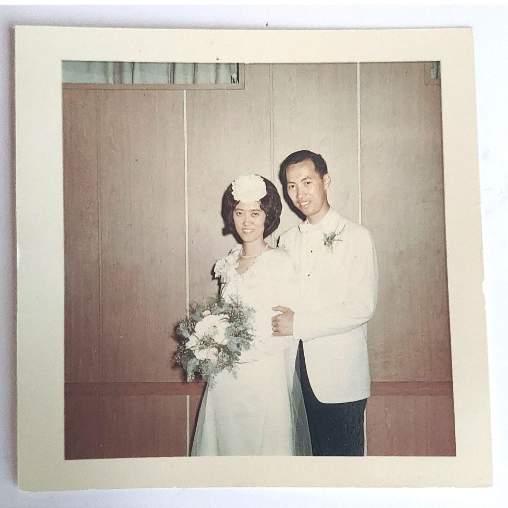
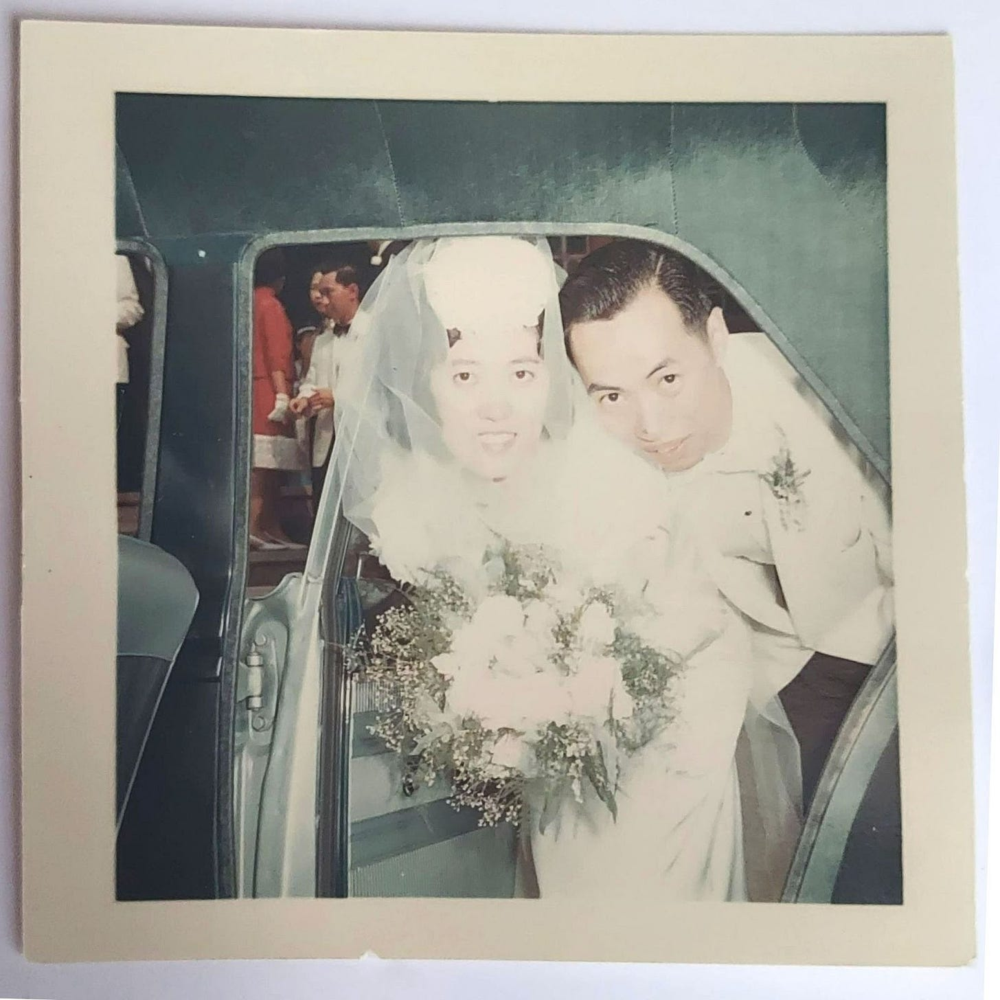

# Lessons from My Parents 

*Things I learned all too well from my immigrant parents*

[Share Perspectives](https://debliu.substack.com/?utm_source=substack&utm_medium=email&utm_content=share&action=share)

My parents on their wedding day

May is AAPI (Asian American and Pacific Islander) Month.

The history of Asian Americans in this country is a complicated one. The Chinese Exclusion Act of 1882 began an era when many Asians, not just Chinese, were not eligible to immigrate, and those who were already here could not become citizens ([ref](https://www.pbs.org/ancestorsintheamericas/time_21.html)). This changed in 1943, when China was an ally during the war, but even then, the annual number of immigrants was capped at just 105 ([ref](https://www.archives.gov/milestone-documents/chinese-exclusion-act)). These strict limits lasted until the 1960s, when Congress passed immigration reform enabling people like my parents to come to America to study. This doubled the number of Asians living in the U.S. ([ref](https://www.loc.gov/classroom-materials/immigration/chinese/a-new-community/)).

My parents came from their home in Hong Kong to study in America. They traveled across the world to a country they had never even visited before. They knew little about the colleges they would attend, and they weren’t sure when—or even if—they would be able to return home. Their possessions were limited to the suitcases they traveled with and what little they had. But they came here dreaming of starting a new and better life.

When they arrived, each of my parents was asked to choose an “American name” that would be easier for people to pronounce, making it easier for them to assimilate. My mom decided on Audrey, and my dad chose William. Though they had both traveled from Hong Kong, they didn’t meet until later, when they were working as waiters in the Catskills one summer. When they wrote to their families explaining that they were planning on marrying, it turned out that their parents all knew each other already, having lived just a few streets apart.

That was a very different time. There was no internet. No cell phones. No texting. Communication mainly took the form of letters, with the occasional brief long-distance phone call on special holidays. My parents would time these calls down to the exact minute; long-distance calls cost several dollars a minute, and the minimum wage at the time was only $1.50.

When my parents got married, few of their relatives could make the overseas trip, so my mother’s godparents came to the small church to act as witnesses. My mom and her friends made all of the flower girls’ dresses themselves, as well as her wedding gown. When it was over, my parents helped clean up the church, then drove to a small town near Niagara Falls for their honeymoon, unable to afford much else. They settled in Queens, New York, near some of my father’s family members, who had also immigrated to the U.S.

Times were tough, and the company where my father worked refused to accept his engineering degree, keeping him instead as a technician at a lower pay grade. One of his friends, who had moved to South Carolina, encouraged my father to make the same move and come work for the government. So, in 1982, our parents moved us from the big city to a small town, seemingly in the middle of nowhere, in South Carolina. The Asian population there was no more than 1%.

Our parents taught us many things. This AAPI Month, I would like to share a few of the lessons they instilled in us—the ones we kept, along with the ones we shed to forge our own stories.

My parents right after their wedding ceremony

### **1. “Put your head down and do the work.”**

From an early age, our parents instructed us not to stand out. They often recounted their early years in the U.S., when they had jobs on green cards. Sometimes coworkers would taunt them, holding their immigration status over their heads with remarks like, “Well, **you** can be deported any time.” With those words hanging over them, our parents kept quiet. Keeping quiet meant not making waves, and not making waves meant not becoming a target. When the school made them bring my sister’s birth certificate to prove she was an American citizen, even though that was not a requirement to get an education, they complied. They knew this was not asked of other families, but they didn’t press the issue. They did what they needed to do, and they rarely ever complained.

My parents taught me to put my head down and do the work. Unfortunately, that only got me so far in my education and career. I often found myself standing between my Chinese heritage and the life we were living in the deep South. My parents didn’t fully understand my world, and in the same way, I didn’t fully understand theirs. I wanted to see a change in the world, and I knew I had to speak up to create it.

There are times in life when you have to stand up and push back. Being true to who you are means more than doing the work and staying quiet. It means finding your voice and standing up for what you believe, even if that makes waves.

### **2. “As a girl, you should be graceful and demure.”**

My sister and I were not your typical girls. We played rough, fought like cats and dogs, and ran through the house shouting. We would spend hours traipsing out in the yard and forest behind us. We shot BB guns with our dad, and we laid traps for the raccoons that ate our garbage. We didn’t brush our hair. We rolled out of bed already wearing our going-out clothing (this meant less time spent getting dressed). We were often told we would “never find husbands” with our lack of grace and our height (in the 99th percentile for America, let alone Asia).

I don’t play out in the yard or forest much anymore (allergies), and on most days I do take a brush to my hair. But I’ve also learned that sometimes it is fine to let go of cultural history to find your place in this world and be who you really are. My sister and I embraced our true selves, and we are not ashamed that we don’t conform to a stereotype.

When you learn that you don’t have to fit into a mold someone else made for you, you can become your authentic self and find those who love you for that.

### **3. “Become an engineer for the job security.”**

My parents didn’t adhere to the old Asian adage, “Doctor, lawyer, engineer, or failure.” Their philosophy was more pragmatic than that. My dad got his degree in electrical engineering, then went on to work for the Bell System. When we moved to the South, he worked for the U.S. government fixing nuclear submarines, then nuclear power plants, and finally infrastructure on an air force base. For my dad, engineering meant job security, even when it took him from NYC to Charleston to Augusta to Altus, Oklahoma (home of Garth Brooks!). Given how poor my parents were when they came to America, he wanted to do everything possible to build a secure life. He encouraged me and my sister to go into engineering so we could have that same security.

In the meantime, my mom did whatever it took to help out. Though she had a college degree, she stayed home when we first moved south. She later became a school bus driver, worked at a Chinese fast-food restaurant and did wholesale shows for my cousin.

I got my undergraduate degree in civil engineering, while my sister majored in chemical engineering. Since then, our career paths have taken us both out of the engineering field. However, the lessons we learned from the rigors of engineering school have stayed with us, propelling us beyond the confines of our degrees to where we are today.

### **4. “Be a producer, not a consumer.”**

Growing up, we were never given an allowance. We did chores and focused on school, but the one thing our parents always invested in was our creativity. We devoured books on crafts at the library, and we were allowed to buy tons of craft supplies. Mom taught us to crochet, sew, and knit. We later taught ourselves calligraphy, clay sculpting, and origami.

By ages eight and ten, my sister and I had our own small business called Lau Handicrafts. My dad built a tiny booth for us to do craft shows. We learned to set up shows, price items, work with customers, and take custom orders. We handled any issues customers had, learning when to haggle and when to raise our prices. By the time we were in high school, we were making enough spending money from our side gig for gas and clothes. Our parents’ encouragement to embrace our creativity and make things has stayed with us all these years.

A short while ago, I saw some earrings on Amazon that were almost exactly like the ones my sister and I made 30 years ago. I would create the cranes by hand. My sister would lacquer and assemble them. I would put them on special cards we had printed. We charged $3.00 at the time (with a bigger discount if you bought more than three pairs). Now, over 30 years later, you can buy [similar ones on Amazon for $30](https://www.amazon.com/Origami-Paper-Crane-Earrings-Anniversary/dp/B01LQXE4R4).

Earrings now on Amazon similar to the ones I made

### **5. “Sing like nobody is watching.”**

Our father was the undisputed king of karaoke in our extended family. He loved to belt out Elvis Presley and The Pretenders, and it didn’t matter who was watching. He sang everywhere. Whether for an audience of one in the shower or a room of a hundred at karaoke, he belted it out with aplomb. He even inspired us to sing in the church choir for a time.

Our father was always his authentic self. He was confident in who he was and was unapologetic about it. He ate three meals of rice every day (because rice was life), including bringing a Tupperware of it with him to microwave at work. He never cared what others thought of his meals, his choice of outfits, or his style. His silliness and sense of embarrassing humor added to his charm.

Dad lived out loud in a place where I wanted him to be silent. I sometimes wished he was less outspoken, less attention-drawing, less himself. But he understood that you could never make the critics happy, so he lived just as he was, with no shame. This was something I struggled with.

With time and experience, I have come to find my own voice. Though I was once mortified by how authentic my father was in living his life, today, I reflect on those lessons with admiration. [It has been 10 years since his passing](https://debliu.substack.com/p/what-i-learned-about-empathy?s=w). I only wish he could see his family now.

### **6. “Save everything. It can be reused for a purpose.”**

For years, due to how tight the finances were, our family saved and reused everything. Our old rickety high chair became a tree stand at Christmas for our tabletop Christmas tree, or a makeshift present-holder. When it wasn’t Christmastime, the high chair served as a plant stand for all the indoor plants my mom grew.

My dad carried the same “work bag” to work every day for close to 40 years. It consisted of two brown paper bags (double bagged) inside one crisp, white, plastic Kmart bag. The brown paper bags gave his work bag support and structure, and the plastic bag gave it handles. My father always made sure his work bag was tidy, and he kept it in the same place for years.

Our family also got a lot of our clothes at thrift shops and discount stores. When we were done with them, we would pass them along to other families, or, if there were holes, turn them into rags we could use to clean the house. We saved our old toothbrushes to clean the white wall on the car tires.

Though we are more comfortable now than we were when we grew up, we still retain that frugal style of living and have passed it down to our kids (who also wore hand-me-downs and used second-hand bikes). It was that frugality that led me to create [Facebook Marketplace](https://www.lennysnewsletter.com/p/the-inside-story-of-facebook-marketplace). I had bought and sold for years on the site and thought we should build a place where everyone could do the same.

---

Though I spent much of my childhood hiding who I was, for AAPI Month, I wanted to share how my parents’ lessons shaped my worldview and perspective. Growing up all-American with immigrant parents showed me two very different worlds, which blended into one and made me the person I am. I am proud to carry that heritage with me, and to share these lessons with my children.

[More Stories Arrive August 2022](https://amzn.to/3FmjU0v)

[Share](https://debliu.substack.com/p/lessons-from-my-parents?utm_source=substack&utm_medium=email&utm_content=share&action=share)