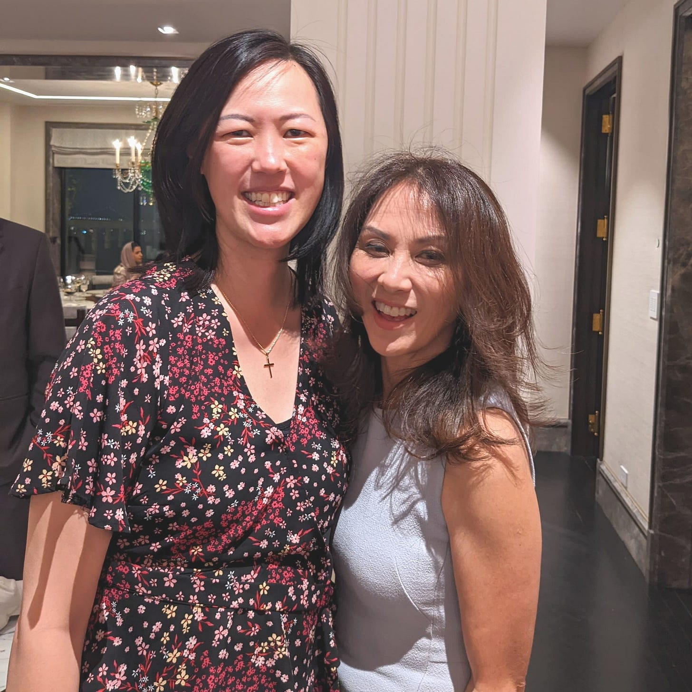

# Turning Points

*How one person can change how you see the world *

[Share](https://debliu.substack.com/p/turning-points?utm_source=substack&utm_medium=email&utm_content=share&action=share)

When I was a freshman at Duke, I was instructed to call a law professor to ask for help on something. (I don't even remember what it was.) I knew I was asking for a favor, and I couldn’t get over the sense that I was imposing on someone who no doubt had an insanely busy schedule. I picked up the phone and called anyway, and the professor, an Asian American woman, answered.

Her reaction astounded me. She was open, kind, patient, and supportive. Not only did she take the time to talk to me and coach me, but she seemed genuinely interested in helping me—a stranger who had cold-called her.

I grew up in South Carolina, a place with very few Asian Americans, let alone Asian American women professors. Yet here was someone who was like me, but in an incredibly important position, and she had taken the time to talk to me, a nobody (in my eyes, at least). I remember having a fangirl moment. I was so stunned she even answered the phone that I felt like I was stuttering when I talked to her.

I later recounted the story to my then-boyfriend, now my husband of two decades. I remember telling him her name and what that call meant to me. It turns out David had met her in person, and he recalled how kind she had been to him. He aspired to go to law school, so meeting an Asian American law professor was memorable for him as well.

It's been over 25 years since that phone call. Recently, I was at a party, and someone across the room said a name that I immediately recognized. I looked over and realized they were talking to the same professor I had spoken with all those years ago.

I wondered if I should even approach her. I almost didn't say anything; she is now incredibly famous, and I felt so silly walking up to her to remind her of a phone call that she had probably long since forgotten. But that interaction had made such an impression that I couldn’t let myself leave without thanking her for it. So I worked up the courage and went up to Amy Chua. I told her how I had called her when I was 18 and reminded her of how she had taken the time to talk to me and give me advice. It was so incredible to meet her in person, express my gratitude, and thank her for helping an impressionable kid see that it was possible to succeed as an Asian American woman. Of course, since then she has gone on to be even more successful and well-known, but the mark she left on me is something I will never forget.

I coach a couple of people a week. They probably won't remember me in a year or two. And that's okay. But maybe, 25 years from now, I'll be at a party and they'll tell me how much they remember that one conversation or that one phone call. I don’t expect this, of course, but part of the reason I coach is because I understand how the right interaction at the right time can change someone’s life for the better.

There are times when you cross paths with people who touch your life in special ways. They come briefly into your life and then depart again, sometimes after just a few minutes, but their words and actions stick with you. Often, your paths never cross again, but if they do, you can thank them for making a difference at an important point in your life, when you were unsure of yourself or your place in the world.

### **Pay It Forward**

Even if you never get a chance to thank someone for helping you, you can still make a difference in someone else’s life.

I try very hard to respond to everyone who contacts me, even if it’s just a short call or an email. For every Women in Product online conference, I go to the 1:1 chat roulette and speak to people for an hour. This is my way of "bumping" into people I may otherwise never get a chance to meet. Although I doubt most of these conversations are that memorable for the other person, sometimes people can benefit from the help you give in surprising ways.

Take a moment to think back on someone whose words, advice, or actions have impacted you. As you reflect on this, ask yourself how you can pay it forward. Make time to give to others what someone else gave to you.

### **Show Gratitude**

I am sure that Amy Chua has touched the lives of many people, so I thought to myself that it would be silly to thank her. But I thanked her anyway. She smiled broadly and thanked me in return for reminding her of our first encounter, saying that I made her day.

Often the people who make the biggest difference in your life will never know the impact they’ve had on you. By taking the time to go back and show your gratitude, you can close the loop and show them that their actions made a difference. [Don't wait for someone else to do it](https://debliu.substack.com/p/the-power-of-gratitude-thanking-the?s=r). Reach out to those who have impacted you, who gave you hope when you were lost or showed you that your dreams were possible. Thank them for the profound effect that they’ve had on you.

### **Remember Your Impact**

99 percent of the time, objects in motion will simply brush past each other. But sometimes they collide, and one or both of them change direction. Know that your words, sometimes spoken lightly, can affect others in good and bad ways.

I have had people tell me years later that my advice changed their lives. I have also had people tell me that I was inattentive or dismissive when they met me, and how that made them feel. The truth is that I don't remember most of these conversations, good or bad. I am an object rolling along and bumping into others, sending them careening in a negative or positive direction. My encounter with Amy at that party has reminded me that the smallest of interactions can have lasting effects.

---

I've read over the years about Amy's mentoring of students and how she has supported and advised them. Each time, I’ve thought back to our encounter. This story will mostly be notable as you read it because of who she is and how well-known she has become. But I remember her for a completely different reason: the fact that someone who looked like me cared enough to show me what was possible, early in my life.

Some people change the course of our lives every day. Pay it forward, show them your appreciation, and know that you may have the same impact on others.

[Share Perspectives](https://debliu.substack.com/?utm_source=substack&utm_medium=email&utm_content=share&action=share)

[Leave a comment](https://debliu.substack.com/p/turning-points/comments)