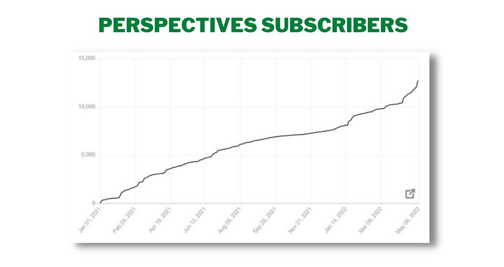

# What to Read on Perspectives

*A look at the most popular and interesting posts thus far *

[Share Perspectives](https://debliu.substack.com/?utm_source=substack&utm_medium=email&utm_content=share&action=share)

Wonton knows Perspectives is a good read; [follow Wonton on IG](https://www.instagram.com/wontonpoodle/)

### **Getting Started**

When I first started Perspectives on New Year’s Day of 2021, I didn’t have many clear expectations. I just sat down and wrote, since that was my New Year’s Resolution. Writing these posts was a way to record my thoughts, work through my thinking, and share advice that might be helpful to others. It is incredible how much Perspectives has grown since then. In the last 15 months, this newsletter has gained close to 13,000 readers.

I am so thankful for each of you! I really appreciate you taking the time to read what I have written. With so many of you new to Perspectives, I thought it would be worth sharing a list of some highlights. If you’re not sure where to begin, these articles are a great place to start.

### **Most Read Articles**

1. **[Make the First 90 Days Count](https://debliu.substack.com/p/make-the-first-90-days-count?s=wdays-count?s=w)**: No matter your role or company, having a 30/60/90 day plan will help you make the most of your first three months at a new job. This guide includes the template I created to outline my 30/60/90 day goals when I started at Ancestry last year. Even now, well over a year later, people still message me thanking me for the example.
2. **[Best Practices For Developing A Product Strategy](https://debliu.substack.com/p/best-practices-for-developing-a-product?s=w)**: “The perfect strategy that is not executable is no better than having no strategy at all.” This post explains my system for developing an actionable and impactful product strategy, including what I like to call the “Four Os.” It resonated with a lot of subscribers.
3. **[Ten Things Getting In The Way of Your Execution](https://debliu.substack.com/p/ten-things-getting-in-the-way-of?s=w)**: Remember, *No Sacred Cats!* (Click on the link to find out more about what this means.) Good execution is imperative for any team, but it often gets hampered by the systems that are in place. This article discusses the most common barriers to execution, as well as the values that I learned while working with my friend [Vijaye Raji](https://www.linkedin.com/in/vijaye/), who is now the founder of Statsig.
4. **[A Guide For Onboarding into A New Role](https://debliu.substack.com/p/a-guide-for-onboarding-into-a-new?s=w)**: As I started my role at Ancestry.com, I reflected on the lessons I learned when I onboarded new employees at Facebook. I described best practices for finding alignment, building trust, and approaching a new role with curiosity, along with how I planned to apply these principles in my new job.
5. **[The Path To CEO: An Interview with Fidji Simo, New CEO of Instacart](https://debliu.substack.com/p/the-path-to-ceo-an-interview-with?s=w)**: For this post, I interviewed my friend and fellow former Facebook coworker [Fidji Simo](https://www.linkedin.com/in/fidjisimo/). We talked about her journey from humble beginnings to becoming the CEO of Instacart.

### **Most Shared**

1. **[How To Negotiate Almost Anything](https://debliu.substack.com/p/how-to-negotiate-almost-anything?s=w)**: With the right strategy, you can negotiate pretty much anything—even things that initially seem non-negotiable. In this article, I discuss the principles of a successful negotiation, from preparation to prioritization.
2. **[Avoid The Pitfalls Of Taking On A New Role](https://debliu.substack.com/p/avoiding-the-pitfalls-of-taking-on?s=w):** As exciting and full of promise as it can be, starting a new job can also be fraught with pitfalls. By taking steps to avoid these common mistakes, you can ensure you’re making the most of your new job—without stepping on any toes.
3. **[What’s The Best Piece of Advice You Have Ever Received?](https://debliu.substack.com/p/what-is-the-best-advice-you-have?s=w)** In this follow-up to my [post](https://debliu.substack.com/p/what-is-the-best-piece-of-advice?s=w) on advice that changed women leaders’ lives, I turned to social media. Readers on LinkedIn, Facebook, and Twitter all shared the advice that changed their lives and careers.
4. **[Blossoming In New Soil](https://debliu.substack.com/p/blossoming-in-new-soil?s=w):** The right change at the right time can be the key to finding your voice and unlocking your full potential. In this post, I reflect on the journey of my friend and former colleague, [Yuji Higaki](https://www.linkedin.com/in/yujihigaki/), and how moving into a new role allowed him to spread his wings.
5. **[Art Of The Handoff: Leaving Things in Good Shape When You Need to Go](https://debliu.substack.com/p/the-art-of-the-handoff-leaving-things?s=w):** Departing a role the right way is just as important as starting a role the right way. Whether you’re taking a break or leaving for good, it’s important to strategize to preserve your relationships and avoid leaving a mess behind for your colleagues.

### **Most Popular on LinkedIn**

1. **[How To Get Promoted](https://debliu.substack.com/p/how-to-get-promoted?s=w)**: Promotions don’t just happen. There’s no set timeline for moving up the ladder, and there may not even be fixed criteria. If you’re ready to advance at a company, you need to be proactive, find sponsors, and ensure your contributions are acknowledged. In this article, I explain how to maximize your chances of landing that promotion.
2. **[What I Learned About Empathy](https://debliu.substack.com/p/what-i-learned-about-empathy?s=w):** Empathy is in short supply these days, but it’s also one of the best things we can do to connect with and support one another. In this post, I reflect on my father’s battle with cancer, and what it taught me about the power of empathy.
3. **[Reframing The Question](https://debliu.substack.com/p/reframing-the-question?s=w):** When deciding whether to pursue a new opportunity, it’s common for us to ask ourselves, “Why me?” Instead, we should be asking ourselves, “Why *not* me?” By learning to view our dreams not as impossibilities, but as inevitabilities, we can climb higher than we ever thought we could.
4. **[The Long Road to Here: Six Steps to Achieving Your Long-Term Goal](https://debliu.substack.com/p/the-long-road-to-here-six-steps-to?s=w):** In this post, I reflect on my writing journey, from starting this newsletter to publishing my first book, and the lessons I learned along the way. By breaking down your goal into actionable steps, you can make a little progress every day—and that goes a long way.
5. **[Admitting You Are Wrong](https://debliu.substack.com/p/admitting-you-are-wrong?s=w):** The key is not to never be wrong, but to do the right thing when you *are* wrong. This post is all about mistakes: the different types, the ways they can affect others, and how to make things right when you’ve done something wrong.

### **Best For Product Managers**

1. **[Dogfooding: How Putting Yourself in the User’s Shoes Changes the Way You See Your Product](https://debliu.substack.com/p/dogfooding-how-putting-yourself-in?s=w)**: Eating your own dog food can help you see your product through your users' eyes, identify blind spots, and gain a new perspective on existing issues. This post describes what this trick looks like in practice—as well as how to use it to get the best results.
2. **[Growth as a Mindset](https://debliu.substack.com/p/growth-as-a-mindset)**: In this post, I reflect on the strategies we used to make Facebook Marketplace one of the top online marketplaces in the world—strategies that you can use to grow any product.
3. **[PM Your Career Like You PM Your Product](https://debliu.substack.com/p/pm-your-career-like-you-pm-your-product)**: Product Management is all about strategizing, planning, and leaving nothing to chance. Yet so many PMs don't invest the same level of care in their own careers. This article discusses how you can apply the principles of Product Management to your own job in order to define success and get to where you want to be.
4. **[Executive Presentations: A Guide to Achieving the Outcomes You Want](https://debliu.substack.com/p/executive-presentations-a-guide-to)**: Presenting to executives can be intimidating, but it's a skill you can learn like any other. With the right preparation, analysis, and delivery, you can get the most out of any presentation, for your product and your team.
5. **[Choose Your Own Adventure](https://debliu.substack.com/p/choose-your-own-adventure)**: Having an honest, thoughtful, and open career conversation with your manager can be the key to getting on the same page and making sure you are on track to achieve your goals. This post discusses my advice for having productive career conversations, no matter your role or organization.

### **Guide to Onboarding to a New Job**

1. **[A Guide for Onboarding Into a New Role](https://debliu.substack.com/p/a-guide-for-onboarding-into-a-new)**: As I started my role at Ancestry.com, I reflected on the lessons I learned when I onboarded new employees at Facebook. I described best practices for finding alignment, building trust, and approaching a new role with curiosity, along with how I planned to apply these principles in my new job.
2. **[Make the First 90 Days Count](https://debliu.substack.com/p/make-the-first-90-days-count):** No matter your role or company, having a 30/60/90 day plan will help you make the most of your first three months in a new job. This guide includes the template I created to outline my 30/60/90 day goals when I started at Ancestry last year.
3. **[From Listening Tour to State of the Union](https://debliu.substack.com/p/from-listening-tour-to-state-of-the):** During my first 30 days at Ancestry, I committed to doing a listening tour. This allowed me to gain insight into what was working, what could be changed, and what people's hopes were for the future of the company. In this article, I reflect on this experience and provide tips for doing a listening tour of your own.
4. **[Getting to Yes: Achieving Alignment](https://debliu.substack.com/p/getting-to-yes-achieving-alignment):** Reaching alignment on strategy and goals is a non-trivial task, but with a little preparation, it's something you can master. This post discusses my suggestions for getting on the same page as your team.
5. **[The End of the Beginning: A Look Ahead From Here](https://debliu.substack.com/p/the-end-of-the-beginning-a-look-ahead):** In this reflection post, I look back on my first few months at Ancestry, what I learned, and how it may help you as you start a new role. By applying these strategies, you can stay on track past your first ninety days and continue to make a long-term impact.

### **Best For Career Advancement**

1. **[Detailed Guide to Negotiating Your Offer](https://debliu.substack.com/p/detailed-guide-to-negotiating-your?s=w)**: Negotiation—or lack thereof—can make a lasting impact on you as you start a new role. By employing a few simple strategies, you can ensure you get the best offer possible without damaging your future relationships.
2. **[How To Negotiate Almost Anything](https://debliu.substack.com/p/how-to-negotiate-almost-anything?s=wate-almost-anything?s=w):** With the right strategy, you can negotiate pretty much anything—even things that initially seem non-negotiable. In this article, I discuss the principles of a successful negotiation, from preparation to prioritization.
3. **[How To Get Promoted](https://debliu.substack.com/p/how-to-get-promoted?s=w):** Promotions don’t just happen. There’s no set timeline to moving up the ladder, and there may not even be fixed criteria. If you’re ready to advance at a company, you need to be proactive, find sponsors, and ensure your contributions are being acknowledged. In this article, I explain how to maximize your chances of landing that promotion.
4. **[Rewrite Your Story To Change Your Path](https://debliu.substack.com/p/rewrite-your-story-to-change-your?s=w): T**he stories we tell ourselves about our past can change the course of our future. By reframing the narrative you've built around yourself and your work, you can more easily move forward in your life and career.
5. **[Career Coaching: How An Outside Perspective Can Change Your Life](https://debliu.substack.com/p/career-coaching-how-an-outside-perspective?s=w):** Having a career coach has helped me overcome barriers in my work and achieve more than I thought was possible. In this post, I discuss the benefits of career coaching, how to make the most of it, and how to find the right coach for you.

### **Coaching Series**

1. **[Day 1: Celebrating 2021 Will Help Set You Up for Success in 2022](https://debliu.substack.com/p/celebrating-2021-will-help-set-you?s=r)**: Renowned coach [Katia Verresen](https://www.linkedin.com/in/katia-verresen/) of KVA Leadership shares her techniques for closing out the year and looking to the future.
2. **[Day 2: Relaxing Into the Space Between What Has Been and What Is Yet to Be](https://debliu.substack.com/p/day-2-relaxing-into-the-space-between?s=r):** Sounding Board's [Lori Mazan](https://www.linkedin.com/in/lorimazan/) reminds us that inspiration is often found where we least expect it in this year-end post.
3. **[Day 3: Elevate Your Impact by Asking Yourself These Three Questions](https://debliu.substack.com/p/day-3-elevate-your-impact-by-asking?s=r):** [Carol Isozaki](https://www.linkedin.com/in/carol-isozaki/) of Strategic Brand Intelligence shares three questions we can all ask ourselves in order to maximize our impact and embrace change in our careers and lives.
4. **[Day 4: Moving Forward Means Renegotiating Your Relationship with Work](https://debliu.substack.com/p/day-4-moving-forward-means-renegotiating?s=r):** [Sanyin Siang](https://www.linkedin.com/in/sanyin/), coach at Sanyin Siang & Associates, gives her advice on renegotiating your relationship with work to evolve and grow.
5. **[Day 5: To Achieve Your 2022 Goals, Stop Focusing on Them](https://debliu.substack.com/p/day-5-to-achieve-your-2022-goals-0c2?s=r): In this post,** [Prakash Raman](https://www.linkedin.com/in/prakash-raman/) of Raman Consulting explains how we can make progress toward our goals while also making peace with where we are right now.

**You can also follow me on**

* **[Instagram](https://www.instagram.com/debliu_/)**
* **[LinkedIn](https://www.linkedin.com/in/deborahliu/)**
* **[Facebook](https://www.facebook.com/debliu/)**
* **[Twitter](https://twitter.com/debliu_)**

Since January of 2022, I have doubled my output by writing twice a week. This has allowed me to maintain my weekly posting cadence and add deeper content for subscribers.

Thank you all for valuing my words and reflections by subscribing and emailing me your thoughts, questions, and comments. I look forward to sharing more with you as this newsletter continues to evolve.

I will also be starting a Dear Perspectives column on LinkedIn. It will be published bimonthly and will feature my answers to bite-sized questions sent in by readers that are too specific to cover in a full-length article. [Subscribe on LinkedIn here](https://www.linkedin.com/newsletters/dear-perspectives-6928783823941877760/). If you have a bite-sized question please reply to this email and I might feature it on Dear Perspectives!

[Leave a comment](https://debliu.substack.com/p/what-to-read-on-perspectives/comments)

[My Book Arrives Aug 9, 2022](https://amzn.to/3FmjU0v)