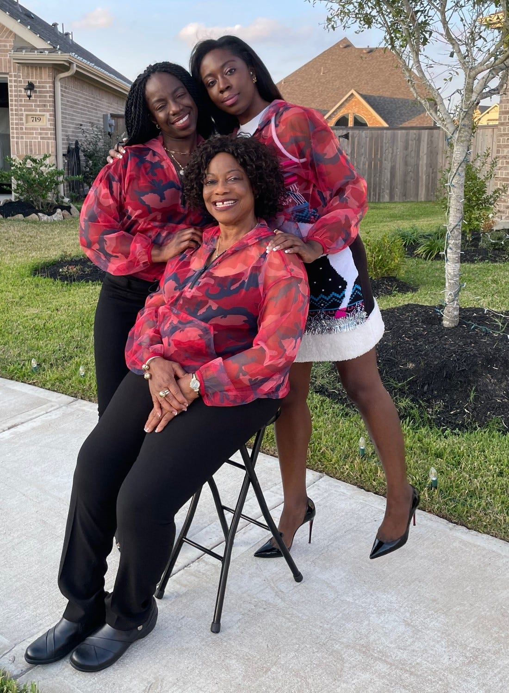
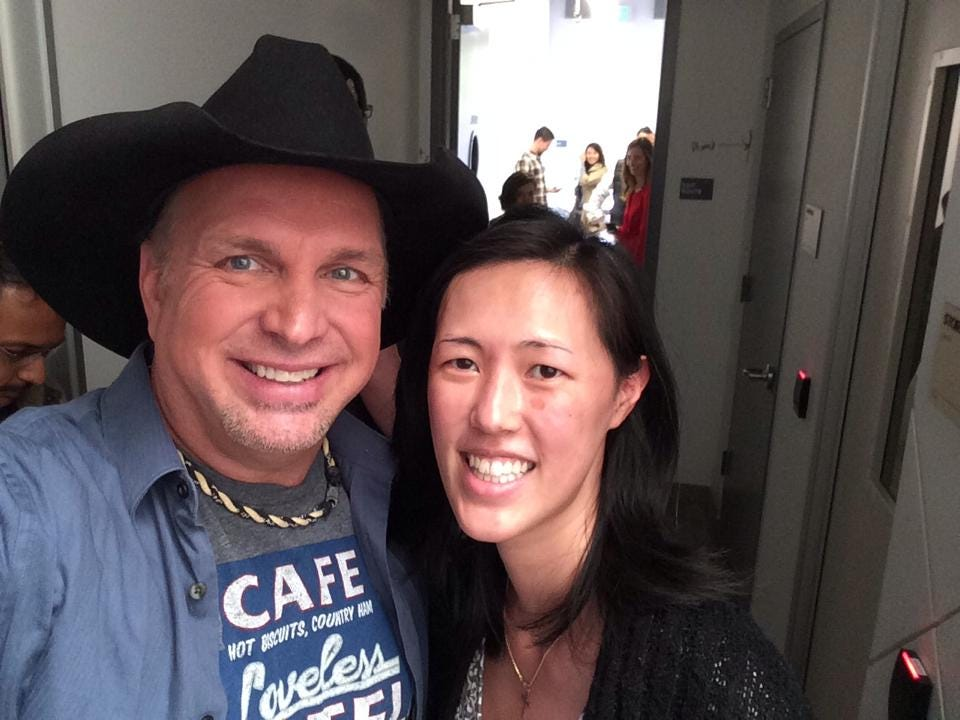

# Actions over Words 

*What you do reflects what you believe more than what you say *

“We are witnessing every day, and only sometimes do we use words.”

I wrote these words down as a reflection in my notes after my friend, Julie Wenah, told me about her late mother, Vidah Amadi Henderson's, life philosophy: "Preach, but use words if necessary. The way you live is a ministry."

These words have stuck with me ever since because we often forget that the way we live our lives is a reflection of our values.

We often believe that the words we say are the most important thing, but our actions truly do speak louder than our words. People make judgments based on who you are, not what you claim to believe. They are reacting to your behavior every moment of every day—and this can cause ripples in your work and your life.

[Subscribe now](https://debliu.substack.com/subscribe?)

## **How actions affect others**

Are you kind, or are you indifferent? Some people walk through life indifferent to those around them as if others are non-playable characters in their video game. These “main characters” see everyone else as less worthy of care or love.

One of the most salient lessons I've ever learned was in my first job at a Chinese fast-food restaurant, where food was cooked fresh and served fast. It was in the deep south, by the Air Force Base near Charleston. I worked the cash register, wiped the tables, took out the trash, and cleaned out the toilets. I also learned to fry almost anything, make our special blend of iced tea, and cook alongside the chefs.

What I realized during that period was that those who work in the restaurant industry are nearly invisible in our society. I was yelled at for issues with the food. People left their tables uncleared or would leave food all over the floor. On occasion, however, someone would see me and compliment me, and it always made my day. The best moments were when someone would leave us a tip (especially because, in the days before electronic payment pads, tips for fast food workers were few and far between - my sister and I probably made $15 in tips over a summer total).

Everyone needs to work in food service at some point in their lives in order to truly grasp how hard it really is. I left my shifts physically exhausted and often demoralized. My time in food service also taught me that it costs almost nothing to acknowledge someone else with a smile or a kind word.

Several studies have shown that those who are of lower socioeconomic status (read: poorer) are more empathetic and less rude than those who are wealthier. For example, one study from University of California Berkeley analyzed the body language of rich and poor students when interacting with a stranger, finding that wealthier students came across as more dismissive and less interested ([ref](https://www.livescience.com/3304-body-language-reveals-wealth.html)).  Another study by the same team showed that those who have less are more compassionate, by word and by the physiological response—for example, the slowing of their heart rates when shown a video of children with cancer ([ref](https://www.scientificamerican.com/article/how-wealth-reduces-compassion/)). Yet another study from the University of Nevada found that those who drive nicer cars are less likely to stop for pedestrians, with a 3% reduction in stopping for every $1,000 more their cars were worth ([ref](https://www.cnn.com/2020/02/26/world/expensive-car-drivers-study-scli-scn-intl/index.html)). (I drive a 12-year-old Hyundai worth about $3,000 at this point, so reading this reminds me to pay close attention at crosswalks.)

All of these studies and anecdotes tell the same story: who we are is displayed by what we do, not who we say we are or what we claim to believe.

## **Intention doesn’t change the impact of behavior**

I remember a product review I hosted where the team came in with a set of rather contentious issues, and we had what I believed was a good discussion—or so I thought. Later that day, my head of engineering pulled me aside and told me, “The whole team is upset. They're sure you are going to kill their project.” I was confused, so I asked him why. He replied, “You had your arms crossed the whole time, and you were asking tough questions.” In my defense, I was only cold, but he was right: my body language spoke volumes to everyone in that room, and I had not even realized the impact it was having on them. After that, I began leaving a sweater or an extra jacket in the office to ensure that I wouldn't accidentally put people off with my body language.

Body language can influence others' reactions in unexpected contexts as well. One day, someone on my lead team asked me not to check my phone as I went to the break room to grab a cup of tea between meetings. She told me that people thought I was ignoring them. I literally had meetings back to back, and sometimes my tea break was the only moment I had to myself. But I took her advice and ended up having interesting, albeit short, conversations with people I ran into. One even posted in our internal work comms tool about how happy she was that I knew her name and what she worked on.

I still have times when I wish I didn't have to pay attention to my surroundings and be “on” all the time. But I also recognize that my intentions matter less than my actions when it comes to having an impact on others. I am now much more aware of my actions and the consequences of inattention—and as a result, I prioritize behavior over intent.

[Share](https://debliu.substack.com/p/actions-over-words?utm_source=substack&utm_medium=email&utm_content=share&action=share)

## **People remember the small things**

I remember the day I had the chance to meet Garth Brooks. He had come to speak at Facebook, and a friend of mine suggested that we go. We were probably two of the few country music fans who had grown up as ethnic minorities in the South. We went to the event and decided to wait and see if we could meet Garth as he was leaving.

I was pretty nervous, because I had listened to his music for so long and was a big fan. I walked up to Garth, and my friend took a picture. He asked me a little bit about myself. I told him that my late father had once lived in Altus, Oklahoma (where Garth is from) and that I had grown up listening to his music because of my father's influence. I could see the singer's handlers trying to hustle him along, since he was clearly late to something, but he stopped, held his hand up, and said that he wanted to keep talking to me. I will never forget that moment: he had a crew of people who were all trying to keep him on time, but he took an extra minute to reminisce with me about my father.

I'm sure Garth doesn't remember that moment, but I always will. That's why, when someone recognizes me or asks me for a photo, I always try to say yes. I am not particularly recognizable or interesting, but if someone as famous and busy as Garth Brooks can take a moment for a random fan in the hallway, I feel I can do no less.

Selfie taken by Garth Brooks in November 2014

Acts of kindness often cost very little, but they can mean the world to someone else. In fact, science tells us we get more satisfaction from doing something kind for others than from buying something for ourselves. A series of studies point to spending on others as a greater driver of overall happiness than spending on oneself ([ref](https://www.spring.org.uk/2023/02/spending-others-happiness.php#:~:text=Participants%20who%20were%20given%20%245,et%20al.%2C%202008).)).

Taking a moment that you otherwise may not have to offer a kind word or compliment to someone may mean more than you can imagine.

---

I spent many years struggling to connect with others. The way I grew up made it really difficult for me to demonstrate warmth. I had this wall around me, and the fight in me that had been instrumental in getting me to where I was eventually turned into a liability.

I was inside my own head for so long that I found it hard to see what my actions were saying. That all changed when I was in the famous Touchy Feely Class at Stanford Graduate School of Business. My classmates told me I was really hard to get to know—and they were right. That was when I realized that my icy exterior was hurting my ability to connect, and something had to change. That said, it didn’t happen overnight. I still had that chip on my shoulder, that anger that fueled me until Sheryl Sandberg told me, [“You can stop fighting now. You’ve won.”](https://www.cnbc.com/2021/12/21/ancestry-ceo-deb-liu-5-words-from-sheryl-sandberg-changed-my-life.html) I was so combative that my actions pushed people away. But recognizing the impact of my behavior on others was a turning point for me, the first step in a journey to greater connection.

Vidah Amadi Henderson was so right. Though I never met her, and she is no longer with us, her words will always remain in my heart, and we are witnessing their truth every day through our actions. People are seeing us, and they are seeing us as who we are, not who we say we are.

What are you saying without speaking?

[Share](https://debliu.substack.com/p/actions-over-words?utm_source=substack&utm_medium=email&utm_content=share&action=share)