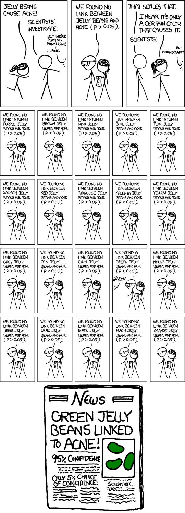

# Addressing Misaligned Incentives 

*The hidden carrots that turn into sticks *

Photo by [Gabriel Gurrola](https://unsplash.com/es/@gabrielgurrola?utm_source=unsplash&utm_medium=referral&utm_content=creditCopyText) on [Unsplash](https://unsplash.com/photos/fcgPRZmTM5w?utm_source=unsplash&utm_medium=referral&utm_content=creditCopyText)

I spent one summer in Washington, D.C., working for the United States Department of Agriculture's Natural Resource Conservation Service. I worked in a block-long building that sat on the National Mall, with views of the Washington Memorial just outside the window. I worked in IT that summer, helping to bring the computers and printers online via Novell Network cards.

Later, I worked alongside a wonderful IT professional, a mid-level woman, who taught me the ropes, along with her peer, who had apparently decided that this college intern **(aka me)** was going to do his job for the summer—which I did—while he applied to more senior roles during the open application season. He was the same level as my dad at a younger age, so I was confused, eventually asking my other colleague how he could just stop showing up and still keep his job. She replied, "We can't fire anyone. The best any manager can do to get rid of someone who does a bad job is to write a strong recommendation and get them promoted into someone else's team." I was, needless to say, in shock.

I've thought back to that summer many times over the years. It wasn't that these were bad people, but rather that they lived within a system where their incentives were deeply skewed. If you did a good job, your manager was incentivized to keep you. But if you didn't, you were more likely to get your manager's support for a promotion to a better job. It was all upside down.

[Share](https://debliu.substack.com/p/addressing-misaligned-incentives?utm_source=substack&utm_medium=email&utm_content=share&action=share)

## **Misaligned incentives at companies**

This issue of misaligned incentives wasn't exclusive to the Department or Agriculture. In fact, it emerges time and again in companies of all shapes and sizes, in a wide range of industries.

I saw another prime example of this issue during the time I spent working on Product Management calibration and performance management, where we optimized for impact above all else. For an individual contributor, 80% of your performance was based on the impact you had, and 20% was based on the capacity you built in a given half. This meant that measurable outcomes (e.g. statsig lifts in the holdout) were considered more important than intangible ones (e.g. UI polish and usability). If your launch would result in your team hitting its goal, and hitting the goal impacted your team's bonuses and your promotion, the stakes became very high. But sometimes hitting your goal meant a regression and headwind for another team's goal. There were launches that ended up being direct tradeoffs between two positive things, while other launches were zero sum-games with no clear winners.

A few things happened as a result of this system. Yes, people did focus much more on impact, metrics, and measurable goals—but they also rushed features and tests out the door at the end of the half, at times causing instability. Other times, outcomes were unintentionally or intentionally gamed, so teams then had watch for that. One of our teams set a goal of being below the fraud rate four out of six months in a half, and when they were on track to miss month three, everyone wanted to give up (which could have caused a spike in fraud). We had to correct the metric before something went awry.

Unsurprisingly, teams with conflicting metrics ended up in contentious conversations over whether one priority trumped another (e.g. video views vs. time spent watching). It was an imperfect system, and while no system can be 100% perfect, in this case, misaligned incentives caused everyone to locally optimize, leaving us all worse off.

While there’s no one-size-fits-all fix to this issue, companies can ensure their incentives are properly aligned by:

* Rewarding higher-level goals
* Setting counter metrics to make sure employees maintain a balanced approach to their work
* Regularly evaluating what metrics are incentivized in order to keep the system fair, effective, and in line with the company's overall goals and values

These strategies can all help companies avoid misaligned incentives. But what happens when the problem goes beyond a single organization?

## **Industry-wide misaligned incentives**

Misaligned incentives can be insidious, and they can cause major problems—not least of all because they can affect more than just organizations.

I want to share the story of how the scientific "replication crisis" was born, as explained in Vox ([ref](https://www.vox.com/future-perfect/21504366/science-replication-crisis-peer-review-statistics)). Scientists, especially those seeking tenure, were incentivized to publish unique findings. Replicating or reinforcing prior findings was not seen as worthy of publication. In hindsight, it's not surprising that, in a publish-or-perish world, incentives were skewed toward unusual findings.

As a result, the practice of P-hacking was created to discover things that were later called into question, including [power posing](https://en.m.wikipedia.org/wiki/Power_posing), [social priming](https://escholarship.org/content/qt0xc3f0wt/qt0xc3f0wt.pdf?t=qsbsc8), [ego depletion](https://en.m.wikipedia.org/wiki/Ego_depletion), and the [stereotype threat](https://en.m.wikipedia.org/wiki/Stereotype_threat). In some estimates cited in Vox, half or more studies failed to replicate ([ref](https://www.vox.com/future-perfect/21504366/science-replication-crisis-peer-review-statistics)). That should raise some eyebrows.

[Image ref](http://Image ref)

Of course, it isn't as if these teams of researchers are going out there and faking data. Instead, they are subtly nudged to find results that are new and exciting, even if that means overlooking inconsistencies or manipulating the way the information is presented. Various solutions have been proposed, such as changing what is rewarded and requiring transparency to counteract the [File Drawer Effect](https://research.uh.edu/the-big-idea/what-went-wrong/behind-closed-drawers-the-file-drawer-effect/#:~:text=In%20psychology%2C%20%E2%80%9Cthe%20file%20drawer,scientists%20might%20like%20to%20think) (a.k.a. hiding bad news), but the fact remains that misaligned incentives in the scientific community have led to numerous inaccuracies and inconsistencies in research.

Scientific research is just one example of how incentives, good and bad, can impact what gets prioritized and, ultimately, what people see. But if you're still not convinced this topic is relevant to you, you don’t need to look any further than a few of the most popular social media platforms. I didn't use Twitter much until last year, when my publishers asked that I join and tweet to connect with other authors and interested readers. As I did, I noticed something about the platform: the more unusual, inflammatory, or amusing the content, the more liked, retweeted, and commented on it was. This resulted in distribution and visibility. The algorithm of public content rewarded those who were the most interesting—in both good and bad ways.

[Share](https://debliu.substack.com/p/addressing-misaligned-incentives?utm_source=substack&utm_medium=email&utm_content=share&action=share)

Reddit, on the other hand, rewards having opinions that conform to the views of the community you are posting in. Some subreddits reward outrage, while others punish it. Karma is offered to those whose content most aligns with each sub's unwritten norms. TikTok, meanwhile, rewards the most interesting and engaging content and largely ignores followers.

Each of these platforms has its own unique set of incentives that shape the behavior of its users. While these incentives can drive engagement and growth, they can also backfire the same way they do in scientific research—such as when algorithms unwittingly encourage inaccurate or harmful content. Needless to say, being mindful of how incentives affect behavior is critical for anyone navigating the landscape of social media platforms—both the users and the companies that run them.

## **Misaligned incentives in manager relationships**

Just like they did in my government internship, managers in the private sector can also fall prey to misaligned incentives. One thing I've noticed over the years is that if you are a good employee, your manager has every incentive to try to keep you. But what if you yourself wanted to become a manager? This also happens if you are at the same level as your manager. They may be anxious about managing someone who possibly has the same amount of experience as them, or they may feel threatened by you.

I remember the first time someone wanted to leave my team: I was mortified that they didn't want to work with me as a manager. But it turned out that they were simply seeking a different kind of opportunity. Over time, I realized that being seen as a net exporter of talent was not a bad thing—but my own anxiety over how others would view a strong product manager leaving my team led me to make it harder for them to leave.

Aligning incentives in manager relationships requires regular feedback, communication, and mutual dedication to shared goals. Managers are people, too, which means they can fall prey to the same skewed incentives as anyone else. As frustrating as this may be, part of the work—for both managers and reports—is to understand each other’s incentives so that you can help make your success their success, and vice versa.

---

People are not fixed elements in a workplace. They are dynamic and organic, responding to stimuli and reacting to both positive and negative reinforcement. That's why it's so important to make sure that you're reinforcing the right behaviors, and not unwittingly creating bad habits. This week, I encourage you to take a moment to think about what's being incentivized in your job, industry, or company, and ask yourself whether your metrics for success are the right ones. What you discover may surprise you.

[Leave a comment](https://debliu.substack.com/p/addressing-misaligned-incentives/comments)