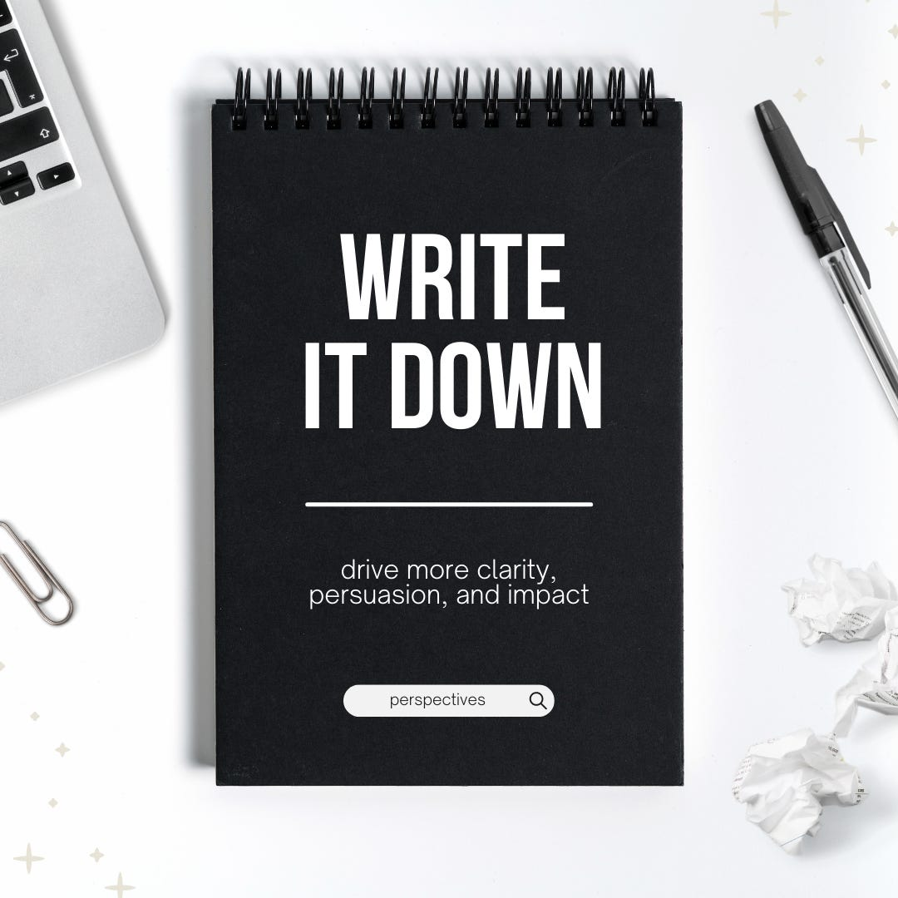

# Write It Down 

*How articulating your point of view in words can help you be more clear, persuasive, and impactful *

I was once part of a group of leaders working on a cross-company initiative. We all had different points of view, and every conversation felt like we were going in circles. Because we could not align on anything, our teams were unsure what to do, and this conflict continued all the way down through our organizations.

[Share](https://debliu.substack.com/p/write-it-down?utm_source=substack&utm_medium=email&utm_content=share&action=share)

It got to the point where we weren't talking *to* each other; we were talking past each other. Even those who agreed did so on a surface level, and it wasn't clear who was on what side. After months of this swirling, one of the leads finally said, "We are just going to write it down." They created a table with all the options available, including the decision points and elements documented. You could either look at one of the columns and agree, or you could create a new option (for example, "Option 3A") with an adjustment.

Turns out, few people actually agreed on anything. Everyone had a slightly different take on the problem and solution set. Suddenly, all those fraught and contentious conversations started to make sense. We were arguing over subtle issues that we weren't even aware we didn't agree on.

Many companies now use Amazon's famous six-pagers for strategies, but neglect to write so many other things down. This is a strategy I wish we saw more of, across roles and industries. Writing things down makes a huge difference, because it:

* Drives alignment
* Ensures clarity
* Creates accountability
* Passes on institutional knowledge
* Allows you to more easily achieve success

That's why, in today's article, I've decided to pay tribute to the magical art of writing it down: how to do it, why it's important, and how it can help you and your team accomplish your goals faster and more efficiently than you would believe.

## **Write it Down to Drive Alignment**

Many teams are like the group I was a part of in my last example. We all *sort of* agreed, but none of us truly understood where our differences were. This led to conflict within our teams which could have been easily avoided. Once we did document the misalignments, we were able to resolve them one by one, taking apart the problem and separating the different pieces so we could address them individually. Ultimately, we got to a clear priority and decision, but it was not until we wrote it down that we did.

If you find yourself unable to get to alignment, or struggling to document what's been discussed, try taking these steps:

* **Create an Excel spreadsheet with a summary of all of the options available to you.** Each option should be in one of the columns, and the decisions within them should be in rows. Do not include any opinions or judgments of "right" or "wrong." Sometimes, there are multiple nested decisions that need to be made, which can't be known until you start this process.
* **Ask each team’s leader or representative to either vote on one of the options as laid out or create a new option.** If a proposal is a small variation on one of the existing options, create a sub-option, such as "Option 2B" and note the row that changed to delineate. Each team gets a primary vote, but they should also mark any option that would be acceptable, even if it is not their first choice.
* **Review the output as a group** and discuss if anything is missing.
* **Bring the options, complete with each team's votes, to the decision maker** to adjudicate the final decision.

Although this may seem complicated, don't be intimidated. This process can save you a ton of time and effort, because everyone goes in with nothing left unwritten, and all points of view are represented equally.

[Share](https://debliu.substack.com/p/write-it-down?utm_source=substack&utm_medium=email&utm_content=share&action=share)

## **Write It Down to Ensure Clarity**

We once hosted a hybrid board meeting where most of the people were in the room, but the person who took notes—as well as several participants—were on Zoom. When we looked at the summary of the general sentiment in the notes, we were caught off-guard. That was when I realized that the important conversations were not actually happening during the official board meeting, but between the sessions and at the board dinners. By seeing the words in black and white, we were able to notice this disconnect, discuss the differences, and make a plan for addressing this in the future for those who could not be at the meetings in person.

I can recall meetings where I walked away with something completely different than what someone else took away—but I didn't realize it until we published the notes. Naturally, in meetings, each person sees the discussion from their own perspective. This, in turn, can have an impact on how they articulate and communicate the decisions that have been made.

One important lesson here is that everyone needs to be on the same page as to what happened in a meeting and what the next steps are. I have found that in some meetings, it's very useful to go over the key points and decisions, document the next steps, and assign owners *before even walking out of the room*. This avoids the post-meeting swirl of having to ensure that everyone agrees on what even happened—let alone what needs to happen next.

## **Write It Down to Create Accountability**

I joined Facebook as the equivalent of a senior manager, even though I had led the Buyer Experience at eBay, where I had been a couple of levels higher. Despite my previous experience, I struggled to get promoted. Finally, after going through seven managers in under three years (including taking a four-month maternity leave), I felt frustrated. I had multiple verbal agreements with many of my managers, who changed over and over, even though I, myself, remained in largely the same role.

Finally, fed up, I asked my seventh manager to clearly outline what he felt the gap was between my level and what it would take to make Director. He shared the criteria with me. I then emailed him back to reiterate what he'd said and requested that we check in each month to ensure I was demonstrating progress. By the end of the half, I was finally promoted after many failed attempts.

I often get calls for coaching from people in similar situations. They tell me that their new manager promised they would be “up for promotion next quarter” or “won’t be layered," and express frustration that their manager never followed through. When I ask if they ever wrote those promises down to confirm, nearly all reply, “No.” It isn’t that their managers are not being truthful, but that things happen and promotions fall off the priority list. Being clear about what the agreement is, and what is needed on both your parts, is critical to joint accountability and long-term success.

## **Write It Down to Pass on Institutional Knowledge**

I once worked on a new 0 to 1 product where everything was under contention. Every day, a new person to the team, or someone who was not previously looped in, questioned something that had long been settled. It drove the core team crazy to have to constantly justify the decisions we had made and relitigate everything over and over. Finally, the PM decided to create a contentious decision document. Everytime we settled something, the answer went into the document with the decision, date, decision-makers, and reasoning. This created a historical record of things we had settled and reduced the churn on the team.

When I joined Ancestry, I asked our then-VP of Product, Heather Friedland, to document all of the innovations we had made over the years, the rationale behind them, and what had happened to them. She interviewed dozens of people at the company to understand what things we had tried, and how they were eventually either integrated into the product or deprecated. She then shared the documentation with the company. This record enabled us to have a strong foundation to build our forward strategy from what we had done previously, and to learn the lessons of the past while looking to the future.

Institutional knowledge can be easy to overlook, but you would be surprised how much information teams accumulate without documentation. Writing this down ensures everyone can quickly get on the same page, no matter when they join the organization or team.

[Share](https://debliu.substack.com/p/write-it-down?utm_source=substack&utm_medium=email&utm_content=share&action=share)

## **Write It Down to Achieve Success**

Goals, likewise, can benefit from being written down. A vague “I want to declutter” is much less powerful than putting up a Post-It note on your mirror that reads, “I commit to spend 20 minutes a day decluttering.” I started this practice as part of my [New Year's Resolution](https://debliu.substack.com/p/new-years-resolutions-and-the-power) this past year, and thus far, I have given away or sold over 1,000 items that we no longer need or use.

When you write something down, you are forcing yourself to articulate exactly what you want to do and acknowledge the commitment you're making. This also shifts your focus from something you *want* to do to working on the things that keep you from doing it. For me, decluttering felt overwhelming, but now it is a bite-sized chunk of effort that has become routine—all thanks to writing it down.

A study by Gail Matthews found that you have a 42% higher likelihood of achieving your goals if you just write them down ([ref](https://www.inc.com/peter-economy/this-is-way-you-need-to-write-down-your-goals-for-faster-success.html)). A hand-wavy goal is not concrete enough to know if you are making progress, but by simply articulating what you hope to achieve, you are much more likely to get there.

---

Writing things down is a simple yet powerful tool to drive more clarity, persuasion, and impact in your work and at home. It can help you achieve more by documenting the fuzzy understandings we all share, putting you more firmly on the path to alignment.

Take a moment this week and choose three things to write down. You would be surprised what you can unlock as a result.

[Subscribe now](https://debliu.substack.com/subscribe?)