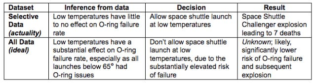

# Four Communication Problems You Need to Address

*Small changes can yield big results *

I once worked with a brilliant person who could look at problems in new and unique ways. But several other leaders pushed back on me when I put their name up to head a new project. I asked them privately why, and they cited the challenges they had each had with communicating and understanding this person’s point of view. I understood that it was a limitation, but I was bullish on their ability to get the job done. I ended up being overruled and, unbeknownst to this person, they lost out on an opportunity to lead and grow—all because of their trouble conveying and landing their message.

[Communication problems can befall anyone and I’ve seen firsthand how they can stifle growth.](https://debliu.substack.com/p/manage-your-communications-like-you) In this article, I’ll focus on a few of the most common ones.

## **The dangers of poor communication**

Time and again, I’ve seen an otherwise amazing person be held back by their communication abilities. Some incredible strategists and executors have been hamstrung by their inability to distill and disseminate information. This is a two-way street; I’ve worked with some other colleagues who were “all talk,” and while they could communicate well, they couldn’t do the work. But like it or not, we have a preference in the workplace for those who communicate over those who execute, because that is the user interface.

I learned this lesson early on. During my freshman year at Duke, I took the [Intro to Engineering](https://fyd.duke.edu/courses/engineering-design-technical-communication) class taught by the famed professor [Henry Petroski](https://en.wikipedia.org/wiki/Henry_Petroski). He urged us to learn to communicate, not just do the work. He attributed some of the greatest engineering disasters to poor communication, not technical error, and that is a lesson that remains with me to this day.

The quintessential example he used was the 1986 *[Challenger](https://www.britannica.com/event/Challenger-disaster)* [disaster](https://www.britannica.com/event/Challenger-disaster), in which the *Challenger* space shuttle exploded during takeoff, killing all seven astronauts on board. The problem was the rubber O-rings connected to the rocket boosters, which became faulty at low temperatures, causing a gas leak that ignited the fuel tank. Engineers had been raising concerns about the O-ring seals long before the mission—but how exactly were they trying to communicate those concerns?

[Share](https://debliu.substack.com/p/five-communication-problems-you-need?utm_source=substack&utm_medium=email&utm_content=share&action=share)

Below you can see the data that was shown on the number of O-ring failures (above one) at different temperatures. At a glance, the data looks mixed. The chart didn’t show a clear enough relationship for NASA to scrub the launch ([ref](https://priceonomics.com/the-space-shuttle-challenger-explosion-and-the-o/)).

What was missing was the data on the many instances when there had been *zero* O-ring failures. This information, illustrated below, was not included in the chart ([ref](https://priceonomics.com/the-space-shuttle-challenger-explosion-and-the-o/)). If it had been, NASA would have seen a clear pattern of O-ring failures at certain temperatures.

Thus, the chart should have actually looked like this:

The temperature on the day of the *Challenger* launch was 31 degrees Fahrenheit, which is below freezing. If the pattern of failures had been communicated differently, it would have been much clearer that the number of expected O-ring failures was unacceptably high at such low temperatures.

As Dr. Petroski pointed out, even the people who could send us to space could not effectively communicate data to prove that the danger of failure was real. With this in mind, what communication errors should we be looking out for in our own work?

## **Error 1: Too much detail**

Many more technical or expert colleagues struggle with getting bogged down by details. I often tell my teams, “If you’re the one who’s thinking about something 110% of the time, and you are asking *me* what to do, then we are both in the wrong jobs.” You spend most of your time immersed in the details, but your job is to take it up a level—and then take it up a level again. Think about your altitude: What is the right level to land your message without getting too deep into the weeds?

This is a common blindspot, especially for those who excel at execution. You get so into the details that you can’t provide the takeaway to someone who lacks the same basic knowledge as you. Your presentations end up being too dense, and therefore difficult to wade through. You try to squeeze too much information in without lifting it up a level.

I spent many years struggling with this. I felt like I needed to show my work to prove my point. But this resulted in getting bogged down with charts and graphs while failing to convey the larger point. I once did a stint writing talks for Rajiv Pant, then the CEO of PayPal. I remember a time when I was prepping the all-hands, and he told me, “I want no more than a couple dozen words on a slide.” I had to learn to translate a very wordy and comprehensive presentation into one that was understandable to thousands of employees, many of whom were not close to the problems.

[Leave a comment](https://debliu.substack.com/p/five-communication-problems-you-need/comments)

## **Error 2: Inside baseball**

Half the time when I watch baseball, I have no idea what the commentators are talking about. There are so many stats and terms. I just want to know who is winning and be able to enjoy the game (this is probably sacrilegious to baseball fans, I know).

We often use acronyms and terminology (TPS reports, I’m looking at you) to make our own lives easier, but they end up making other people’s lives harder. Things quickly become a game of jargon, reducing people to “insiders” and “outsiders.” Communication should be inclusive. If you are unintentionally leaving people out of what you are trying to say, then you are not landing your message.

At one of my previous companies, we did half-end reviews. We would each write a summary of how our products and businesses had gone and share it with one another over a two-day period. Pre-reads were required to be sent ahead of time.

I found these presentations hard to put together, but since I also sat in on them for other teams, I was able to see the pitfalls. At one point, another exec and I swapped presentations a few weeks before the meeting. He and I worked in vastly different parts of the company, and when I read his updates, I could see the areas he’d glossed over, which led to more questions, as well as places where he provided too much or too little data. Because we looked at each other’s work, we were able to catch our blind spots and find the right altitude *before* it was shown to the larger group.

## **Error 3: Lack of context**

[I’ve written before about the importance of context for effective communication](https://debliu.substack.com/p/communicating-so-your-message-lands). Many executives spend maybe five percent of their time thinking about your specific area, so it’s critical to make sure you are giving them the background they need.

The great thing about a six-pager, as popularized by Amazon, is that it forces your work to stand on its own. No voiceover. No commentary. No outside information. Your words are what they are and are read as such in the room.

Every communication should have sufficient context, but not too much detail for anybody to pick it up and understand what you’re talking about. Remember, presentations get forwarded. Strategies get passed around. Make sure that there is enough context that anyone seeing your work has a general sense of the environment in which the communication is shared. If your communication can't stand on its own, then you need to rethink your context-setting.

## **Error 4: Clear blind spots**

The actual issue with the *Challenger* data, as illustrated above and below ([ref](https://priceonomics.com/the-space-shuttle-challenger-explosion-and-the-o/)), is that it was selective. I have seen otherwise great strategies and presenters caught out for missing some data or not fully representing all points of view. These blind spots undermine credibility in the best case and can be disastrous in the worst case.

I have fallen for this trap myself. In my eagerness to present my strategy on an area of new investment, I failed to share a clear articulation of competition, risks, and reasons not to invest. My proposal came off as partisan and self-serving.

I learned this lesson the hard way, but you don’t have to. Focus on communicating everything—both the good and the bad. Don’t hide bad news; instead, make it clear that you see the full picture. Make your case, but also understand that there is a counterpoint to your strategy. Point out the flaws before someone else does, and take the opportunity to address their concerns before they are brought up. You’ll save yourself a major headache later.

---

You can be an amazing strategist and strong executor but still struggle to gain traction for your ideas and investment for your product if you lack strong communication skills. This means more than being wordy or providing only your side of the story. Proper communication includes context, balance, and a level of information that’s both accessible and broad enough to be understood. This is a learned skill, one that often takes time to develop, but it can be the key to succeeding in your role and, as the *Challenger* disaster shows, potentially even avoiding disaster.

[Subscribe now](https://debliu.substack.com/subscribe?)