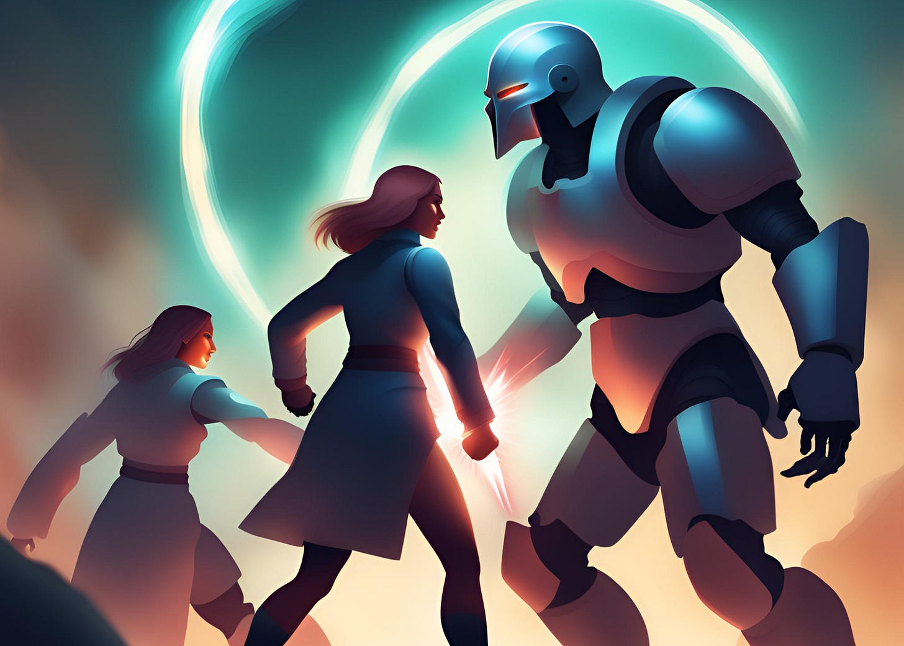

# Turn the Tables 

*Change your relationships by flipping the script*

I remember complaining to a woman VP about someone who constantly interrupted people. It was always derailing our meetings, and I was struggling to manage the situation.

When I expressed this to her, she suggested what (to me) sounded like a crazy idea:  “Put the person who keeps interrupting in charge of keeping other people from interrupting anyone. Trust me, it works.”

I thought she was crazy. But she assured me that this strategy never failed to work. I tried it, and voila: Suddenly the offender turned into the enforcer. The entire group dynamic changed. Ever since, each time I’ve used this trick, it has had a similar effect.

That VP taught me how to turn the tables on the situation. So often, we can solve interpersonal problems by doing something that seems completely counterintuitive: making our adversaries into our allies.

[Subscribe now](https://debliu.substack.com/subscribe?)

## **Turning the offender into the enforcer**

What this entire incident taught me is that most people don't see themselves as the “bad guy.” In fact, most of the people who have ever interrupted me had no idea that I saw it as an interruption at all. Once I realized this, I was able to change the way I approached the problem.

Whenever we face a conflict, in our minds, someone is always the “offender.” They are the guilty party. They are the obvious antagonist. But what if everyone is just another player on the same playing field? Each of us sees things from only our own perspective, not from above the chessboard. And [because no one can know our true intentions except ourselves](https://debliu.substack.com/p/tough-love-how-hard-feedback-changed?utm_source=publication-search), we’re left to draw our own (often incorrect) conclusions.

When you look at it from this perspective, it’s no wonder why asking someone to change their behavior when they don't see it as aggressive would be baffling for them! They are blissfully living their lives, assuming what they're doing is right. It’s not that they don't know right from wrong, but that they don't see how their actions might be perceived as incorrect. Human nature dampens our ability to see things clearly.

We’re all guilty of this. [We discard information that disagrees with our point of view and amplify information that supports it](https://debliu.substack.com/p/changing-your-mind?utm_source=publication-search). We take our assumptions as facts, we subconsciously take “sides,” and we fall out of alignment when other people (naturally) do the same.

We are all partisan, even if we don't want to admit it. But if we can see past that long enough to change how we relate to our rivals, we can hack even the most contentious relationships.

[Share](https://debliu.substack.com/p/turn-the-tables?utm_source=substack&utm_medium=email&utm_content=share&action=share)

## **Flip the script**

[We each play a role in our teams and organizations](https://debliu.substack.com/p/what-role-do-you-play). We play these roles invisibly, without thinking about them. One colleague I worked with was always the skeptic. No matter what was said, he felt the need to disagree, to push the envelope. He was always playing the devil's advocate to ensure that we didn't fall into groupthink. But then he was asked to pitch something himself. When it was his own idea, he suddenly had this over-the-top proposal with a metric to match.

I realized that when he was freed from his fixed role, he took on a completely new one. It was wonderful to see him in action in such a different way. Funnily enough, those around him felt the need to be skeptical when he pitched his idea. He got a bit of a taste of his own medicine, but ultimately, our team was stronger as a result, because we could see ourselves play all the parts.

We often take the roles that others assign us, or that we naturally fall into. We play those parts to perfection—often to the exclusion of everything else.

Some of the best product strategies I’ve ever worked on were co-written by analysts, designers, and engineers. When you hand the pen to someone else, something magical happens. You see the world from their perspective and get a glimpse into their understanding. You coalesce around ideas in a different way. The next time you find yourself butting heads with someone, play around with roles and expectations. You might just create magic.

## **Make the heckler the owner**

I once had someone on my team who was pretty skeptical about off-sites and team-building exercises. So I put them in charge: They had to help come up with the agenda and set up the day. Something that they had complained about vociferously suddenly became their responsibility. I'm not sure that they ever became a huge fan of off-sites, but having put in the work to make one of them great, they now understood the investment it took to make them happen.

For anyone who creates or puts themselves out there, there will always be hecklers. There will be people who complain, who nitpick, and who are never satisfied. Asking them to channel that energy into improving something they don’t like is a more useful way to engage them than trying to explain why something should work a certain way.

The reverse is also true. Next time you think something is terrible, rather than complaining, take it over. If you think the recruiting process is bad, offer to run it for one season. If you hate team-building exercises, offer to plan the next one. The point is to not be a critic, but a contributor. This can unlock new ways of looking at things and give you a new appreciation for them.

[Share Perspectives](https://debliu.substack.com/?utm_source=substack&utm_medium=email&utm_content=share&action=share)

## **Swap positions**

In high school debate, there is an event called [CX, or cross-examination debate](https://en.m.wikipedia.org/wiki/Policy_debate#:~:text=It%20is%20also%20referred%20to,not%20change%20the%20status%20quo.). What is interesting about this type of debate is that each team of two has to take the affirmative, be cross-examined on it, and then immediately take the other side. This exercise forces the debaters to successfully and effectively take both sides of an issue while also examining someone else’s arguments.

We are, by nature, unreliable narrators. We see only our own points of view and struggle to examine the ways we are biased. By forcing yourself to take both sides of an issue, you can learn to see the world in a totally different way.

I heard a story about a professor who asked his students to write the opposite of what they believed about a hot-button issue like abortion, the death penalty, or affirmative action. They had to research the position as if it were their own, and they had to make their case convincing. Though the students did not change their points of view, many said they came away with more perspective and empathy for those who disagreed with them.

---

Even in complex situations, we often fall into the trap of “us versus them.” Good guys versus bad guys. Aggressors versus defenders. But this can cost us perspective and objectivity. How much success and innovation are we inadvertently stifling when we think this way?

Forcing yourself out of this binary thinking isn’t easy, but it can yield benefits for both you and others. That’s why this week, I urge you to think of a frustrating relationship in your work or personal life and consider how you can turn the tables. Put the other person in charge of the thing they’re making difficult. Change the role they play—or the one that you do. Make a list of arguments to support their position and refute your own. You might not become instant friends, but you may be surprised at how much less friction there is when you no longer see them as an enemy.

[Leave a comment](https://debliu.substack.com/p/turn-the-tables/comments)