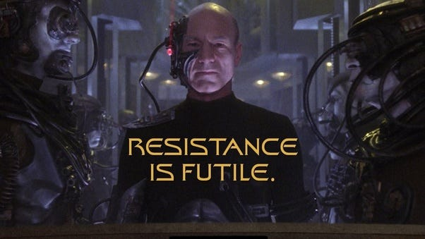

# What Are You Resisting? 

*Why the things you’re fighting might be just what you need*

“Resistance is futile.”

David and I both loved watching *Star Trek* growing up, and we are surprised and delighted that our kids became fans, too. We showed them highlights from the original series, *The Next Generation*, *Deep Space Nine*, and *Voyager*. We skipped *Enterprise* and went straight to *Discovery*, *Lower Decks,* and *Prodigy* before picking up *Strange New Worlds* and *Picard*.

One of the scariest villains in the whole *Star Trek* franchise is the Borg, a hive-minded species set on assimilating all other species to their collective consciousness so they can achieve perfection. We often jokingly use their catchphrase, “Resistance is futile,” in our house, especially since our kids often increase the cost of compliance in an effort to get out of doing things.

Our eldest started doing the dishes with me when he was eight, and for five blissful years, he never complained. Then, at 13, he announced that he wanted a change. We asked one of our other kids to take over, and she made us pay a high price. Broken dishes, half-washed items, and general grumpiness became a running theme in our household. She did the dishes stomping around, spilling dirty water all over the place, and generally making a mess. She was adding friction and resisting with all her might, but we had to persist. If we let her get away with it, she would continue this behavior any time she didn’t want to do something.

We finally agreed to let her off the hook if she could go a full month without digging her heels in. It took her five months to finally pass dish duty on to her other sister. That resistance cost her more time having to do the one thing she was resisting!

[Share](https://debliu.substack.com/p/what-are-you-resisting?utm_source=substack&utm_medium=email&utm_content=share&action=share)

## **What are you resisting in your life?**

David and I were in full resistance mode when his parents passed. We would go over to their house, our old home down the street, and take care of things like picking up the mail or taking the trash cans to the curb. It took us a couple of months to even start going through their financial statements, then another month to go through their things. I dragged myself over when I had time to take the load off of his shoulders, but it was painful to go through their things. That house was a time capsule from when they left to go to the hospital, and I was terrified to touch anything.

This resistance went on and on until we finally had a wake-up call: one of the toilets started leaking, and we weren’t there to see it. A week later, we realized that it could have been a disaster, so we finally put in the work to get it cleaned up (including bribing the kids to help us).

The dread I felt lasted as long as I resisted, but once I started to do what I’d been resisting, I stopped dwelling on it. Looking back, I should have gotten myself together and started tackling things sooner. I am a doer, so this resistance was counterproductive and frustrating. Procrastinating *felt* easier, but I was only delaying the inevitable.

This is the irony of resistance: It gives us a sense of control, but how often does it really get us out of what we’re avoiding? I think most of us have things we’d rather not deal with, but those things eventually catch up with us, and nine times out of time, it’s easier in the long run to face them head-on.

## **Resistance catches up with you**

Problems don’t go away because you are unwilling to face them.

Once, as we were clearing out the house, we went to the four sheds we have in our yard and unpacked the boxes we had in storage from our last move. Funnily enough, that move was in 2010. We’d had boxes sitting there, unopened, for over a decade.

Things long buried were unearthed: boxes of things I didn’t want to face, including whatever I had packed up from my desk in a rush when we had to clear out our old house. We found cases of diapers (our kids outgrew those about 10 years ago), old family photos, old junk mail and dried-out pens. It was all sitting there like a time capsule, things I wanted to preserve all jumbled up with things I should have discarded years ago.

As Gravemine from Halo says, “I am a monument to all your sins.” David and I joke that those 50-some boxes we put in storage are a monument to our own sins, a physical reminder of the resistance we had in the past.

I remember reading about Dostadning, or “Swedish Death Cleaning,” which is the practice of decluttering while you are still alive so as not to leave that burden for your children. We decided that with our upcoming move, we would stop resisting and make a clean break from accumulating more stuff we didn’t need. After all, if you haven’t opened a box of things in 10 years, do you really need any of it?

[Leave a comment](https://debliu.substack.com/p/what-are-you-resisting/comments)

## **Stop fighting and swim downstream**

I struggled for a long time to help my mom stay independent. I wanted to be a good daughter who could juggle everything and make it work. But then I realized that getting help when you need it isn’t a sign of weakness. It’s not giving up; it’s a gift.

When my mom got sick, she didn’t want to have a caregiver come in, but it was hurting our relationship to fight over how independent she wanted to be and the restrictions I placed on her to keep her safe. Finally I found a caregiver she loved, and she became Mom’s companion and friend.

The change couldn’t have been more stark—or more positive. Whereas before, I had to make sure she took her medicine or tracked her blood pressure, we were now free to simply enjoy our time together instead of fighting over stuff I needed her to do. When I finally started swimming downstream, it transformed our relationship back into a more healthy one.

We dig our heels in for all sorts of reasons. We don’t want to face change, we’ve grown used to doing things a certain way, we’ve bought into the sunk-cost fallacy… But resistance can blind us to smoother, more constructive ways of doing things. We get so used to swimming upstream, it can be easy to forget that swimming downstream is an option.

## **Turning resistance into freedom**

Resistance is not always bad, but sometimes we let it become an end in and of itself. We become defined by what we *aren’t* rather than what we *are*.

I never saw myself as a writer, and as a result, I refused to write. But then one day, Julie Zhuo told me about how she wrote regularly and suggested I do it, too. I told her writing was not something I did… but her words stuck with me all the same.

What if I *could* be a writer? What if I had something to say?

Suddenly, all that old resistance melted away and was replaced by a sense of purpose. My own redefinition forced me to rethink why I had pushed back when Julie made her suggestion. I began to dip my toes into writing—first for myself, then internally at work, and then, finally, for a wider audience through my book and this newsletter. That small shift in perspective gave me clarity I didn’t know I was missing. It freed me from the restrictions I had unconsciously placed on myself by defining myself in terms of what I “didn’t” or “couldn’t” do.

Freeing ourselves from the grip of resistance can be transformative, but it depends on our ability to notice where we’re digging our heels in and make a conscious change. To reduce resistance in your life, start with these tips:

* **Identify your resistance.** Try this exercise: Make a list of three to five areas in your life where you’re making things harder than they need to be. Maybe you're procrastinating on something, holding a grudge, clinging to your old ways of doing things, or ignoring a problem. Decide which one you want to tackle.
* **Start new rituals.** When you make something difficult into a routine, it becomes easier and easier. Each time you successfully do it, recognize your success and reward yourself. Eventually, it will become a habit (like writing did for me), and you’ll rarely have to think about it anymore.
* **Minimize friction.** I’ve written a lot about the benefits of [reducing friction in your life](https://debliu.substack.com/p/reducing-friction-in-your-life?utm_source=publication-search). The same goes for when you’re trying to free yourself from resistance. If you’re struggling to get up early, add something to your morning routine that you can look forward to. If you’re resisting eating healthier, try meal prepping so you have healthy food ready at dinnertime. The easier you can make it for yourself, the easier it will be to let go of what’s holding you back.

Resistance can be comfortable, but it can also be limiting. When we can let go of it, we’re not just gaining new perspectives; we’re unlocking a world of new possibilities.

---

We spend so much of our lives looking for ways to get out of things. We waste so much brain power and emotional strain pushing back that we forget that often, resistance really *is* futile. The things we’re fighting have a way of catching up to us, whether we like it or not, so why bend over backward to avoid them? By making the choice to let go of resistance, we can meet challenges on our own terms—and more often than not, that changes us for the better.

[Share](https://debliu.substack.com/p/what-are-you-resisting?utm_source=substack&utm_medium=email&utm_content=share&action=share)