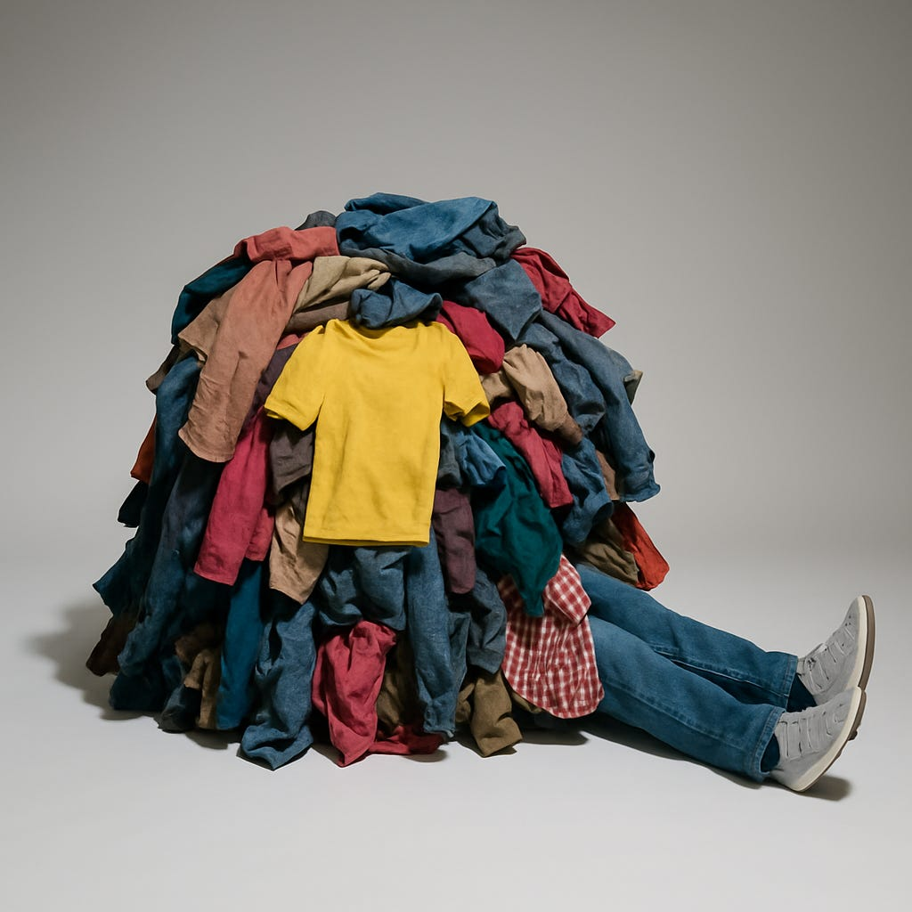

# Five Easy Ways to Declutter Your Life

*Simplifying, clearing, and cleaning out the things that hold you back*

I have to admit, I’m a bit of a hoarder. Okay, I’m a huge hoarder. In my mind, everything has the potential to be useful someday. And the idea that I might not have something when I needed it gave me a sense of anxious dread.

What if I ran out of toilet paper? You can never have too many pairs of scissors, right? Who doesn’t need ten types of tape for every possible occasion?

This is how I ended up with 23 pairs of scissors, about 40 chip clips, and at least six Costco-sized packs of toilet paper taking up space in my house. That doesn’t include roughly 200 blank greeting cards, several thousand sheets of paper, and three shoeboxes full of every kind of tape. I also had a dozen new kids’ backpacks, ten lunch bags (don’t ask), and at least three dozen random water bottles from events I barely remember. And because I never wanted to run out, I had no fewer than 50 reusable totes because why wouldn’t I?

My house became so full of stuff that I often couldn’t even find the things I needed. Sometimes the kids couldn’t either. Instead of looking, they’d beg me just to buy another one rather than spend hours searching. I started to feel like I wasn’t controlling the stuff and it was controlling me.

I’ve written before about my husband’s obsession with a wheelbarrow he’s owned for two decades and used exactly three times. He’d like to remind me he used it again last week, which, I’m sure, justifies keeping it for another twenty years.

[Subscribe now](https://debliu.substack.com/subscribe?)

## **1. Take Back Control**

I read obsessively about how to deal with clutter. I tried everything: [KonMari](https://amzn.to/43PVeMD), [Swedish Death Cleaning](https://amzn.to/3ZGjQVB), [Dana White](https://amzn.to/4mA91hR), [Apartment Therapy.](https://amzn.to/4kJjbeq) But nothing worked.

Nothing worked because I wasn’t ready to let go. Until I wanted to take back control, I wasn’t going to change my home.

These things were a safety net. It felt comforting to know that if I lost my favorite jacket, I had two more. But what purpose did that serve? I didn’t need 20 hairbrushes. I had backups for my backups. It became almost pathological.

I had to step back and let go of the fear of going without. That meant not stockpiling six months’ worth of toilet paper or keeping enough canned food to survive the zombie apocalypse. Growing up with financial insecurity, I clung to useful things. But they stopped being useful a long time ago and started to control me.

## **2. Declutter as a Mindset Change**

Not long ago, I found a box of business suits that I wore right out of college during my consulting days. I hadn’t needed them since, and honestly, I had forgotten they were even in the house until we moved recently.

I opened the box and donated half right away. The rest gave me pause. I once loved those suits, and seeing them brought back memories of my first job, freshly out of school and figuring things out. But now, three kids and fifteen pounds later, they didn’t quite fit. I sat with it for a few days, then decided it was time. I let them all go except for one jacket I kept as a memento of that chapter.

That moment was a turning point. Something I hadn’t laid eyes on in fifteen years still had such a hold on me that I seriously considered keeping it. But letting go meant something more. Donating the entire crate to Dress for Success allowed me to pass them on to women just beginning their own careers—right where I had once stood.

[Leave a comment](https://debliu.substack.com/p/five-easy-ways-to-declutter-your/comments)

## **3. Find a Place for All Things (Sometimes That Place Is the Trash)**

What you own doesn’t matter if you can’t find it. I was constantly searching for things. But once something had a designated home, suddenly everyone knew where to look and where to return it. Once I organized things, I realized just how many rolls of packing tape we had (the answer is 12, if you’re wondering) and how many clothing lint rollers we had stocked up (9 and counting).

In our new home, we have a place for each thing, and it’s made it clear what we have and what we don’t. Everyone knows where to look first, and the kids are now returning things to where they belong. Since each of them has their own room, anything they don’t want to bring into their space goes into the donation bin or the trash.

Much of what they’d saved over the years, they had to sort through and decide: keep, donate, or trash. Suddenly, the things they had just tucked away resurfaced, and they had to make the call once and for all.

## **4. Avoid the Boxes of Doom**

We joke that we have these “boxes of doom” where we sweep unwanted things to deal with later. But that “later” always comes. Maybe not for years, but eventually.

I found three huge sealed totes I didn’t even recognize. The clear plastic had gone cloudy with age. I opened them with trepidation. David came by and casually mentioned, “Oh, those are the totes Jonathan and I moved down from the attic.” That meant they dated back to when we moved out of our tiny starter home in 2010 and renovated this one.

Fifteen years later, there I was, unraveling the choices we made back then.

As I sat on the floor going through my fifteenth such box, my present self was cursing my past self for leaving this mess. I threw out most of the detritus, but not before pocketing the $100 I found tucked away. And my future self will no doubt appreciate my current self for biting the bullet and clearing it out.

[Subscribe now](https://debliu.substack.com/subscribe?)

## **5. Stop Paying to Procrastinate**

Someone once told me a story about cleaning out their parents’ home after they passed. That’s when they discovered a storage unit the family had been paying for since their last move decades earlier. She was left to sort through everything they couldn’t bring themselves to face.

Another friend said their mother couldn’t bear to clean out her parents’ home. So the house sits there, costing $4,000 a month, still fully powered, serving as a storage shed for memories no one wants to confront. More than a decade later, it’s still untouched.

If I asked you how much you’d pay to avoid decluttering, would your answer be $48,000 a year? Because that’s what some people spend.

They are not alone. Americans spend more than $48 billion a year on self-storage. This is an industry that has more physical locations than Starbucks, McDonald’s, and Subway combined. All that space, mostly to house things we don’t use, can’t part with, or don’t want to deal with.

Part of the struggle is not knowing the value of what we’re holding onto. What if we give away something truly meaningful? An heirloom? A piece of jewelry?

---

I grew up with a scarcity mindset. My parents came to America with very little. They always worried about making the mortgage. I internalized that anxiety for a long time. I [was even in charge of cutting our store-bought napkins in half so we didn’t waste them.](https://www.linkedin.com/posts/deborahliu_growing-up-i-was-in-charge-of-cutting-our-activity-7227716253447045120-YHd6?utm_source=social_share_send&utm_medium=member_desktop_web&rcm=ACoAAABMb7ABtHb6JCzTqQBzknbw1O0cQrAmjLc) To this day, I still catch myself tempted to do it even though it’s no longer necessary, or even useful.

But the truth is, not everything needs to be saved. Not every item is worth saving. Sometimes, the real act of courage is letting go of things, of habits, of old fears that no longer serve the life I want to live now.

Decluttering isn’t just about reclaiming space in your home. It’s about making room for what actually matters.

So ask yourself: what are you still holding onto, and why?

**Because when you finally choose to let go, you may just find yourself finally free.**

[Share](https://debliu.substack.com/p/five-easy-ways-to-declutter-your?utm_source=substack&utm_medium=email&utm_content=share&action=share)