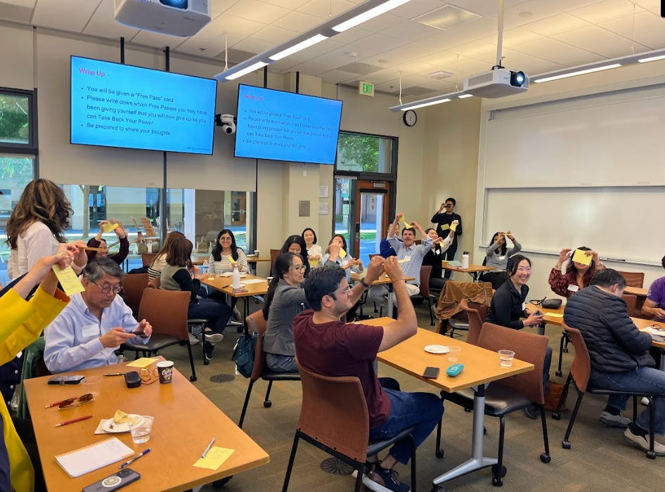

# How to Stop Holding Yourself Back

*Giving Up the Stories that No Longer Serve You*

Recently, I led a workshop hosted by the Stanford GSB Asian Alumni Chapter called “[Power Unlocked: Confidence, Presence, and Career Clarity](https://groups.stanford.edu/events/125550).” I gave a short talk, then spent the next hour taking participant questions about real-life situations. Some had managers who didn’t have their back. Others were debating major career moves. Still others felt sidelined by someone they trusted. Each had a story and we unpacked them live, even well after the session ended.

I wanted to share a version of the talk here to introduce the key ideas, many of which first appeared in my book.

[Share](https://debliu.substack.com/p/how-to-stop-holding-yourself-back?utm_source=substack&utm_medium=email&utm_content=share&action=share)

**Power Is Not a Dirty Word**How do you feel when I say the word “power”?

Some in the room said it meant strength. Others thought of dominance. For years, the idea of power made me uncomfortable. We’ve all seen it used poorly, and it can make us want to pull back. We don’t want to be the one leveraging power over others. We want to be kind, benevolent and not domineering or aggressive.

But power isn’t a dirty word. If you look up the definition, it simply means “the ability to impact or influence the events and people around us.” Isn’t that what we all want? To leave a mark?

When I worked at Ancestry, I saw people dig into the lives of their ancestors. Often, there was only limited documentation — just a name, birth date, and maybe a few life milestones. Many of these lives had faded into history. And yet, we yearn for more for our own stories: the ability to shape our world and be remembered.

But here’s the paradox while we long to make an impact, we often give away our power without realizing it.

**The Free Pass: What Are You Excusing?**My friend, the incredible coach and speaker [Carol Isozaki, introduced me to the idea of the “free pass.”](https://debliu.substack.com/p/day-3-elevate-your-impact-by-asking) It’s the quiet permission slip we give ourselves to play small, to defer, to opt out. It’s back-benching. Holding back. Staying silent.

We tell ourselves, “I shouldn’t get involved,” or “It’s not my place to speak up.” But as Carol says, the free pass isn’t actually free. It costs us opportunity, visibility, and influence. It holds us back, and we don’t even notice.

Years ago, I recruited a friend to join my team. She was exceptional. After a long process, the recruiting team prepared an offer with room for negotiation. But I knew something they didn’t: she wouldn’t negotiate. She’d either accept or walk. So I pushed for the best and final offer upfront. She accepted immediately without negotiating, just as I expected.

Later, I told her, “Don’t ever do that again.” She isn’t always going to have someone going to bat for her. That free pass had a real and tangible cost.

[Leave a comment](https://debliu.substack.com/p/how-to-stop-holding-yourself-back/comments)

**Kill the Unintentional Ridiculous Strategies**[Carol also talks about the “unintentional ridiculous strategies”](https://debliu.substack.com/p/stop-using-ridiculous-strategies) we use to protect ourselves—even if we’d never say them out loud.

* You don’t walk into a meeting and say, “I hope to add no value today.”
* You don’t put on your calendar, “Plan to stay silent in the back of the room.”
* You’d never say, “I’m going to lurk on Zoom and hope no one notices me.”

And yet, that’s exactly what we do. We show up with our cameras off and voices muted. We have ideas, but we wait for a perfect moment that never comes.

Yuji Higaki has been the subject of two of my articles in this newsletter. [Blossoming in New Soil](https://debliu.substack.com/p/blossoming-in-new-soil) and [Blossoming in New Soil - A Different Perspective](https://debliu.substack.com/p/blossoming-in-new-soil-a-different). In one-on-ones, he was sharp and thoughtful. He had great ideas and we enjoyed lively debates about our products and customers. But in meetings, he disappeared. He’d stay silent, letting others lead the conversation.

Then he joined Niantic and something changed. He spoke up, he led, and he made his voice heard. Same person. New environment. Leaving helped him rewrite the internal script that held him back.

But you don’t need to leave your job to change your story. Sometimes, you just need to tear up your old playbook.

[Subscribe now](https://debliu.substack.com/subscribe?)

**What Is the Photograph You Leave Behind?**Every room you enter leaves a trace. Every meeting, every project, every conversation is a snapshot of how you show up. Is your presence clear and compelling—or is it faded and hard to see?

[Sam Zun was the Legal Director for our team at Facebook](https://debliu.substack.com/p/speaking-up-and-connecting). once asked to meet after three years of working together. I asked why it took so long. He said, “I didn’t want to waste your time.”

That stunned me. He was critical to our success, yet he thought he wasn’t worthy of my time. I hadn’t realized how invisible he had felt and how I had taken him for granted.

We fixed it, and he became a trusted advisor and friend. But it reminded me: silence leaves an impression, too.

**Finding Your Voice**I’ve spent over a decade working with [Katia Verresen](https://www.kvaleadership.com/), my leadership coach. Her question, time and again, was always:  
*“What’s holding you back from doing the thing you already know you need to do?”*

It’s rarely a question of knowledge; it’s the stories we tell ourselves. The excuses we make. The reasons we give to avoid doing the hard thing.

[That is why I use the Hot Shot rule with those I coach](https://debliu.substack.com/p/how-the-hotshot-rule-can-change-your). Kat Cole, the former Cinnabon CEO, would go on retreats alone and ask:  
*“If a hotshot took over my role today, what would they see and immediately change?”*

If you have an answer to that question, then ask yourself: why haven’t you changed it already? Because if you haven’t, you’re giving away your power.

At the end of the class, everyone had to write one free pass they were giving themselves on a piece of paper. We had a few people share what they wrote including stories they clung to that held them back.

Then they lifted up the little notecard with their free pass and tore it up in front of everyone. Seeing a room full of people excise something from their lives that no longer served them was gratifying.

So I’ll leave you with this:  
**What free pass do you need to tear up?**

[Subscribe now](https://debliu.substack.com/subscribe?)