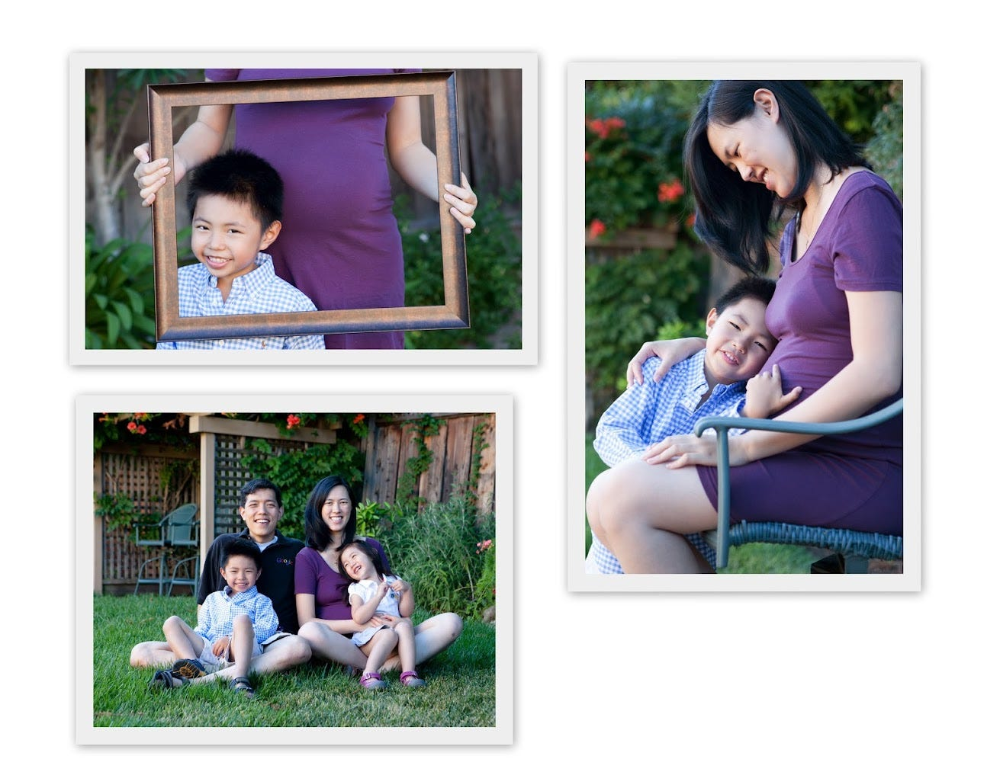
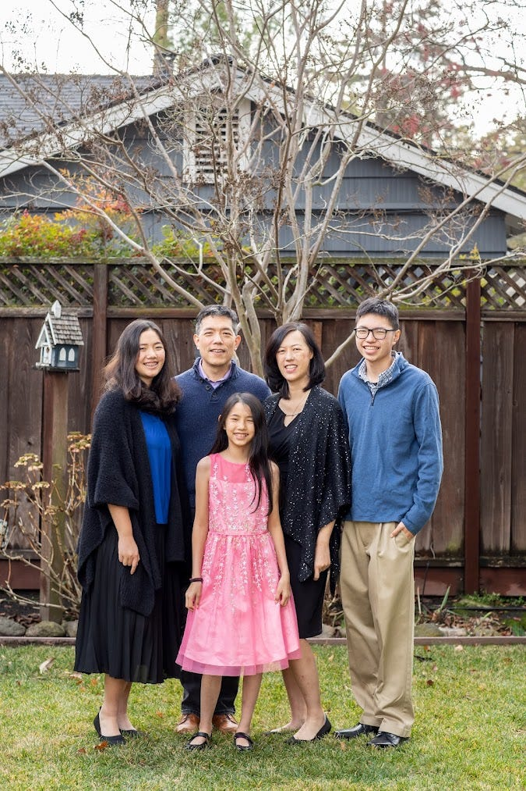

# Ask Me Anything: Family Edition

*Questions from readers on things from mundane to existential *

This week, I decided to reach into my virtual mailbag and pull out a few questions I’ve gotten recently from readers. My hope is that by posting my answers on this platform, I can scale that knowledge and make it accessible to more people who might benefit from it. This is a new format I’m testing, and I will be adding it to the rotation if the reception is good.

So, without further ado, I’d like to present this week’s Q&A. The theme: family stuff, from balancing kids and a career to fertility, quality time, and more.

NOTE: Questions have been edited for clarity and readability.

**I have a hard time coming to terms with the fact that starting a family impacts career progress. I would love to hear about any practices that can help me make peace with the choices I make (for example, picking children over career advancement when the kids are young).**

I wish I could say there are no trade-offs to having kids, but in this world, that’s simply not true. Those trade-offs are especially real for women, who bear the physical and economic costs of both the pregnancy and parental leave. But it doesn't end there. There is a misconception in the workplace that women are somehow less serious about their jobs after they have children. There is also the expectation that the woman will be the primary caregiver and home parent.

I’ve previously written about both [the cost of pregnancy](https://debliu.substack.com/p/the-truth-about-maternity-leave) and [the cost of parenthood](https://debliu.substack.com/p/what-they-dont-tell-you-about-having). These costs are absolutely real, and I’ve experienced them myself. For six years, I felt stuck. I was happy I was able to have three wonderful children, but that came at a price. However, in many ways, I’m where I am today *because* of those choices, not in spite of them.

Every choice you make has a cost, but that doesn’t mean you shouldn’t make them. Often, we’re forced to make our choices based on the options available to us, even if they aren’t always our first choice. These kinds of decisions are rarely clean-cut. We tend to make them in a serial fashion rather than having everything laid out in front of us, allowing us to pick a perfect path. When doubt starts to creep in, it’s important to remember that. We’re all doing the best we can with the information and options we have.

Unfortunately, there is no panacea. I remember struggling with the kids’ pickups and drop-offs. We used to fight every morning trying to get them out the door. Shoes were lost, jackets weren't worn. It was super frustrating, and that’s not even getting into the juggling act of managing after-school activities. Eventually we ended up rehiring our old nanny, who had retired, to come and get the kids ready for school every morning. She would then drop them off after making them a healthy breakfast and ensuring they had everything they needed. She got the chance to see them for an hour a day, and we were no longer starting the day off fighting each other. It was a huge financial sacrifice at the time, but it completely changed the dynamic of our household.

This example is a reminder that, although the trade-offs are real, life is not always a zero-sum game, either. It's not necessarily one or the other. If you’re struggling to juggle kids and a career, sometimes it's worth investing money to buy back time or sanity. Look for ways to balance things out so you don't always feel like something's got to give.

[Share](https://debliu.substack.com/p/ask-me-anything-family-edition?utm_source=substack&utm_medium=email&utm_content=share&action=share)

**If it's not too personal, I think it could be useful for many ladies to hear how you thought about your fertility journey and family planning versus your career goals and growth.**

We were really fortunate with our first kid in that we were able to get pregnant within a couple of months of trying. I only wanted two kids, and I wanted them to be close in age to each other. (My sister and I are only 16 months apart, and we are very close.) But that wasn't meant to be. We had more trouble having our second, and it took a bit of extra time and work to make it happen. David asked me for a third child for our 10th anniversary, and I said I'd give him one chance. Given how difficult it was the second time, I was pretty sure I was going to win that bet, but we ended up being blessed with a third! You never know what life has in store.

Fertility is not always a yes or no. It is a process, and it’s about probability. That’s why it can be tough to predict. About 10-15% of people run into issues with fertility ([ref](https://www.mayoclinic.org/diseases-conditions/infertility/symptoms-causes/syc-20354317)), so it’s not an uncommon thing. I have many friends who froze their eggs because they weren't ready to have children at that point in their lives, or they hadn’t met the person they wanted to partner with. I’ve seen the toll that it's taken on them, but I also recognize how fortunate they are to have this option today, something that wasn't available just a couple of decades ago.

**How do you keep motivating yourself to reach new heights in your career when you have so many other life responsibilities (kids, family, health, etc.)?**

I went through a period when I wasn't sure that a high-flying career was going to be in my future. After I had my son, all the motherhood endorphins kicked in, and I gave up my job leading the eBay product team at PayPal. I was on the senior staff of the VP of Product. I was running an amazing team that was responsible for a large business. I also had the privilege to work on the eBay-PayPal integration. I gave that all up, started working part-time, took a job in product strategy—see [last week's post](https://debliu.substack.com/p/one-foot-in-front-of-the-other)—and drifted. I ended up creating the social commerce and charity verticals at PayPal eventually, but I really wasn't happy with my job.

I ended up telling the VP I was closest to that I was going to resign and possibly stay home. I was fortunate that he stopped me and got me a job at eBay leading the buyer experience product. Even still, during this period, I didn't have that many career aspirations. This remained true throughout my time at eBay. I enjoyed what I did, but my mind was mostly at home. This was doubly true when I was pregnant with my daughter, and subsequently went on maternity leave again.

During that leave was when I got the call to go to Facebook to work on a new initiative. I wish I could say that I went in with some sort of plan, but I didn't. Sheryl Sandberg, who interviewed me for that job, even gave me the Lean In talk during the interview, years before her book came out.

I wish I could say I was always one of those up-and-to-the-right people. But the answer is much more complicated than that. I had a lot of torn feelings about working outside the home when my kids were small. I was lucky to have incredible sponsors and mentors who helped me through that difficult time, but if not for them, I might have taken a very different path.

The answer is that there is no one right answer for everybody, because not everyone is motivated by the same things. But you have to have *some* sort of purpose. When a very close colleague of mine left her senior job to stay home with the kids because her husband traveled extensively, I begged her to return to the workforce someday. And she actually did, years later. She is now an executive at a unicorn startup.

We all have seasons in our lives, and not all of them are going to be times of climbing. Sometimes they are plateaus, where maybe we just set up a picnic and enjoy the view for a while before we keep going. That is absolutely okay.

[Share Perspectives](https://debliu.substack.com/?utm_source=substack&utm_medium=email&utm_content=share&action=share)

**How have you juggled such a highly demanding career, family, and motherhood without feeling guilty about missing out on time with your children? This is a struggle for me.**

I've been asked many times, even now, if I ever feel like I missed out on my kids’ childhood. Each time, I tell David, and he laughs and says, “No one has ever asked me that.” He is a very involved father and a very loving husband, but there's a double standard. For some reason, he's not expected to feel guilt for pursuing his career. Why are working moms the only ones who are supposed to feel guilty?

To answer your question, I pick and choose what's important. For me, [food is one of those things](https://debliu.substack.com/p/memories-through-food-how-taste-passes). I think it's critical that our children grow up in the kind of household where we make dinner and eat together every night. So when I'm home, I make it a point to make dinner. I bake my own bread and cook a lot of things from scratch because that's how I grew up, and that's how my mother showed love. I travel a lot for work, and when I'm gone, I know that David is often cobbling together dinner from whatever is in the freezer. So on the days when I'm home, it's even more important that I make something for us to enjoy together. But we make it work.

At the end of the day, guilt does not make me a better mother. I decided a long time ago that regret was something I was not going to feel. Instead of looking backward, I choose to look forward and enjoy each moment I get to spend with those I love.

**How do you make sure family time is as important as work time?**

The biggest difference between family time and work time is that work time has deadlines. It has clear, measurable metrics. There is accountability built in through reviews, feedback, and one-on-ones.

But if you slack off during family time, no one actually holds you accountable. It is one day out of many, many days that you will spend with your family, and likely not even a very memorable one. But the costs accumulate over time. It’s a lot like smoking or junk food; one cigarette is unlikely to kill you, and having an occasional burger and fries won’t give you a heart attack, but if you make it a habit, you’ll see the effects in the future.

Not being present during family time has no immediate detrimental impact. No one's life is destroyed. You don't get a bad review. But kids are watching. They are learning what and where they fit in your pecking order. They are understanding the world through your actions. And while no single thing is going to make or break your relationship, taking that extra moment is critical. The good news is, that can become a habit, too, and there are ways of building it into your routine. My daughter Bethany and I walk the dog together every night. It is our chance to spend time together. There are many nights when it's raining or I'm tired or it's cold, but I put on my shoes and go anyway, because it's a chance to talk to her and hear her thoughts. There are nights when I wish I didn't have to, but I never regret it afterward.

---

I hope you’ve enjoyed this family edition of Ask Me Anything! Have a question of your own? Feel free to email or leave a comment!

[Leave a comment](https://debliu.substack.com/p/ask-me-anything-family-edition/comments)