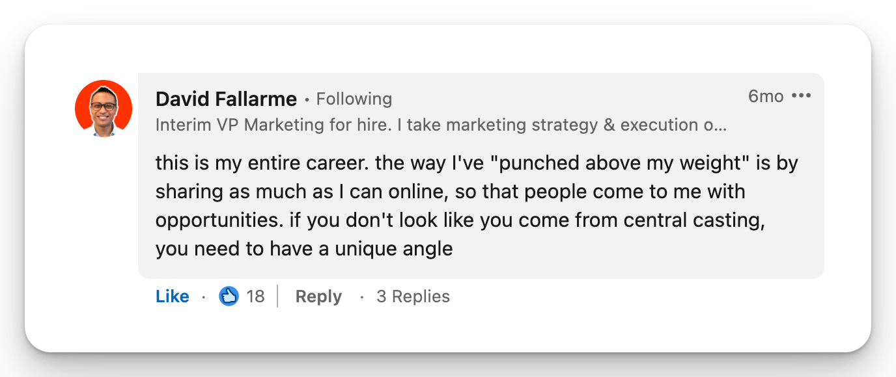
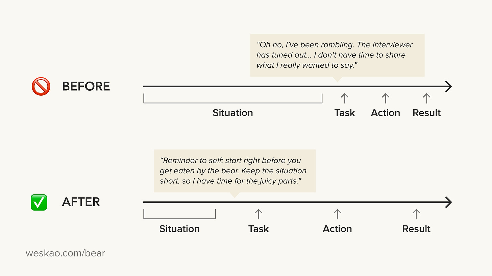
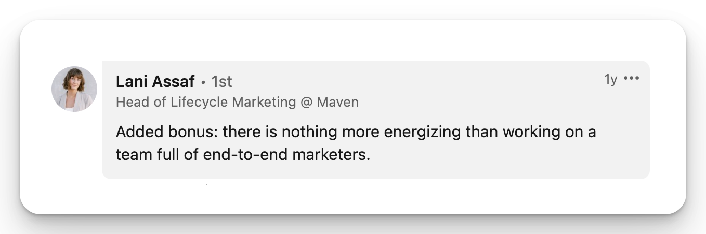

# How to Land at a Fast-Paced Startup

*What you need to stand out, get hired, and thrive at a startup*

**Note From Deb:**

I often get asked to write about life at a startup. While I have invested in and advised startups, I haven’t actually worked at one in years and years. (Where did I work, you may be wondering? PayPal only had a few hundred people when I joined, and Facebook was sub-1,000. But the environment has changed so much, and both would be late, late, late stage at this point.)

I have been in touch with [Wes](http://newsletter.weskao.com) since her time running her startup, Maven, and when she was open to writing about her extensive experience, I was really excited. She brings a wealth of knowledge about something many of us are curious about. I hope you learn something new if you’re exploring this as an option on your career journey.

[Subscribe now](https://debliu.substack.com/subscribe?)

---

I grew up and went to college in the Bay Area, where tech startups were the default industry. While I initially wanted to look further from home, within a few years of finishing college, I took on a role at a startup, and I haven't looked back since. I loved the pace, openness to new ideas, and willingness to challenge the status quo that the environment offered.

In the past 15 years, I’ve co-founded a venture-backed company that raised $25M from Andreessen Horowitz and worked at, advised, and interviewed hundreds of startup candidates. Today, I’d like to share some of what I’ve learned.

Although landing your first startup job can be an intimidating challenge, there are several ways you can make it more manageable. From embracing take-home projects to clarifying your work and talking points, these strategies can help you prepare and stand out. Whether you’re interested in getting hired at a startup or you’re just curious about what it takes to land at one, here is my best advice.

[Share](https://debliu.substack.com/p/how-to-land-at-a-fast-paced-startup?utm_source=substack&utm_medium=email&utm_content=share&action=share)

## **1. Embrace take-home projects.**

Startups have a lot less room for hiring errors, so they derisk by using portfolio reviews and take-home projects to evaluate candidates. These assignments can be controversial because some employers are unreasonable in their asks or use them to exploit candidates. (My advice in this section assumes you’re doing a take-home project for a company with integrity, and not one using candidate projects as a cheap source of execution.)

Often, candidates are also concerned that employers will steal their ideas, so they hold back their insights as a result. If you think that might be the case, that company probably isn’t one you should be interviewing with in the first place. As a hiring manager who has reviewed hundreds of take-home projects, I can tell you that most candidates don’t have enough context on the company’s business for their projects to be usable as is. The exception is if your project output is literal, as is the case for designers and copywriters.

Most of the time, though, the value in these projects is in what they can tell a company about you. Take-home projects can help distinguish you as a candidate. I urge you to use them as an opportunity to show your ability, the “what” and “how” of your strategic thinking, your sense of judgment, and your level of care.

How can you do this? Here are a few tips:

* **Pick a medium you are comfortable with.** If you’re fluent in Google Slides, use that over Figma. Be wary of learning a new tool just to complete a project.
* **Show your work.** Don’t assume the content of your project will speak for itself. Consider adding a Loom video that explains your thought process. Provide context and state your assumptions so the hiring manager isn’t assessing your work in a vacuum.
* **Answer the [question behind the question](https://www.weskao.com/blog/the-question-behind-the-question).** Each section of a take-home project is designed to evaluate a different aspect of the role you're being interviewed for. Instead of taking the questions at face value, think about what their underlying purpose might be. This can help you scope your project and decide what skills you should focus on demonstrating.

Despite their reputation, take-home assignments can be invaluable—both for the company and for you as a candidate. If you’re interested in landing a job at a startup, I encourage you to make the most of them.

[Subscribe now](https://debliu.substack.com/subscribe?)

## **2. Prove you can do the job.**

We’ve all heard the advice “show, don’t tell,” but what does that actually mean? *Telling* is saying, “I’m savvy, resourceful, and proactive.” *Showing* is offering examples of work output, including side projects, that demonstrate these traits. These examples carry a lot more weight than words in the hiring manager’s mind.

Thanks to the internet, credentials matter less, and proof of work matters more. Here are a few examples of proof points you can prepare, whether or not you’re actively interviewing:

* Host a digital event about a trending topic in your industry
* Do a weekend side project and build a microsite to document it
* Post short videos on LinkedIn to share learnings
* Share industry insights on social media
* Start a podcast and interview industry experts
* Write an op-ed arguing your thesis on a relevant topic
* Write a blog or newsletter sharing your observations and analyses

In the first five years of my career, when I was a mid-level marketer without big-name credentials, I did many of the above. I thought Airbnb’s messaging could be better, so I [rewrote their ads](https://www.weskao.com/blog/redesigning-airbnb-ads). I had strong thoughts about what Lululemon could have done differently on their website, so I wrote and pitched my op-ed to *Fast Company* and got published. I started an in-person storytelling event series in San Francisco and New York, where I asked women to share hard-earned career lessons with an invite-only group.

These side projects taught me to get out of my comfort zone and learn new skills. They also taught me that having an idea and making it a reality were very different—and how to bridge that gap. These were not side hustles, but learning experiences that doubled as credibility-building opportunities. I wanted to develop a public body of work not locked behind the closed doors of my employer. (Deb has also discussed this in her article [Escape Velocity](https://debliu.substack.com/p/escape-velocity-building-a-career).) The goal was to show future collaborators how I think and how I learn.

Now, as a co-founder and leader on the employer side, if I had to choose between a candidate with little practical experience and a candidate who writes an interesting newsletter about tech or makes videos about what they’re learning, I would choose the latter.

If your experience doesn’t look relevant on paper, it’s up to you to connect the dots. Even if you’re not switching careers, there are often thousands of candidates applying for the same position, so you’ll need to stand out. Demonstrating your knowledge and skills is critical.

Does creating proof points sound like a lot of work? Yes. But the spray-and-pray approach of sending out hundreds of resumes doesn’t work. It’s more effective (and rewarding) to take control and show what you can do.

[Share Perspectives](https://debliu.substack.com/?utm_source=substack&utm_medium=email&utm_content=share&action=share)

## **3. Clarify what you’ll be doing on the job.**

Many job descriptions include a dozen or more bullet points, but 80% of the job focuses on just a few of them. If you can’t tell which ones comprise the majority of how you’ll be spending your time, you could be in for an unpleasant surprise if you end up taking the job.

It’s important to do more than read the literal job description. Instead, try to determine the “why” behind the description and identify the underlying problem the job will be focused on solving. What KPI will this role be measured on? What are the levers and resources available? What skills is the team missing right now? Once you know the answers to these questions, you have the option to break the frame—for example, if you believe the role should actually be measured on something else, you can make that point in your discussions. (This requires  confidence, backed by evidence, data, or experience.)

Determining what is important for the role is also valuable because it lets you share what you would do if you got the job. When you “act as if,” you help the hiring manager imagine what it would be like having you on the team. The rule I developed for myself was to only apply for jobs where I had a strong perspective on what I would do if I landed it. Coming into the interview with hypotheses and a willingness to share hunches based on what you understand of the business will set you apart from most candidates.

Without clear conviction about what you can do, it can be hard to persuade the hiring manager (or yourself) that you’re the best fit for the role. This is true at both startups and larger companies. Ask yourself, “If they brought me on, what would I do, and why?” Demonstrate that you are uniquely able to solve a set of problems, that you are excited to solve them, and that this company is where you want to solve them.

## **4. Practice your talking points.**

For most business roles at startups, you’ll get some behavioral interview questions. It’s useful to prepare a few go-to stories and examples to demonstrate your creativity, strategic thinking, and operational ability. When answering these questions, try to avoid [backstory scope creep](http://weskao.com/bear). You may think you need to share a ton of context for your point to make sense, but you’d be surprised how little backstory is actually needed.

The classic interview answer framework is the STAR (situation, task, action, results) method. It can be easy to accidentally spend too much time on the *situation* part. Remember to allocate your time appropriately, because the situation is probably the least interesting part of your story.

When interviewing, make your answers count. Practice your talking points ahead of time, and hone in on the most important parts of your responses. This signals maturity and finesse because you’re able to prioritize what to communicate.

## **5. Show that you can turn ideas into reality.**

When it comes to landing a role at a startup, showing your ability to take action and solve problems is key. That means being willing to take initiative and jump into the deep end—and demonstrating that willingness in the interview.

What does this look like? Let’s say you think your company’s onboarding emails are mediocre, and you believe fixing them could improve conversion and new customer engagement. You can approach this in one of two ways:

Operator #1:

* Thinks the emails are bad.
* Needs to hire an email strategist, copywriter, and designer to make them better.

Operator #2:

* Thinks the emails are bad.
* Gathers industry examples of onboarding and lifecycle emails for inspiration.
* Sketches a new email flow in Figma.
* Convinces the marketing team to test the new email flow with 10% of customers.
* Takes A/B test data to leadership to show how this will improve conversion.

In a startup environment, Operator #2 will win. Why? Because they’re able to bring their ideas to life with minimal outside support and low overhead while handling both strategy and execution.

Being an [end-to-end operator](https://www.linkedin.com/posts/weskao_linkedintopstartups-activity-6983074221245558784-M6fP?utm_source=share&utm_medium=member_desktop) is incredibly valuable on lean teams. When trying to land a startup job, consider whether you can demonstrate this during the interview. Brainstorm stories of when you solved problems with little support, took matters into your own hands, and were able to execute as well as strategize. These abilities will take you a long way, in both the interview process and in the role itself.

## **6. Embrace being hands-on.**

I want to emphasize that in a startup environment, very few people spend all day sitting around and thinking. Even CEOs are executing and doing some individual contributor work.

I’ve interviewed executives who came from larger organizations, or MBA grads who wanted to get into tech startups, and many were excited to do *strategy*. But if strategy is the only thing you want to do, a startup may not be the right place for you, because you will almost certainly be expected to execute.

A candidate who is willing and ready to get close to the problem will surpass one who can only stay at a high level. When you’re willing to talk to customers, write copy, analyze metrics, and interact with primary data, you’re more likely to derive insights that drive the business. If you seem like someone who only wants to do thought leadership and hire a team to do the work, the impression you leave is that you can’t be relied on to get stuff done.

Startups are more likely to want a T-shaped operator than someone who is a deep subject matter expert in one narrow area. Why? Because at a startup, the company needs (and, therefore, roles and responsibilities) can evolve every few months. On the flip side, demonstrating that you are flexible, coachable, and growth-oriented can help you get in. This is doubly true if you come from the corporate world or are trying to break into a new function or industry. Hiring managers at startups, like hiring managers everywhere else, want candidates who can start contributing immediately because they don’t have much bandwidth to train them.

Depending on your startup’s stage and trajectory, you might be a team of one, or part of a small team, for a year or more. If you’re a manager or leader, you’ll likely need to be a player-coach who’s responsible for managing your team while also serving as an individual contributor. You’ll be expected to identify what you need, why you need it, and find the most effective way to get it. This includes utilizing internal and external resources to help bring your vision to life. For the right person, the opportunity to execute is a feature, not a bug, and it’s an expectation at most high-growth startups.

---

I hope this article gives you a good starting point for how to approach interviewing for a startup role. On the surface, the process can seem intimidating, but knowing what to focus on can make it more accessible and rewarding. Startups can be an incredible opportunity to supercharge your career and many startups are actively looking for strong talent. Show them you are the A-player they’ve been looking for.

[Leave a comment](https://debliu.substack.com/p/how-to-land-at-a-fast-paced-startup/comments)

Wes Kao is a marketing executive, entrepreneur, and advisor who writes at [newsletter.weskao.com](http://newsletter.weskao.com). She is co-founder of Maven, an education company that raised $25M from First Round and Andreessen Horowitz.

**LinkedIn**: <https://www.linkedin.com/in/weskao/>

**Twitter**: <https://twitter.com/wes_kao>

**Wes’s Substack:** [newsletter.weskao.com](http://newsletter.weskao.com)