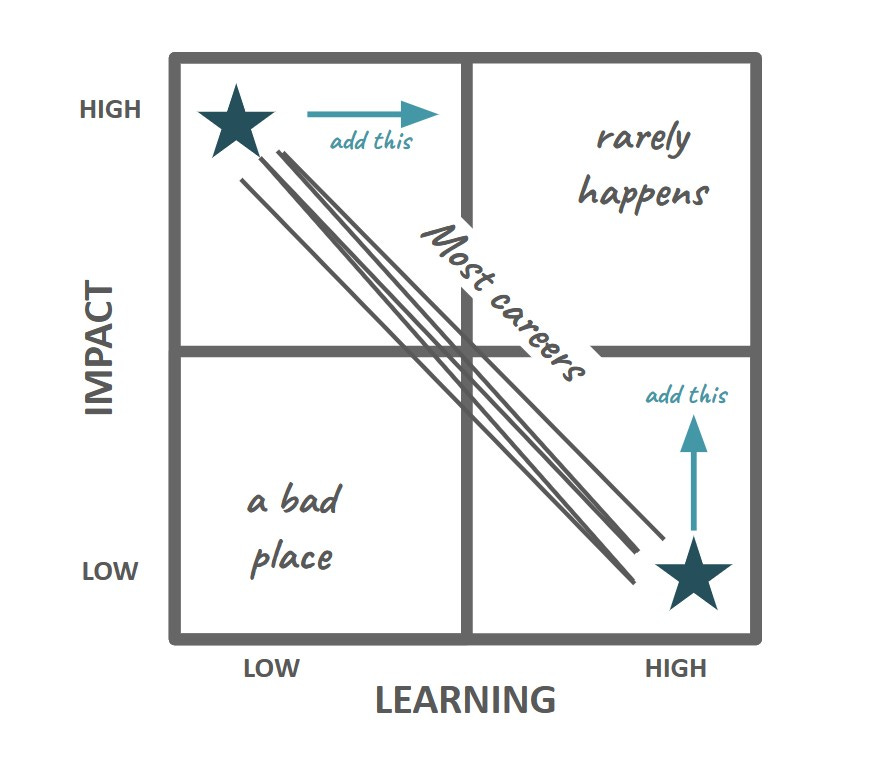

# Learning vs. Impact

*How to grow while you execute*

After 11 years at Facebook, I woke up one day and realized something: I had gotten good at my job. I knew how to get budget, manage headcount, and horse-trade for my team. I knew the ins and outs of how to get around processes and how to use various tools to reduce the overhead on my teams. I knew enough about our history and experiences to know when we could bend the rules and when they were fixed. In other words, I was getting better at doing the job I had created every single day. Every minute I stayed, I deepened that groove, and things became even more second nature.

But the flip side of being at a job I knew so well was that my learning and growth had slowed. I was spending nearly all my time practicing and executing what I already knew, which meant I had to take time—and [activation energy](https://debliu.substack.com/p/activation-energy-the-hidden-superpower)—to create ways of honing new skills.

This is the paradox of “Learning versus Impact.” You typically have the most impact in your career when you are learning the least, and you tend to learn the most when you are least effective.

In a new role, you are mostly learning and having little actual impact. This is a time of stretching and growing and forcing yourself outside your comfort zone. Every day brings a new relationship, a new opportunity, something to learn. On the other hand, you accomplish the most when you're comfortable and you know how everything runs. After all, there is now a you-shaped hole in your organization. And who better to fill that hole than… you? The processes you’ve set up, the relationships you've built, and the ways you’ve found to get things done make it easy for you to accomplish more. But you are no longer growing and changing as much as you used to.

This dichotomy is one that we too often ignore. How do we find a balance between making an impact at work and continuing to learn and develop new skills?

## **Adding learning to impact**

The most impactful periods in my career have tended to follow the same trajectory. I would give and give and give. It felt easy to do the work, and it was nice to finally be swimming downstream. But I would inevitably start to feel restless. Sooner or later, there was a sense of stagnation and boredom that made each day tedious.

When you get comfortable in your job, it’s easy to get complacent. You know what’s required, you can deliver results, and you slip into cruise control without even realizing it. But there’s something to be said for being forced out of your comfort zone. Challenges lead to growth, even at the expense of comfort and ease. This push creates opportunities to change things up and find new ways of doing things.

Marriages are the same way. As humans, we like novelty, and we tend to be more invested in what’s new. Changing out spouses is clearly out of the question, so what if you could find a way to grow together? The excitement of learning something new while still in your current relationship can reignite feelings of freshness, mimicking the initial rush of emotions of falling in love ([ref](https://www.nytimes.com/2008/02/12/health/12well.html)). In fact, doing something new, unusual, or exciting has been found to increase marital satisfaction ([ref](https://www.researchgate.net/profile/Elaine-Aron/publication/12609069_Couples%27_shared_participation_in_novel_and_arousing_activities_and_experienced_relationship_quality/links/5577bd0f08aeacff20004ef3/Couples-shared-participation-in-novel-and-arousing-activities-and-experienced-relationship-quality.pdf), [ref](https://www.nytimes.com/2008/02/12/health/12well.html)).

The same strategy can also apply to a job. Although some people take stagnation as a sign to find a new role, this may not always be the only option. Often, a good first step is to look for ways to stretch yourself. This can bring excitement back into your day-to-day and help you get out of the rut. Even if you do end up leaving, you’ll have had a chance to develop new skills and explore new areas of growth.

Here are a few ways to bring learning back into your role when you are having maximum impact:

* **Pick a challenge.** Choose something you don’t usually do that you can assign yourself as a personal mission. Speak externally once a quarter. Write once a month. Learn to pull your own data. The goal is to find something that is doable, but enough of a challenge to nudge you out of your comfort zone.
* **Innovate.** Sometimes we think we’ve already done as much as we can in a role, but there are always other options to explore. Research a new space to expand into. Launch a Hackathon project. Explore a new partnership. Even if it doesn’t pan out, odds are it will open up new lines of thinking and creativity.
* **Create something new.** Growth opportunities don’t always have to be directly related to your daily work. Try starting a mentoring circle. Launch a [Toastmasters club](https://www.toastmasters.org/start-a-club). Find a platform to share your learnings with others. You may uncover new areas of interest and growth you never would have considered otherwise.
* **Help someone else.** Advise a startup. Join a non-profit board. Mentor an intern. Doing something nice for another person can promote positive feelings and boost your confidence. It can also show you ways to apply your skills beyond your typical work responsibilities.

What do all these examples have in common? Each one takes you outside your comfort zone and into something new. Devoting just 10% of your time to something that gives you energy can keep you excited and engaged longer. As an added bonus, it can also allow you to bring new insights and experiences back into your day job.

Perspectives is a reader-supported publication. To receive new posts and support my work, consider becoming a free or paid subscriber.

## **Adding impact to learning**

[I have written extensively about onboarding into a new job](https://debliu.substack.com/p/a-simple-guide-to-preparing-for-a), and one of the things I emphasize is using your first few weeks as a learning opportunity. I encourage anyone who’s just started a new role to spend their first 30 days listening before trying to have a big impact. It can sometimes be beneficial to wait even longer before feeling like you need to get things 100% right.

But this time of learning can also make you feel like you're not of any value. When you’re new, the stakes can feel high. This is a time when people are looking at you and seeing what you're made of. They're measuring you, and they're listening to you. And they're wondering what to think. That’s why finding ways to make an impact when you're still in the learning period can be valuable as well. Yes, it's important to listen, but it's also important to demonstrate that you have something to bring to the table. And there are a number of ways to do this.

If you’re new to a role and want to create value while you’re still learning the ropes, here are a few things to try:

* **Fix a problem.** Find one issue that you can fix, address, or help with that takes a week or less, and do it. This will teach you about the culture and what it takes to untangle an issue. It doesn’t have to be anything earth-shattering; even finding a small solution can create goodwill and show others that you can take initiative.
* **Pick something up.** At any company, there are issues and challenges lying around everywhere waiting to be picked up. Pick something that you know well enough to do, such as planning an offsite, designing swag, or improving recruiting, and then offer to do it. You’ll be taking the load off someone else while getting something valuable done.
* **Bank a win.** A small win can lead to others coming to you to do bigger and more important things. Give yourself points for each small win you land and keep a running tally. As you work your way up, you may find your impact growing, too.
* **Help someone out.** Sometimes, having an impact can be as simple as helping out someone who needs you most. This could be someone who is a bottleneck in the process or someone whose work is critical to others. Freeing them up can yield large dividends.

A new director once joined our team at a time when we were extremely busy. We were so swamped that we could barely get any hiring done because no one even had time to screen or interview people. While the new director was onboarding, she offered to run the process for us. She was able to create batch hiring days and improve our processes tremendously. By investing a few weeks of her time, she transformed the organization. Along the way, she earned the respect of those around her. She wasn't an expert in our product. She didn't know anyone that well. But she was able to add value quickly while building relationships with everyone she was going to have to work with in the future.

This is just one example of making the right impact early on. Our ideas of success tend to be tied directly to our daily responsibilities, but there are often ways to add value even when you don’t fully know the job yet. Look for these opportunities while you’re still learning, and you can set yourself up for success.

[Share](https://debliu.substack.com/p/learning-vs-impact?utm_source=substack&utm_medium=email&utm_content=share&action=share)

## **Balancing both in a demanding role**

One reason impact and learning often feel like a paradox is because they tend to pull against each other. You get better at something, but you then walk familiar paths to get it done. You learn new things, but you start out bad at them.

When you are in a demanding role, it often feels easiest to pick one or the other. But those who want to grow their scope and career know how to balance both. Some choose to go back and forth, continuing to weave their way through an organization while constantly taking on new things to push themselves to the next level. Others choose to keep deepening their knowledge until they are an N of 1 and no one can replicate or replace them. They create a space that is perfect for their unique skills and abilities.

Regardless of which way you lean, it is critical to seek out the other in some form. Just like a little bit of salt can make an otherwise too-sweet chocolate chip cookie sing, a little bit of what you lack can likewise bring out the best in what you have.

---

At first glance, the paradox of learning and impact can seem like… Well, a paradox. But when you look more closely, you can see that there are ways to bring out both in your work, whether you’re experienced or brand new. If you feel yourself stagnating, look for new ways to challenge yourself. If you’re still learning, look for ways to use the skills you have already. In doing so, you can get the best of both worlds, no matter where you are in your career.

[Share Perspectives](https://debliu.substack.com/?utm_source=substack&utm_medium=email&utm_content=share&action=share)