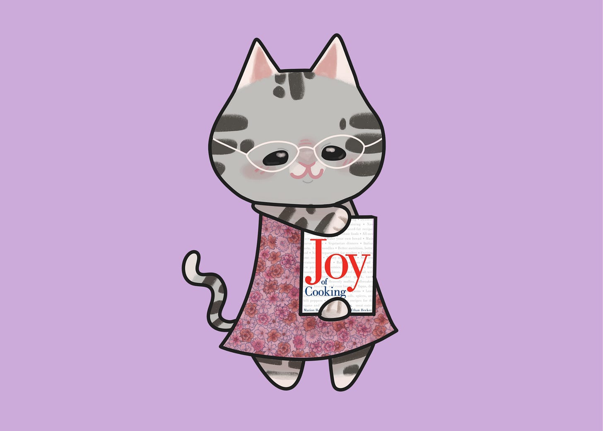
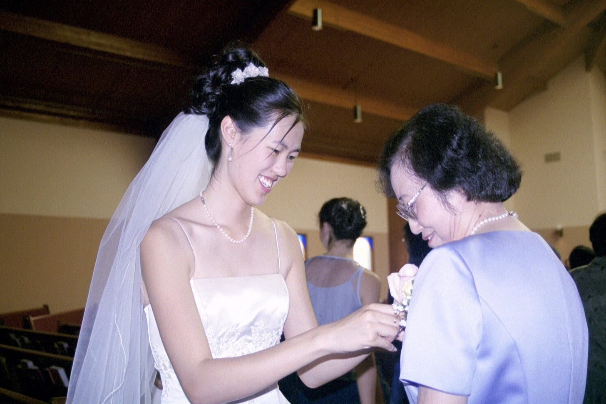
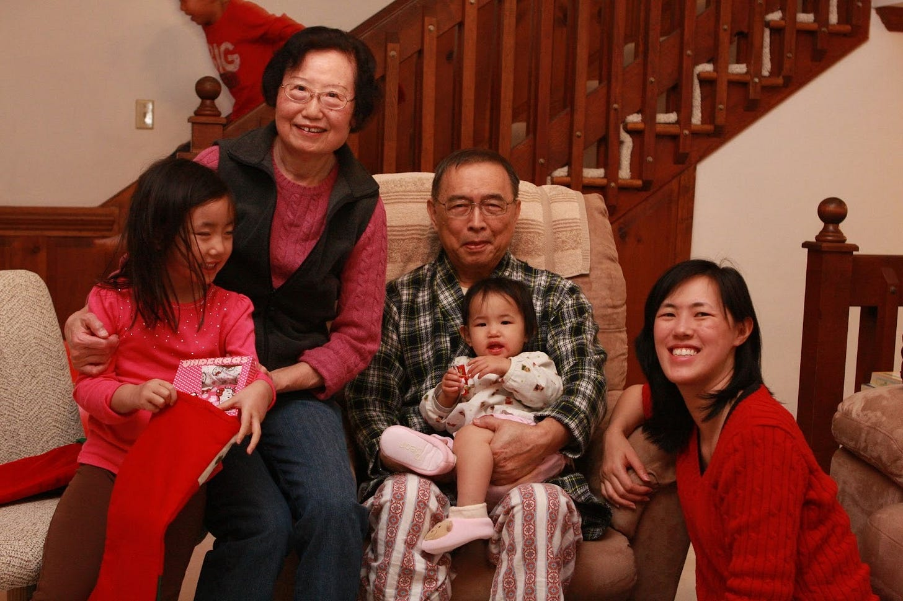
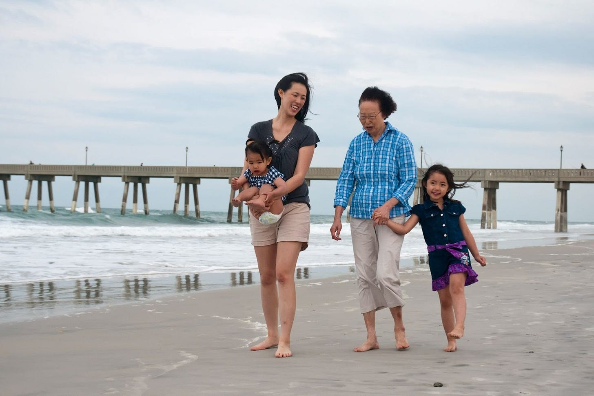
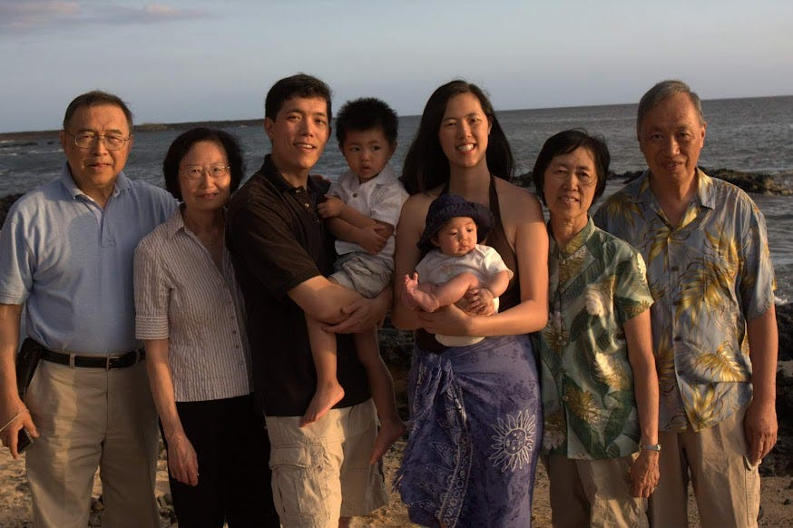
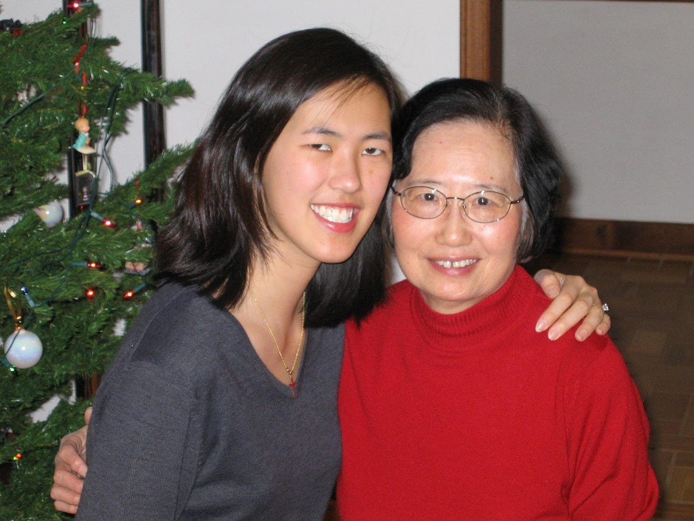

# Awkward Family Dinners and Other Lessons on Love

*How my mother-in-law taught me to hear differently*

**Deb’s Note:** This article was inspired by my friend [Sarah Pachter](https://sarahpachter.com/) who gave an [incredible TEDx talk](https://www.youtube.com/watch?v=pj2Xwg6L3wc) on mothers-in-law and daughters-in-law. I hope anyone who has a MIL or DIL (or hopes to have one someday) watches her video because it is an exercise in empathy.

---

The first time my parents met my future in-laws, my then-boyfriend and I weren’t even there. When David’s parents heard through a mutual friend that *my* parents were going to be in town, they forced a meeting. I was horrified. I phoned David to see if he could call off his parents, but this was in a time before cell phones (yes, we are old), and David was still in Boston, where he was attending law school.

I remember how awkward that dinner was. It was my parents, his parents, and my friend Danny Tan, whose parents facilitated the dinner. Danny was actually the person who introduced David and me, so it was all the more awkward. They sat around making polite conversation. At some point, my mom said something about how David really liked hot sauce. She said, “I bought an entire container just for him, and after just a few visits, it’s nearly all gone.”

That’s when David’s mom said matter-of-factly, “Yeah, David likes to put hot sauce on food he doesn’t like to eat.”

My mom was deeply offended. After dinner, she mentioned how terrible David must think her cooking was. She joked about this incident for years afterward.

### **My Imperfect Lens**

My mother-in-law was a wonderful, kind, and loving person. She also had a way of saying things that could be hurtful, completely by accident. It was like she had a way of telling hard truths without noticing. Because the truth is, David truly did think my mom’s cooking was bland, but my future mother-in-law in no way wanted to imply that to her. She wasn’t trying to be hurtful, but her dry honesty came across as cutting.

I remember one day many years ago, we brought our very colicky infant to North Carolina to visit them. Danielle was our surprise baby, and our lives were extremely hectic. We already had 4 and 2-year-olds, and my Dad had just passed from cancer. My mother-in-law was watching me struggle to feed baby Danielle. She said, “Why did you have a third child? You’re so busy. You could have stopped at two.”

I joked back with her, “I think that ship has sailed.”

It would be easy to read that as judgment. But that wasn’t her intention. She was worried about us. Beneath her awkward phrasing was concern and love.

Reading just her words, you might think that she is a terrible mother-in-law. I grew up reading advice columns like Ask Ann and Dear Abby, and if I wrote in just about these two incidents, you would assume she was the mother-in-law from hell. A Reddit post on r/amitheasshole or r/relationship\_advice would be filled with comments talking about how terrible she was. But she was the opposite. She was actually one of the kindest and loving people that I ever met. She had a big heart, and I think sometimes the language barrier got in the way.

### **An Often Fraught Relationship**

Recently, my friend Sarah Pachter gave a [TEDx talk](https://www.youtube.com/watch?v=pj2Xwg6L3wc) that spoke to the complicated dynamics between mothers-in-law and daughters-in-law. She had interviewed women on both sides and found something fascinating: each believed they were acting out of love, yet both often felt misunderstood.

That resonated with me. In our culture, mothers-in-law are often the villains. The [“Marie Barone” archetype from Everybody Loves Raymond](https://youtu.be/CJy07y1Xp9E) comes to mind, well-meaning but meddling. The showrunner, Phil Rosenthal, [admitted that Ray’s mom was the villain](https://youtu.be/J8-DXNTvrrc?si=ouIRVAD3QBQceGQI), even if she didn’t see herself that way. And that’s the way of a lot of relationships. The mother and daughter-in-law relationship is particularly fraught because you love the same person, but with very different perspectives.

My mother-in-law and I on my wedding day.

[Subscribe now](https://debliu.substack.com/subscribe?)

Admittedly, I am not what my mother-in-law wanted for her son. She made it clear from the start that I was not what she expected or hoped for for her child. She told me on more than one occasion that she thought David would marry someone more nurturing and less career-oriented, which is ironic, because she herself was a very successful woman in her own right. I laughed and told her that it was entirely too late for that. She smiled.

That is what I loved about her: she was completely honest and completely lovely. She was also unfailingly polite and kind, never overstepped her bounds, and always made suggestions or thoughts very openly. She was an extremely quiet and private person.

My husband adored her, and she adored him, too, but they were not outwardly demonstrative at all. David was born extremely premature, and she had coddled him most of his childhood, something that she later regretted. She admitted to me once that she feared she spoiled him by making him second dinners when he didn’t want Chinese food. It made sense that she wanted someone who would take care of her son just as she had his whole life.

### **Finding Common Ground**

My mother-in-law and I found our rhythm over time, yet I still had lingering doubts. I wondered in the back of my mind if I was still not who she wanted for her son. I bit my tongue when she came and washed our laundry for us, and she held hers when I left the table early to wash the dishes.

Then one year, she gifted me *The Joy of Cooking* for Christmas. I wasn’t sure whether I should be flattered or offended. She was an incredible cook and loved cooking. Was she saying I was a bad cook?

I could’ve taken it as an insult, but instead, I chose to accept it as an act of love; she enjoyed cooking, and I loved that she wanted to share that with me. If she thinks my cooking is terrible and wants me to get better, that’s okay. I’ll learn.

She collected recipes from across her life, and wrote them down for me in careful handwriting, so that I could make them for her husband and mine. In her later years, she taught me to cook her favorites. She lovingly made dinner for us once a week for years, delighting in making intricate Chinese dishes. She spent hours teaching our kids Chinese and how to cook.

Cooking was how she showed care, and she was inviting me into that part of her world. It was her way of bonding.

It took me years to understand her, but I loved her from the start. She saw the world through her own lens, and I through mine. The hardest part of relationships is that love looks different to each person. Sometimes it can inadvertently sound like criticism, worry, or even disapproval. But underneath, there is a desire to connect.

If I had taken her gestures and words at face value, I would’ve missed that chance.

[Share](https://debliu.substack.com/p/awkward-family-dinners-and-other?utm_source=substack&utm_medium=email&utm_content=share&action=share)

### **Curiosity, Not Criticism**

In her TEDx talk, Sarah shared that the tension between mothers and daughters-in-law often comes from the very thing they have in common: love for the same person. Both want to protect and nurture, but from different vantage points.

She shares her experience of interviewing dozens of women who all wanted harmony but kept clashing because each saw the other through the lens of competition rather than connection. Sarah’s takeaway was simple and profound: shift from judgment to curiosity. Instead of asking, “Why is she doing this?” ask, “What is she trying to express?”

That mindset has stayed with me. My mother-in-law and I never perfectly understood each other, but we did share one thing: a deep love for our families.

[Leave a comment](https://debliu.substack.com/p/awkward-family-dinners-and-other/comments)

In many ways, she was as dear to me as my own mother. Though I refer to her here as “mother-in-law” for clarity, in everyday life, I just called her “Mom”. She asked me to do so, and I was happy to. My parents and in-laws became good friends over the years, despite their rough beginning and that awkward dinner. We took all four of them on vacation all over the world together, and they were very close.

Family vacation circa 2009.

Sadly, she passed away a year and a half ago. I still miss her every day. In many ways, her passing was even harder than my father-in-law’s and my mother’s, even though they all happened at around the same time. Both my father-in-law and my mother were sick for a long time. But my mother-in-law’s passing was sudden and unexpected. We lost her right after she lost her husband of 50 years. I had hoped that after his passing, we would have more time to spend with her. But she just went into the hospital one day and never returned.

Looking back, I can see so clearly that she was teaching me her language as I taught her my own. It is the kind of realization that comes with distance. I think about her often, especially as I imagine one day becoming a mother-in-law myself.

---

Someday, when my own kids bring home partners, I hope I remember Sarah’s advice: approach with curiosity, not criticism. Actions can be interpreted as care or suffocation. And it’s up to us to reach a level of understanding. Don’t assume the worst, and instead know that many times, how you hear the words matters just as much as the words that were said.

My relationship with my mother-in-law is a reminder that curiosity and communication can overcome anything. And that love comes in many languages, accents, and expressions. We just have to be willing to learn them.

*Related Perspectives:*