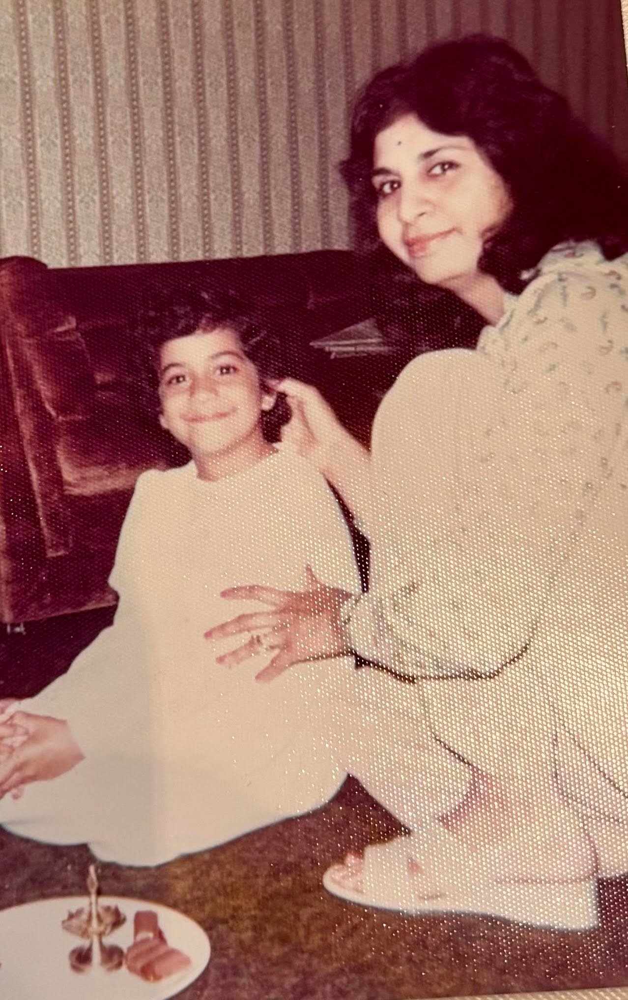

# What Happens in the Mirror

*And why one reflection isn't enough*

**Note from Deb:** From time to time, I invite interesting people with interesting perspectives to be part of this newsletter to share their point of view. I met Sheila through a mutual friend. Though she had the flu the first time we met, I was charmed. She shared that she was writing a book inspired by her [TEDxSan Diego talk](https://www.youtube.com/watch?v=2DpDx6T3-X4), and she encouraged me to give a talk, too. I loved her message, and I wanted to share it with you. If you like Sheila’s message, please check out her book, *[The Mirror Effect](https://amzn.to/4oz5sJc)*.

---

I was seven, trailing my mother as she pushed a shopping cart down the dry goods aisle. She was still in her work clothes from her clinic shift at the hospital. Circles shadowed her eyes; she hadn’t slept well, but her dark hair was well-coiffed, and her posture was arrow-straight as always.

“Dr. Gujrathi?”

A woman approached us, her voice breaking. Behind her stood a small boy, maybe my own age, clutching a box of Lucky Charms.

“I just wanted to thank you again. For saving Johnny’s life.”

My mother smiled—gracious, warm, brief—and touched the woman’s arm. “I’m so glad he’s doing well.”

Then we were back to our list: potatoes, spinach, rice, and lentils, for the Indian dinner she’d cook that night after finally getting some sleep.

I watched her that day the way I’d watched her my entire childhood: in awe. My mother was a decorated physician who commanded respect at work. A caretaker who nursed my father through years of illness after he nearly died when I was three. She was a provider who put my brother and me through medical school without a penny of debt after my father passed when I was a teenager. And she was a homemaker who still managed to cook incredible meals and hold our family together.

She did it all, brilliantly. Seemingly effortlessly. Without a single word of complaint.

And for years, I thought that’s what I was supposed to do, too.

### **The Gift of an Impossible Standard**

My mother was my first mirror. She was the person who showed me what was possible for a woman, for a daughter of immigrants, for someone who refused to choose between professional excellence and family devotion. She never once suggested I’d be anything less than a professional with an important career. Independence wasn’t optional; it was survival. She’d learned that at thirty, when my father’s illness forced her to become the sole financial anchor for our family.

But I didn’t understand as a child, or even as a young professional, that my mother was one person. One singular, extraordinary mirror who set a standard I’d spend decades trying to meet.

A single mirror, no matter how brilliant, can only show you one angle. One possibility. One version of success. But the truth is that we all contain multitudes.

[Subscribe now](https://debliu.substack.com/subscribe?)

### **The Reflection I Couldn’t See**

As I moved up in my career in biotech and pharma (heavily male-dominated industries), I began to notice what was missing.

I’d watch the men around me with entire boards of directors advocating for them behind closed doors. Meanwhile, I was so used to being the only person who looked like me in any given room that I didn’t even register it as unusual anymore. And even when people acknowledged my talents, they didn’t necessarily fight for me. They didn’t put me up for the opportunities I felt I had earned.

While my mother had been an incredible mirror, in this harsh corporate world, my reflection of her wasn’t enough. I looked around, and I was alone. I didn’t have advocates. I didn’t have sponsors. I didn’t have people saying my name in rooms I wasn’t in.

I did have one incredible mirror, a male mentor who showed me what success could look like. He was the first person to suggest I could be a CEO. But I didn’t have the disco ball of reflection I actually needed: diverse perspectives bouncing light back to me from every angle, showing me dimensions of myself I couldn’t see alone.

Moreover, I realized I couldn’t be my mom.

It happened one evening, after a grueling day of team meetings and investor calls. I was standing in my kitchen, apron secured around my waist, trying to recreate one of the from-scratch meals I remembered so fondly from childhood. My kids were hungry, the counters were a mess, and I still had hours of paperwork left to tackle before I could call it a night. I was exhausted.

Trying to navigate the exact moment between blooming my spices and burning them, I had an epiphany: I just didn’t love cooking the way my mom did.

For her, it was a creative outlet, a respite from the stress of the hospital and the many other responsibilities stacked on her list. For me, it was just added pressure. Another thing I had to do before I could get to the next thing clamoring for my attention. I loved my family, and soaking up time with my kids as they worked on their homework or scored goals on the soccer field. I made a point to make it to practice and science fairs and field trips whenever I could. That filled my cup. But the homemaking responsibilities didn’t. I was fortunate enough to be able to outsource some of the housework she took on directly, and I could exercise that opportunity.

Truthfully, outsourcing the housework came with some guilt and shame. I felt bad that I couldn’t do it all. I couldn’t be an amazing homekeeper and executive and the kind of mom I wanted to be; one who’s professional *and* present for the important stuff. But it was worth it.

Taking those tasks off my list allowed me to show up in the ways that mattered most.

I eventually realized that there were other traits of my mother’s that I didn’t want to reflect. For example, her brilliance and professionalism came with a harsh inner and external critic. That criticism contributed to my negative self-talk, the little voice inside my head that whispered I might not be good enough.

For years, I lived with what I now call FIDS (fear, insecurity, doubt, and shame). I struggled with imposter syndrome despite my accomplishments. I people-pleased my way through situations where I should have stood my ground. I received criticism for being assertive in ways my male colleagues were praised for. And I didn’t realize that these weren’t personal failings; they were responses to systemic barriers I’d been navigating my entire career.

I was looking for everyone else to show me who I was instead of learning to look at myself with honesty, compassion, and clarity. I had spent so much time trying to be like Mom, trying to replicate the images of those that I saw around me, that I didn’t even know what *I* looked like anymore. I couldn’t see myself.

I needed to learn to become my own mirror.

[Share](https://debliu.substack.com/p/what-happens-in-the-mirror?utm_source=substack&utm_medium=email&utm_content=share&action=share)

### **See Yourself Clearly**

I spent years struggling to understand the internal fears and doubts holding me back and the capabilities and hard-won wisdom propelling me forward. I needed to see both clearly. And I needed to do this with compassion, not judgment. Not with the harsh self-criticism that had plagued me for decades, but with the kind of clear-eyed honesty that leads to real growth.

That’s why I wrote *[The Mirror Effect](https://amzn.to/4oz5sJc)*.

I wanted to create the guide I wish I’d had decades ago. A set of tools that teaches you how to truly see yourself—your patterns, your power, your possibilities. Tools that help you be there for yourself when no one else is. I wanted to show others how to advocate for themselves in rooms where you’re the only one. How to negotiate for the life and career you actually want, not just the one you think you’re supposed to have.

We get to choose how we see ourselves. We must not only find mirrors that reflect the multi-dimensional aspects of ourselves, but also become our own mirrors. What reflection do you want to see staring back at you?

We can’t wait for someone else to validate us, fight for us, or tell us we’re powerful and capable. We have to see it in ourselves first.

[Leave a comment](https://debliu.substack.com/p/what-happens-in-the-mirror/comments)

### **Holding Both Truths**

Today, my mother and I are very close. I acknowledge all that she is, and she continues to inspire me. But I’ve also learned to do things on my own terms—to create a life that honors my values, not just her example.

I can hold both truths now: she gave me an extraordinary gift by showing me what was possible, and she also—through no fault of her own—was only one mirror showing one version of success. I can honor her example *and* set a new one that is unique to me. Her path is not my path, and that’s okay.

I’ve learned to become my own mirror. To see both my power and my humanity. To stop waiting for validation from others and start trusting what I see in myself. To shape my own reflection instead of trying to live up to that of others.

Now, it’s your turn. What mirrors are you reflecting? What images are you still trying to live up to, even when it doesn’t fit?

Take it from me: you’re already everything you need to be. You just need to learn how to see it.

---

*Sheila’s book, [The Mirror Effect: A Transformative Approach to Growth for the Next Generation of Female Leaders](https://a.co/d/7rhWLz0), is available now. She hopes it will empower you to feel a sense of belonging in every room you enter, regardless of whether or not you see yourself reflected in the faces at the table.*