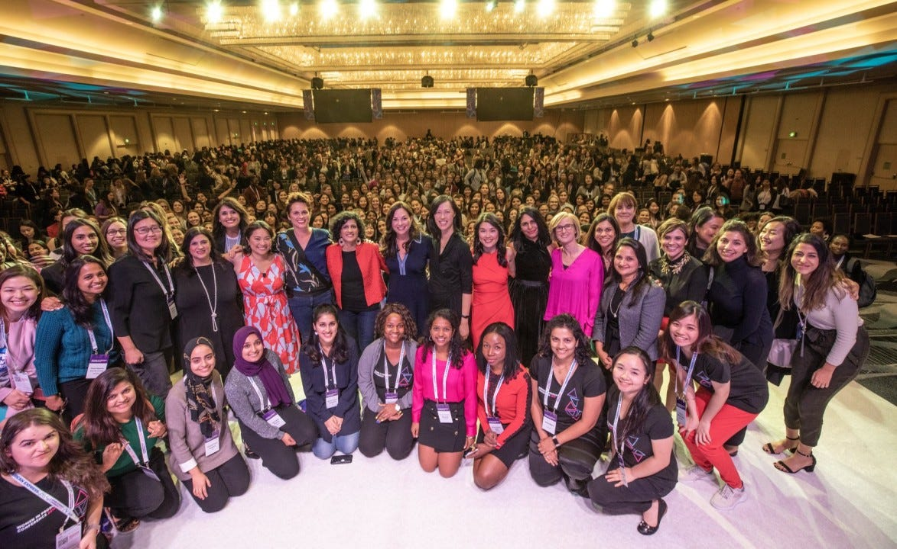
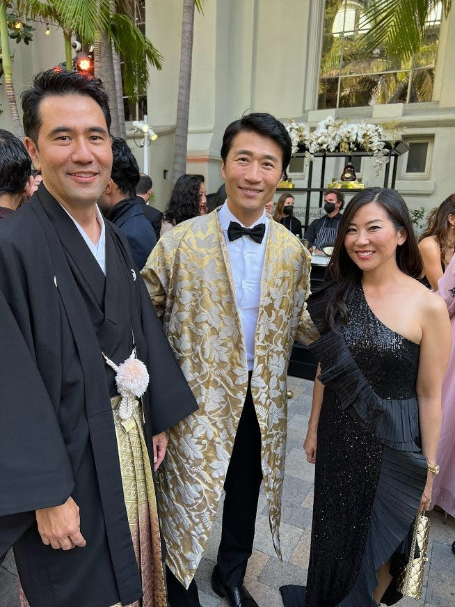

# A Definitive Guide to Networking (for Those Who Hate Networking)

*Finding our way through something everyone should know how to do *

Women in Product Conference - San Francisco 2019

# **networking**

/ˈnetwərkiNG/

noun: **networking**

1. **the action or process of interacting with others to exchange information and develop professional or social contacts. ([ref](https://languages.oup.com/google-dictionary-en/))**

Networking is often seen as a dirty word. I would know because, for a long time, I felt that way myself. I hated networking. The idea of going to events to meet people who might be useful to me in the long term seemed craven and opportunistic. I avoided it at all costs.

When we think about networking, our first reaction is often to recoil. Networking sounds like something done by people who are only out for themselves. It comes across as calculating like we’re using others for our personal gain. We see ourselves as better than that.

The problem? As unpleasant as it can seem, networking can do wonders for your career. That’s why it’s so important to get comfortable with the idea and see it for what it is: a chance to connect, build mutually-beneficial relationships, and help others.

(Note: I will be using that much-hated word, “networking,” in the rest of this article, precisely because it is so disliked. I want to destigmatize it and focus on the benefits of learning how to do it well.)

Your mission, dear reader, should you decide to accept it, is to learn to network by turning it from a sinister and uncomfortable chore to a set of achievable steps. In today’s post, I’m going to show you how.

## **Step 1. Get out of your own way**

Too many of us get deep into our own heads about networking. We think it's not worth doing—or worse, unethical—so we avoid it. When we go to parties or events, we become wallflowers, or we stick with people we already know and like. We stay in our comfort zone.

The first step to successful networking is getting out of your own way. This starts by redefining how you see networking. Instead of thinking of it as an unpleasant, self-centered task, think of it as a useful give-and-take. Every connection you make is a two-way street, a chance to open doors for someone while having doors opened for you. By reframing it as a productive activity that has a positive return on your time investment, you will have a different mindset.

Remember—and this is important—that networking means you need to show up. You need to put yourself out there and speak to people you are not close to. Sometimes nothing will come from these interactions, but sometimes, good things will. These connections can have untold benefits for your, and other people’s, careers. Embrace this process, and you are on your way.

**Your assignment:** Pick three opportunities over the next quarter to put yourself out there, meet new people, and form connections. Keep your eyes peeled for conferences, happy hours, or community events (e.g. Women in Product Chapter events) where you can try this out.

## **Step 2. Make it your job to welcome others**

Have you ever noticed how many powerful people bring their own entourage along wherever they go? That's because they want the comfort of not having to connect with other people. The entourage acts as a buffer between them and people they don’t know.

But most people don't have an entourage to bring along with them. They are swimming alone in a sea of strangers, looking for a safe harbor. Welcome them. Connect with them.

It's much easier to get out of your own way when you're helping others. I often think back to this piece of advice I once heard from a powerful connector and leader: "Everyone feels out of place when they go to an event. When you see someone coming in by themselves or sitting alone, invite them to your circle. If you make it a point to make others feel comfortable, you are doing them a favor. That puts you in a position of influence and help."

By flipping the script like this, you're changing the game: instead of forcing yourself to do something for your own gain, you are focusing on helping others. You are alleviating their discomfort and making them feel at home. This change in perspective has been really powerful for me.

Once, I went to the Gold House gala and started talking to random people, especially those who were by themselves. I walked up to one guy who was standing alone. I said, “You look really familiar. Have I seen you in something?”

Soji Arai replied, “I am the star of Pachinko.” I went on to hear his story of being a Korean-Japanese actor, which was so incredibly cool. I then introduced him to my friend, who was also wearing a [kimono from the same kimono studio in LA.](https://www.kimonosk.com/#/) The kimono artist actually told us about an actor she had outfitted before we got there— and it was him!

[Share](https://debliu.substack.com/p/a-definitive-guide-to-networking?utm_source=substack&utm_medium=email&utm_content=share&action=share)

By taking the initiative of reaching out to others, you are building bridges and fostering connection. Everyone wants to feel like they belong, so why not be the one to welcome them?

**Your assignment:** When you go to your chosen networking events, make a point to welcome at least three people you don’t know. Look for those who are standing alone, or who look like they are waiting for a friend. You never know who you will run into!

## **Step 3: Be curious, and connect over what you have in common**

People are most comfortable when answering questions about themselves. This is human nature. If you are inquisitive and curious, people will respond with warmth and interest.

The best way to break the ice is to ask questions. This shows the other person that you are listening, and it allows you to find things you have in common. Affinity bias is real, and it is an important component of building relationships. In a nutshell, humans have evolved to favor and support people who are most like them ([ref](https://en.wikipedia.org/wiki/Cognitive_bias)). This is a natural inclination—after all, if you were trying to survive harsh conditions, you would be most likely to want to help those who were similar to you.

Remember, you don’t need to be the same age, race, gender, or nationality to find common ground with someone. Attending the same school, working in the same industry, growing up in the same state, or even both being parents are all commonalities you can bond over. Try playing the name game and looking for friends you have in common, or discussing shared hobbies and interests. These simple touchstones can be the foundation of connection.

**Your assignment**: Each time you meet someone new, try to find three things you have in common with them. Don’t be afraid to think outside the box!

## **Step 4: Be helpful**

Helping others not only makes you feel good, but it can be a powerful way to build relationships. Listen as people talk about what they are worried about. Then look for ways to help.

The point of networking is to build your connections, so having a concrete way to measure that is important. Your goal is to walk away from every networking opportunity with one thing you are doing to help someone, no matter how small. This could be as simple as making an introduction or passing along a resume. If you didn’t exchange information to help at least one person, you failed this step.

I recently attended the *Fortune* Most Powerful Women event in Laguna Niguel. I met so many women from different industries and backgrounds. As a result, I am now helping two women from the military find post-service jobs, and connecting with two others about how to get on boards. These are small things I can do to assist those I met while I was there.

Similarly, at the Gold House event, I connected with a couple I had met before at a Haven House fundraiser. We were pushed aside to welcome celebrities like Andrew Yang. They expressed interest in meeting him, so I invited them to a dinner I later hosted when Andrew was in town.

When you approach networking with a mindset of helping others, you can break down barriers and form positive connections. Others will be grateful, and you will build the foundation of future relationships.

**Your assignment:** At every networking event you attend, leave with three tasks you can do to help the people you meet there. These don’t have to be heavy lifts—even just a simple favor will do.

## **Step 5: Give others the opportunity to be helpful**

Despite what you may imagine, most people want to be useful to others. They may not be able to say yes to every ask, but they usually appreciate the chance to help when they’re needed.

Gold House does something really powerful at their events: an activity called “Give and Get”. Each person goes around the table and introduces themselves. They then each offer something to others (the “give”) and ask for something (the “get”). Someone records this and emails it out after the event. What is both fun and incredible about this is that everyone, no matter how powerful or junior, has something to offer others. And everyone has something they can ask for. It was through one of these activities that I met a founder whom I later started advising. I have also helped people get started writing their own books. It was really gratifying.

Studies have shown that weak ties (friends-of-friends or beyond) are more likely to help you get your next job than immediate friends ([ref](https://www.scientificamerican.com/article/a-massive-linkedin-study-reveals-who-actually-helps-you-get-that-job/#:~:text=According%20to%20one%20of%20the,garnered%20more%20than%2065%2C000%20citations.)). Why? Because you and your close friends are more likely to have an overlapping network. Friends-of-friends more likely have access to opportunities you would not otherwise know about. Networking is how you find these distant connections.

A founder once reached out to me, asking me to pass along speaking engagements I got invites to but couldn’t make. No one had ever asked me that before, and I was happy to pay it forward. A CMO recently reached out asking for help getting on a board. I am now helping her with the process of getting connected. I only know these people via my larger network, but I am happy to help them when asked.

Who might be able to help you from your own network?

**Your assignment:** Ask someone you meet at an event for something. It doesn’t have to be big; maybe it is a simple introduction or a connection to someone else. Just put yourself out there and ask. You’ll be surprised how helpful others can be.

---

There you have it: your step-by-step guide to getting comfortable with networking and using it to build relationships. As you can see, networking doesn’t have to be scary or hard. It can be something you tackle in just five simple steps.

The goal of networking is not to meet everyone in the world, but to make meaningful connections. By completing these tasks, you can demystify the process and use it the way it was meant to be used. Be intentional, and push yourself out of your comfort zone. You will get so much more out of the time you spend this way—and so will the people you meet.

Thank you for reading Perspectives. This post is public so feel free to share it.

[Share](https://debliu.substack.com/p/a-definitive-guide-to-networking?utm_source=substack&utm_medium=email&utm_content=share&action=share)

[Leave a comment](https://debliu.substack.com/p/a-definitive-guide-to-networking/comments)