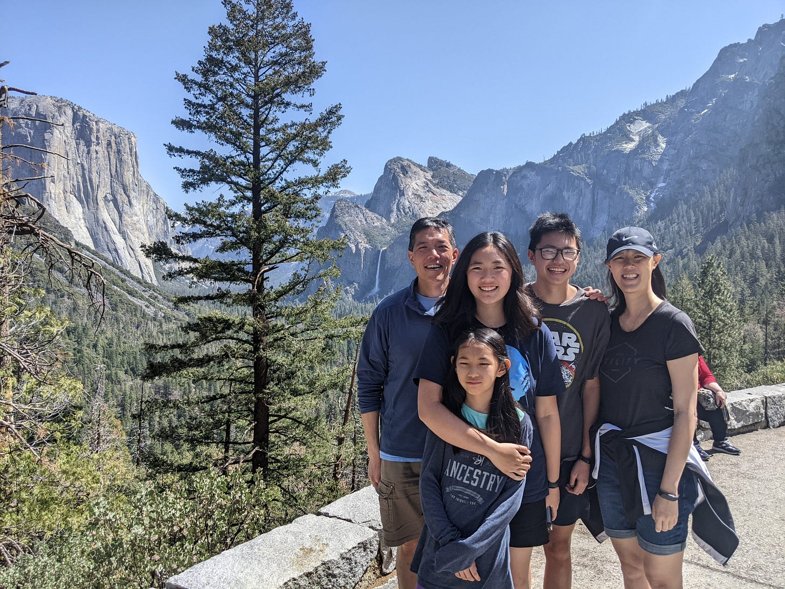
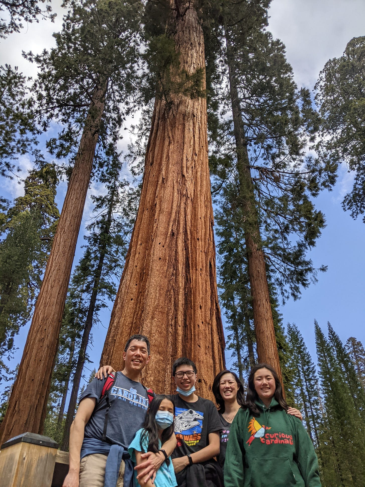
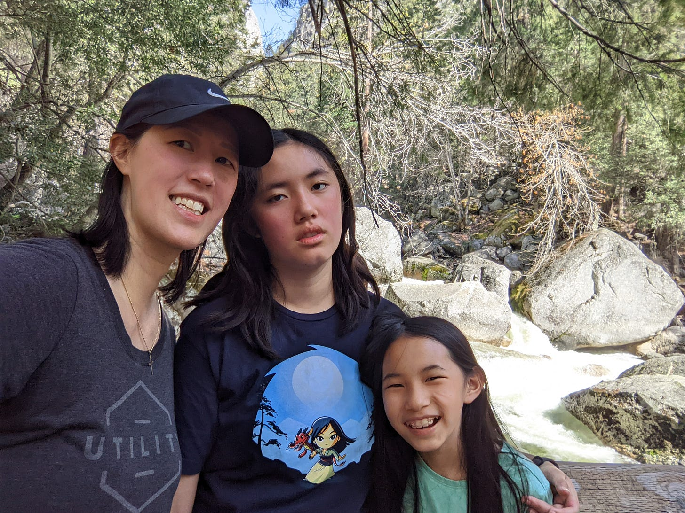
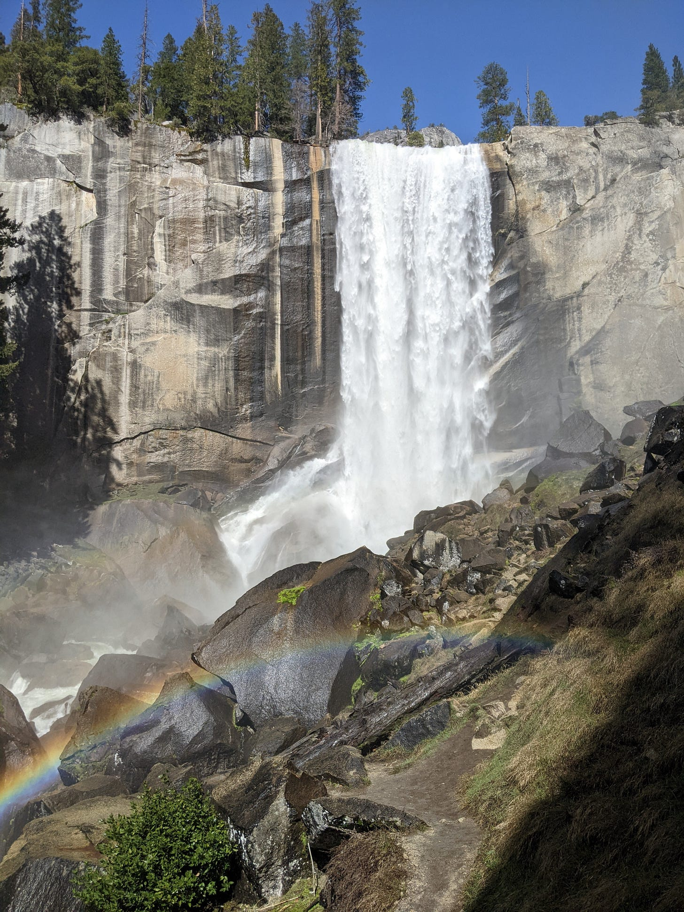
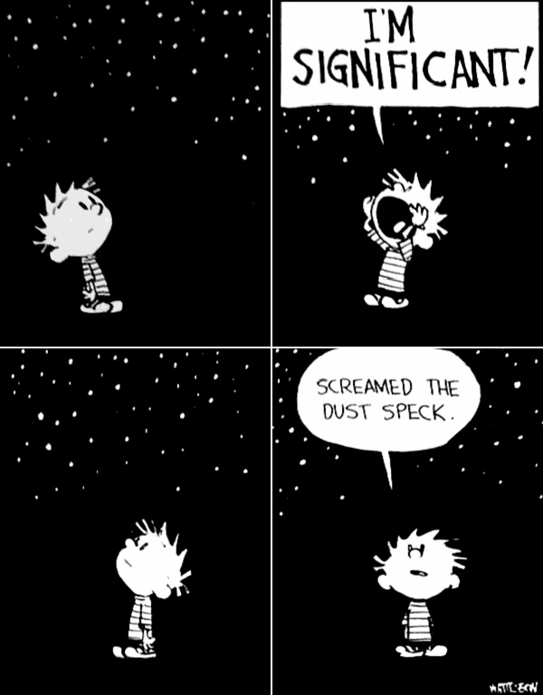

# Change Your Vantage Point to Gain Perspective

*How adjusting your perspective can affect your actions and outcomes *

My husband of over two decades, David, loves the outdoors. He enjoys hiking, whitewater rafting, ropes courses, and ziplining. He always takes us on vacations to places where the main form of entertainment is spending time in nature.

[Share](https://debliu.substack.com/p/change-your-vantage-point-to-gain?utm_source=substack&utm_medium=email&utm_content=share&action=share)

I, on the other hand, was born allergic to the very nature he loves so much. My allergies light up when it comes to things like grasses, trees, and animals—you know, things that happen to be everywhere in the great outdoors. One of my three kids and I also have a hereditary condition where we overheat easily and can’t shed heat through sweat like others do. We have both fainted more than once due to this issue. Needless to say, the outdoors are a challenge for us.

At least once a year, we do an outdoor trip as a family. I've made peace with it by loading up on allergy meds, carrying an EpiPen, and bringing loads of ice water with me for these adventures. This year for spring break, we went to Yosemite, which was definitely *not* my first choice. We spent days and days hiking. On our final full day there, David wanted to hike up to [Vernal Falls, and then to Nevada Falls via the Mist Trail](https://www.yosemitehikes.com/yosemite-valley/mist-trail/mist-trail.htm). This is a moderate to strenuous hike, and it was going to take at least three to four hours. It was hot, and shade was rare in some sections.

I complained—a lot. For the first two hours, I was frustrated and grumpy about the heat, the pace, and just about everything else. Then David and Jonathan decided to go all the way up the Mist Trail together. Up until this point, I had been complaining, asking anyone who would listen why we had to hike this horrible trail.

Then David suddenly left me in charge of the two girls, and that changed everything. I was no longer the follower, but the leader. Thrust into this new position, my job was to get them both up to Vernal Falls. That was when Bethany, who has the same overheating issue I do, started to groan and complain—to me this time.

## **What it means to change your vantage point**

There are times in your career where you will complain about what someone higher in the organization does. Perhaps it is a decision about working from home, or whether or not an expense is reimbursed. You complain because the issue is outside your control and hasn’t been resolved to your satisfaction.

Sooner or later, though, you end up on the committee that makes the recommendation. Or you are put in charge of the same decision you once griped about. Your vantage point changes completely. You are going from being a person on the trail to being the leader of the group. As the leader, your job is to get everyone to the summit, not to complain about the hike. You have more control, but you also have more accountability.

Changing your vantage point completely changes your perspective. When David put me in charge of the girls, I could no longer complain about the trail or why we had to hike it. I had to encourage or cajole my daughter to get there with me so we didn’t miss our meetup point. The hike was equally strenuous, but rather than asking my husband why he had to drag us here on yet another outdoor trip, I had a responsibility to make sure we met up at the falls on time.

## **How to change your point of view**

I named this blog “Perspectives” for two reasons. The first was that I originally called writing “Putting Things into Perspective”. The second was that seeing the world from a different perspective can change the way you live and work.

We tend to see our lives as though we are the main character. Other people are important, perhaps, but we are the protagonists in our own stories. This dictates how we exist and interact with others. But when we take a step back, we realize that the vast galaxy around us looks at us differently.

When I was in high school, I cut out this comic and tucked it into my folder:

from reddit

I kept it there to remind myself that even though every moment felt weighty to me, in the vastness of the universe, we are mere specks of dust. This became even more salient when my husband signed us up for stargazing at the Grand Canyon and in Yosemite. Going out into the night and seeing a seemingly infinite galaxy stretch out before us was a wonder to behold. The ancients looked upon that same sky with wonder and awe, and even with our modern technology, it is no less amazing.

After each trip, we listened to this song with the kids on the drive home:

###### [contains some somewhat explicit content]

Changing your point of view is sometimes just a matter of realizing that, although your place in the world may seem central in a certain light, it may be completely peripheral in others.

## **Why It Is Important to Change Your Vantage Point**

My family does a ton of road trips, and this was even more common during Covid. We drove to LA multiple times, took the long, flat road to Utah, met up with my sister's family in Arizona, and drove to Yosemite.

I hate driving, but during college, I was a road warrior. I drove home for short holidays of just three or four days, even though my parents lived almost six hours away from my school. I just drove and drove everywhere alone, along the quiet highways lined by miles and miles of trees.

But after we married, I let David drive more and more. At one point, my then two-year-old daughter took out her girl doll, put her in the back of her Little People Airplane, and made the boy doll the pilot. I asked her why. She said, “The boy is the driver. Daddy always drives and you sit.”

Hm… Sometimes the mirror hurts.

That was when I realized I had been a free rider (and human navigator for my husband) for two decades. But when I wasn’t navigating, I would nap. I got into the car and promptly fell asleep, much to David’s frustration. So every trip, I resolved to drive for at least an hour or two, just to remind myself to be a good car companion.

We take things for granted when we don’t look at the world from different points of view. This leads to a narrow perspective and a lack of introspection. Even a little investment in changing things up makes a huge difference when you resume your routine. By seeing the world through different eyes, we can interact with it in new, better ways.

## **Practical Ways to Change Your Vantage Point**

This month, take some time to get out of your normal stance and step into someone else’s shoes. What you learn may surprise you, disturb you, or inspire you, but it will inevitably give you a useful new way of looking at the world.

Here are 10 ways you can change your point of view and see the world differently:

**At Work:**

* **Try a job swap with someone in a different function.** Understand their challenges and point of view by living them for a day. Then have them follow you for a day, too. You will both gain useful insight into each other’s day-to-day work.
* **Help someone else write their presentation or product review.** When you help another team with a presentation or six-pager, you notice missing context and flaws in their thinking much faster than when you talk about your own product. By finding the errors in other people’s presentations, you can strengthen the way you develop your own presentations in the future.
* **Dogfood competitor products.** [I’ve written a lot about eating your own dog food, but what about someone else’s?](https://debliu.substack.com/p/dogfooding-how-putting-yourself-in) Try using a competitor’s product and asking yourself why a customer would choose it over your own. What are the benefits they are seeking, and how does the competing product provide them?
* **Mentor three people who are different from you.** Listen to their challenges, hopes, and aspirations. I once coached someone who was the first in their family to go to college, and whose parents cleaned houses for a living. Their desire to succeed was so great, but their struggles were so visceral. It was eye-opening for me. We often mentor or sponsor those who are most like us, but a different point of view gives us new appreciation for the diversity of experiences we all bring.

**At Home:**

* **Swap chores with your partner for a month.** Write down what each of you does, and then trade for a month. You will find that you made a lot of assumptions about the difficulty of some tasks. You may also discover some “hidden work” that your partner has been doing to make your life easier.
* **Pick three things in your home that you would fix before selling them.** By forcing yourself to pick things you would fix for someone else, but not yourself, you will look at your home with fresh eyes. One thing we desperately need is an electrician to fix our light switches and outlets, since several of them are broken. We have learned to live with them, but in my experience, fixing these things can be a huge life improvement. ([I am talking about you, chicken wallpaper](https://debliu.substack.com/p/the-secret-power-of-fresh-eyes).)

**In Life:**

* **Read books by authors who are different from you.** [I find that reading helps expand my point of view on things I know little about](https://debliu.substack.com/p/on-my-bookshelf-what-i-am-reading). For example, *The Conversation* by Robert Livingston helped me see the limits of how we talk about race. I have several other books waiting, including *The Family Outing* and *Killing Comparison,* on my nightstand.
* **Meet people you would normally not encounter.** It’s amazing how vast the world is, and yet how small our own can be. By keeping an open-door policy, I have had the chance to speak to college students, successful entrepreneurs, people struggling with terminal illnesses, and new moms. Each has their own story to tell, and each has left me with a broader view of the world.
* **Do something out of character for you.** We all fall into ruts. By forcing yourself to go outside your comfort zone, you will learn so much more about yourself. Part of why I let David plan our vacations is because he is constantly seeking out new adventures. This forces me to get uncomfortable—but getting uncomfortable is an opportunity to learn.
* **Take on a challenge.** As I mentioned in [Run Your Own Race](https://debliu.substack.com/p/run-your-own-race), Omonye Phillips ran a marathon because her mentor challenged her to. A few years ago, I said I would write a book, [and now here we are](https://debliu.substack.com/p/today-is-launch-day). What kinds of challenges could you tackle if you chose? Consider setting a [New Year's Resolution](https://debliu.substack.com/p/resolve-to-progress)—and stick to it. Pick something you’ve never considered doing before, and do it!

---

After the hike in Yosemite, I told my husband what happened after he and Jonathan had left for the higher-elevation trail. He laughed when I explained how I had to listen to Bethany complain and grouse all the way up, even though I had just been doing the same thing before he left.

We’re used to seeing the world from a single, fixed perspective, and we filter everything based on our experiences. Allowing ourselves to be trapped in our own point of view holds us back from growing and becoming better leaders. But what if we tried a different vantage point? Think about how you could try seeing the world differently, then make the effort to take on a new perspective. Your life will be richer for it.

[Leave a comment](https://debliu.substack.com/p/change-your-vantage-point-to-gain/comments)

[Share](https://debliu.substack.com/p/change-your-vantage-point-to-gain?utm_source=substack&utm_medium=email&utm_content=share&action=share)