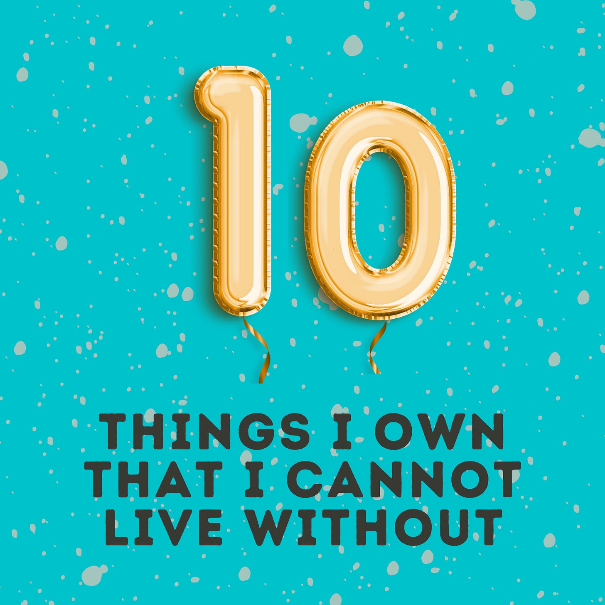
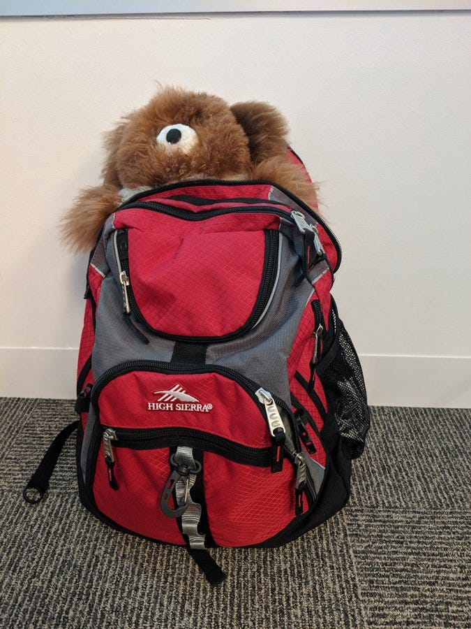

# Ten Things I Own That I Couldn’t Live Without 

*Simple items that are worth their weight in gold *

[Share](https://debliu.substack.com/p/ten-things-i-own-that-i-couldnt-live?utm_source=substack&utm_medium=email&utm_content=share&action=share)

Sometimes, the most valuable things in your life are not the fanciest or the most expensive; rather, they are the simple, inexpensive solutions that make you a little happier.  I thought about ten less commonly owned things that make my life a bit easier. They each are worth so much more to me than they cost because they are invaluable to my life in some way.

With that in mind, here are my top ten somewhat uncommon items (in no particular order) that I couldn’t live without, and the ways they have improved my life. As gift-giving season comes up, consider one or more of these as a present for yourself or someone you love.

### **1. [Weighted blanket](https://amzn.to/3erc3GN): sleep deeper and longer ($40)**

I have an obsession with being cozy at night. Rather than having blankets with top sheets, we grew up sleeping under large, cozy comforters. At one point, I found myself sleeping with no fewer than three comforters, and it drove David crazy. In fact, having separate comforters was a marriage saver for us, since we no longer had to fight over the covers. Things got even better when my husband finally bought me a weighted blanket. That sense of being cocooned was everything I was missing.

I love my weighted blanket. It weighs 40 pounds and never fails to help me drift into a deep, restful sleep. It has really helped me with my insomnia, because it also allows me to stay asleep longer. (The only downside is that it's very hard to sleep without it, since I'm so used to the feeling of it pressing down on me!)

### **2. [A great water bottle](https://amzn.to/3yq0Hd5): save over 500 plastic containers a year with a reusable bottle ($20)**

If you see me around, you'll know that I carry a water bottle everywhere I go. I love having a cold (or hot!) beverage with me no matter where I am. [My insulated H2Go bottle is always by my side](https://www.instagram.com/stories/highlights/17963913574280377/) (this photo is from over three years ago, and it’s still going strong—and yes, that's me wearing the suit with a water bottle in my hand.)

I estimate that, since starting with a reusable bottle three years ago, I've saved over 1,500 plastic containers. The great thing is that there are all these wonderful water bottle fillers all over the place right now, so staying hydrated isn’t a chore. The only unfortunate part is that I keep losing my bottles and having to track them down. So far, I still have the same one from several years ago, although because it was swag from my old company, I have not been able to find a regular version of it. (I once forgot it on a recent trip to NYC, so I had to get a new one from Amazon after checking three stores near the hotel. [This Arlo is a new favorite that I’ve added to the rotation.](https://amzn.to/3CBpJsv))

Regardless of the brand you choose, invest in a trusty insulated water bottle. I promise you won't regret it, and you’ll do the planet a huge favor by reducing your plastic pollution.

### **3. [Kiziks: step-in shoes save time (and your shoe heels!)](https://i.refs.cc/6nm5ltPB?smile_ref=eyJzbWlsZV9zb3VyY2UiOiJzbWlsZV91aSIsInNtaWxlX21lZGl1bSI6IiIsInNtaWxlX2NhbXBhaWduIjoicmVmZXJyYWxfcHJvZ3JhbSIsInNtaWxlX2N1c3RvbWVyX2lkIjoxMDI1NjYyMjIzfQ%3D%3D) ($120)**

Full disclosure: I got a pair of these for free for being a speaker at [Silicon Slopes](https://www.siliconslopes.com/). I thought it was kind of strange that they would give away shoes to the speakers, but I figured, why not?

Let me tell you, these sneakers have changed my life, which is why I recommend them to everyone. Initially, Kiziks were created to help those who had trouble putting on shoes by allowing them to easily snap on a pair of sneakers. By now, they've taken life of their own. Seriously, I wish these were around when I was pregnant and had to beg my husband to tie my shoelaces!

Objectively, I know they're just shoes, but there's something wonderful about how easy they are to put on. My daughter would steal mine so much that I bought her a pair of her own, and I plan to get a pair for my mom, who has trouble bending over.

### **4. [Life Fitness Elliptical](https://shop.lifefitness.com/collections/ellipticals): multitask while you work out (~$1000 used)**

I bought my Life Fitness off Craigslist over 17 years ago, and it has been going strong ever since. The person who sold it to me said they had used it a handful of times and ended up storing it away. It was the best $800 I have ever spent. Facebook Marketplace is a great place to find deals on used exercise equipment for more than half off.

I have used it faithfully since. My Life Fitness has seen me through three pregnancies, helped me lose 45 pounds after each baby, and gave me something to do while my littlest, who had colic, fell asleep each night. I use it every day for at least 30 minutes, and because it’s in our living room, I can work out while I watch movies with the kids.

### **5. [High Sierra Backpack](https://amzn.to/3CL0eVq): a versatile backpack for hiking, traveling, and working ($80)**

A trusty travel and hiking backpack is critical for any household. I bought mine at a Black Friday sale in 2012 in Raleigh, North Carolina. I then promptly forgot about it for years until my in-laws moved out here in 2016. Since then, it has been my go-to. I can pack several days’ worth of clothing in it for a quick trip. It is also just the right size to take on a plane, without bringing another suitcase, if I’m away for three or four days.

Unfortunately, wear and tear have gotten the best of my backpack, which developed a hole right at the top. I got a new one, but I'm still going to try to get my old one repaired so that I can take it hiking.

### **6. [Popcorn and popcorn salt](https://amzn.to/3Vm4vWK): a light snack that is both healthy and satisfying ($20)**

I love popcorn, but buttered popcorn can be really unhealthy. The solution? I found a way to buy popcorn and butter-flavored seasoning salt to make a healthy snack. You don't need any fancy equipment; all you need is a glass bowl and something to cover it. You put the popcorn in, spray it with a little bit of canola oil, and add just the right amount of butter salt. You then microwave it until the popping is down to one pop every second or two. Voila: a 40-calorie snack that is great for any afternoon.

This light, inexpensive snack can satisfy your need for munching without blowing your budget. I tried a number of brands, and my favorite is Amish Country. Their [Baby White 6 lb bag of popcorn](https://amzn.to/3Eyd9eK) and [bulk popcorn salt](https://amzn.to/3T2f0fM) (this link is for 2lbs of popcorn salt, but you should buy a small one first if you are not sure) is the best of all of the ones I have tried.

### **7. [Instant Pot](https://amzn.to/3VfPLZl): cook in bulk and save a ton of time and money ($150)**

We get to choose what we spend our time on, and I think it's really important that we eat together as a family. That’s why I make sure we have a homemade meal at least six nights a week. In order to make this scalable, I use an Instant Pot. We have the giant 8-quart one my sister gifted us. You can make enough bolognese to last days for a family of six using the three-packs of ground turkey from Costco. You can also make enough miso ramen soup to last for several meals. Some of our go-to recipes include butter chicken, Taiwanese beef noodle soup, and pulled pork. The best part is that you don’t have to watch the Instant Pot while you cook—you can just set it and forget about it. For the deal seekers, Prime Days/Cyber Mondays are always the days for the best price! (For some more of my favorite recipes, check out [this post](https://debliu.substack.com/p/memories-through-food-how-taste-passes).)

### **8. [Percussion massager](https://amzn.to/3CNucrT): fast muscle relief without a massage ($100 to $300)**

A muscle in my neck once froze up. It was so bad that I couldn't even move my head from side to side. I struggled to figure out what to do, eventually turning to Facebook and asking my friends for advice. A large number of people suggested getting a percussion massager. I had no idea what that was, so I did a bit of research and picked one up. I ended up having to see a physical therapist to resolve the original issue, but I have used my massager on my neck muscles every week since and haven't had the same issue in a few years.

The worst part about getting old is pulling random muscles while doing everyday things, like opening the fridge or reaching for your phone. The percussion massager makes a huge difference for those everyday aches and pains, especially the tension you carry in your shoulders from spending all day on Zoom in front of a large monitor.

The one I bought has been discontinued, so I linked to one that works similarly with great force, though is more expensive. I also bought a [lighter touch one for the kids found here](https://amzn.to/3Ta9VBX).

Side note: one chef in the Food Network Magazine suggested using it to tenderize meat (but the massager not touching the meat of course). A two-in-one tool. How can you resist?

### **9. [Travel pillow](https://amzn.to/3ejGL4G) and [eye mask](https://amzn.to/3rJqQQ7): make red-eye flights your friend ($25 for both)**

I usually take red-eye flights when I travel to the east coast. Crazy, I know, but it's a huge time saver. You can get on a plane, fall asleep, and when you wake up, you are there. The key is to get super comfortable the minute you board so you can maximize the amount of sleep you get. I have usually flown coach on these flights since I don't notice much about the ride when I’m asleep.

Of course, there are a few things you can do to make snoozing easier when you're flying. A good, easy-to-pack neck pillow will save the day every time. Throw in a quality eye mask and some noise-canceling headphones, and you're in a cocoon of comfort. I got a nice squishy pillow that folds up to a tiny size for easy transport. I bring a foldable eye mask to block out the bright light, tuck it all in my backpack, and I’m good to go. It makes those long flights so much easier.

### **10. [Aquaphor](https://amzn.to/3rJqU2i): great skin hydration without the irritants ($15 for a giant tub)**

Eczema runs in our family. My dad had it. Two of my kids have it. For them, it’s all reasonably mild. But mine flared up so badly one day that the rash ran all the way from my forehead down the side of my face. It was raw and extremely painful.

Unsure what to do, I went to two specialists to get expert help. They both told me to stop using every single cream and lotion I had and switch to Aquaphor. At first, I found it off-putting to use such a thick ointment, but it worked like a charm. The lack of exposure to fragrances and fillers helped to calm and heal my skin. Now I never leave home without it and I have gotten rid of all of the creams and lotions.

---

A few simple items can make a huge difference in your life. As the gift-giving season rolls around, I hope this list gives you some inspiration—whether for yourself or for your loved ones.

What are the top ten things you couldn’t live without? Share your thoughts in the comments.

[Leave a comment](https://debliu.substack.com/p/ten-things-i-own-that-i-couldnt-live/comments)

Perspectives is a reader-supported publication. To receive new posts and support my work, consider becoming a free or paid subscriber.