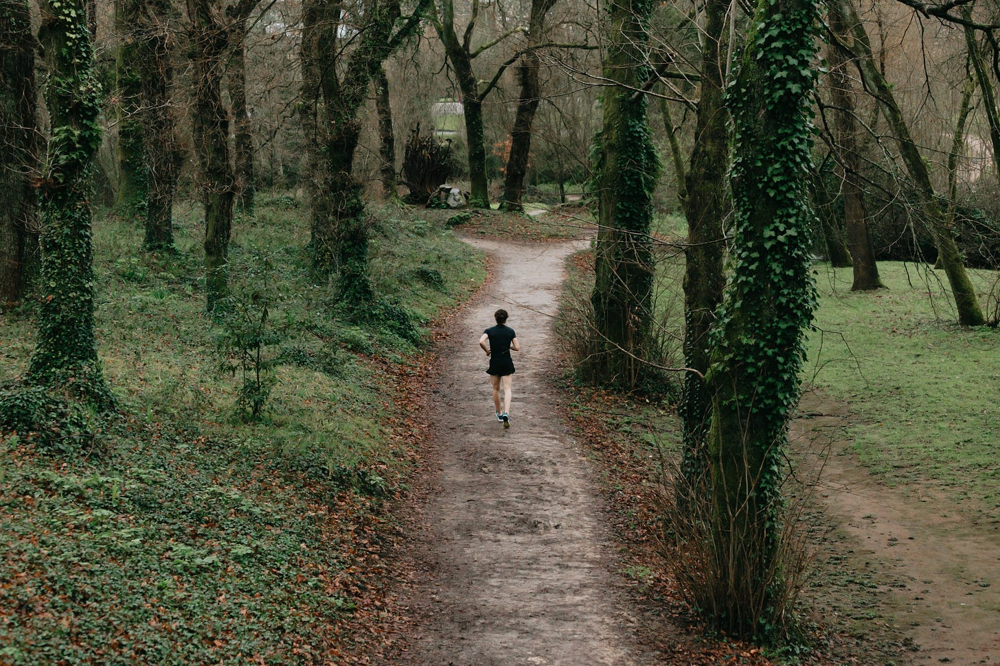

# One Foot in Front of the Other 

*Doing what's necessary, even when it feels impossible*

Photo by [Avelino Calvar Martinez](https://www.shopify.com/stock-photos/@ave?utm_campaign=photo_credit&utm_content=Browse+Free+HD+Images+of+A+Person+In+Black+Running+On+A+Country+Trail&utm_medium=referral&utm_source=credit) from [Burst](https://www.shopify.com/stock-photos/run?utm_campaign=photo_credit&utm_content=Browse+Free+HD+Images+of+A+Person+In+Black+Running+On+A+Country+Trail&utm_medium=referral&utm_source=credit)

There are weeks when writing this newsletter feels like a chore. Sometimes I have to drag myself over to the computer to do it because I have to, not because I find any joy in it. I procrastinate. I get annoyed. And I *do* get it done… but it sucks.

I went through such a dry spell recently. Every post felt so difficult to complete, and I didn’t like any of them. When I write those posts, I'm often surprised that people even read them, let alone compliment them. I tend to think they're terrible because of my state of mind, not necessarily because they are objectively bad.

Then there are weeks like this week when I have so many ideas, I can't keep them all contained. In the last couple of days alone, I've started five different posts. It feels like I'm on a roll. Everything comes easily. At times like these, I wonder why I ever had a dry spell at all.

Life is like this. Feast and famine. Rain and drought. Growth and stagnation. Cycles as natural as the seasons. Yet when we are in a moment of plenty, we forget what it’s like to struggle, and when we are in a time of stress, we forget the times of peace.

My solution when I have writer's block, when things are unbearably hard, is a simple one, but it's also the key to getting back to those times when it's fulfilling. My answer during those hard moments? Write through them.

[Share](https://debliu.substack.com/p/one-foot-in-front-of-the-other?utm_source=substack&utm_medium=email&utm_content=share&action=share)

## **Faking it 'til you make it**

I am an introvert, and I find conferences exhausting. Whenever I'm at a conference, I feel like I need to always be "on." To have a sparkling personality, and to show up when I would rather be in bed with a cover over my head.

But I force myself to show up—not because it's a bad thing, but because it's a wonderful thing. Going to conferences is good for me. It’s a chance to push myself out of my comfort zone, connect with new people, learn new things, and unlock new opportunities. And if I have to force it at first to get the reward later, then so be it.

There are times in life when we have to do something we don't want to until it gets us to something that we *do*. It's a bit like working out: It hurts while you're doing it, but you are always glad you did it afterward.

The act of pressing forward, especially when the situation is demanding, is no small feat. Hard things are, well, hard. When the alarm clock first goes off in the morning, the last thing you want to do is get out of bed. But showing up and participating, even unwillingly, can pave the way to positive results and personal growth. You don’t always have to enjoy the ride; as long as you’re on it, you’ll eventually get where you need to go.

## **Love is a choice**

Love isn't something you *feel*; it's something you *do*. [I've always believed that.](https://debliu.substack.com/p/reigniting-the-fire) We experience the emotions of falling in love, and when we're in the middle of it, we think that feeling is going to last forever. But in reality, the chemical high you get in your brain from love only lasts a couple of years. Then, when it finally goes away, you are left feeling lost, wondering if you made a mistake. What if this wasn't the right person? If the butterflies are gone, does that mean it's the end?

But that's not how love works. Love is an action. It’s a choice. It’s something that you practice. I sometimes joke that I love my kids even though there are many days when I don't think I like them very much. And I'm sure they feel the same way about me when I'm cajoling them to do one thing or another.

I have always found it interesting—and alarming—how [in opposite-sex marriages where one partner is diagnosed with a serious illness, the husband is six times more likely to leave than the wife](https://acsjournals.onlinelibrary.wiley.com/doi/10.1002/cncr.24577). That is a shocking statistic. What happened to "for better or for worse, in sickness and in health?" Do we love somebody for who they are, or do we only love them for what they can give us?

Over the years, I've watched the marriages of my parents and in-laws weather many storms. This year, I watched my mother-in-law grieve for her husband of 50 years. She cared for him in his final days at the expense of her own health. She took care of him until his last breath, and it wasn’t easy.

Sometimes the path is hard. But it is also honorable, and we live it every day through our actions. Doing something meaningful is about so much more than the excitement of getting started; it’s about the discipline that endures after the novelty fades. Choosing commitment, day in and day out, even when the road is bumpy, is what true love really means.

[Share](https://debliu.substack.com/p/one-foot-in-front-of-the-other?utm_source=substack&utm_medium=email&utm_content=share&action=share)

## **Finding a path forward**

I remember a time when I had a job that seemed amazing on paper: working in corporate strategy at PayPal. We got to work on interesting things, and we had the freedom to pick the topics. We advised the CEO, and for a time, I even had the chance to write his talks.

But every day felt like I was swimming through molasses. We sat with the executives, so we had to be there from exactly 9:00 to 5:00 every day. And even though I didn't have that much work to do (to be honest, I was bored out of my mind), I still had to sit there and pretend to be engaged. I came up with projects for myself. I tried researching things. I did what I could to keep as busy as possible. But I hated every second. I felt like I was just creating work to keep my mind engaged.

What I missed was the day-to-day of building and operating, and eventually, I realized that I just didn't have the patience for sitting around and writing strategy decks anymore. I wanted to be in the thick of the action again, but that opportunity wasn't just going to fall into my lap. I had to find a way to make it happen, even if that meant carving a path through a job that currently felt miserable. So I started creating strategies around things that I thought we *should* be doing. I wrote a pitch for social commerce and charity as two new verticals we should go after. I took them and turned them into a team, and eventually, I got a chance to build those at PayPal.

Even when my job was at its worst, I found a path forward that energized me. It was both a wonderful time and a difficult time. When I had just come back from maternity leave, I was having a hard time reintegrating into a new role, and I was restless. But then I got a chance to work on something I was excited about, and everything changed again.

This is how it goes, in life and in work. Just like in relationships, not every day is full of bliss. But putting one foot in front of the other doesn’t have to mean staying on your current path, either. Sometimes it means having the perseverance to carve out a new path for ourselves, one that allows us to grow, thrive, reconnect with our values, and make a positive impact.

## **Doing versus dreaming**

There are times when you can dream about what's possible, but there are many more times when you have to just *do*. When you show up at the hospital even though you don't want to that day. When you go see your friend who is struggling even though you're feeling exhausted. When you stop to get gas even though you know your spouse will do it if you don't.

We have these ideas of "dream companies" and "dream jobs." I've had those jobs, and they were wonderful. But so much of the day-to-day is the hard work, filling out spreadsheets or doing budgets. Life is about putting one foot in front of the other and learning to show up even when you don't want to.

My friend [Katherine Woo](https://www.linkedin.com/in/katherinewoo?utm_source=share&utm_campaign=share_via&utm_content=profile&utm_medium=android_app) is part of the reason I got into tech. She's the reason I became a product manager, and I have long looked up to her. And she had her dream job. She was the executive director of Airbnb.org, and by all accounts, she changed the world. But there came a time when she had to give that up to go home and take care of her parents.

[I've written about the sandwich generation before](https://debliu.substack.com/p/the-sandwich-generation). Katherine is a prime example of someone who feels filial piety and is following that path. If you had asked me 10 years ago what her dream was, I would have told you she was living it, even the day before she quit. But she has a new dream now, and it's different from the path that I thought she would be on—perhaps even different from the path *she* thought she would be on. But I admire her for putting one foot in front of the other and doing what she needed to.

Life often comes with unforeseen turns, and sometimes outside circumstances challenge our vision for the future. In these moments, resilience becomes even more important. Our strength lies in our ability to adapt, embrace change, and maintain our commitment to showing up. In doing so, we open ourselves up to new possibilities—possibilities that, while they may not have been what we expected, can lead to unexpected fulfillment.

---

There's an old saying that a journey of 1,000 miles begins with a single step, and that's what I choose to believe about everything in life. Every change, every day, every moment—everything is a choice. Sometimes that choice isn't easy. Sometimes it's painful at first, but it still leads to something great. Sometimes it doesn't. Either way, we make it, because we know we're working toward something bigger than ourselves.

Every step we take, regardless of its difficulty or immediate appeal, contributes toward our larger journey. By embracing the cyclical nature of life and carrying on through the difficult times, we discover that sometimes the hardest steps forward can lead to the most rewarding destinations.

[Leave a comment](https://debliu.substack.com/p/one-foot-in-front-of-the-other/comments)