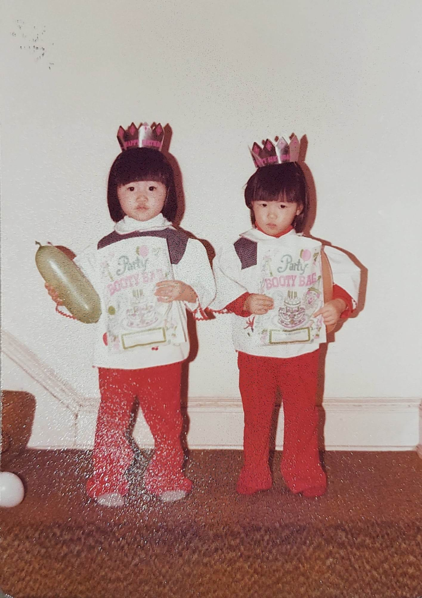

# Perception Is Reality 

*How two people can see the same event in totally different ways *

Photo by [Bud Helisson](https://unsplash.com/@budhelisson?utm_content=creditCopyText&utm_medium=referral&utm_source=unsplash) on [Unsplash](https://unsplash.com/photos/kqguzgvYrtM?utm_content=creditCopyText&utm_medium=referral&utm_source=unsplash)

I once went to an event where I spoke to two siblings. I had met them both before, but I didn’t know them well. This was the first opportunity I had to have an extended conversation with them about their lives and experiences. The most fascinating thing? They each told me a completely different story about growing up—not just about their own childhood, but about the *other* person’s childhood as well. It was as if they had lived in completely different environments. Their perspectives couldn’t have been more different.

Although each sibling’s story was true in their own mind, it was really confusing to a third party who didn't know them well enough to know who was right. At one point, I asked one of them about a story the other had told me about being treated unfairly. The other sibling claimed that was a totally incorrect perspective on what happened. I later asked the other sibling about that reaction, and they reasserted their point of view.

The interesting thing is that these siblings are very close, and they speak highly of each other to everyone they meet. They are both pioneers in their own fields and are extremely successful by every objective measure. But it was clear they had never sat down and discussed what had really happened in their childhood. Then again, perhaps they *had*, and they had agreed to disagree. In the end, I think they were each living their own truth.

[Subscribe now](https://debliu.substack.com/subscribe?)

## **When history has multiple interpretations**

So many times, in writing this newsletter, I will tell a story about our childhood or something that happened in our family, and my sister will have a completely different perspective on that same event. In fact, she once told me that she thought I had changed some of the facts of my life for my book when in actuality she just didn't remember things the same way. Even when I proved the facts to her with the dates, our interpretations remained different.

Last year, I got together with a bunch of my cousins when we had a free weekend in New York. Caroline and I had dinner and then spent the day with them. We exchanged stories with our cousins about a mutual uncle who had passed away when he was very young. But it turns out that our parents and our cousins’ parents had told us all a different story about what had caused his death at age five or six. Each of us walked away wondering what the reality was.

While what happened was important, there was a lesson in the misalignment: each of our parents had grown up with their own version of events, which went on to shape their version of reality. And what that version looked like to them was critical in shaping what they then taught each of us. In my father's telling of the story, his little brother would feel like his legs were numb, which was why it used to scare him whenever I said I had prickly legs. Later, I found out that his brother had actually died of the flu, and that the discrepancy was due to a misinterpretation by a nurse in Vietnam when our family only spoke Chinese.

## **Conflicting perspectives at work**

These kinds of misinterpretations are more common than you might think—and when they happen in the workplace, it can be downright baffling. I remember a series of meetings that my team once had with another team where all of us walked away on completely different pages. As the differences in takeaways became harder to ignore, I even double-checked to make sure the invite list was the same. And it always was, from meeting to meeting. The same people were attending each one, so how was it that we were all leaving with completely different versions of what had been said and agreed on?

But then I learned something: there’s more that goes into shaping someone’s perspective of events than just the events themselves. Any number of things can influence a person’s version of reality. To name a few:

* **Someone could have a different** ***experience*** **than you:** Two siblings can grow up in exactly the same household and have totally different experiences. Different things can happen to different people, some big and some small, and what sticks in one person’s memory may not be the same as what sticks in another’s.
* **Someone could have a different** ***interpretation*** **of an experience than you:** Even if two people experience the same thing, how each of them sees it matters a lot. Biases, memories, grudges, and assumptions can all factor into how someone interprets an event.
* **Someone could have a different** ***takeaway*** **from the experience than you:** Each of the two siblings I mentioned earlier took away something completely different from their upbringing. Neither one ended up bitter, but what each of them got out of their childhood propelled them to their own success in its own way.
* **Someone could have a different** ***reaction*** **to the experience than you:** My parents always joked that I was their Chinese daughter, and my sister was their American daughter. Although we grew up with very similar experiences, we each had a completely different response to them. How those experiences shaped us had a profound impact on our choices.

When you reflect on all these different factors, it’s no wonder that two people can walk away from the same experience with completely divergent points of view. This is true of so many situations in life—and if it can happen between siblings or friends who grew up together in the same environment, imagine what can happen when you're trying to communicate with two people in a work meeting.

[Subscribe now](https://debliu.substack.com/subscribe?)

## **Getting on the same page**

So, what do you do when your version of reality is at odds with someone else’s? How do you find a way forward?

The first step to getting on the same page is to truly understand the other person's point of view. I see this a lot when couples talk about each other's contributions to the household. Each of them feels like they're taking on the bulk of the work, but neither of them can see that the other person is contributing equally, if not more. You see what you yourself do, but you don’t count what the other person does. This type of negative bean counting can be disastrous for a long-term relationship.

One of the things we did with our kids when it came to assigning chores was to have them make a list of all the chores in the house and allocate points to what they were willing to do. Two of our kids were so insistent on not doing dishes that they were basically willing to split 100% of the other chores with each other. Our youngest, Danielle, did the dishes without complaint and ended up with zero other responsibilities. She lorded it over her siblings when there was another chore to be done.

Recently, we were stuck with two unenviable tasks that were both due in three weeks. Our son's first college application was due, and it needed a lot of work. At the same time, our taxes were also due. Each of us was looking at about 40 hours of work over a short period. David let me choose first, and I picked helping our son. Then he changed his mind and decided he wanted to help Jonathan while I worked on the taxes. He joked that it was dogfooding, after all. (And yes, I do have a long list of feedback to share on TurboTax as usual.)

We could have chosen to be resentful. We could have complained. And early in our marriage, we did our share of that. But by now we've reached a place where we are at peace with each other and okay with the yin and yang, the give-and-take of our relationship. I felt very fortunate that David was able to help Jonathan get his first application submitted, and he was grateful that I was willing to compile and enter all of our tax documents and resolve some complicated issues.

I encourage couples to use the book *[Fair Play](https://www.amazon.com/Fair-Play-Game-Changing-Solution-When-ebook/dp/B07NTX84PY)* to get to the heart of who's truly doing what. This can be an important first step toward finding a middle ground. After all, a great relationship is a win-win relationship. It is one where you feel like the give-and-take is fair and equitable. Some other tips for getting on the same page, in relationships and beyond:

* **Practice active listening:** Often, even when we try to listen to someone else’s perspective, we don’t see it as a way to actually hear them, but as a necessary step to voicing our own opinions. Instead of just waiting for your chance to speak, give the other person your full attention. Listen with an open mind, even if you disagree, and don’t be afraid to ask clarifying questions to better understand their point of view.
* **Get to the facts:** When it comes to conflicting versions of the same event, sometimes it can help to look for evidence of the truth. Try bringing in a third party who also witnessed what happened and asking what they remember. Consult meeting notes and transcripts. Any objective source of data can help you nail down the facts, but just remember they might not always align with your version.
* **Reflect on your own perception:** When we get entrenched in our own views, it can be easy to forget that we’re susceptible to faulty perceptions, too. Take some time to think about what might be affecting *your* version of reality, like biases, past experiences, relationships, and assumptions. What lens are you using to look at the situation? You might find that it’s not as objective as you thought.
* **Agree to disagree:** Despite your best efforts, sometimes there are situations where you just can’t reconcile two people’s perspectives. This is where it pays to disagree and commit, and to let go of who was “right” and “wrong.” If you can’t seem to find alignment, shift your focus to finding a path forward that you can both live with.

Getting to alignment can be tricky when two people’s perspectives clash, but it’s not impossible. The key is to approach these challenges with an open mind and work to understand the other person's viewpoint. Even if you don’t fully agree, you can usually find an acceptable solution.

[Share](https://debliu.substack.com/p/perception-is-reality?utm_source=substack&utm_medium=email&utm_content=share&action=share)

---

It’s easy to think of reality as a fixed, objective thing, but the truth is, it’s often not. So many things play into how we perceive events, leading us to come away with totally different interpretations.

The key to navigating these differences is recognizing that they’re there. By being willing to understand where someone is coming from, collaborating to get to the truth, and being open to different points of view, we can strengthen our relationships and improve our collaboration. At the end of the day, it’s not our differences that define us; it’s how we handle them.

[Leave a comment](https://debliu.substack.com/p/perception-is-reality/comments)