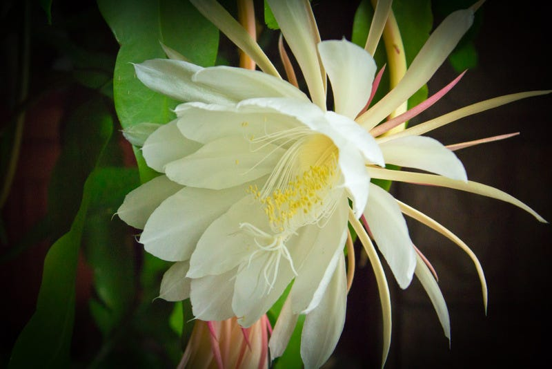

# Planting the Seeds

*Investing in long-term gains that yield more than you can imagine*

[Wikicommons Photo](https://commons.wikimedia.org/wiki/File:Epiphyllum_oxypetalum_01.jpg)

My father had a lifelong obsession with a single flower. It wasn't just any flower; it was a flower that is considered magical in Chinese culture. We drove all the way to New York so he could get a cutting of it from my uncle. We brought it back to South Carolina, and he planted it—this tiny, leaf-like thing—in a very large flower pot. It sat by the bay window in front of our dinner table for years and years and years.

And nothing happened.

It consumed resources. It required constant watering. And it was right there, two feet from where I sat every night at dinner, doing absolutely nothing but growing more leaves that never showed any hope of flowering. Then, one day, my dad announced, “It's time.” I could hardly believe it, but it was true: a tiny bud had formed, growing bigger and bigger each day. This useless plant was actually going to flower.

My dad explained that this plant only ever flowered at night, and only for a single night at a time. Most Westerners have heard about this flower thanks to the movie “Crazy Rich Asians” and the Cinderella moment when Rachel Chu shows up in full glory for Nick’s grandmother’s party. I’ve always wondered how they knew the exact day to plan such an elaborate event, because it can actually be rather hard to predict. Regardless, the moment the plant blooms is considered precious and miraculous, something to be treasured and celebrated.

My parents planned for that evening, too. My dad brought his lamps into the kitchen, and we moved the kitchen table aside. He set the plant up in the middle of our dining area so he could take photo after photo. And then there it was: a mystical white flower that seemed to come alive out of nowhere. It was enormous—about the size of my head at the time—and it was glorious. Our parents let us stay up all night watching it blossom in our suburban South Carolina home. This flower, so celebrated in our country of origin, was the centerpiece of our small space.

[Share](https://debliu.substack.com/p/planting-the-seeds?utm_source=substack&utm_medium=email&utm_content=share&action=share)

## **From planting to blooming**

I didn’t think about that flower for years. Then, recently, someone told me a story about how their friend, who was making wine at home, said matter-of-factly, "Okay. That's it. In three years, we'll have 3,000 bottles of wine." Three years seems like a lifetime.

My first reflection was on Dad's flower. The Queen of the Night (Epiphyllum oxypetalum) is a desert cactus from Mexico and Guatemala that was imported to China in the 1600s [(ref)](https://flowerpowerdaily.com/tan-hua-flower-becomes-a-star-thanks-to-crazy-rich-asians/#:~:text=Fans%20of%20the%20hit%20film,and%20then%20dies%20at%20sunrise.). It is highly treasured for its rare beauty, which only appears once per year and only for one night. Travelers to the West found this plant and brought it halfway around the world to the East, only for it to return to thrive in our South Carolina home.

That small cutting, to my parents, represented everything that could be. And now that I look back, I see their cultivation of it as a sign of their hope. They came to America with very little, and they built a life achieving their version of the American dream. They planted that little leaf, thinking one day it would blossom and grow, even if it took years—and it did.

The act of immigration to America was about hope. The act of moving from New York City to a small town in South Carolina was about hope, too. It was about taking what once was, moving it, and cultivating it to be much more than it could have been.

I think about that a lot: what it takes to plant a seed, not knowing what it can become… or whether it will become anything at all. Many times, things don’t work out. The seed fails to take root. Plants die. Success is ephemeral. But we humans are hopeful. We are persistent. We plant and plant, hoping to one day watch things blossom.

## **Planting the seeds of success**

Someone once came to me telling me she wanted to join the board of a Fortune 500 company, one of the biggest brands in the world. I didn’t know her well, but I admired her gumption for asking. She told me this had been her lifelong dream.

This is a board that only draws from the best of the best. I gave her my thoughts on how to get started. I introduced her to one of the current board members and suggested several steps she could take along the way. I explained that this whole process would take a long time, at least 10 or 15 years. She told me she understood, but that she wanted to take the first step.

Our interaction was a reminder that things don’t just happen overnight. Most people reach out to me because they have to make a decision about a job in the next few weeks or months. Instead, this person wanted to map out a decade-long plan to land one of the most coveted board seats in the world. Will she get there? I believe she has the courage, hunger, and gumption to make it happen. She set a goal, and even if she doesn’t make it there, I know she is bound for great things.

[Subscribe now](https://debliu.substack.com/subscribe?)

## **On getting there**

What I loved about my conversation with that person was that she dreamed big and was willing to do whatever it took to make it happen. She had courage, and she was willing to make space in her life to see it through.

My parents did the same thing with the Queen of the Night. It surprised me that they kept it in such a big pot for so long, but they understood how much it could grow. They also understood that it needed space and nutrients to do so. They believed in the future, and they planned for that outcome. Getting where you want to go means making a plan and being willing to do the work, even if success isn’t immediate—or guaranteed.

So what does that look like?

* **Declare your goal.** What is your Fortune 500 board seat, your 3,000 bottles of wine, or your once-in-a-lifetime blossom? Just like my father had a vision for his flower cutting, the first step is to have a vision of your goals. What does success look like to you? Visualize it, write it down, and keep it somewhere you can see it. This vision will be your North Star, guiding you through the times when getting there feels impossible.
* **Estimate the time it will take.** Your goal may take three years, five years, or even ten years to achieve. This timeline will be unique to you, but having a rough idea of how long it will take is important for measuring your progress.
* **Make a clear plan.** Write down five steps that you know will be involved in accomplishing your goal. Then list the smaller steps involved in accomplishing each of those. Go as granular as you can; the more you can break them down, the easier it will be to tackle them one at a time. If you need help figuring out where to start, don’t be afraid to ask. Talk to a mentor or reach out to someone who’s done it already to learn more.
* **Take the first step.** This is where you create the right environment, the soil to thrive, and plant the seed. Look back at your plan, start at the beginning, and try not to get caught up in thinking too far ahead. Focus on putting one foot in front of the other. You already have your road map, so keep your perspective on what you’re accomplishing right now.

As I discussed in an earlier post, [the hardest step in any journey is often the first](https://debliu.substack.com/p/reframing-the-question). The farther out your goal is, the harder it can seem. It can be easy to lose your way when the finish line looks so far away, but as everyone who’s run a marathon knows, once you know where the path is, it’s just a matter of following it. Sooner or later you’ll get there.

---

When I was in high school, the naval shipyard where my Dad worked closed, so we had to move from South Carolina to the small town in Georgia where they had reassigned him. It was during that time that we had to let go of the plant that had been such a big part of my childhood. It had become too big to move, so we took a cutting of it and started again in our new place.

I still think fondly of the hope my parents had and the dreams they planted. They dreamed big and cultivated those seeds early. And to see the flowering plant that they nurtured from a single cutting was proof that anything is possible with patience and a plan.

It’s never too late to start planting your own seeds. Tend to them and give them time, and you can grow something amazing.

[Leave a comment](https://debliu.substack.com/p/planting-the-seeds/comments)