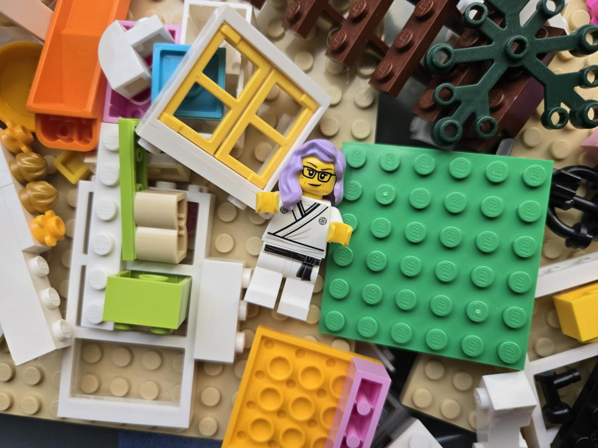

# Decontextualize: A Powerful, Underused Tool 

*Changing the context to change your life*

We are creatures of habit. We're used to doing things a certain way, and they continue to be that way unless there's a reason to change. Sometimes we call those ruts, and other times we call them routines. But whatever name we give them, they're how we subconsciously live our lives, without ever thinking twice… Until something changes.

Maybe there’s a death in the family that makes you rethink your priorities. Maybe you go through a job change that makes you reconsider your work-life balance or an illness that refocuses your attention on your health. Recently, I have been preparing our house for a move, and I’ve been forced to confront things I spent years overlooking. Items that had been sitting in a cabinet for years were pulled out for review. Boxes that had been stored away are now in our living room. Old test papers and books that had once been hidden from view are now sitting out in the open. Suddenly, decontextualized from their normal places, all these things that once seemed perfectly fine where they were now seem out of place. Once-useful things now look like clutter.

When we're in a routine, it's easy to ignore the things that are around us. Then, when they're disrupted, we feel a sudden need to reevaluate and reassess. As shocking as this process can be, it can also be freeing. It forces us to rethink the way we’ve done things and be intentional about how we do them moving forward.

Today, I’d like to share with you a few moments in time when this reassessment can come in handy—and how you can practice this reassessment in your own life.

[Subscribe now](https://debliu.substack.com/subscribe?)

## **Moving things from their place**

Changing things around helps you see them for what they really are.

We have many things in our house that we would otherwise not buy today, but since they're there, they just… sit there. Our clothes that we don't wear anymore. The frozen food hiding in the freezer. Tools that sit in the tool shed, unused, for years.

As I was [cleaning out my in-laws’ house](https://debliu.substack.com/p/hitting-reset), there was one point when I just wanted to throw everything away and start over from scratch. Of course, I couldn't, because there were precious papers and photos hidden amongst all the old newspaper clippings and tax returns. I had to go through every single box and every single piece of paper to sort the things that mattered from a pile of things that didn't. I would find bills from their old house from over a decade ago next to a savings bond with my husband's name on it from 35 years ago.

It was maddening. But removed from all the boxes and sitting on our floor, I was forced to recontextualize all these items. What place did this stuff occupy in my life? What did I want to do with it moving forward? It wasn’t an easy process, but it was important—and it wouldn’t have been possible without that forced change of context.

Whether you’re moving or not, there’s never a bad time to take stock of the objects in your space. Here’s how:

* Take everything out of your freezer and refrigerator and put it on the kitchen counter. Then put each item back in, one at a time. The catch? Only put back the items you will buy or need again in the next six months. Discard everything else.
* Wait until your laundry is completely full—those are the clothes that you wear most often because you like them the most—then go back into your closet and separate out everything else. Put back the things you have worn in the last 12 months, or plan to wear again in the next year. Donate everything else.
* Remove everything from your pantry. Discard all the expired food (you might be surprised how much there is). Look at what’s left and decide what you are going to eat or need in the next six months. Combine things, organize things so that they're visible, and discard anything that isn’t needed.
* Unearth all your miscellaneous papers from drawers, boxes, and shelves. Separate out the important things and put them in a safe place. Take a photo of the things you are unsure about. Shred everything else.

There’s so much clutter that we only keep around because we’re used to seeing it in a certain place. Decontextualize everything that you can, and then put it back. When you go through the process of replacing things, it will become clear what no longer belongs.

[Leave a comment](https://debliu.substack.com/p/decontextualize-a-powerful-underused/comments)

## **Changing things in relationships**

One thing I encourage people to do after they start dating is to actually go on vacation together. I’m not talking about one of those pampering vacations where you have everything taken care of for you, but one where you really have to make decisions on the fly and live with the stressful calls together. That's the test of a real relationship.

David and I have been married for over two decades. Having been together that long, there have naturally been times when our relationship has fallen into a rut. We sometimes find ourselves just putting one foot in front of the other to get through the week.

But decontextualizing a relationship can give it new life. Some couples go on a getaway, but then they come back to their old life and fall into the same patterns. That’s why, if you can’t take a vacation, you can also try something new that is unrelated to what you do today, but still in the context of your home and your family.

For example, David and I used to walk together every single night in the evening after dinner. We did this for years, but once we had kids we had to put to bed, it was harder for us to find the time. During Covid, we got a dog, Wonton, who needed walking. I started walking her with my middle child, Bethany. Recently, Bethany has been very busy with school, so she asked us to walk the dog instead. I had forgotten what it was like to be able to decompress and talk to David like this again.

Relationships, just like living spaces, need refreshing. Sometimes they fall into disrepair, and we stop working on them. This is true of friendships as well. Find a way to put them in a different context, and you can spruce them up.

## **Recontextualizing at work**

Sometimes I have someone approach me at work, feeling torn about someone on their team.

My response to them is always, “Would you hire this person again for the same role? If the answer is no, then they’re not the right person for the role at this time. That doesn't mean they can't be good at something else; it just means they're not the right person for what you need right now. So you either need to change the person or you need to change the role.”

Just like in relationships, at work, we sometimes fall into a rut. I once worked with a product leader who was struggling. They came from a different organization where they had really thrived, but in this new role, they were barely keeping their head above water. I asked them to go back to their old job, where they had been thriving in a role that was adjacent to us. They wanted to fight and stay, even though their work and well-being were suffering.

If you would not take the job you have today again, think about whether there’s anything you can change about it. Find new ways to contribute or things you can add to or subtract from your job. Participate in other things, find meaning in helping others, or pare out some of the reports that you feel are a waste of your time. Rather than just continuing on and being dissatisfied with the job that you have, decontextualize it to make it into the job that you want.

---

I use a PC, and periodically I have to restart it because for some reason gremlins get into it and the only thing that fixes it is control-alt-delete. I don't mind, because it *does* help. The computer works better when I reboot it.

Life also sometimes requires a reboot or a fresh start. That doesn't mean you have to quit your job or move to Portugal. Sometimes it just means that you need to take a step back, give yourself a different perspective, and rethink how you have been doing things.

It's easy to fall into bad patterns or ignore things that just annoy you a little bit, but not enough to matter. But those things *do* add up, even if you don’t realize it. This week, ask yourself what it is that you do that needs some decontextualization. Take the pieces out of context, take stock of them, and then put them back. You’ll lighten a load you didn’t even know you were carrying.

[Share Perspectives](https://debliu.substack.com/?utm_source=substack&utm_medium=email&utm_content=share&action=share)