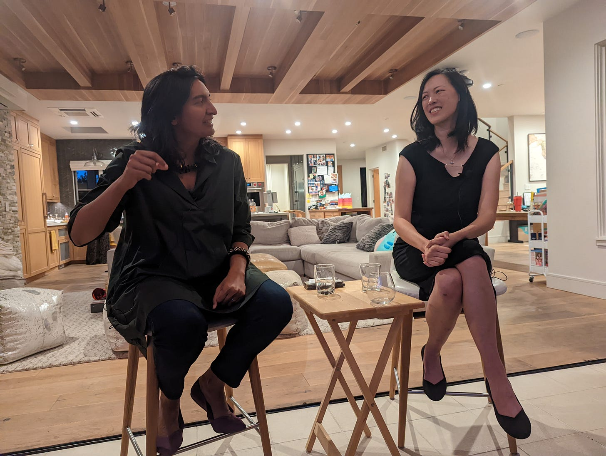

# How to Say No

*And create space for things you truly care about*

**A note from Deb:** Ami and I have been friends for nearly 15 years. Over that time, we have learned from each other, supported each other, and encouraged each other. We decided to do a newsletter swap focused on “The advice I would give you.” So consider this written feedback shared with our whole audience. If you want to read about my advice for Ami’s audience, you can check out [my post on her blog here](https://amivora.substack.com/p/cced93ae-3ee5-44ad-8998-1660933dbad8).

---

Deb is a long-time friend, colleague, sponsor, and supporter.  She also is one of the best people I know at giving honest, direct, proactive feedback that has helped me and so many other people grow.  When she and I were chatting a few weeks ago, she pointed out that I was terrible at taking credit for what I’ve done, and said,“You know what? I’m going to write you a post on how to do this well.”

And so we decided that we’d write guest posts for each other, about a topic that the other person does *not* do well. Deb is sharing “how to take credit for your accomplishments” on my blog, and I’m sharing “how to say no” on hers.

If you know Deb, you know that she can’t resist jumping into problems.  It was a running joke in our team for all the years we worked together that whenever we needed something done, we could just mention it to Deb and she’d volunteer to take it on.  “Deb, we need to make sure someone’s managing PM recruiting.” “Deb, we need someone to take the lead on this employee resource group.”  Even the idea of doing this post swap was something she spearheaded because she saw a problem (my own perception gaps) and couldn’t resist trying to fix it.  No matter what, Deb always tirelessly says, “I can do it!”  I am sometimes exhausted just watching her.

[Share](https://debliu.substack.com/p/how-to-say-no?utm_source=substack&utm_medium=email&utm_content=share&action=share)

I, on the other hand, am a champion of saying no.  In fact, my whole family would say that I’m a little *too* good at saying no.  Tactics that work for me:

1. **Instead of saying “no” to something, say “yes” to what I care about – and share that context.**  When I get requests for 1:1s, speaking engagements, or advisory positions, I immediately want to say “yes” to them all!  They all seem interesting and important.  But then I’d never make progress on my own goals.  Instead, I proactively outline my goals and only say yes to opportunities that match them – and explain that to people who reach out.  That way, they not only understand why I’m saying no, they can also help connect me to what I’m looking for.  “For the rest of this year, I’m focused on my current product roadmap and learning more about CEO roles, so I’m declining other opportunities. Thank you!”
2. **Intentionally make space for others to grow.** I once asked someone on my team why they didn’t volunteer for a particularly challenging project. “Well, you’ve already said what you want here, so it’s easier to just let you do it,” they said. I realized that by automatically taking on so many things myself (and accidentally criticizing the way others did it) I was not only tiring myself out but also blocking others’ chance at leading.
3. **Celebrate the things I am doing.** Sometimes my desire to do more comes from a feeling that I’m just “not doing enough.”  This could be “not doing enough to get promoted”, or “not doing enough for what I want to accomplish in life”, or it could be a deep-down insecurity of “not doing enough to justify all the opportunities I have.”  So I started keeping a list of “things I’m proud of that would not have happened without me.” Whenever I get worried that I’m not doing enough, I open my list and automatically feel calmer.  This gives me a chance to celebrate what I am doing, rather than always feeling the need for more.
4. **Use the old shopping trick.** Many of us learned that when making big purchases, we should walk away first.  If we still want it 24 hours later, that’s a good indicator that we should consider investing in it. In the same way, I often try to visualize myself actually taking on a task and see if I’m still excited 24 hours later.  It’s always okay to take a day to decide.
5. **Gather data by seeing what breaks if I don’t do it.** Sometimes I’ve waited 24 hours, decided I’m not really excited about something, and given other people space to step up…and no one does.  This could be taking on an org initiative at work or folding my kids’ laundry.  Then, I have to ask honestly:  Is this really worth doing?  If the answer is yes, then I might need to be the one to do it.  But if it is a nice-to-have…maybe my kids can choose their clothes straight from the dryer, and we’ll revisit in 6 months.  And in the meantime, we’ll gather more data on how important this is.  If nothing breaks, maybe it’s fine to take this task off our list.

I’ve found that these tactics have given me a lot more room (and less guilt) in my life.  They’ve helped me create space for what I truly care about, and even space for some downtime and exploration.  That helps me not only be more present today, but also dream of what I’m excited about for tomorrow.  I hope they work for you!  And I hope they give Deb a little bit more space in her busy, impactful life.

Thank you, Deb, for the swap and all the years of friendship <3

If you’re interested in more of these short lessons learned around product, leadership, and scaling, subscribe to “[The Hard Parts of Growth](http://amivora.substack.com.)” at amivora.substack.com.

[Subscribe now](https://debliu.substack.com/subscribe?)

---

[Ami Vora](https://www.linkedin.com/in/amvora/) has led some of the most widely used tech products in the world.  As VP at WhatsApp and Facebook Ads, Ami oversaw the growth of some of Meta’s most successful products. She's now the CPO at Faire, a marketplace for local independent retailers. Ami has 3 young children and (coincidentally?) enjoys solo travel :).