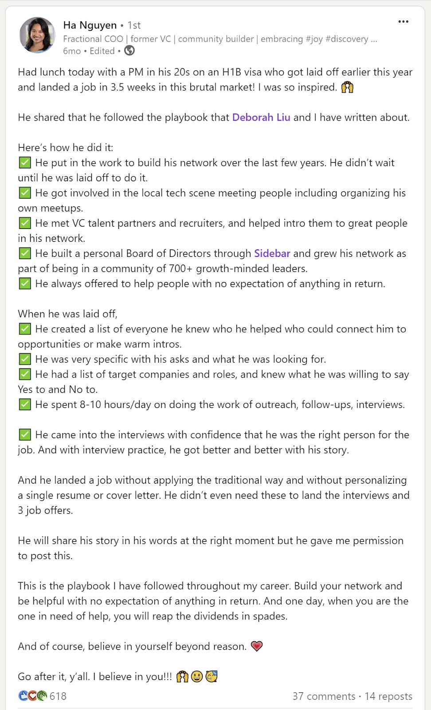

# Networking in the Real World 

*Two case studies on how networking can open new doors*

A couple months ago, someone reached out to me to ask for help. He had never really interviewed for a job before in his multi-decade career. Having started and sold two companies, he always ended up landing jobs during the acquisitions but had never gone through a formal application process before.

With his earn-out completing shortly, he was looking to interview for a new job for the first time ever. He was not ready to start another company and instead wanted to work at a larger corporation for a while. Though his network within the venture capital world was good, he lacked the connections to get the right introductions to the right people.

[Share](https://debliu.substack.com/p/networking-in-the-real-world?utm_source=substack&utm_medium=email&utm_content=share&action=share)

**My advice to him: “Network, network, network.”**

We went for a walk with Wonton while we were having this conversation. I brought up three companies who were hiring and sent the introductions afterward. A month later, he reached out and said he had three offers—each from one of the companies I had introduced him to. He ended up taking a VP offer at a successful tech company and is excited to get started.

Someone who has been out of the game for years reached out to someone he barely knew and asked for help, and it worked. I later joked that when I told him to network, I hadn’t meant me specifically, but that connection ended up unlocking his next opportunity.

I’ve written about networking [in previous posts](https://debliu.substack.com/p/a-definitive-guide-to-networking), but today, I want to revisit that topic—not just to give tips on how to do it, but to make a case for why it’s so important. Many people overlook networking in career development, but if you learn to do it the right way, it can pay dividends when you need them the most.

## **Networking before you need the network**

To be totally honest, I hate telling people to “network.” It feels transactional, inauthentic, and a bit mercenary. I think that’s one of the reasons why many people naturally shy away from it. But when you need help, who would pick up the phone for you?

When you seek out connections with people, they tend to reciprocate. When you offer them help, they tend to return the favor. The people whose help you end up needing don’t have to be close connections. In fact, you are more likely to get help from those who are further away in your network than those who are closer to you. Why? Because those who are closest to you often have access to the same information and opportunities as you. On the other hand, those further away can connect you with others who are not in your orbit. They can open doors you never even knew about.

This is exactly what happened to someone my friend Ha wrote about a few months ago. (You can find more of her insights on networking in [a recent guest post](https://debliu.substack.com/p/networking-as-a-superpower) she wrote for this newsletter.) A friend of Ha’s from Sidebar was suddenly laid off when the startup he worked at struggled to raise new capital.

For nearly a year, this person had watched as conditions deteriorated. But rather than waiting until he was part of a reduction in force, he started reconnecting with people, preparing for interviews, setting the ball in motion for the day his turn came. Though he was in the last group, he eventually got that dreaded message four years after he joined the company. Because he was on a visa, the clock was already ticking. If he wanted to stay in the country, he had 60 days to land a new job. And that was exactly what he did.

What he did differently was that he didn’t wait to network until he needed it. Instead, he saw the transformative power of networking and took steps to harness it before the situation became urgent. By the time it did, he was already in a good spot to find a new opportunity. His networking advice:

1. **Stay focused.** Don’t go broad and try to connect with everyone. Instead, focus on finding communities of trust and mutual interest. He is involved in several communities in his local area, stays active with his alma mater, and hosts events for online communities.
2. **Go online.** He connected with deep online communities, including a mentorship community via Sidebar, Lenny’s Community, and Shreyas’ Product Club. This broadened his network to like-minded Product Managers in the same industry.
3. **Help others.** Networking is not a one-way street. He went out of his way to help others for years before he called on them for help in return. Those seeds he planted bore fruit when he needed it most.
4. **Activate your network.** Once he was laid off, he was on a short work visa timeline, so he had to act fast. He made a list of people to reach out to and requested introductions to “hiring managers, founders, VCs, and recruiters at companies and firms.” He let them know he had been laid off and had a simple ask: an introduction to a specific person, or two or three others who could potentially be worth meeting.
5. **Appreciate others.** Some of the introductions panned out, but many others didn’t. Even for those that didn’t, he expressed his gratitude to everyone who helped and shared how he planned to pay it forward. This showed that he valued the relationship and allowed him to keep the door open for future collaborations.

Through these clear actions, this individual got interviews with 10 companies in just two weeks, and by the time a month had passed, he had landed a new job as an individual contributor at a mid-sized public company.

[Share Perspectives](https://debliu.substack.com/?utm_source=substack&utm_medium=email&utm_content=share&action=share)

## **When you need help before you build your network**

When you are in need of help, that is the worst time to start networking. You don’t harvest before you have planted the seeds, but sometimes you need help even when you haven’t invested the time. What do you do then?

The person whose story I opened this article with is someone I don’t know very well. I am friends with his wife, but he and I had never had a full conversation before. She had come through for me in several times of need (and even occasionally cooked my family her incredible butter chicken), and I could definitely not say no when the time came to help her husband.

The moral of the story? Even if your network is underdeveloped, you still know people who know people. Though those relationships might be more tentative, you can still ask for assistance by proxy. It may be harder to get a yes, but that does not mean the answer will inevitably be no. Here are some ways to do this:

1. **Ask a friend of a friend.** Seek help from someone [who can be a linchpin](https://debliu.substack.com/p/the-importance-of-linchpins-and-why) for you. Even if your friends are not in the same industry as you, chances are, they know someone who is. (You can also try reaching out to old managers and colleagues.)
2. **Leverage other types of networks.** In the Women in Product Facebook group, people often ask for help with interview prep, referrals to hiring managers, and career coaching. Seek out alumni who are in your industry or explore other channels to connect professionally.
3. **Put yourself out there.** A public appeal is often a last resort, but posting on Facebook or LinkedIn can open doors. Use this judiciously.
4. **Don’t search alone.** There are many groups of job seekers whose goal is to support each other and exchange connections. Knowing a group of people in the same situation as you can also make your search more sustainable.

More people are open to helping than you can imagine. While it’s always better to have a network in place before you need it, you would be surprised how far you can get by just looking for those human connections. The trick, as with all forms of networking, is to have the courage to ask.

[Leave a comment](https://debliu.substack.com/p/networking-in-the-real-world/comments)

## **…and a final note to founders who want to stay in the game**

Founders like the one whose story I told here face a unique challenge when it comes to networking. Building relationships can be harder when you’re knee-deep in running a startup, but there are strategies you can use to form connections just the same. Here’s how:

1. **Keep your old corporate networks alive.** Startups can take up a lot of mental space and time, but make an effort not to let your old connections get stale. If anything, staying connected to old colleagues can make it easier to manage stress while allowing you to preserve your network.
2. **Offer expertise and advising.** Folks of all seniority levels at larger corporations are keen to learn about the startup journey. Many are exploring starting their own companies and are interested in the tools, techniques, and experiences that will allow them to move fast. Start offering weekly slots of advising time, and you can provide much-needed guidance while building your network in the process.
3. **Look for projects.** When it’s time to move away from being a founder and into a new role at a larger corporation, a lot of startup folks get questioned with, “Can this person scale?” Many companies, including the likes of Google and Meta, hire for 0-to-1 projects even at mid-senior levels. Target those as an effective entry point (and a chance to form new relationships).

Many of the “built-in” networking opportunities you have as an employee aren’t there when you’re building your own company, but that doesn’t mean networking has to take a back seat, either. You’re in a unique position to make connections that you might not have otherwise. You just have to play your cards right.

---

Networking is something a lot of people avoid, and as a natural introvert, I can understand why. But knowing the right person at the right time can open so many doors, especially when you’re in a tight spot. Putting in the time to build your network before you need it—or, barring that, finding other ways to ask for help—can make a world of difference. So here’s your reminder to check in with your network, or to start building one if you don’t already have one. As these stories show, you’ll be glad you did.

[Share](https://debliu.substack.com/p/networking-in-the-real-world?utm_source=substack&utm_medium=email&utm_content=share&action=share)