# Ten Charts I Can’t Stop Thinking About: Part Three

*Data visualizations that change the way we see things*

[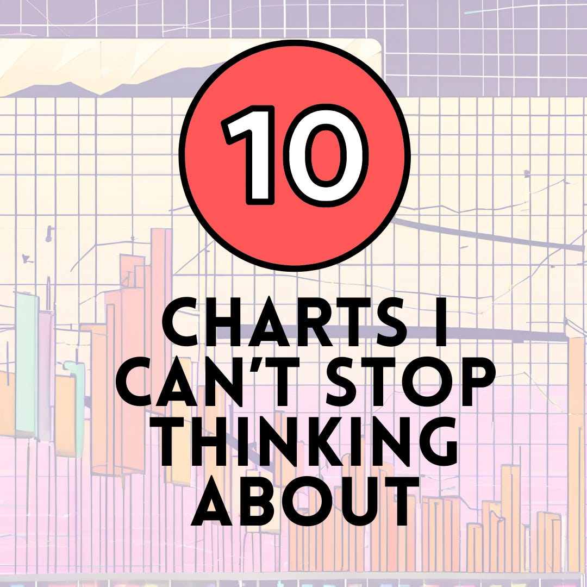](https://substackcdn.com/image/fetch/$s_!VdPb!,f_auto,q_auto:good,fl_progressive:steep/https%3A%2F%2Fsubstack-post-media.s3.amazonaws.com%2Fpublic%2Fimages%2Ff195dfc1-2964-402d-9d48-9aa272e26c60_1080x1080.png)

Two of my top posts on this newsletter have been [Ten Charts I Can’t Stop Thinking About](https://debliu.substack.com/p/ten-charts-i-cant-stop-thinking-about) and its sequel, [Ten More Charts I Can’t Stop Thinking About](https://debliu.substack.com/p/ten-more-charts-i-cant-stop-thinking). At first, I was planning to only publish these posts once a year, but I’ve somehow ended up collecting too many charts already since the last one. That’s why I’ve decided to release the next one now so I can continue to accumulate more interesting data visualizations.

If it wasn’t already obvious, I am a prodigious collector of charts and data. I started my career in consulting, where I learned the power of taking data and turning it into insights. We are visual creatures, and we see the world differently when information is organized in different ways. The joke is that there are “Lies, darn lies, and statistics.” Data displayed badly can be misleading, but data shown well can be revealing.

With this in mind, here are ten more charts that reveal something important.

[Subscribe now](https://debliu.substack.com/subscribe?)

## **1. GLP-1 drugs drastically reduce death**

[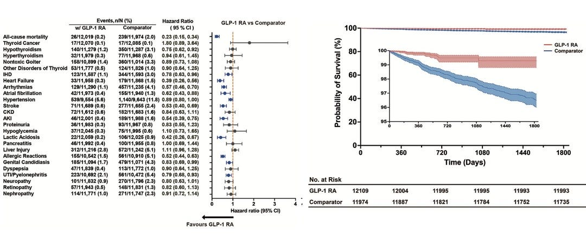](https://substackcdn.com/image/fetch/$s_!qLJb!,f_auto,q_auto:good,fl_progressive:steep/https%3A%2F%2Fsubstack-post-media.s3.amazonaws.com%2Fpublic%2Fimages%2F7beae566-91bd-437a-8d2e-db665f0e92f8_1080x463.png)

[Source: Threads from Diabetes, Metabolism, and Obesity](https://www.threads.net/@erictopol1/post/C_GeNxDvV0y)

Hank Green says it best in one of the comments:

We have long treated obesity like a moral failing, but now we have a tool that can treat it as an addressable condition. As a result, we are seeing death rates drop and lives improve. The chart above shows death rates of only .22% for those who took GLP-1 drugs, compared to nearly 2% for those who didn’t. Separately, I also saw a study in the New York Times showing that Wegovy reduced the death rate from Covid by 33% ([ref](https://www.nytimes.com/2024/08/30/health/wegovy-covid-deaths.html)).

I don't think these drugs are panaceas, and we don't yet know their long-term effects, but if I told you that a drug could cut death rates by almost 90% for a group of people with a specific condition—regardless of what it was—it would make you sit up and listen. These drugs are offering hope to those who have been struggling with weight and weight-related illnesses, and they could be a game-changer for obesity-related mortality.

## **2. Children are not attending school post-COVID**

[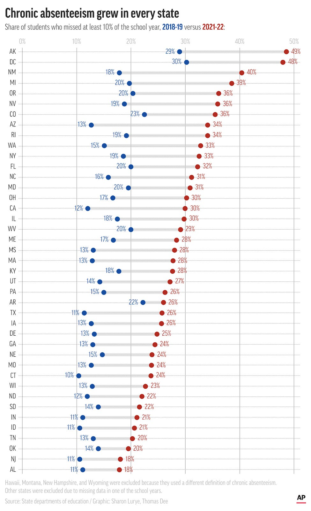](https://substackcdn.com/image/fetch/$s_!EL95!,f_auto,q_auto:good,fl_progressive:steep/https%3A%2F%2Fsubstack-post-media.s3.amazonaws.com%2Fpublic%2Fimages%2F5828096f-13dd-4763-b4c2-029460066249_975x1600.png)

[Source: EdSource](https://edsource.org/2023/millions-of-kids-are-missing-weeks-of-school-as-attendance-tanks-across-the-us/695460)

COVID had—and still has—a major impact on our lives, but one of the ones we might not think about as often is the impact of the lockdowns on children. In the aftermath of the pandemic, students are more chronically absent (defined as missing more than 10% of the school year) in every single state in the U.S.

According to EdSource, “School relationships have frayed, and after months at home, many parents and students don’t see the point of regular attendance.” ([ref](https://edsource.org/2023/millions-of-kids-are-missing-weeks-of-school-as-attendance-tanks-across-the-us/695460)) COVID stretched, and in some cases even broke, the bonds between students and schools, and now districts are struggling to keep kids coming in.

## **3. “Assortative mating” has increased since 1960**

[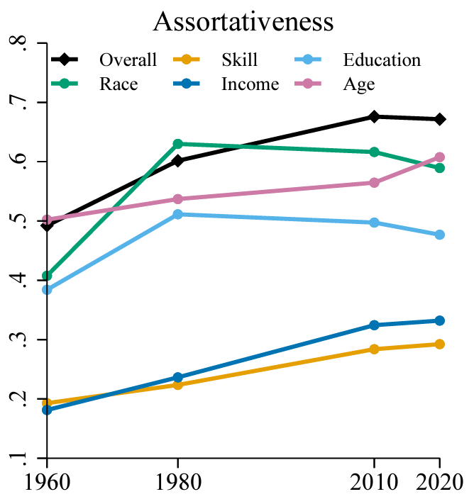](https://substackcdn.com/image/fetch/$s_!-u_V!,f_auto,q_auto:good,fl_progressive:steep/https%3A%2F%2Fsubstack-post-media.s3.amazonaws.com%2Fpublic%2Fimages%2F4f07a67d-55fd-4017-9c5b-1d5a8142337f_661x704.png)

[Source: FEDERAL RESERVE BANK OF ST. LOUIS](https://www.edwardconard.com/macro-roundup/comparing-1980-vs-2020-americans-became-less-selective-on-race-and-more-selective-on-income-and-skill-in-choosing-a-spouse-assortative-mating-accounts-for-50-of-the-increase-in/?view=detail) / [Seen posted by @carnegie4life here](https://www.threads.net/@carnage4life/post/C_9YuJbPFma/?xmt=AQGzJZ4pJ_ZwfJOfGHRAE3vQRGrp2zrZaHer2kc5yi-34Q)

“Assortative mating” is the term for how people tend to pick partners they have things in common with. It makes logical sense, but we don’t often think about how this might lead to self-separation in society. “We find that the observed increase in assortativeness accounts for approximately half of the increase in household income inequality between 1980 and 2020,” a paper from the Federal Reserve Bank of St. Louis states. “The most important factors contributing to household income inequality through mate selection are selection on education (35%) and skill (30%), with selection on income (15%) and age (15%) trailing significantly, while selection by race (5%) plays a relatively inconsequential role.” ([ref](https://s3.amazonaws.com/real.stlouisfed.org/wp/2023/2023-023.pdf))

While we talk about income inequality, I think we speak less about “assortative mating” as a driver. Further complicating things is that women with college educations are nearly twice as likely to have lasting marriages as those with only a high school education ([ref](https://www.pewresearch.org/short-reads/2015/12/04/education-and-marriage/)). Combined, these two factors are long-term drivers of income disparity that may be hard to address.

[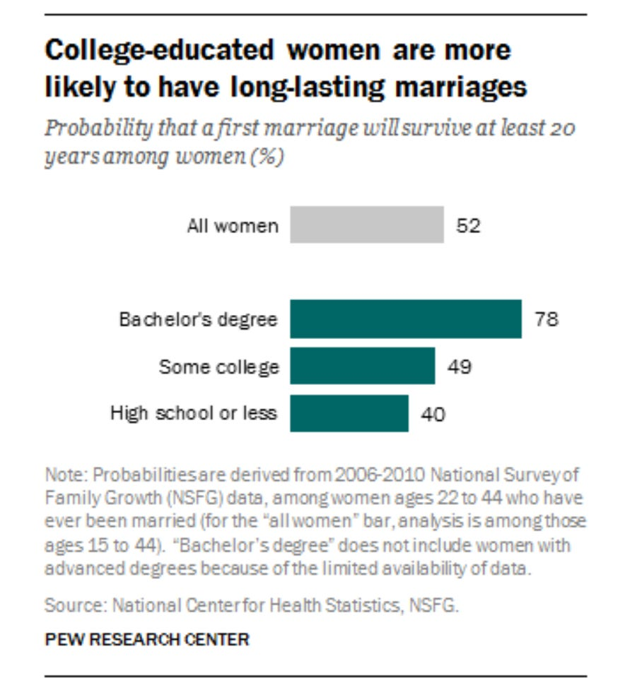](https://substackcdn.com/image/fetch/$s_!_xAI!,f_auto,q_auto:good,fl_progressive:steep/https%3A%2F%2Fsubstack-post-media.s3.amazonaws.com%2Fpublic%2Fimages%2F3c75a5ba-682e-4244-9342-fc2433b94591_901x987.png)

[Source: Pew Research](https://www.pewresearch.org/short-reads/2015/12/04/education-and-marriage/)

[Leave a comment](https://debliu.substack.com/p/ten-charts-i-cant-stop-thinking-about-855/comments)

## **4. Americans are more polarized**

[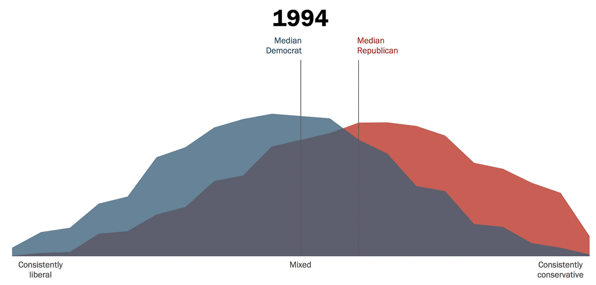](https://substackcdn.com/image/fetch/$s_!takY!,f_auto,q_auto:good,fl_progressive:steep/https%3A%2F%2Fsubstack-post-media.s3.amazonaws.com%2Fpublic%2Fimages%2F222b95ce-2a3e-49b0-a596-d30fcb17bca8_1600x766.gif)

[Source: Pew Research](https://www.pewresearch.org/politics/2014/06/12/political-polarization-in-the-american-public/)

This chart was first published in 2014, and it shows just how much we are pulling apart politically as a nation. I looked for more recent data and found this updated look from 2016 to 2022, which shows how people from different parties feel even more negative about each other than they did in 2015. The most alarming thing is how in 2016, fewer than half of people thought people in the other party were “immoral,” but now that number has climbed to two-thirds ([ref](https://www.pewresearch.org/politics/2022/08/09/as-partisan-hostility-grows-signs-of-frustration-with-the-two-party-system/)). These two charts together illustrate how far we are moving away from one another as a group.

[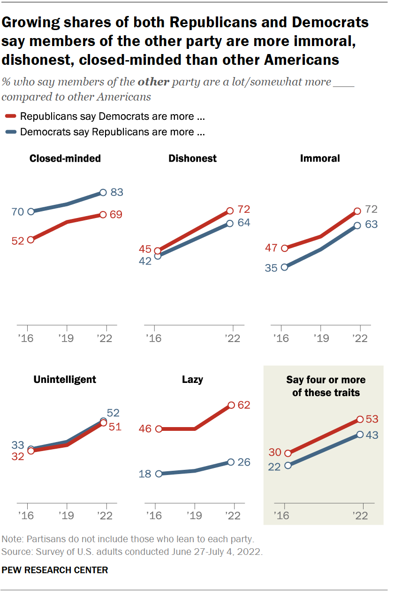](https://substackcdn.com/image/fetch/$s_!IdBc!,f_auto,q_auto:good,fl_progressive:steep/https%3A%2F%2Fsubstack-post-media.s3.amazonaws.com%2Fpublic%2Fimages%2F721c9ecb-8b5a-430b-8ce1-9e33b22c4003_840x1260.png)

[Source: Pew Research](https://www.pewresearch.org/politics/2022/08/09/as-partisan-hostility-grows-signs-of-frustration-with-the-two-party-system/)

## **5. Childcare is increasingly unaffordable**

[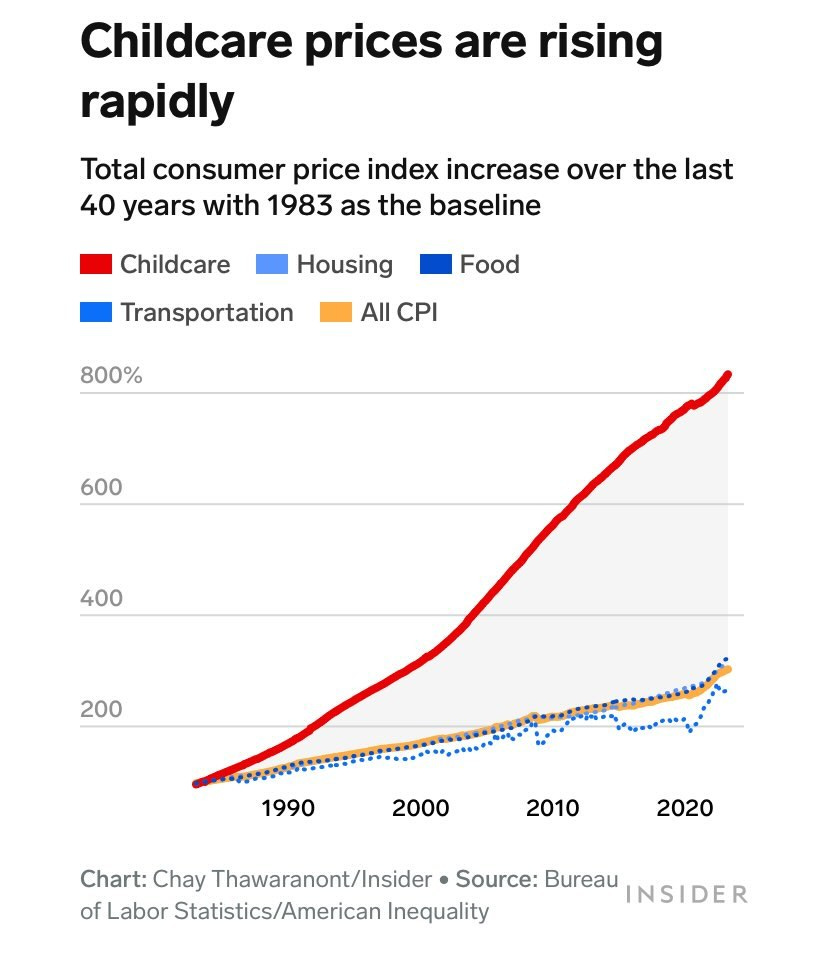](https://substackcdn.com/image/fetch/$s_!niSH!,f_auto,q_auto:good,fl_progressive:steep/https%3A%2F%2Fsubstack-post-media.s3.amazonaws.com%2Fpublic%2Fimages%2F3d54d73b-2fc3-4a02-bcf7-a35db2cf2781_828x970.png)

[Source: Business Insider](https://www.businessinsider.com/most-expensive-cities-for-childcare-daycare-us-affordable-care-cost-2023-5)

Childcare costs have skyrocketed well above the costs of other household goods and services. Costs are high for a number of reasons, including regulatory requirements for location, staff-to-child ratio, and rising labor costs. As a working mom of three, this hit close to home for me.

A 2023 podcast from NPR cites a U.S. Treasury report saying that 60% of households can’t afford quality care, yet childcare centers are barely able to stay afloat ([ref](https://www.npr.org/2023/02/02/1153931108/day-care-market-expensive-child-care-waitlists)). The margins are thin, staff compensation is low, and parents are frustrated. This is a market failure.

According to the New York Times, the average O.E.C.D. country spends nearly $14K per child on daycare. They address this market gap with public funding. The U.S., by contrast, spends $500 ([ref](https://www.nytimes.com/2021/10/06/upshot/child-care-biden.html)), leaving it up to the free market—and making childcare out of reach for many families.

[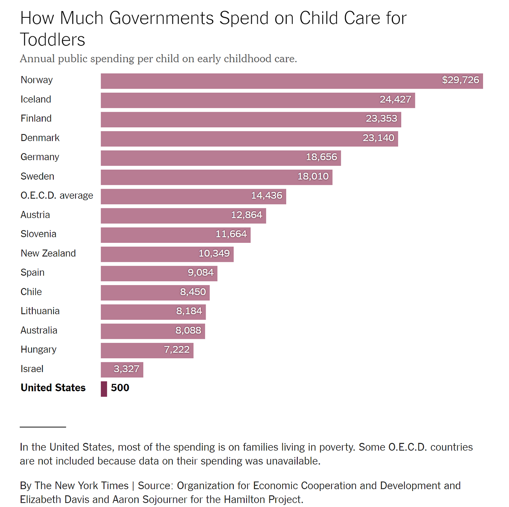](https://substackcdn.com/image/fetch/$s_!y0WF!,f_auto,q_auto:good,fl_progressive:steep/https%3A%2F%2Fsubstack-post-media.s3.amazonaws.com%2Fpublic%2Fimages%2F5bd0e111-6d1b-4e41-b61e-92e60bce273f_1600x1598.png)

[Source: New York Times](https://www.nytimes.com/2021/10/06/upshot/child-care-biden.html)

## **6. Housing prices are outpacing income growth**

[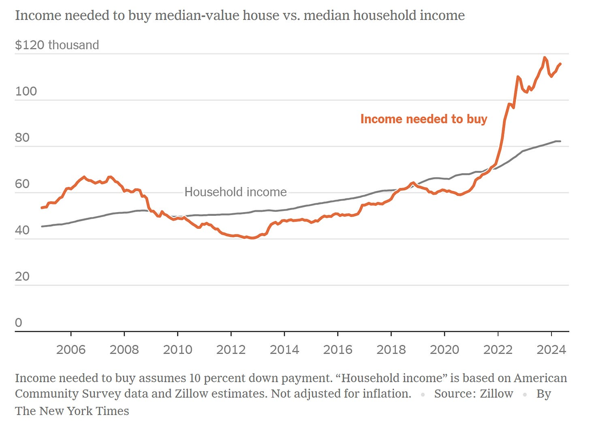](https://substackcdn.com/image/fetch/$s_!JZiA!,f_auto,q_auto:good,fl_progressive:steep/https%3A%2F%2Fsubstack-post-media.s3.amazonaws.com%2Fpublic%2Fimages%2Fac107a00-7bf5-4e1c-9e65-c36af50c99ad_1592x1167.png)

[Source: New York Times](https://www.nytimes.com/2024/06/20/business/economy/housing-market-explained.html)

Housing prices are increasingly putting home ownership out of reach for the average family. Like childcare, the cost of buying a house is increasing, stretching the ability of families to achieve this part of the American Dream. Interest rate increases have exacerbated the problem. Those with a 3% interest rate have no incentive to sell, since they would have to take on a mortgage at twice the rate, eating into the affordable monthly payments.

At the same time, I also came across this chart from Freddie Mac. In absolute numbers and share of inventory, the construction of smaller, entry-level homes has fallen since the Great Recession. These less expensive homes haven’t been coming onto the market for the past 15 years, thus limiting the supply of more affordable stock.

[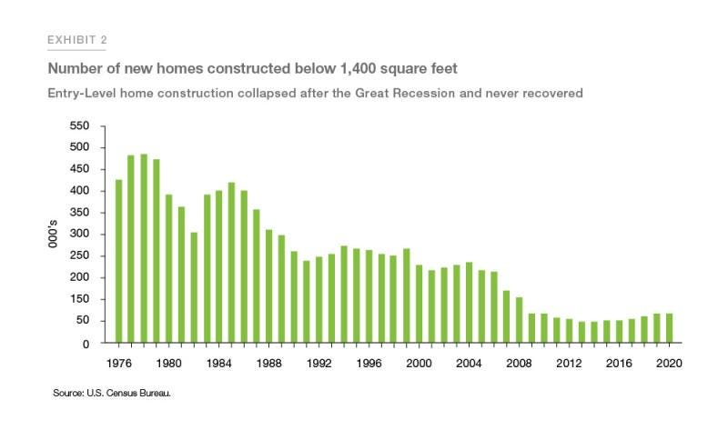](https://substackcdn.com/image/fetch/$s_!wDzM!,f_auto,q_auto:good,fl_progressive:steep/https%3A%2F%2Fsubstack-post-media.s3.amazonaws.com%2Fpublic%2Fimages%2Fa6024c10-6a3a-485b-8fc4-a06e6bd251c7_800x484.png)

[Source: Freddie Mac](https://www.freddiemac.com/research/insight/20210507-housing-supply)

## **7. The majority of U.S. couples now meet online**

[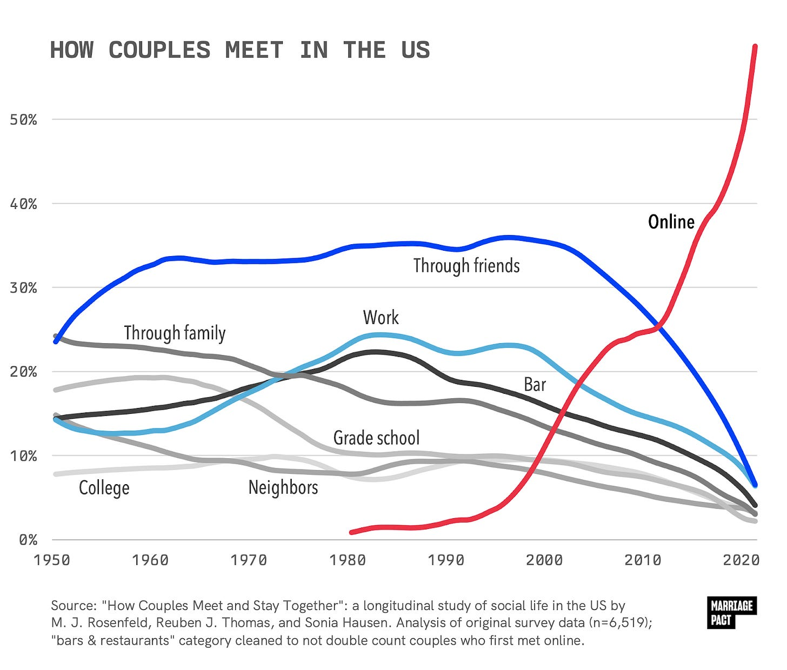](https://substackcdn.com/image/fetch/$s_!q1Ts!,f_auto,q_auto:good,fl_progressive:steep/https%3A%2F%2Fsubstack-post-media.s3.amazonaws.com%2Fpublic%2Fimages%2F2b122974-c8a7-4ea3-8b81-be99949fc2b2_1600x1363.png)

[Source: Reddit and Marriage Pact](https://www.reddit.com/r/dataisbeautiful/comments/18h7k9g/how_heterosexual_couples_met_oc/)

I found this chart fascinating. I guess if you were to ask us how we met, David and I would tell you it was through church. But it was actually through a childhood friend of mine, who moved away to become a childhood friend of David’s and introduced us to one another my first weekend away at college. So… friends and college? In any case, seeing how the “online” category has taken off as a way to meet a partner is really interesting. In fact, all other ways of meeting a partner seem to be down to less than 10%, while more than half of couples now meet virtually.

Also interesting is this chart showing that fewer people are using dating apps now than they were in previous years. Perhaps people continue to meet one another online, but not on apps. I met a couple recently who met on LinkedIn. “Online” now encompasses communities of many types, not just dating apps.

[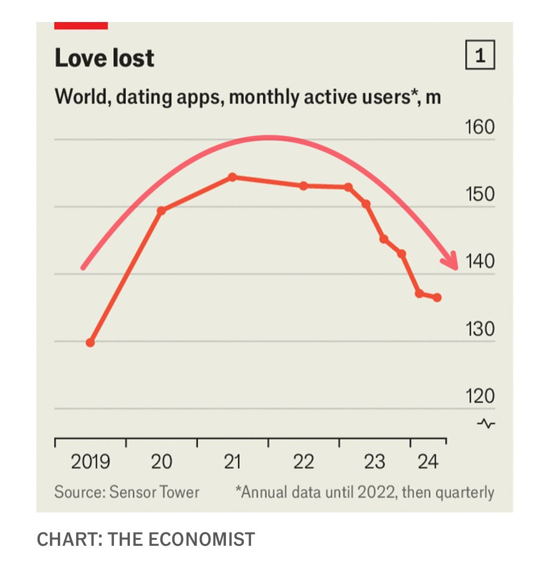](https://substackcdn.com/image/fetch/$s_!_zhX!,f_auto,q_auto:good,fl_progressive:steep/https%3A%2F%2Fsubstack-post-media.s3.amazonaws.com%2Fpublic%2Fimages%2Fb918436c-78a2-4a00-9e5e-3c695c0c68f0_931x960.png)

[Source: The Economist](https://www.economist.com/business/2024/08/08/why-people-have-fallen-out-of-love-with-dating-apps)

## **8. College majors have very different ROIs**

[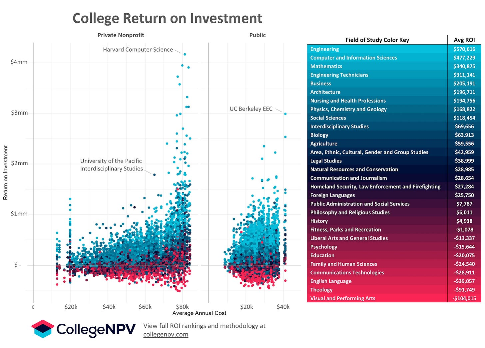](https://substackcdn.com/image/fetch/$s_!iKc0!,f_auto,q_auto:good,fl_progressive:steep/https%3A%2F%2Fsubstack-post-media.s3.amazonaws.com%2Fpublic%2Fimages%2F744f83bc-cc62-47e5-b8ec-8574b1e38112_1600x1148.png)

When I went to college, I knew I was going to study engineering. My dad was an electrical engineer, and my sister was in college studying chemical engineering. I decided to study civil and environmental engineering. As the child of immigrants, I knew I had to have a practical and employable field of study, so I never deviated from the path they set me on. When I got to college, I was surprised at the wide range of majors.

David and I recently sent our first child to college. Jonathan initially wanted to study political science like his father, but we both urged him to pick something in STEM. He ended up opting for data science and political science as double majors instead. We want him to enjoy his field of study, but to also learn the hard math and data skills necessary for a world being transformed by technology.

## **9. Fertility rates are dropping below replacement levels in many countries**

[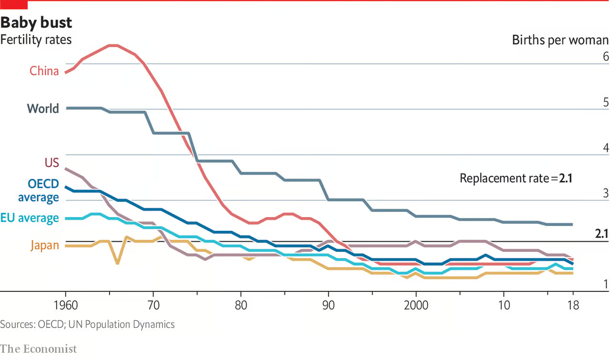](https://substackcdn.com/image/fetch/$s_!2JKQ!,f_auto,q_auto:good,fl_progressive:steep/https%3A%2F%2Fsubstack-post-media.s3.amazonaws.com%2Fpublic%2Fimages%2F6e9575e5-71cf-43ca-8435-663cb6c4aea0_1280x748.png)

[Source: The Economist](https://www.economist.com/the-economist-explains/2021/04/29/how-can-countries-such-as-china-tackle-falling-birth-rates)

The U.S., E.U., and many East Asian Countries are seeing their birth rates fall below replacement levels. Japan (1.26 per person) and South Korea (0.72 per person) are already facing economic challenges due to an aging population without enough young workers to fuel the economy. Though it seems simple to say that having more family policies could turn this around, it’s really not that simple. Even countries like Norway, with [12 months of parental leave](https://www.norden.org/en/info-norden/parental-benefit-and-parental-leave-norway), child stipends, and [85% subsidies for child care](https://www.csmonitor.com/World/Europe/2024/1015/norway-child-care-subsidy-universal-preschool#:~:text=community%20%E2%80%93%20and%20biodiversity-,Public%20funding%20covers%2085%25%20of%20operating%20costs%20for%20child%20care,amount%20of%20choice%20for%20parents.), are seeing their fertility rates drop to 1.4 per person. Most couples in wealthy countries are opting for fewer or even no children. This is going to be a major demographic shift, one that we have not yet reckoned with.

## **10 . The political divide between men and women is increasing**

[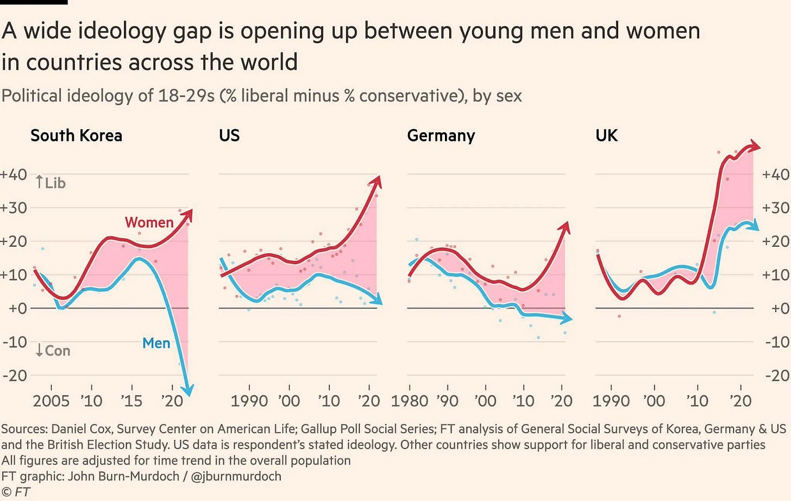](https://substackcdn.com/image/fetch/$s_!c6Y0!,f_auto,q_auto:good,fl_progressive:steep/https%3A%2F%2Fsubstack-post-media.s3.amazonaws.com%2Fpublic%2Fimages%2Fc04b6212-b2f3-40d3-8311-c788f7f4a4a9_1600x1015.png)

David and I have largely similar political views, but we also met in the ‘90s, when the gap was fairly small between the sexes. Looking at people now, the gap appears to be widening between men and women—not just in terms of their political views, but also in terms of their church attendance. For the first time, women are reporting they are less religiously affiliated than the men of their generation. This is a flip from previous generations. [A recent look at this in the New York Times shows how this is changing the face of churches and politics](https://www.americansurveycenter.org/newsletter/young-women-are-leaving-church-in-unprecedented-numbers/).

[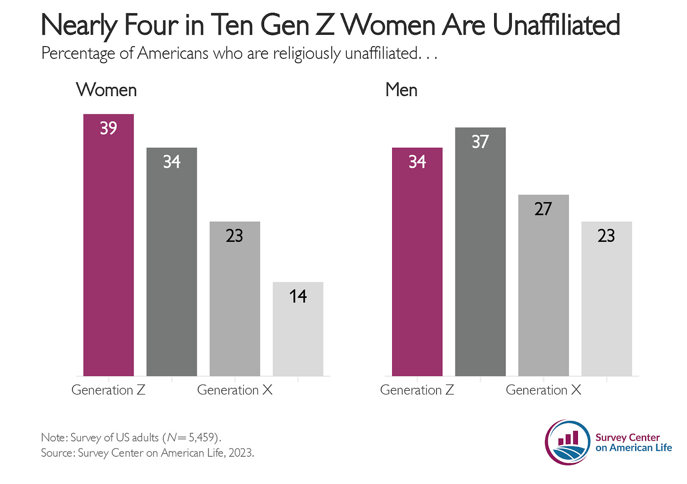](https://substackcdn.com/image/fetch/$s_!EzXs!,f_auto,q_auto:good,fl_progressive:steep/https%3A%2F%2Fsubstack-post-media.s3.amazonaws.com%2Fpublic%2Fimages%2Fc03f831b-bd57-47fd-aa4f-41a2d39fae5e_1600x1129.png)

[Source: Survey Center on American Life](https://www.americansurveycenter.org/newsletter/young-women-are-leaving-church-in-unprecedented-numbers/)

---

It’s always interesting to take a step back and look at this data. I collect individual charts I find interesting, but it’s only when I compile them in a post that I notice broader themes and trends. So often, data has a larger meaning, even when I didn’t see it at the start. We live in such a tech-heavy, interconnected world, and that connectedness is shaping our ideas and behaviors, from our political views to our approaches to dating and education. As technology and science progress, I’ll be curious to see if these trends continue—and how we’ll manage their implications for society.

What do you think of this data? Have you come across any charts you’ve found fascinating lately? I’d love to hear your thoughts.

[Leave a comment](https://debliu.substack.com/p/ten-charts-i-cant-stop-thinking-about-855/comments)