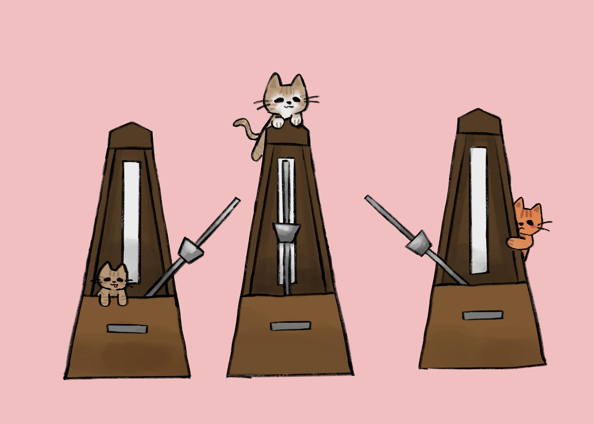

# In Sync: The Hidden Rhythms That Shape Us

*How the people closest to us quietly shape who we become*

Artwork by my youngest daughter, Danielle.

[Years ago, I saw one of those viral videos of a bunch of metronomes ticking out of sync on a table](https://youtu.be/JWToUATLGzs?si=1lzxqKf5cVXcoAUx). At first, it was chaos, and every pendulum was at its own pace and beat. But slowly, something started happening. With each swing, the metronomes influenced the platform they were on, and this slight redistribution of every beat went to the platform, which in turn influenced each metronome’s rhythm. Within minutes, the chaos turned into synchronicity, where every metronome ticked in perfect time.

It feels like magic, but it’s physics. When systems are connected, they influence one another almost imperceptibly until they find equilibrium. Watching this video again after many years, I couldn’t help but think about people, social networks, and culture.

We live assuming we move to our own tempos and choose our own paths. But eventually, we sync with those around us, for better or worse. They pull on us, and we, in turn, change them. The more connected we are, the faster that alignment happens, and the more we fall in line with the norms around us.

In companies and teams, this synchronization is what we call culture. It is the invisible energy that allows people to move in concert. It is not set by mandate but by creating the conditions that make things happen when no one is watching. Like the platform beneath the metronomes, a shared foundation of values and mission allows everyone to tune to one another until the motion happens in concert.

[Subscribe now](https://debliu.substack.com/subscribe?)

### **Setting the Foundation**

There is an old saying: “Show me your five best friends, and I’ll show you who you are.”

We ask each of our kids who go off to college to attend church and a Bible Study weekly when they arrive. It is not that we are dictating what they believe, but we want them to set up routines and make friends who share their faith foundation when they land in a strange new place. I met David at church my first weekend in college, and I attended the Bible Study he had gone to before me. That is also where we met some of our closest friends, people we are still connected to decades later.

We mirror the people closest to us. Their habits, ambitions, and values seep into us quietly. Spend time with people who share your values, and they will amplify them. But steep yourself in a culture where peers pressure you into what feels wrong, and over time, you may start to give in.

We like to think our choices are entirely our own, but they rarely are. Our lives echo through one another far more than we realize. That is why who you surround yourself with matters more than almost anything else.

[Share](https://debliu.substack.com/p/in-sync-the-hidden-rhythms-that-shape?utm_source=substack&utm_medium=email&utm_content=share&action=share)

### **Social Contagion**

I recently met someone who told me that divorce had spread through their social circle. Once one couple split, it seemed to ripple outward until half their group was divorced. They said it just sort of happened.

It turns out, science backs that up. Researchers studying social networks have found that divorce is indeed contagious. When someone close to you ends their marriage, it does not just affect them. It can influence others up to two degrees away. [Using decades of data from the Framingham Heart Study](https://www.pewresearch.org/short-reads/2013/10/21/is-divorce-contagious/), scientists found that if your friend divorces, your own likelihood of divorcing rises by 75 percent. A friend of a friend’s divorce raises your odds by about a third.

Perhaps knowing divorce is not the end of the world gives others the courage to act. Or maybe having someone to guide you through it lowers the barrier. Whatever the reason, the results are striking. Attitudes, norms, and expectations shift in groups, and even something as life-changing as divorce can be contagious.

The same is true for weight gain. In the same study, scientists discovered that obesity spread through social ties just like divorce. [If a close friend became obese, your own chance of becoming obese increased by 57 percent](https://hms.harvard.edu/news/obesity-spreads-through-social-networks), even higher than the effect of a sibling at 40 percent or a spouse at 37 percent. It was not about living together or sharing meals. This pattern held even for friends living hundreds of miles apart. Connection trumped proximity.

I sometimes wonder if the same is true today in the opposite direction, if weight loss from GLP-1s spreads through social networks just as naturally.

These findings reveal something essential about being human. We are social mirrors. Even though we believe we have free will, we are influenced by others in our habits, beliefs, and even our bodies. The people we care about most shape the platform beneath us, nudging us into sync.

### **Syncing at Work**

At work, I have seen teams gradually sync in tone, pace, and optimism. A leader’s anxiety can spread through a room faster than wildfire, but so can calm and confidence. A manager who celebrates wins rather than punishes misses can transform outcomes. A culture that values thoughtful deliberation over speed can yield wildly different results.

Alignment can either accelerate or erode progress. That is why how you show up matters. It is beyond strategy or decision-making. It is about setting the tempo that others unconsciously match.

I once worked with a team where no one ever showed up late. I was new, but I soon learned that the penalty for being even 30 seconds behind was an immediate, good-natured callout. No one had written that rule down, but everyone followed it. Once a norm takes hold, it becomes self-reinforcing for newer folks to the group.

The same principle applies to families, friendships, and communities. Once something becomes a norm, everyone subtly conforms.

[Leave a comment](https://debliu.substack.com/p/in-sync-the-hidden-rhythms-that-shape/comments)

---

That is the beauty and the danger of connection. It takes individuals and helps them work in concert, magnifying both the good and the bad. We can catch courage just as easily as we catch cynicism. We can absorb resilience as quickly as resignation. The contagion goes both ways.

So choose your platform wisely. Who are you letting set the tempo in your life? Who are you syncing with, day after day, often without realizing it? Is that influence lifting you up or holding you back?

Eventually, the chaos will turn into rhythm. When it does, be sure it is the one you want in the first place.