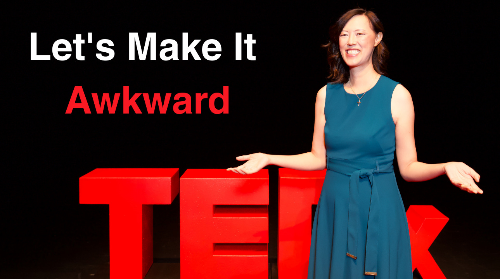

# Let's Make It Awkward

*Why Calling It Out Changes Everything*

I was invited to [TedX San Diego](https://www.tedxsandiego.com/) to give a talk. I cycled through half a dozen drafts of something related to the book I am working on. But iteration after iteration, my [speech coach, Allison Wonders](https://www.coachingwonders.com/), and I just didn’t feel it was coming together. I was frustrated after weeks of writing and editing, and she stopped me and asked me to just tell her some stories from my book to see if it could spark something. I gave her a few anecdotes, and she and I both had the “aha moment” when I said “Let’s make it awkward.” The story I share is the one that opens my book, [Take Back Your Power](https://amzn.to/4mItKyK).

Below is the full content of my [TEDx talk](https://youtu.be/a3Xja3Lmp7A?si=pz6RleRQSivEkN96). Please watch the talk and drop a comment with a time when you should have made it awkward.

---

“Don’t make it awkward.”

That’s what I used to tell myself every time someone dismissed me, interrupted me, or edged me out of the conversation.

After all, I didn’t want to be (yes, that dreaded word) “difficult”.

I remember standing on the floor of the preeminent payments conference, [Money 2020](https://www.money2020.com/). Thousands of influential global fintech leaders were there, and as the head of payments at Facebook, I was the most senior leader from my company represented.

On the first day, my male colleague and I walked the show floor together, introducing ourselves to potential partners. And something kept happening. Subtly, almost imperceptibly, the partner would edge me out, both physically and verbally, until I was standing there like a third wheel, nodding politely while they spoke exclusively to each other.

It didn’t just happen once. It happened three years in a row. And every time, I told myself: Don’t make it awkward. After all, they were just playing the odds, right?

Then came the second day when I went on stage to give a keynote. The minute I stepped off that stage, those same people who had ignored me the day before suddenly wanted to talk.

This happened repeatedly throughout my career. When I led product for the biggest business at PayPal. When I was an executive at Facebook. When I was the CEO of Ancestry.

[Share Perspectives](https://debliu.substack.com/?utm_source=substack&utm_medium=email&utm_content=share&action=share)

### **What “Making It Awkward” Means**

I founded an organization called [Women in Product](https://womenpm.org/) with over 30,000 members. At one of our lead’s dinners in New York, we swapped stories of similar experiences at industry conferences and events. Then and there, we decided we would no longer allow ourselves to be dismissed, pushed aside, or assumed to be lesser. We made a pact: “Screw it. Let’s make it awkward.”

That was the turning point for me. No longer did awkward feel like an imposition on someone else, but rather it became the birthplace of change.

So, what does “making it awkward” even mean?

It means speaking up and stepping into the conversation. Physically and verbally showing up and saying, “I am here and worthy of being listened to,” even if it makes you uncomfortable. Making it awkward forces us into that raw, honest space where the status quo is being challenged.

[Share](https://debliu.substack.com/p/lets-make-it-awkward?utm_source=substack&utm_medium=email&utm_content=share&action=share)

### **Where Awkwardness Comes From**

Awkwardness isn’t something we’re born with. It’s a learned response shaped by moments when we felt unsure or excluded. We adapt by taking up less space. We stop correcting the record.

Where did yours come from? Mine started in childhood.

I grew up the child of immigrants in a small town in the deep South where few people looked like us. Strangers would come up to my family on the street and say, “Go back to where you came from.” My parents loved America. They told me, “Ignore them,” and never give their words power by acknowledging the taunts. They showed me how to stay safe by keeping my head down and not drawing attention to myself.

We were the targets of racial bullying for years, and I learned the safest way to live was to never engage. But every polite silence, every time I let it go, I unintentionally reinforced the idea that I was lesser, not worthy of belonging, or undeserving of being truly seen.

Those lessons ran deep. I didn’t make it awkward.

* Even when the CEO of a startup pitched us and spoke only to my colleague who reported to me, I didn’t rock the boat.
* Even when I was asked to get refreshments for a client because they assumed I was the assistant, I said nothing.
* Even when another executive interrupted me to explain the progress on my own product, I stayed quiet.

Every time, I thought I was avoiding conflict. In reality, I was giving away my power.

[Subscribe now](https://debliu.substack.com/subscribe?)

### **Making It Awkward**

Every time we name what’s happening, every time we step back into the conversation, we jolt the moment awake. Yes, it’s uncomfortable, but it’s also unforgettable. That night at Women In Product, it was the start of a change in me.

Four years ago, when I took on the role of CEO of Ancestry, I knew I couldn’t hide or pretend. This company deserved a leader willing to lead from the front, or I was doing a disservice to our employees and customers.

One day, we got on a call with a consulting firm handling an important project for us. During introductions, I said my name and title, and the partner looked visibly startled that I was the CEO. The old me might have sat back and not pushed the point. But I made it awkward, and he left rethinking his assumptions.

### **Let’s Make It Awkward Together**

What I’ve come to understand is that making it awkward is a spark. It disrupts autopilot. It forces people to correct their assumptions. And over time, it changes the story so you are no longer written out.

So let’s make a pact together—right here, right now. No more being edged out. No more shrinking. No more staying quiet.

From this moment on, when the room goes quiet, the moment feels tense, even as your voice starts to shake

***Let’s Make it Awkward.***

[Leave a comment](https://debliu.substack.com/p/lets-make-it-awkward/comments)

---

*Ready to make it awkward? Challenge someone in your circle to make it awkward by [sharing this talk](https://youtu.be/a3Xja3Lmp7A?si=pz6RleRQSivEkN96) with them. And be sure to leave a comment if this topic resonated with you!*