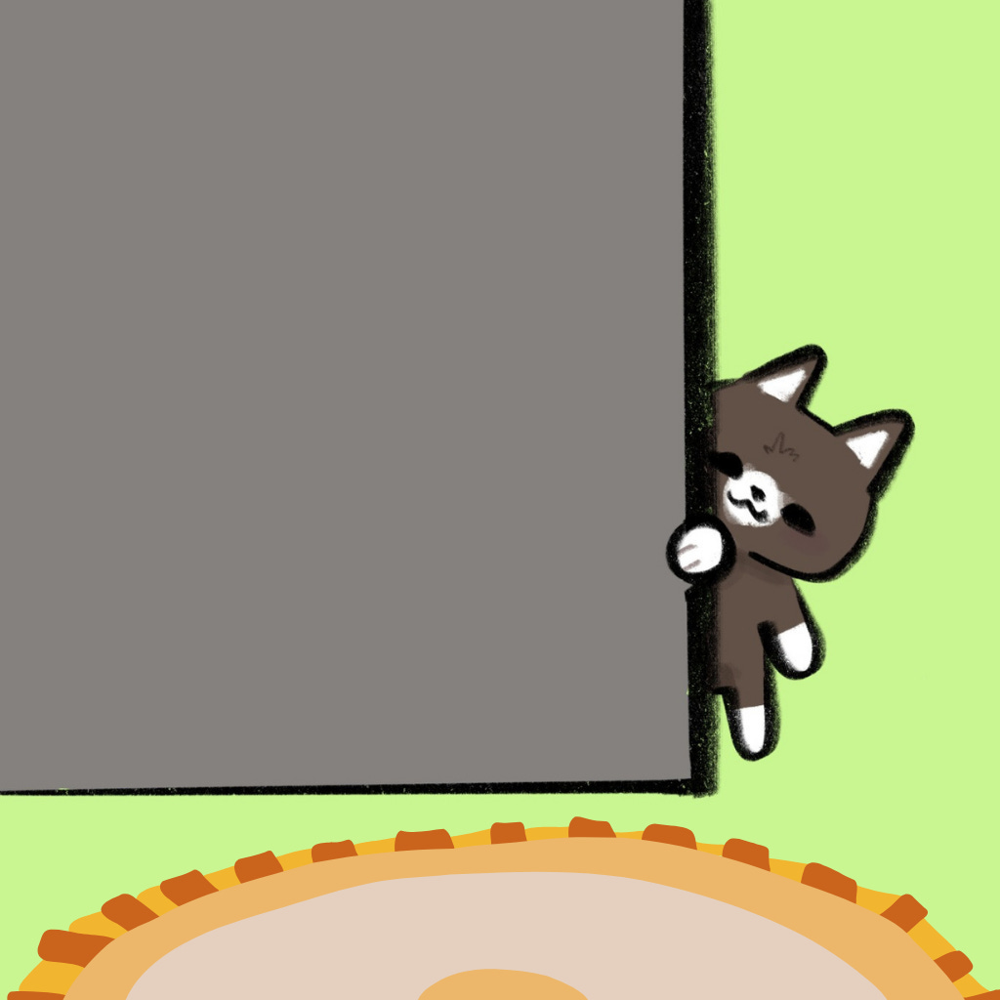

# Pivots, Paths, and Prototypes

*Why letting go is sometimes harder than holding on*

Artwork by my youngest daughter, Danielle.

During this, my “Year of Yes”, I did a lot of things I would never have done before. I will share more in the coming weeks, but one of the things I said yes to was giving a TEDx San Diego Talk, thanks to my friend, [Sheila Gujrathi](https://www.linkedin.com/in/sheila-gujrathi-md/).

I had a plan when I first agreed. I was going to leverage the talk to work on my upcoming book, [the one about transitions](https://debliu.substack.com/p/at-the-edge-of-whats-next-navigating) I have been writing for the past few years. I wanted to use the talk to explore its themes and test them with a wider audience. The first draft was a struggle, but I got something on paper before my first meeting with the speaking coach, [Allison Wonders](https://www.linkedin.com/in/allisonwondersgars/), and producer, Jami Edelheit.

Our first meeting was June 4th, and I figured I had three months until September 9th. The first draft turned into a second draft. Then a third. Then fourth. By the time we met, I had cobbled together something, but it felt off.

Allison patiently helped me with revision after revision. She would say something nice about what I wrote, but she knew it was not working. “It’s okay,” she said one day, “but it isn’t memorable. TEDx is all about ‘ideas worth spreading’ and you need something that sticks with people.”

I was stuck. The theme wasn’t resonating in a sub-10-minute talk, and nothing I did could make it work. Several weeks after we got started, after one particularly frustrating session, she finally said, “Let’s stop trying to fix this one. Just tell me about yourself.”

We talked about my writing, my book, and moments when things got uncomfortable. Somewhere in that banter, she stopped me and said, “That’s your talk. *Let’s Make It Awkward* is the theme of your talk.”

I had already spent over a month trying to perfect another talk, and part of me didn’t want to start over. But she was right. With only a month left before the event, I pivoted completely and started fresh. The final version came together quickly because, for the first time, it felt like the right talk for me to give.

### **Why Pivot?**

There are times in life when you reach a crossroads. You put your heart into something that isn’t clicking. You convince yourself that if you just keep pushing, it will eventually fall into place. You stay in the job, the project, or the relationship because you believe you’re supposed to finish what you start. But you are [stuck](https://debliu.substack.com/p/getting-unstuck-a-guide-for-those).

From the time we are young, we are taught that grit is the path to greatness. We go to schools that reward us for mastering every subject, even the ones we hate, so we can be “well-rounded.” We learn to push through frustration because quitting feels like failure. For a while, that discipline serves us. But eventually, grit can become a trap when what made us successful turns against us.

We start to confuse persistence with progress. We think giving up means we are weak. So we stay in situations long after we should have walked away. Sometimes, the hardest and bravest thing we can do is to stop forcing something that is no longer working.

[Leave a comment](https://debliu.substack.com/p/pivots-paths-and-prototypes/comments)

### **Staying the course vs taking another path**

The founder of Zappos, Tony Hsieh, [offered those who just completed four weeks of training $2,000 if they quit](https://www.businessinsider.com/zappos-tony-hsieh-paid-new-workers-to-quit-the-offer-2020-11). He wanted employees who wanted to be a part of the culture, not those who were just there for a job. So he turned the incentives on its head. Get money immediately for leaving. Eventually, Amazon carried this mantle forward and offered Amazon fulfillment center employees $5000 to walk away. It’s a radical idea, but one I admire.

Zappos and Amazon showed us that quitting is sometimes the better choice. A bit of an incentive to do it may be enough to push you over the edge, which means you were never meant to be there in the first place. What if life worked that way? What if we could step away from what doesn’t fit without guilt or judgment?

Imagine if jobs, projects, or even relationships came with built-in trial periods where walking away was considered a real option. We treat changing our minds like betrayal, but it is a type of growth. Sometimes we outgrow things in our lives, and it is time for a change. And sometimes a forced detour can be the best choice for us.

That is what the TEDx experience taught me. I thought the goal was to test the ideas for my book. In reality, I found an idea worth spreading from something that happened in my life.

[Share](https://debliu.substack.com/p/pivots-paths-and-prototypes?utm_source=substack&utm_medium=email&utm_content=share&action=share)

### **Iteration as practice**

Building great products and companies takes iteration. There is a Chinese saying 一步登天, which is translated to “trying to get into heaven in one step.” It warns of trying to hit perfection in one stride, whereas life requires taking things step by step.

Why don’t we build more opportunities for iteration into our lives? In product development, we are constantly testing, prototyping, and adjusting. Yet in life, we tend to make permanent decisions without ever trying things out first.

What if we lived with more “beta” moments?

Before I advise a company or founder, I meet with them several times just to see how it feels for both of us. I pay attention to whether they are getting value from our conversations or not, and if I find energy in helping them. It’s a simple test that lets both of us see if the relationship works before we formalize anything.

Some companies are starting to do this too. They let potential hires consult or work on short-term projects before either side commits. It reduces risk for both parties and ensures that things will go smoothly.

We can do that in our personal lives as well. Try a new role, a creative pursuit, or a passion project without deciding it has to define you. Give yourself permission to explore before you decide. We don’t have to live life on fixed contracts. Sometimes it is better to start with a prototype.

[Subscribe now](https://debliu.substack.com/subscribe?)

### **Pivots as paths not detours**

I am proud of the final TEDx talk, not because it was perfect, but because it reflects something close to my heart. It wasn’t the message that I started with, but it is one I care deeply about. Pivots are not always detours. Many times, the pivot can be the path itself.

If something in your life isn’t clicking right now, it may not be because you are failing. It may be because you are being called to pivot.

Say yes to that.

You might be surprised where it leads.

---

*If you liked this article, you may enjoy these:*