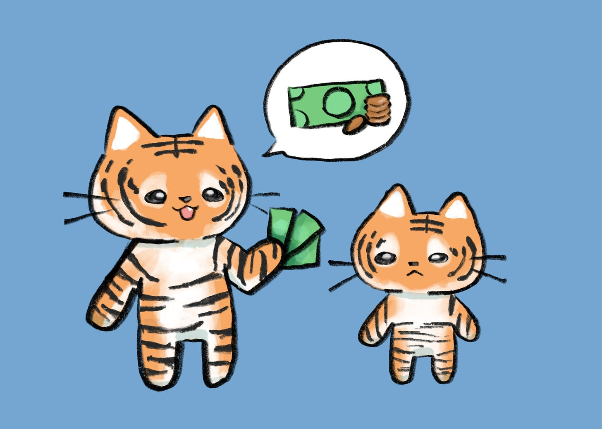

# Show, Don’t Tell: Teaching Our Kids About Money

*What We Do is More Important Than What We Say*

Recently, Bethany and I had the chance to speak at the [JP Morgan Asian American Summit](https://www.instagram.com/p/DPYD5LvAP0o/?utm_source=ig_web_copy_link). We were invited because of our column, *[A Tiger Mom and Her Cub](https://asamnews.com/2024/06/24/financial-education-frugalness-hunger-family-budgets-parenting/)*, where we write about everything from grief to dating to fighting. One of our most popular pieces was about money and how we think about it in our household. We had the opportunity to share that perspective with other families at the event.

My parents and in-laws came to America with a few suitcases and a few hundred dollars to attend college. They knew they had to earn enough just to afford a ticket home. But they were unafraid and built a life in their new country. As a result, they were extremely frugal. They taught us the value of money from a young age, and thus we always wanted to pass that on to our children.

According to [T. Rowe Price’s 14th Annual Parents, Kids, and Money survey](https://www.moneyconfidentkids.com/content/dam/mck/news-and-research/14th-Annual-Parents-Kids-Money-Report-Full-Results.pdf), more than half of parents are reluctant to talk to their kids about money. Yet money is something kids need to learn about early, or they risk not understanding how it works.

[Share](https://debliu.substack.com/p/show-dont-tell-teaching-our-kids?utm_source=substack&utm_medium=email&utm_content=share&action=share)

### **Show, Don’t Tell**

In our home, we focus less on *telling* our kids about money and more on *showing* them what we value. Bethany was asked at the talk what our family’s money values were. Without hesitation, she said, “Generosity and frugality.” She was exactly right. We believe in giving generously to causes we care about, but we also inherited our immigrant parents’ frugality. (Side note: David finally banned me from [cutting napkins in half](https://debliu.substack.com/p/unlearning-the-lessons-that-no-longer) at home which my dad made me do my whole childhood.)

When our kids were little, the older two were maybe six and four, we went out to lunch with friends. My son said loudly, “Mommy, their kids ordered drinks! Don’t they know that costs money? Water is free.” Bethany chimed in, “And you can ask for a lemon and use sugar to make your own lemonade.” I was both proud and mortified. To this day, they rarely order drinks when we go out, though my youngest does have a weakness for boba.

[A Merrill Private Wealth Management study](https://www.nytimes.com/2019/08/02/your-money/parenting-wealth-discussions.html) found that two-thirds of Americans with over $3 million haven’t discussed their wealth with their children. Most said they worried their kids would lose motivation to make it on their own.

Our kids grew up in a neighborhood where the median house sold today is several million dollars. We bought our first home here long ago, during the housing crisis. What was once a nice community has grown into one of immense affluence. One day, Bethany came home from school and told me she and a friend counted 20 Teslas on their short bike ride home. We knew they were surrounded by wealth, so we couldn’t ignore talking about money, or we risked them not being educated about something that was all around them.

In our home, we live by this simple rule: *Show, don’t tell.*

When we took the kids to Taiwan this summer, we let them decide whether to book basic economy or regular economy tickets. We showed them the price difference ($400 per ticket) and asked what they wanted to do. They calculated how much that was per hour of flight time and decided it wasn’t worth it. Instead, they asked if we could spend some of the savings eating out at night markets. We agreed, and it became one of the most memorable parts of the trip.

Kids are watching your actions and values more than you know.

In our family, we have a rule about Christmas gifts. Rather than piling presents under the tree, we each draw two names from a hat. What follows is an elaborate game of cat-and-mouse, including secret hints, whispered alliances, and the occasional decoy gift until Christmas morning. But we cap each gift at $20. It’s never about the price tag. It’s about creativity, thoughtfulness, and the joy of surprising one another. Over the years, the best memories have come not from the gifts themselves but from the laughter and plotting that lead up to them.

We focus on experiences, not things. Instead of buying more, we take one family trip each year to explore somewhere new and connect. Those shared moments like navigating a night market in Taipei, visiting one of the oldest churches in Ireland, or riding Space Mountain in Hong Kong for the 10th time, are the memories that stay with us long after the souvenirs fade.

[Subscribe now](https://debliu.substack.com/subscribe?)

### **Teaching the Trade-Offs**

Kids notice more than we think. By involving them in decisions, we help them understand that every choice has trade-offs. There isn’t an invisible pool of money; there are only priorities. Every dollar spent today is a dollar you can’t use tomorrow.

We also involve our kids in conversations about their college funds and inheritance. I want them to understand the choices we make and why.

When my in-laws passed away, they left a larger college fund for my son than for my daughters, simply because he was closer to college. We asked him what he thought was fair. At 18, it was technically his money, but he immediately said it should be split three ways.

When the kids were younger, I asked them whether we should leave them their full inheritance or donate a substantial portion to charities we care about. My son said, “Give it to charity.” My middle child agreed. Then my youngest said, “You should give it to charity, but if I start a nonprofit, can it be used to pay me?”

I told that story to my son, who laughed and said, “Wait, that’s an option?” Then he added, “But honestly, anything else would be against the Liu family values. And you wouldn’t give it to us anyway.”

He’s right.

More than that, I want them to understand that money confers *freedom,* the freedom to give, to choose, and to live by your values.

We can’t just tell our kids how to think about money. We have to show them. It’s in the choices you make every single day. They see how those choices shape their lives and how you think about money—and it makes all the difference in the world.

[Leave a comment](https://debliu.substack.com/p/show-dont-tell-teaching-our-kids/comments)

## **How to Talk to Kids About Money**

**Don’t make money a taboo topic.** Have the conversation in everyday life. Talk about buying in bulk. Discuss why brand-name versus store-brand products exist. Ask them to think about why one ice cream cone at Cold Stone costs as much as a gallon at the grocery store. Small discussions add up to real knowledge over time.

**Show kids choices and opportunity costs.** Let them help set budgets and make trade-offs. When you go on vacation, set up a budget for flights, hotels, and activities. Teach them how to compare prices and evaluate what’s worth paying more for.

**Teach them the fundamentals.** We introduced compound interest, the Rule of 72, and how retirement accounts work. We walked through the difference between public and private college costs and why we set up 529 plans. We talked to them about budgets and rent. We want them to understand the basics before life teaches them the lessons the hard way.

---

Money lessons are really values lessons. What you choose to invest in and pay for is what you value. Understanding trade-offs, gratitude, and generosity is something all kids should know. Every choice has a cost, and every dollar is a decision.

As parents, we can give our kids the tools to navigate life with confidence. Not by shielding them from money, but by bringing them into the conversation.

Helping kids understand how money works equips them for the real world, and that’s one of the greatest gifts we can give them.