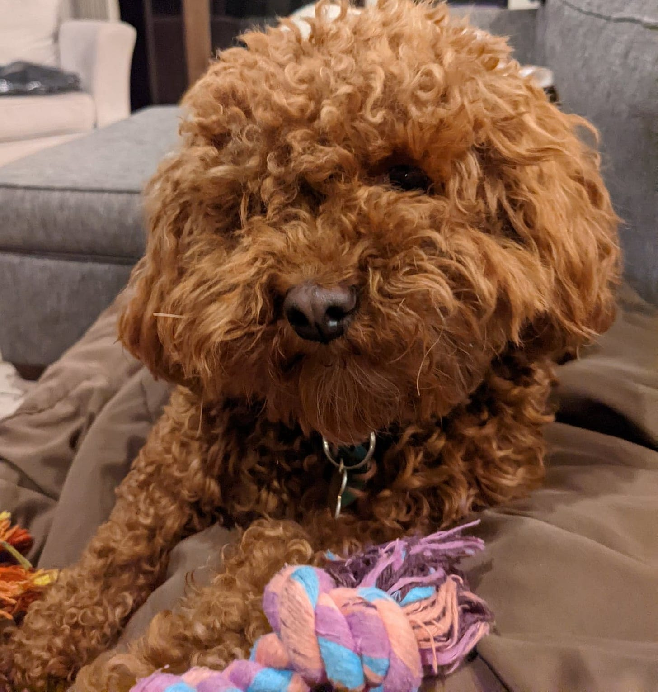
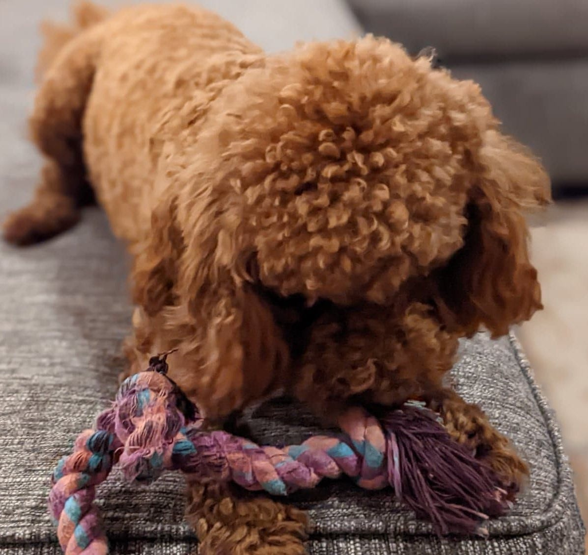

# Drop the Rope

*Stop the tug-of-war and start being constructive *

Hi, I am Wonton - tug-of-war world champion

[Subscribe now](https://debliu.substack.com/subscribe?)

Our dog, Wonton, always likes to bring me her tug of war rope and try to get me to play with her. She comes to me with the rope, puts it right in front of my hand, and then, when I try to grab it, she pulls it away. As she backs away, she gives me this taunting look with the rope just beyond my reach, and she makes this cute little growling noise. Her game is to bait me into pulling the rope so that she can pull back.

I played along with her for a long time, but this game of teasing got to be a little annoying when she wouldn't let go. When I wouldn’t grab the rope fast enough, she would shake her head really fast, whipping it around hard enough to give me rope burns and bruises. (I have to say, few things sting quite so much as a very determined dog repeatedly slapping you with a saliva-soaked rope.)

One day, I did something unusual: I didn't even reach for the rope. Wonton taunted and teased, but I held firm. I dropped the rope, and I didn’t pick it up again. Over time, she learned that she had to get someone else to play tug of war with her, something my three kids have no problems doing. In return, I stopped getting rope burn.

How many times have you worked with somebody like Wonton, who baits you into debates? Someone who tries to get you to engage? Someone who takes pleasure in getting a rise out of you? It's not that this person is malicious. It’s just that on some level, they get satisfaction from pulling you into their set of problems or concerns. When this happens, it can be tempting—almost irresistible—to engage.

My advice? ***Drop the rope.***

## **The power of non-resistance**

Whenever Wonton tries to bait me into playing with her, the power is in her hands (or, more accurately, her paws). But when I stopped going for the rope, I took the power back. Now, she no longer slaps me in the face with it to get me to play with her. I call that a win.

I remember working with a colleague who would debate me on things that I worked on and owned. It wasn't just me; he would do this to others too. It annoyed me that he would speak to me about my own product as if he understood it better than I did. Sometimes he even said things that contradicted each other, but he didn't seem to notice or care. I was constantly trying to keep up by catching things and calling them out, always pushing back against him when he was wrong. It was exhausting.

Then one day, I realized that he actually took pleasure in the back and forth, almost like it was a demonstration to the people around us. He was extremely smart, and he got energy from being provocative and contradictory.

That was when I decided to just drop the rope. When he would say something provocative, I would correct the record very briefly and then let it go. I would sit back like an observer, without feeling the need to always be “right.” I would still ask him objective questions, ones that forced him to defend his positions, but always in a neutral way. I stopped bringing emotion into it, and as a result, he could no longer bait me into a debate. I turned from a combatant to a neutral observer, allowing others to see the truth of what he said by letting him do the defending. I used to get extremely worked up during our conversations, but now I was completely calm.

When you remove the emotion from loaded interactions, you immediately take the power back. Even if someone challenges you, you’re coming from an objective place, rather than a reactive one. By making your responses neutral, you can save yourself the exhaustion of debating everything and let your work speak for itself.

## **Finding a way to let go**

You can only play tug of war if both people pull. When one person stops tugging, there’s no more game.

I noticed this early in my marriage. David and I would always fight about whose family we would spend our holidays with, and it became a never-ending cycle. The only thing I wanted was for him to admit that his parents didn't like to travel, whereas mine did. He would say we had seen my parents so many times already, so we should go visit his parents this time. I would retort that that was only because my parents made an effort to visit us.

David stubbornly refused to admit this. We played this game of tug of war for years and years. Finally, he relented and admitted that his parents didn't like coming to visit—or even traveling much at all.

The thing is, none of this mattered to our marriage. We actually have been very lucky in that we love each other's parents dearly—so much so that we traveled the world with them on elaborate vacations with both sets of parents together. We saw both our parents almost the same exact amount, no matter how much we fought about it. I could have dropped that rope at any time, but the debate itself irked me, so I kept at it for years.

How often do you fight for ages about something, only for it to change literally nothing? Sometimes it’s worth taking a step back and asking yourself, “What am I getting out of these interactions?” Often, the answer is nothing more than exasperation and irritation.

What would happen if you decided to drop the rope? How much easier would your life become?

## **Don't start the tug of war**

When the kids were small, they would often throw tantrums when they didn't get something they wanted. We would just ignore them. One day, my daughter was crying and complaining as she tried to get me to give her a cookie. I finally asked her, “If I give you the cookie, won’t you just cry more later to get another one?”

Through her tears, and even though she was only three or four years old, she responded, "Yes, I would cry more."

I replied, “Now you understand why I can't give you the cookie."

When the kids were acting up, my husband often joked, “We don't negotiate with terrorists. If they’re going to terrorize us, they’re definitely not going to get what they want.” We held firm to this. Our middle child, Bethany, really put us through the ringer on this one, testing our resolve over and over. She hated doing the dishes, and she complained about it every single night. When she cried about doing the dishes, we would stop helping her. We would just let her decide whether or not she wanted us to be a part of the process with her. If she complained about it, we let her go on, even though it was painful (and, unfortunately, there were some dish casualties as a result).

When we are, we understand that by rewarding a behavior, we get more of it. By ignoring it, we get less. So why

When playing the game means encouraging future conflict, sometimes the only way to win is to not play the game at all.

## **Managing a push-pull relationship**

I'm sure you have experienced this before, whether at home or at work: there's someone that you are constantly at odds with on a very specific issue, and it becomes a fight every day. If you find yourself in this situation, employ these simple techniques:

* Be a neutral observer rather than a combatant. Don't bring your emotions into the debate.
* Ask questions rather than engaging in debate. Let the other person do the pulling and lifting.
* If it persists, gray rock when it comes to that topic and make it off limits. Agree to disagree and move on.

The back and forth and the tug of war only exist if two people are pulling on each other. Instead, let the rope go. Return to the audience and watch the other person tug on the rope alone. Don't get drawn into a counterproductive conversation.

---

In relationships, we are sometimes the instigator and sometimes the reactor. But we also have the power to let go. Dropping the rope means not pulling back and forth, but instead coming at the problem or approaching the relationship in a more positive way. Stop pulling and start engaging.

Thank you for reading Perspectives. This post is public so feel free to share it, Wonton would like to invite you to tug of war.

[Share](https://debliu.substack.com/p/drop-the-rope?utm_source=substack&utm_medium=email&utm_content=share&action=share)