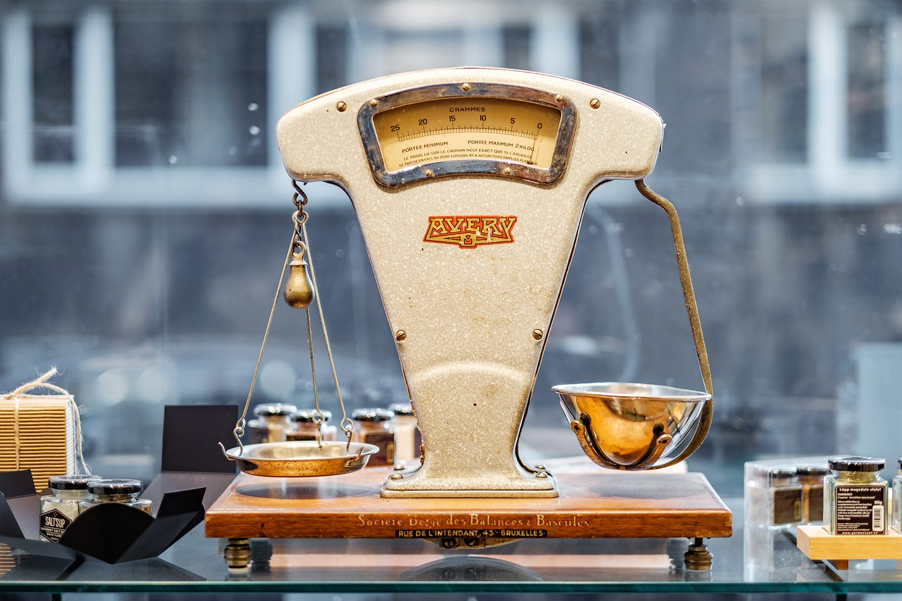

# Unfair, But Valid Feedback - The Seeming Contradiction

*The difference between unfair and invalid feedback lies in the details*

Photo by [Piret Ilver](https://unsplash.com/@saltsup?utm_source=unsplash&utm_medium=referral&utm_content=creditCopyText) on [Unsplash](https://unsplash.com/s/photos/balance?utm_source=unsplash&utm_medium=referral&utm_content=creditCopyText)

***“You are hard to relate to.”***

I lost track of how many times I heard this. It was often followed by some discussion of me being too quiet, not warm enough, or not friendly enough.I received this feedback for most of my career.

I grew up in a small town in the south in the ‘80s and ‘90s, at a time when few Asian Americans lived there. I struggled with being “the other,” and I felt alienated from the people around me. Add to that the fact that I was naturally shy, introverted, and socially awkward (see photo of me as a teen), and you can see why I got this feedback over and over. I was different from many people around me. I was uncomfortable in my surroundings, and others sensed it. I was not warm or easy to connect with.

Whenever I got this feedback, I was frustrated. Not everyone has to be warm and relatable to be competent. In fact, people tend to expect this mostly of women. It seemed unfair. But what I didn’t realize was that feedback can be unfair while also being valid.

## **How can feedback be both unfair and valid?**

I think we’ve all been in this position: we receive feedback that feels completely unfair, especially for women or underrepresented minorities. One study revealed that for women to be seen as leaders, they must be competent and warm, while men only have to be seen as competent. I was repeatedly told that I lacked warmth, when a man would rarely hear this feedback.

The criticism was unfair. Here’s the thing, though: it wasn’t wrong, either. It was absolutely true that others experienced me as aloof and distant, and that made me harder to connect with. This had tangible effects on my work relationships. Therefore, the feedback was valid.

Sounds like a contradiction, doesn't it? How do we navigate this conflict?

First, we need to understand the difference between **validity** and **fairness.** Fairness is objective: would someone else in the same situation receive the same feedback? Validity, on the other hand, is subjective. It’s about how other people experience you.

Our natural inclination is to say that when feedback is unfair, it is automatically invalid, and therefore not worth listening to. This is the path I took for many years. If someone gave me feedback that I felt was unfair, I would choose not to listen to it. I would assume they were wrong, ignore it, and move on. Then, one day, my manager told me that people had a hard time trusting me. It was a blow, but I had worked with this manager for some time. I knew he had my best interests at heart, and that if he was giving me feedback, it was probably valid and worth listening to. That was when it hit me: if his feedback was right, then perhaps everyone else’s was too.

People experienced me as lacking warmth. Even though this might not have been a problem for a man, that didn’t make it any less of a problem for me. It was unfair, but I still had to address it.

## **What do you do when you get feedback that’s valid but unfair?**

When you receive criticism that seems unfair, you have three options:

* Ignore the feedback
* Question the feedback
* React to the feedback

I've done all three of these over the years. Here are the results.

**Ignoring the feedback** worked for a long time, until I realized I was missing something important: when people told me I came across as aloof, they were sharing their **perceptions** of me. I've written before about [intent, behavior and perception](https://debliu.substack.com/p/tough-love-how-hard-feedback-changed). Although my **intent** (focus on building the product) was positive, my **behavior** (single-minded focus on outcomes) led to a mistaken **perception** (that I lacked warmth and was hard to connect with). Because I knew my intent and didn’t question my own behavior, I automatically disregarded other people’s perceptions, and as a result, I was damaging my relationships.

Only take this path if you can confirm that the feedback you’re getting is both unfair and invalid.Don’t assume this is the case at the start, or you may be discarding an important piece of data that you can use to improve your interactions.

**Questioning the feedback** is a path I’ve taken several times as well. When you question feedback, you don’t automatically discard it, but you take it with a grain of salt. One day, a colleague gave me written feedback that included that I was gossipy. I didn't understand what that meant, so I struggled with it since no one had ever said it before. I sat on it for a while before I finally asked him for an example. What he said surprised me.

He shared that I was extremely casual when I opened meetings, and that I was letting there be too much talking before we started. That was what he classified as gossipy. I was surprised, because I didn't realize he had a negative perception of that behavior. I asked him, "Do you think I actually gossip? Would you still use that word to describe my actions if I were a man?” He answered no to both questions, and then offered to correct the feedback to better reflect his insight.

My colleague's feedback was **both valid and unfair,** but the language was a barrier to understanding his point of view. By questioning the feedback, I got the data I actually needed. I adjusted meeting openings to be shorter and got to business faster.

**Reacting to feedback** is your other option. I say “react to,” because a reaction isn't always a complete change. Instead, it’s examining the behavior that causes people to think of you a certain way. Your intent will probably remain the same, and changing their perception of you can be a challenge. That’s why you have to look at your behavior, which lies between their perception and your intent.

In the previous example, I reacted to my colleague’s feedback by making small adjustments, without completely changing the way I ran meetings. I still think it’s important to connect with people before meetings start, but I have shortened that period to soften the perception that I wasn’t being efficient enough.

Remember, how you react to feedback is a choice, and the power is in your hands. You can make small changes, like I did, and then ask for additional feedback. You might also approach the person and share your intent.

When you react, you’re making a proactive choice. By problem-solving your behavior, you can shift someone’s perception while staying true to your original intention.

## **What to do when someone else gets unfair but valid feedback**

Sometimes you hear feedback for other people that seems unfair. In these cases, it may feel like there’s nothing you can do, but that’s not true. Being a good ally means standing up for those who aren't in the room. It also means holding others accountable for the feedback they give.

One day, we were doing a debrief on a candidate. One of the senior product managers said, “I don’t think we should hire her because she's bossy." I was taken aback, so I called him out on it. I also happened to know that he was an incredible ally to his women colleagues. I pointed out that he would never say the same thing about a man, and I asked him to explain why he thought she was bossy. He explained that the candidate was not listening when he was speaking, and that she wasn’t responding to his questions. A couple of others noticed a similar pattern, so we ended up not hiring her. When I challenged the feedback in the room, everyone saw that it was both unfair and valid. But by listening to his explanation, we were able to get to the root of the problem, which helped us better assess the candidate.

If you hear feedback directed at another person or group that seems unfair on the surface, call it out. Ask for an explanation. By reducing the [strategic ambiguity](https://debliu.substack.com/p/stop-practicing-strategic-ambiguity), you are actually bringing more clarity to the situation. You are making it known that it’s not okay to refer to a woman candidate as bossy, but you’re *also* affirming that the feedback may be valid if there’s data to support it. This makes the conversation much more valuable to everybody around.

## **Delivering unfair but valid feedback**

You may notice that I tried very hard in this article to not negatively judge those who offer unfair but valid feedback. They are sharing it because it is valid to them. Just because it's unfair doesn't mean they are wrong. If you are ever the person giving this kind of feedback, don’t hold back. Instead, start by acknowledging, "This may be unfair, but…"

I have received peer feedback for those on my team that fell into this category. I could have held it back from them because it was unfair. The thing is, I knew why people were saying these things. In one case, someone on my team was considered unfriendly and hard to connect with. Sound familiar? While I was close to this person, other people struggled to build a relationship with her, something I had coached her on. Even an external speaker I brought in to work with my team noticed this after meeting her and pointed it out to me.

I knew that most men wouldn’t get this criticism. In fact, off the top of my head, I can think of half a dozen different women on my teams who have received similar feedback, and not a single man, even though our teams skewed heavily male. But at the same time, I could see how frustrating it was to struggle to connect with someone who seemed distant. The feedback was unfair, but it would have also been unfair *not* to share it with them. My solution was to share it with the caveat that I felt it was unfair but valid. Returning to the person above, this allowed her to hear the feedback while defusing some of the possible frustration. And in the end, it improved how she approached relationships.

---

No matter what feedback you receive, take a step back and assess it before you take action. Understand the impact of the criticism, and then decide what you're going to do. Remember, while feedback may be unfair, it may also point to a real truth. The same goes if you hear unfair feedback toward others. Take a moment to call it out, but make sure to share it appropriately so they can take action as they wish.

I wish we lived in a world without the biases that lead to this kind of feedback, but that is not the reality. Until we get there, we have to support each other within the boundaries of other people’s perceptions. Sometimes that means listening to feedback that other people might not get in the same situation. This feedback can also be valid. In fact, it may even lead to positive change.

Perspectives is a reader-supported publication. To receive new posts and support my work, consider becoming a free or paid subscriber.

[Share Perspectives](https://debliu.substack.com/?utm_source=substack&utm_medium=email&utm_content=share&action=share)