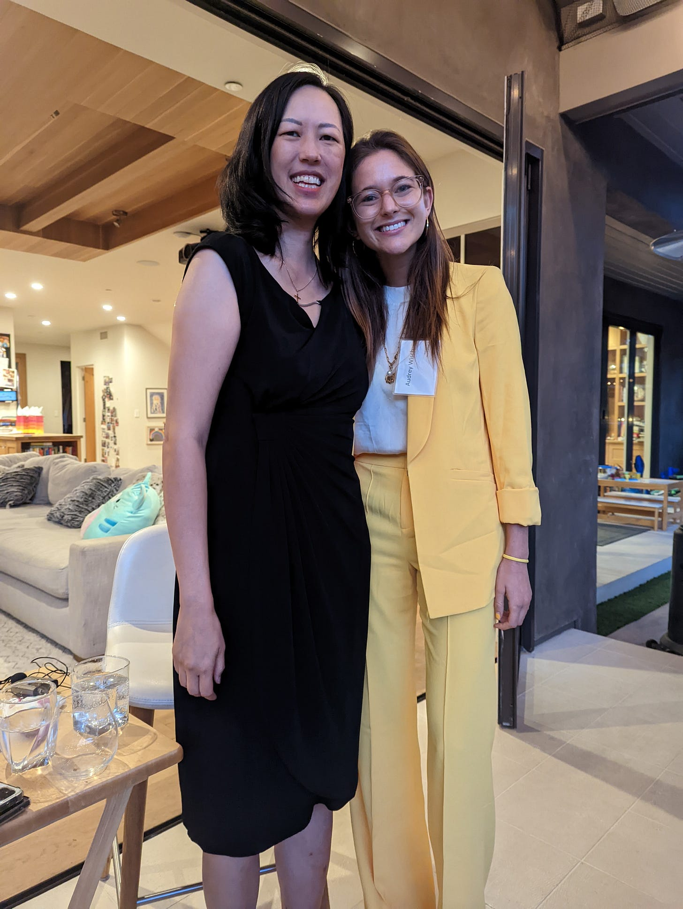
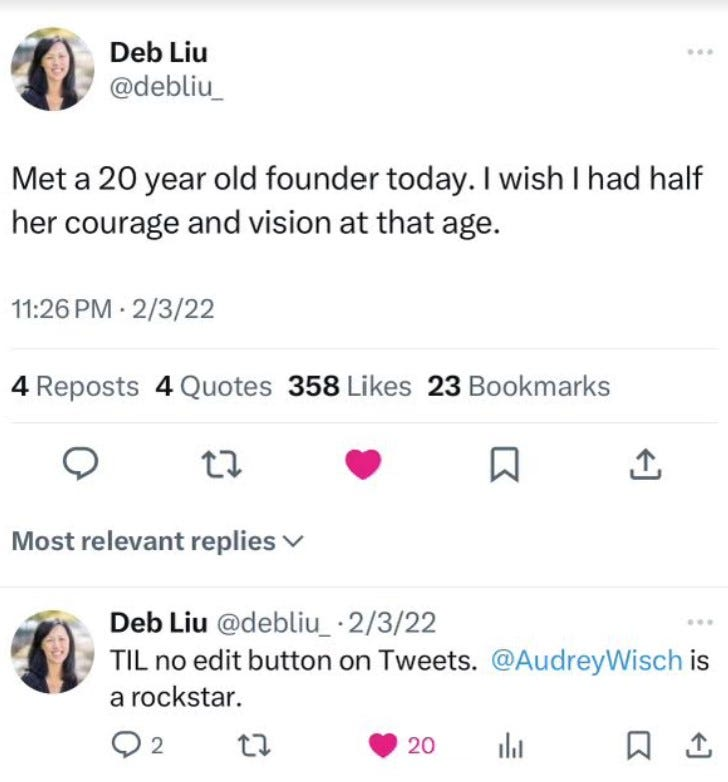
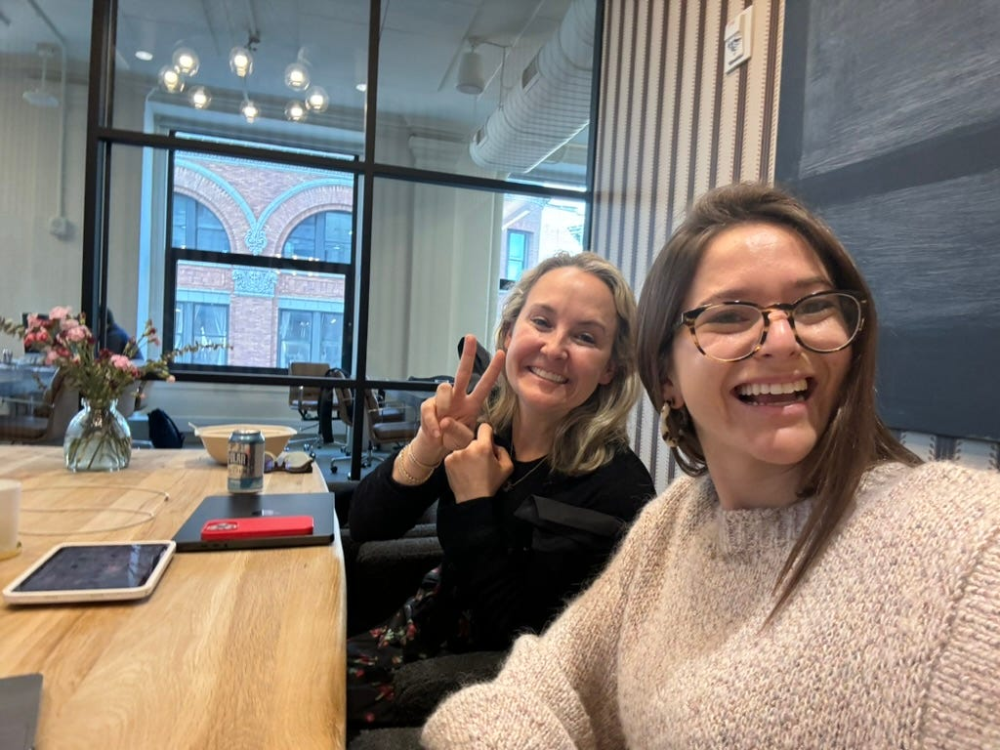

# The Power of Mentorship

*Lessons from my founder journey*

**Note from Deb:** I met Audrey through an introduction by a mutual friend. She was so impressive during that first meeting that I eventually became her mentor and a tiny seed investor in her startup, [Curious Cardinals](https://www.curiouscardinals.com/?utm_source=debliuperspectives&utm_medium=email&utm_campaign=debliuperspectives), which matches kids ages eight to eighteen with university-age mentors. (We are also a Curious Cardinals family.) Audrey asked me recently to post a video about a mentor who changed my life. In turn, I asked her to share her thoughts on mentorship from the perspective of a founder who started her company at 20 and never really had a manager or formal reporting structure. I loved her take, and I am happy to share it with you here.

---

**Hot take: My least favorite part about being a founder is not having a manager.**

I know, I know. People grouse about their managers all the time. They complain about being micromanaged or not receiving clear direction. They feel like their managers don’t understand them. But, as [Deb writes](https://debliu.substack.com/p/what-ive-learned-from-my-best-managers?utm_source=publication-search), a great manager can be transformative.

I've never had a manager. I started [Curious Cardinals](https://www.curiouscardinals.com/?utm_source=debliuperspectives&utm_medium=email&utm_campaign=debliuperspectives) when I was a student at Stanford, and I have been the leader of the company ever since.

**Why do I long for a manager?**

1. **I crave feedback.** I am a type-A student. I want to know what I am doing right or wrong. As a founder, I miss having the guidance and support to help me improve.
2. **I need help pruning.** I have a gazillion ideas. Each week I set a "thesis" and three core goals laddering up to it to help me hone my focus, but it would be nice to have a manager to brainstorm and prioritize with.

While not all managers are great, the best managers facilitate growth. They offer a structure for learning and accountability. But even though I can’t just “get” a manager, I’ve realized something: Mentorship is a proxy for what I seek from a manager.

Mentorship, often misunderstood, is a potent catalyst for personal and career growth. You may not be a founder, but at times in your life, you will still need mentors who can not only guide you through difficult situations and decisions, but help you discover the best version of yourself.

The key to unlocking the power of mentorship lies in understanding how to find and nurture these relationships. Truly game-changing mentors don't come easily—they require hustle, buy-in, dedication, and gratitude. In this piece, I aim to empower you to find mentors who can supercharge your trajectory—whether you have a traditional manager or not.

[Subscribe now](https://debliu.substack.com/subscribe?)

## **Finding mentors**

I mentioned to our lead investor that it would be meaningful for me to have a female founder/CEO mentor I could turn to and learn from. [Nakul Mandan](https://www.linkedin.com/in/nakulmandan), the managing partner at [Audacious Ventures](https://www.audacious.co/), introduced me to Deb, who with her husband is one of his LPs.

I was able to get 15 minutes on Deb’s calendar. Those 15 minutes turned into 30, and then 45. [She ripped into me, laying out everything that was wrong with our business.](https://www.linkedin.com/posts/audrey-wisch_mentorship-candorwithcare-feedback-activity-7126025471842009088-BXbI?utm_source=share&utm_medium=member_desktop)

I followed up, unsure if she liked me or not (and very nervous that she didn’t). She ended up tweeting about me and our encounter.

One week later, I asked Deb to be my mentor. My co-founder, Alec, and I have had regular conversations with her for the past couple of years since. It has been an invaluable relationship. We share our thinking, and she pushes us to think differently. Her perspective comes with a level of experience and objectivity that we don’t have, given how close we are to the problems.

My second mentor is [Alexa Von Tobel](https://www.linkedin.com/in/alexavontobel/). She formerly founded and sold LearnVest, and now she’s the founder/CEO of [Inspired Capital](https://www.inspiredcapital.com/). I was introduced to Alexa by two other Curious Cardinals parents. At the end of our first call, she said to me, “You remind me of my younger self. I will mentor you.”

Just like Deb, Alexa is ruthless with me. She is unconditionally honest. She tells me everything that isn’t working and isn’t afraid to ask me tough questions. If I don’t know the answer or lack certain data on our business, she’ll tell me, “You’re CEO. That’s unacceptable. You must know that.”

Both Alexa and Deb push me because they believe in me. This is what a great mentor can do for you, but it all hinges on finding the right fit. Mentorship is about finding someone you can see yourself learning from long-term. Deb saw something in me that led her to spend time with me. So did Alexa. Rarely do you find someone with whom you click like we did, so invest the time and effort to get to know a potential mentor before you ask for more of their time.

[Leave a comment](https://debliu.substack.com/p/the-power-of-mentorship/comments)

## **The secret to successful mentorship**

Mentorship isn't a free ride. It's a two-way street paved with mutual effort. Even after years of building strong bonds, I'm still in the ring, fighting for these relationships. They're the crown jewels of my professional life, second only to my partnership with my co-founder.

Deb and Alexa could do anything with their time and energy. They choose to spend it with me. I want to do everything I can to nurture those relationships.

Here are some unspoken rules for ensuring your mentor remains engaged:

* **Close the loop:** After every meeting or informal call, I send an email summarizing our key takeaways. This simple gesture shows I value their input and actively process our discussions. I don’t always agree with everything they tell me, but I make a point to show that I listened and considered their advice.
* **Learn to ask:** With Alexa, persistence is key. Sometimes, I need to reach out multiple times before getting a reply. This isn't pestering, but showing dedication to our relationship.
* **Offer reciprocal value:** Both of my mentors are also customers of Curious Cardinals. They get to experience our product firsthand, provide feedback, and know I'm invested in helping their kids.
* **Support them back:** As a mentee, I want to show that I care what my mentors care about. I gift Alexa’s book on financial literacy, *[Rebel Girls Money Matters](https://amzn.to/3XuiGe4)*, to the young girls in my life. I forward Deb’s newsletter to people I think would benefit from it. I want to show I am leaning into the relationship.

If you want a world-class mentor in your corner, you have to step up to the plate. Their time is precious, a finite resource torn between work, family, and you. So make it count. Show up, give back, and radiate gratitude.

## **How to identify the right mentor**

So, how do you identify the right mentor for you? First, you need to define your needs. Before you start having mentorship conversations, reflect on:

1. **Identity:** Consider aspects of your identity that are important to you personally or professionally. Is there a personal characteristic that deeply defines your experience? As a female founder, having a woman leader as a mentor was important to me.
2. **Professional goals:** Think about where you want to be in five to ten years. Look for mentors who have experience in areas you want to grow into and can help you get there.
3. **Relationship structure:** Determine what kind of mentorship you need. Do you want regular, structured meetings, or more casual, as-needed guidance?
4. **Mentorship style:** Reflect on past positive learning experiences. What qualities made those individuals effective teachers? Seek those traits in potential mentors.
5. **Current needs:** Assess your existing support network and identify gaps that a mentor could fill. Keep in mind that what you need from a mentor will evolve as you grow in your career.

I started Curious Cardinals as a “pandemic passion project.” The idea emerged from my experience tutoring students, where I saw firsthand how student disengagement was at an all-time high. Simultaneously, I saw my college peers eager to make a meaningful impact while earning extra income. The solution seemed clear: Bridge these two groups through mentorship.

But something incredible happened. As we matched students with mentors, I witnessed something far more powerful than tutoring. By emphasizing personalized matches and true mentorship, we transformed otherwise transactional relationships into inspiring connections, rekindling students' passion for learning and boosting their confidence.

The pandemic highlighted a pre-existing flaw in K-12 education: widespread student disengagement. Recognizing this as a long-term issue, we envisioned a solution that would outlast the crisis. Our goal became clear: to transform K-12 education through technology-enhanced personalized mentorship. Committed to this vision, my co-founder and I took a leave from Stanford to fully dedicate ourselves to building Curious Cardinals.

We're not just addressing a temporary need but reimagining how students learn and grow. We hope that someday the Curious Cardinals mentorship model will be woven into the fabric of education worldwide. We believe that seeing what you can be and learning from someone you admire is priceless.

[Share Perspectives](https://debliu.substack.com/?utm_source=substack&utm_medium=email&utm_content=share&action=share)

## **I Challenge You**

While I use a lot of tools for self-improvement, nothing beats a mentor’s guidance. Their hard-earned wisdom, forged through successes and failures, offers insights no app or book can match. Mentors illuminate what they wish they'd known and push you further, fueled by their belief in your potential. Mentorship is not just a nice-to-have; it's a career-defining asset that can propel you further than you can believe. But as we've seen, finding and nurturing these relationships isn't a passive process. It requires hustle, genuine commitment, and a willingness to be pushed beyond your comfort zone.

The best mentors aren't found through casual networking or LinkedIn connections. They're individuals who see your potential and choose to invest their time and wisdom in you. In return, they expect to see their guidance translate into tangible growth and success.

Whether you're a founder navigating uncharted waters or a student plotting your future course, the right mentor can illuminate paths you never knew existed. They're not just signposts pointing the way—they're catalysts pushing you to heights you might never have dared to reach on your own.

I started Curious Cardinals because I believe in the power of mentorship to change the trajectory of your life. Since then, I’ve witnessed the transformative power of mentorship for thousands of students. We're committed to making these life-changing connections accessible to all.

Whether through our platform or your own networks, remember: the right mentorship relationship could be the key that unlocks your full potential. So, armed with the insights from this piece, I challenge you: Don't wait for mentorship to find you. Seek it out. Commit to it. Nurture it. Show your gratitude through your growth and success. The mentor who will supercharge your trajectory is out there. It's up to you to take the first step.

---

**Note from Deb:** My three kids all had [Curious Cardinals](https://www.curiouscardinals.com/?utm_source=debliuperspectives&utm_medium=email&utm_campaign=debliuperspectives) mentors over the years, and they have grown from those relationships. If you are interested in learning more, [here is a link to their site](https://www.curiouscardinals.com/?utm_source=debliuperspectives&utm_medium=email&utm_campaign=debliuperspectives). Tell them you read about them on this blog, and they can offer your kids a free mentor session.