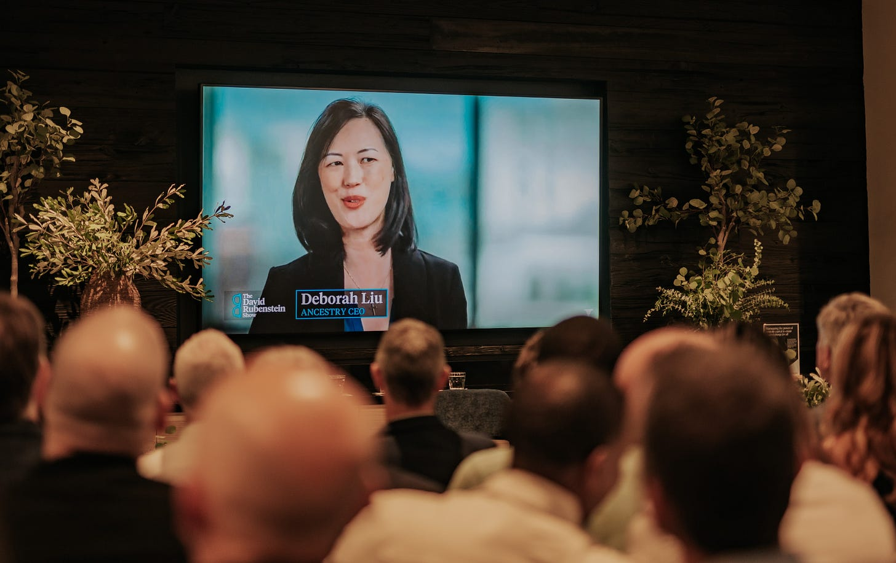

# The Power of Your Voice

*How what you say (and how you say it) determines what people think of you *

Think about your last company town hall or Q&A. Who spoke? Did it feel staged or natural? Were the people speaking persuasive and engaging, or distant and clinical?

We judge the leadership at our companies on their ability to communicate ideas—not necessarily the ideas themselves, or their ability to execute them. We pick our presidents based on [how they look on stage](https://debliu.substack.com/p/the-hidden-message-youre-communicating) when speaking against an opponent. Or how they answer questions from the press. Or how they sound when asked a question spontaneously.

People who listened to [the 1960 Nixon-Kennedy debate](https://www.history.com/topics/us-presidents/kennedy-nixon-debates#maybe-it-s-lazy-shave) on the radio felt that Nixon was the clear winner. On the other hand, those who watched it on television felt that Kennedy had obviously won. This dichotomy had to do with audio versus visual processing. Kennedy looked like people felt a president should. Nixon looked unshaven, slightly sweaty, and a little rough—but apparently, he sounded presidential to those who didn't have a television nearby.

We like to think this rule doesn’t apply to the workplace, but it absolutely does. How much of being successful in your job is actually about execution and strategy, and how much of it is just… talking about it? It's an uncomfortable topic, but like it or not, it’s the truth. Often, *how* we communicate is just as important as *what* we’re communicating.

[Subscribe now](https://debliu.substack.com/subscribe?)

## **The dirty secret within organizations**

I once worked with somebody who was an incredible product leader. She was smart, strategic, and able to execute any plan. People who worked with her loved her… but she was a mystery to everybody else. As a natural introvert, she rarely spoke to people outside of our organization. While she was friendly and polite, she rarely sought out relationships beyond the borders of her job. I had been her friend and manager for so long that I didn't see these gaps. When it came time for promotions or opportunities, I would bring up her name, and people would react in a strange way. It took me a long time to realize that they just didn't feel like they ever saw much of her. They had no visibility into her work. And as her manager, I ended up having to use a lot more of my influence to get her support.

I had another person on my team at the same time who was gregarious and outgoing. He was everyone's friend, and people universally believed he was exceptionally talented. Yes, he was very good at his job, but not objectively better than the woman leader on our team. While his relationships appeared stronger from the outside, she had better relationships with the cross-functional team. Even still, the natural inclination was to assume that he was better at everything because of his exceptional communication skills.

If you’ve worked in large organizations, you’ve probably seen something similar happen. Maybe you’ve even been on the receiving end, where you do excellent work that gets downplayed or overlooked because you’re not extroverted enough. It feels like you have to work twice as hard for your contributions to be noticed—and at many companies, that’s exactly the case.

## **The reality and what to do about it**

I am a political junkie. I like to follow politics and understand the ins and outs of our political system, so I watch many of the speeches at the two political conventions with interest. I then listen to the commentary and analysis the next day.

It’s always so interesting how people judge the elected officials and leaders who go on stage. This past election season, what struck me was that those who were relatable and connected with the audience were given a lot more leeway on what they said. Even if they misspoke or were somewhat incorrect, the ones who spoke with the most authenticity, charisma, and connection were praised the most (and judged less harshly for their missteps).

We look for ways to find commonality with others. We want to hear their stories. We want our leaders to be relatable and charismatic. As a result, we tend to subconsciously favor people who are open books. The more easily we feel we can relate to someone, the more we trust them to make decisions. (I even wrote [a whole article about this hidden bias](https://debliu.substack.com/p/the-bias-no-one-talks-about) a few years back, and it’s as true today as it was then.)

[Share](https://debliu.substack.com/p/the-power-of-your-voice?utm_source=substack&utm_medium=email&utm_content=share&action=share)

## **Introverts unite**

So what does this mean for those who can’t speak on a dime? Put simply, we are at a disadvantage.

When I was in middle school, I made a speech that was so bad that my teacher pulled me aside and told me I needed to take speaking classes. While I did an excellent job on display boards and props about China, I couldn't convey that information nearly as well. My speech was, frankly, boring and uninspiring. I was lost in a torrent of words.

Though I continue to be extremely introverted, I took speech and debate in high school. I turned out to be a pretty good competitor in original oratory and extemporaneous speaking with little to no preparation. Little did I know that I would use these same skills to this day.

Last week, I did an event called “Iron Sharpens Iron” with Next Legacy. I was honored to be asked by my friend, Ryan Nece, to be on a panel with Lance Armstrong. As I said at the event, the packed audience was there to hear him; I was just the opening act. I just wanted to sound good enough that people would want to buy my CD (or, as they say nowadays, stream my songs on Spotify).

There was a time when I would have been very intimidated by speaking at an event like this, but now I'm comfortable enough in my skin to be able to answer challenging questions on the fly. And if I can do it, then so can you. Here’s how:

* **Just say it.** We're often reluctant to say the wrong thing, but what if I told you that not saying anything is just as risky? Putting yourself out there may be hard, but not showing up has different—and often even greater—consequences.
* **Treat speaking as a skill.** I was listening to two people who worked with President Obama for his first debate with Mitt Romney. [He didn't do the work to prepare, winged it instead, and lost the debate](https://www.cnn.com/2016/09/25/politics/obama-debate-election-2012/index.html)—but he came back strong by putting in the prep for the next one. The moral of the story? Speaking and debating are skills, and you can improve your performance by preparing.
* **Practice makes comfort.** There was a time when you could never have caught me dead speaking on a stage. I remember how every year before I got on stage for F8 to speak to thousands of people, I would say to the guy behind the curtain, “I'm going to pass out.” But guess what? It got easier each time. Now I can do events like Iron Sharpens Iron without missing a beat.
* **Engage and persuade.** We tend to overthink and get too deep in our own heads. As a result, we're very conservative about what we're willing to say or put ourselves out there for. But if you focus on what the other person is looking for from you, you will find yourself in a much different place in your communication. When you're looking to engage and persuade, not just make your point, this takes you out of your own head and puts you back into the mix with others.

Remember, you don’t have to be the world’s best public speaker to make your voice heard. Start taking small steps, and it will get easier each time. Our bias toward communicators can make being an introvert hard, but it doesn’t have to be impossible.

---

Our expectations of leaders center around their ability to communicate. We elevate those who can speak and convince. Ninety minutes on a television stage can swing elections and change the course of history.

Communication isn't nearly as high-stakes for most of us in our day-to-day, but when you think about your strategy to have influence, you need to be intentional about your communication. Yes, it’s important to hear others’ perspectives, but the people you work with are looking to you to share your point of view as well.

Seek to connect and engage with those around you. You’ll find that the power of your voice is so much greater than you could have imagined.

[Share](https://debliu.substack.com/p/the-power-of-your-voice?utm_source=substack&utm_medium=email&utm_content=share&action=share)