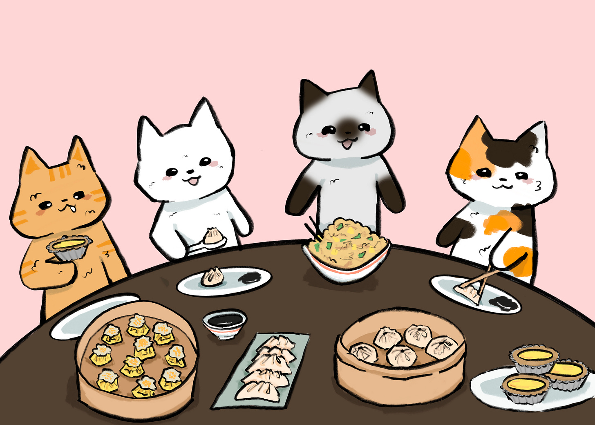
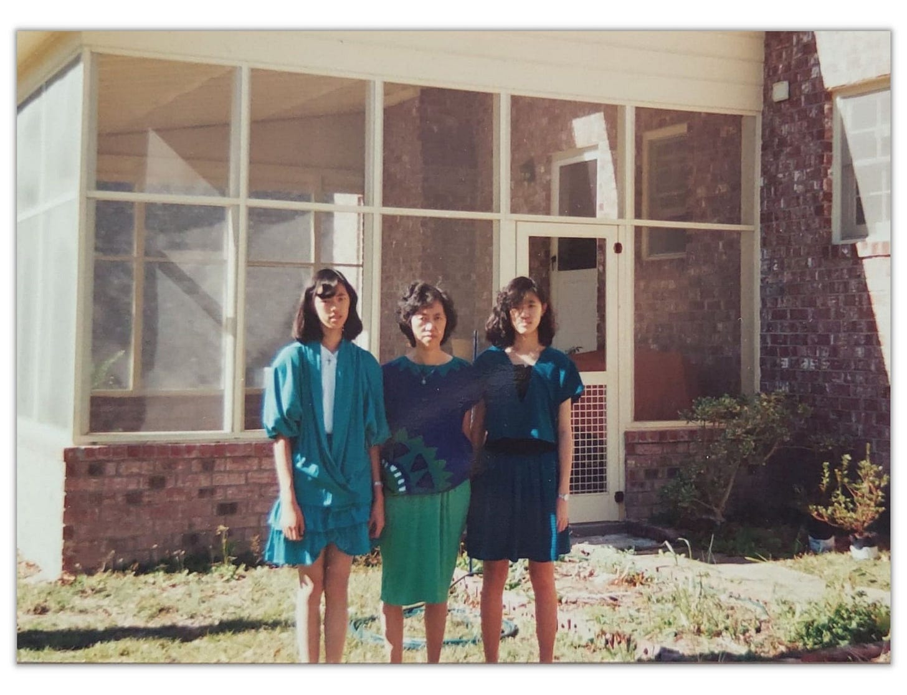
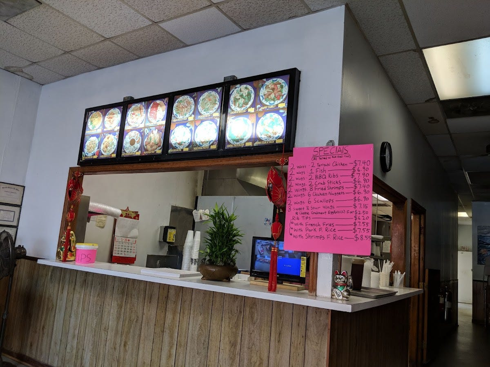
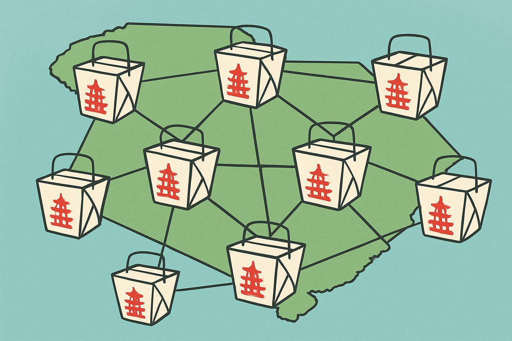

# Community, Resilience, and the Story of Chinese Restaurants in America

*When you sit down at a Chinese restaurant, you’re experiencing something more*

A couple of years ago, I met an admissions officer for a top 20 school who said something that has stayed with me ever since. For years, when he saw a college application where a student listed restaurant work at a Chinese place, he dismissed it. “Every Chinese kid did it,” he was told. It was considered cliché, not worthy of being weighed in the application process.

Then an Asian American colleague explained the history. He came to see that restaurant work wasn’t just another after-school job for Chinese American kids. It was part of a much bigger story: one that tied to immigration, survival, and community.

I lived that reality in my first job.

My sister found this unfortunate photo from the first job era.

### **My First Job**

I grew up in a small town in South Carolina, a state where Asians were less than 1% of the population.

[I was a teenager when my mom got me a job at the restaurant where she worked](https://debliu.substack.com/p/what-was-the-first-job-you-ever-had). Today, you might call it fast casual, but at the time, it was simply a made-to-order $3.95 daily special lunch place tucked into a strip mall behind a gas station. Thirty-five years later, it’s still there.

The restaurant we worked in. Not much has changed, even after three decades.

Working there taught me so much. I cleaned toilets, vacuumed, swept floors, and hauled out massive bags of garbage. I learned to run the fryer, brewed mediocre coffee, and made twenty gallons of incredible Chinese iced tea each morning. I dipped sweet-and-sour chicken, wrapped egg rolls, and cooked hot and sour soup to order.

It was exhausting and often thankless, but it was also one of the most formative jobs I ever had. At the end of a shift, I went home knowing how hard it was to work for minimum wage in a fast-food restaurant and how much human labor was worth.

My mom, who had a college education, struggled to find work in our small town that gave her the flexibility to be home in the evenings. So she drove the school bus and worked in restaurants to supplement my father’s government engineering job. We were far from alone. Many of the Chinese families we knew relied on restaurants to make ends meet, either as owners or staff.

Some were like my parents, immigrants who had come to the States for college. Others were recent arrivals with limited English and few resources. The restaurant community was a bridge into America.

[Leave a comment](https://debliu.substack.com/p/community-resilience-and-the-story/comments)

### **How Laws Shape Communities**

The history of Chinese restaurants runs deep in America. In the mid-1800s, Chinese immigrants first came to work on railroads and in mines, settling mostly in the West. They were seen as “other,” useful as hired laborers but never fully accepted. As the political climate shifted, anti-Chinese laws followed, culminating in the Chinese Exclusion Act of 1882.

The Act barred immigration from China completely and prohibited current residents from becoming citizens. It was intended as a temporary 10-year measure, but it wasn’t repealed until 1943. Immigration from China didn’t fully reopen until 1965.

[But there was one loophole: Chinese restaurants.](https://www.npr.org/sections/thesalt/2016/02/22/467113401/lo-mein-loophole-how-u-s-immigration-law-fueled-a-chinese-restaurant-boom)

In 1915, U.S. law allowed Chinese-owned restaurants to recruit workers from China. It became one of the few industries where Chinese immigrants could legally work and even bring family members over. Groups of workers often banded together to open a restaurant, each “running” it on paper so they could bring family over.

What began as a survival strategy turned into a path. By the early 20th century, these so-called “chop suey houses” had popped up across America. The food wasn’t exactly what families ate in China. It was adapted to local ingredients and American palates. These restaurants flourished, first serving Chinese communities, then expanding to the wider public.

These places became community anchors. They created jobs, supported families, and provided the next generation with funding for college. From there, the next generation went on to become engineers, doctors, and professionals.

[Share](https://debliu.substack.com/p/community-resilience-and-the-story?utm_source=substack&utm_medium=email&utm_content=share&action=share)

### **The Hidden Community**

When I worked in that tiny restaurant, it had already been more than a century since the Exclusion Act was passed, but I witnessed how restaurant culture still shaped lives.

The Chinese restaurant community in my hometown was small, but everyone knew each other. And here’s what struck me: They helped one another.

When one restaurant owner was hospitalized, others sent over staff to cover extra shifts. When a shipment of takeout containers was delayed, a neighbor sent over boxes of their own. Owners loaned each other money or helped finance new restaurants. They shared workers, recipes, and business secrets.

A successful restaurant wasn’t the finish line. One family would stabilize their business, then help a cousin, a friend, or a former employee open their own place.

To the outside world, Chinese restaurants might have looked like small, isolated businesses. Inside, they were part of an invisible network of mutual support. It was a collective survival strategy in our town, just as it was in the early 1900s.

[Subscribe now](https://debliu.substack.com/subscribe?)

### **What I Learned**

**Hard work and compensation aren’t always correlated**During the pandemic, frontline workers were suddenly called “essential,” but many were still the lowest paid, with the least job security. At our restaurant, our chefs earned low wages, but they were skilled enough to make 400 made-to-order lunches each in under ten minutes. The amount of skill required was enormous, but the rewards were slim.

**Community keeps everyone afloat**Restaurants didn’t compete; they collaborated. The owners and workers formed an ecosystem that made sure no one was left behind. They rallied when someone fell ill. They funded new ventures. They lent supplies and labor without keeping score. It was a community built on resilience and trust.

**Survival depended on each other**Some families, like mine, came through college. Others were refugees or recent immigrants who barely spoke English. Yet in the restaurant community, those differences blurred. They worked side by side, sharing resources and supporting one another, because survival demanded it.

---

Even today, Chinese restaurants remain a story of resilience. Families work long hours, often with children doing homework in the back booth. As a teen, I tutored two kids whose father was a chef I worked alongside. He spoke no English, yet his children went on to college and built their own American Dream.

That’s why dismissing restaurant work on a college application misses the point. What might look like a cliché on paper is, in reality, a story of survival, sacrifice, and community. It created a path that lifted entire generations.

I grew up in that Chinese restaurant community, and it taught me the value of collaboration and connection. When you sit down at a Chinese restaurant, you’re experiencing more than a meal. You’re sharing in the legacy of a community that overcame exclusion, built belonging, and created something lasting in their chosen home.

[Subscribe now](https://debliu.substack.com/subscribe?)