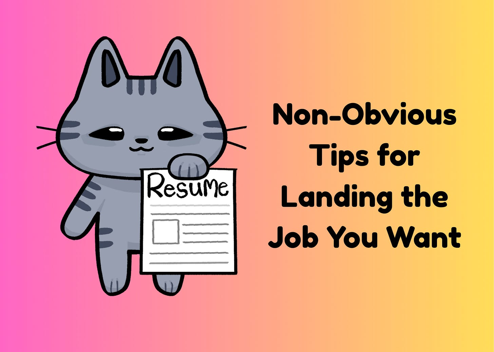

# Non-Obvious Tips for Landing the Job You Want

*Hidden strategies to give you an edge in a grueling process*

The CEO of a company I advise recently posted a job for a Product Manager. Within a few days, hundreds of applications poured in. By the time he made an offer, nearly 950 people had applied for one role at a company of only three dozen employees. ***[Update: Turns out the final number was 1,814!]***

When you hit “submit” on a job application, it’s easy to imagine someone carefully reading every resume. But that isn’t always the case. Many companies use tools to filter applications before a human even looks at them. Others scan the first wave of resumes, invite a handful of candidates to interviews, and never get back to the rest.

Having been a hiring manager, led product recruiting at Meta, and sat in the trenches screening resumes, I’ve seen how daunting it is for candidates. Here are some non-obvious ways to stand out:

### **1. Never rely only on online submission**

Easy application tools create a many-to-many problem. Every job post attracts hundreds of resumes, many of which go unnoticed. At Ancestry, our summer internship program drew tens of thousands of applications for just a few dozen spots. One year at Meta, the RPM program hired one person from the general resume pool. The rest were referrals or sourced by our recruiters. Blind submission via an online tool is rarely your friend. Find another path in, whether that’s a referral, a connection, or a direct reach-out to make sure you get noticed. The goal is to keep your resume out of the digital dustbin and into someone’s hands for true consideration.

### **2. Ask for advice, not a job**

There’s a Silicon Valley saying: “If you want money, ask for advice. If you want advice, ask for money.” The same is true for jobs. Reach out sincerely for guidance on how to break into a field or company. Share what you’re exploring and invite them to brainstorm with you. People are more generous than you think, and even if they don’t have a role for you, they may point you to new sources of opportunities you didn’t know existed.

Not everyone will have the immediate answer, but if you tell people what you want, they can keep an eye out for you. I referred several friends for a role, but none of them worked out due to timing or fit. Then another friend reached out and told me he was open to new opportunities, so I put his name in. He got the job! I would have put his name in on the first go-round had I known he was looking.

[Share](https://debliu.substack.com/p/non-obvious-tips-for-landing-the?utm_source=substack&utm_medium=email&utm_content=share&action=share)

### **3. Give them a reason to say yes**

When I was early in my career, I worked at a consulting firm. Part of our jobs as associates was to spend days sorting through stacks of incoming resumes. Out of hundreds we each got, I could only push forward a dozen. The process was about finding reasons to say no. I flagged misspellings, lack of experience, poor grammar, or weak GPAs. The resumes that caught my eye were ones that gave me something to connect with. Hiring managers are human. They notice alma maters, hobbies, or passions they share. Add those touchpoints as a way to [hack affinity bias](https://debliu.substack.com/p/an-open-secret-i-wish-we-could-talk). Don’t just show your hard skills, give them common ground to see themselves spending time with you bonding over something you both care about.

### **4. Find the “you-shaped hole”**

Instead of applying indiscriminately, look for places where your skills uniquely fit. A PM I knew had once been a buyer for SaaS software. When she applied to a company building SaaS tools, she highlighted her insider knowledge of purchasing and client needs. She showed she could hit the ground running on day one. That brought her to the top of the list for consideration.

You have unique skills that are suited for specific roles. Make sure that the hiring manager sees that you are the best bet because of your experience, knowledge, or passion for the work.

### **5. See the world through the hiring manager’s eyes**

Hiring managers aren’t just filling a role. In reality, they are managing risk. A bad hire can derail a roadmap and sink a team. It can also reflect poorly on their reputation. That’s why referrals and internal transfers feel safer, especially for newer managers or those who are hiring for a critical role. Your job is to reassure them you are a sure bet. Find common contacts, bring in references, and show how you’ll make them look good for choosing you.

You know your abilities, but they don’t. There is an asymmetry of information. Your job is to close that gap. Show them you will be someone worth investing in and betting on. You are asking them to take a chance on you. When you look at it from that perspective, you can see your job is to show them why you are a great return on their investment.

### **6. Do the job before you get the job**

The strongest candidates act like they already work there. They use the product, read analyst reports, talk to customers, and bring ideas. I remember candidates who showed up with prototypes or user research. It told me they wanted not just a job, but *this* job. You don’t need to boil the ocean or write a long research report, but demonstrating that kind of initiative speaks volumes.

A lot of candidates avoid jobs that require homework, and that is understandable, especially when you have a job already. But put in some time to really show you cared enough to prepare. Bring a prototype or an idea that will make you stand out. I have been working on a vibe-coded project with my teen daughter, and in just a few weeks, she learned to “show, not tell” by taking her feature idea and turning it into a service. Imagine anyone being able to do that before you go into an interview. You can show them new areas to explore and demonstrate the value you bring, even before you are hired.

[Leave a comment](https://debliu.substack.com/p/non-obvious-tips-for-landing-the/comments)

### **7. Tailor your resume (and your story) for the role**

Resumes are factual, but you can use them to tell a story. I once coached someone in learning and development who wanted to become a PM. Her resume made her look like HR staff, which was technically where her role sat. I encouraged her to reframe her work around building and implementing HR systems, which is what an internal PM would be doing. Armed with the same facts and a different lens, she landed a PM job at a learning and development company.

Resumes are not fixed things you send around. They are living documents where you highlight the important experiences you want to share. Make sure to take the time to speak the language of the hiring company, or risk being set aside for someone who does.

---

Landing the job isn’t about brute-force applying. It’s about opening doors, de-risking yourself for the hiring manager, and showing that you are the one candidate who fits the “you-shaped hole.” You are asking someone to take a chance on you, so make it clear to them that you are worth betting on.

In the end, it only takes one yes, so focus your energy on giving them every reason to say it to you.

[Subscribe now](https://debliu.substack.com/subscribe?)

Special thanks to [Stephanie Shum](https://www.linkedin.com/in/thestephanieshum/) for her help in pulling this article together!