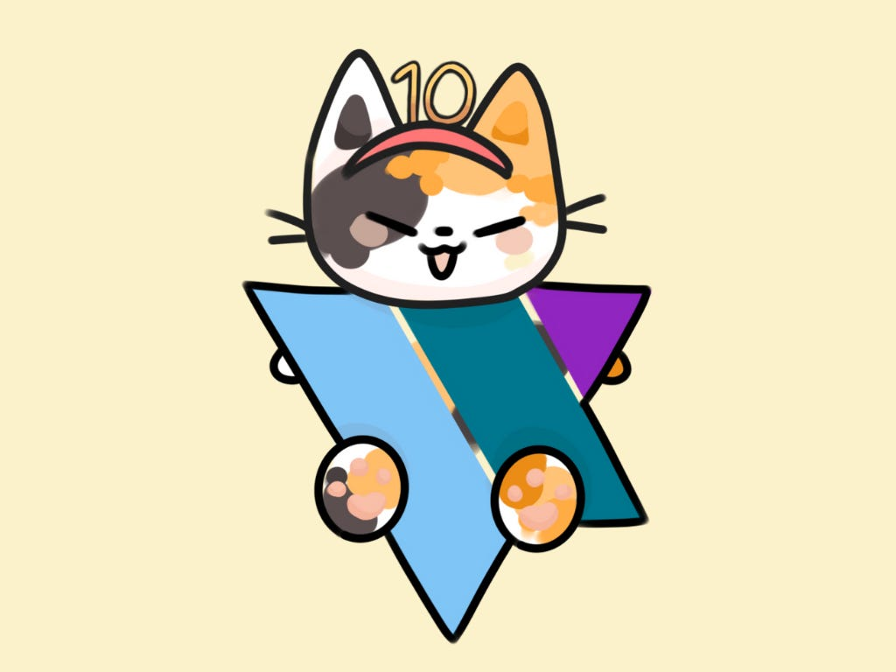
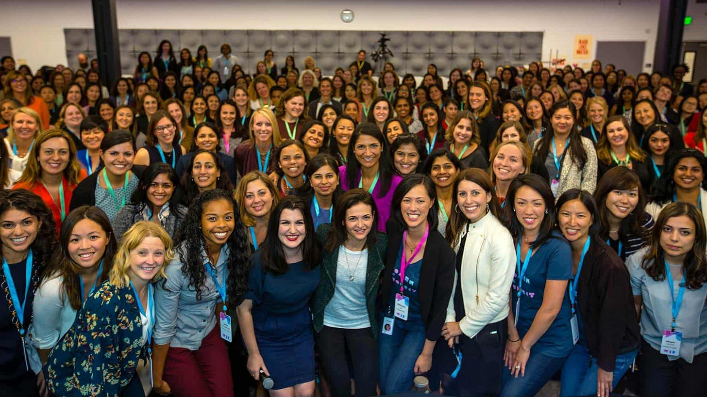
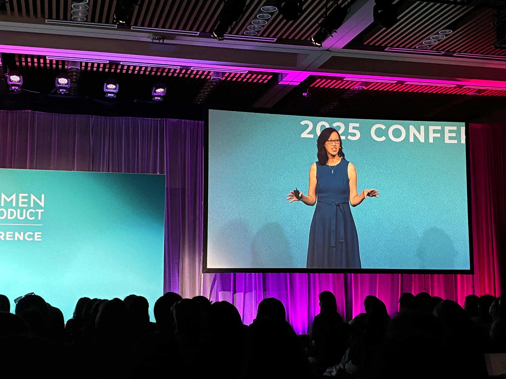

# Ten Years Strong: Craft, Courage, Community

*Reflections on a decade of Women in Product and what the next chapter means for builders*

Ten years ago, we gathered for the very first [Women in Product](https://womenpm.org/) conference. Back then, it was just an idea: could we create a space for women in this field to connect, to learn, to belong? Could we build a community that didn’t exist when many of us were starting out?

It began with dinner in 2012. We would gather with women product leaders for dinner every quarter to build connection. For four years, we met regularly. One night at one of these dinners, a group of us talked about Grace Hopper, and we wondered why we didn’t have our own. So we decided to build it, and thus the first conference was born.

When Ami Vora and I met with the Facebook events staff for help, they suggested that perhaps a conference was not the way to go because it would be hard to fill the space. She said, “We will just product manage our way out of this.” When we opened registration, 3000 people applied for just 300 spots.

I could never have imagined standing on stage this week, a decade later, looking out at a thousand faces who gathered to learn from each other. This year’s theme was **10 Years Strong: Craft, Courage, Community**. And it could not be more relevant to the moment we are living in.

### **The Moment We’re In**

Not long ago, product management felt well defined. PMs created roadmaps, wrote specs, and PRDs. Designers shaped flows and UX. Researchers gathered qualitative and quantitative feedback. Analysts shared data and insights. Engineers built it, and product marketers took features to market.

I remember sitting in a large budget meeting at a major tech company where one of the executives was doodling. He drew a caricature of a PM in the center of the page. Around the figure, he drew circles with pictures of the following: a designer, a researcher, a data scientist, a technical program manager, a marketer, and a host of engineers. Then he laughed and said, “A PM can’t even go to the bathroom without an entourage going along.”

That orchestra could make beautiful, complex music. Everyone knew their role. But over time, complexity became the bottleneck. Too many handoffs. Too many functions. Too much coordination. Costs soared. Progress slowed.

Then something shifted. Leaders began asking hard questions. Do we need all these roles? Where can we streamline? At the same time, new tools, especially AI, allowed one person to do what once took a team.

Suddenly, leaders were making massive changes to the field. One incoming CEO fired his PMs and had designers and engineers step in. Another head of a large division said she replaced most of her PMs because they were just turning the crank when she needed builders. A founder said they combined design, product, and product marketing into one.

Alarming? Maybe. But the truth is, **the product roles we once knew are evolving**.

AI has given us incredible power. What once took years now takes months. What once took months now takes days. We can create something from nothing in hours. But with that acceleration comes a reckoning.

When companies can do more with less, they begin to ask: Who is essential? Which roles add unique value? Which can be automated or combined? And that questioning has led to sweeping reorganizations and, yes, layoffs.

So while this is a moment of immense possibility, it is also a moment of deep uncertainty.

[Leave a comment](https://debliu.substack.com/p/ten-years-strong-craft-courage-community/comments)

### **Layoffs and Uncertainty**

So far, [more than 140,000 people in tech have been laid off across hundreds of companies](https://www.trueup.io/layoffs) this year. One product conference organizer told me that when she emailed last year’s attendees, half the emails bounced. Half. That means people are moving around or losing roles at a pace we’ve never seen before.

And behind every statistic is a human being. A friend. A colleague.

I’ll give you another number. A CEO I advise posted a PM role. Within days, hundreds applied. By the time he was interviewing, nearly 950 applications had come in. When he shared the final count, it stunned me: [1,814 people applied for a single PM role at a company of just a few dozen employees](https://debliu.substack.com/p/non-obvious-tips-for-landing-the?r=3k88l).

That’s what the job market looks like.

And yet here’s the paradox. Even in this environment of layoffs and scarcity, demand for product leadership and product thinking is not disappearing. It’s shifting. It’s evolving. That’s why **Craft, Courage, and Community** matter more than ever.

[Share](https://debliu.substack.com/p/ten-years-strong-craft-courage-community?utm_source=substack&utm_medium=email&utm_content=share&action=share)

### **Craft**

Craft matters because tools are changing, but people remain at the center.

For the past month, I have been working with my 13-year-old daughter on an idea she had. She called it a “social media manager in a box.” We put her concept into [SnapDev, a tool I’ve been working on with a friend](https://snapdev.ai/). Within half an hour, we had a prototype. Together, we took time to work on her ICP (ideal customer profile), refine her user experience, and discuss her monetization strategy. [We had some discussions about pricing to value vs pricing to cost.]

AI gave my 13-year-old the ability to think like a product manager, but it didn’t replace the craft of what a builder does.

Craft is empathy. Craft is judgment. Craft is asking the right questions. AI can generate answers, but only we can decide which problems are worth solving and for whom we are solving the problem.

[As my friend Li Fan says](https://debliu.substack.com/p/future-ready-thriving-in-the-age), *“You will not be replaced by AI. You will be replaced by someone who knows how to leverage AI better than you.”*

Tools will evolve. But craft, the art of building with purpose, is timeless.

### **Courage**

But craft alone is not enough. We also need courage.

Courage to raise your hand for the stretch assignment. To pitch the idea when others hang back. To speak up when your voice feels small.

I’ve felt that fear myself. Imposter syndrome followed me well into my career. Even after leading large teams, I would sometimes wonder, *Do I really belong here?*

And yet courage is not the absence of fear. It is moving forward despite it.

When I left eBay for Facebook, people told me I was crazy. I had a toddler and a newborn. I worked part-time and got paid full-time. Facebook was a startup with 900 employees. But Sheryl Sandberg told me to get on the rocketship and not ask about the seat. So I strapped in, and it became the ride of my career.

Recently, [I stepped down as CEO of Ancestry](https://debliu.substack.com/p/looking-back-and-looking-ahead) after four years without deciding what was next. No title, no roadmap, no plans. A week later, I was at a party with my friend, [Avni Shah](https://www.linkedin.com/in/avni24/), who had also stepped down from an executive position. She asked, “What do we write under our names?” A moment later, Avni flagged down another, [Sandy Huang](https://www.linkedin.com/in/sandyhuangproduct/), who had just left a senior role and jokingly said, “Come join the [Blank Name Tag Club](https://lnkd.in/p/ecYgkTBv)!”

Who are we without our titles and companies that our identities are so tied up in? It was terrifying, but also in that space, I discovered freedom. In six months, [I was treated for cancer](https://debliu.substack.com/p/what-we-learn-from-sickness?r=3k88l). I gave a TEDx talk. I was an executive producer for [my friend’s short film](https://lnkd.in/p/evWemSv2). I am creating a show with a team from Hollywood. I am writing [another book](https://debliu.substack.com/p/at-the-edge-of-whats-next-navigating). I am exploring starting a company. I am joining a new board. I advise a dozen founders who are pursuing their dreams.

[Subscribe now](https://debliu.substack.com/subscribe?)

Courage doesn’t mean having the answers. Courage means saying yes before you know how the story ends.

Maybe your courage right now looks like reinventing yourself after a layoff. Maybe it’s bringing AI to your company. Maybe it’s speaking truth to your leaders. Whatever it is, remember: courage grows the more you use it.

### **Community**

And finally, community.

This has always been the heart of [Women in Product](https://womenpm.org/). We started this because so many of us felt alone. The only woman in the room, the only one navigating this path. We needed each other.

A decade later, that hasn’t changed. Especially in times of uncertainty.

Women in particular are leaving the field at an unprecedented rate. Half of women leave tech by age 35. Women only occupy 28% of leadership roles. We have made so much progress, yet still have so far to go. Claire Vo shared that 90% of those who listen to her podcast “How I AI” are men. Women risk being left behind by this next chapter if we are not careful. Yet the juggling of families, pressures from burnout, and demands from work are all weighing on us. Many are leaving at one of the most exciting but also daunting times in our industry.

But this community can carry us through when things feel tough and the obstacles feel insurmountable.

Product is changing, but product thinking and mindset, built of curiosity and problem-solving, transcends our jobs. The Women In Product community has shown there are ways to help one another, build for the world, and lift each other up.

[Leave a comment](https://debliu.substack.com/p/ten-years-strong-craft-courage-community/comments)

### **Closing**

So on this, our 10th anniversary of Women In Product, here’s what I want you to carry with you:

* **Craft will always matter.** The details, the empathy, the care we bring to our work and those we serve. Those are timeless.
* **Courage will always be required.** The world will keep changing, sometimes in unexpected and challenging ways, but all of us have the strength to face that change with boldness.
* **Community will always be our anchor.** Alone, we struggle. Together, we rise.

The next decade of product will look very different from the last. AI will reshape the landscape. Roles will evolve to meet the times. The industry will shift again and again. But one thing will not change: the future of product is in the hands of builders.

I believe with craft, with courage, and with community, there is nothing we cannot build together.

Thank you for being here. Thank you for building this movement. And here’s to the next 10 years.