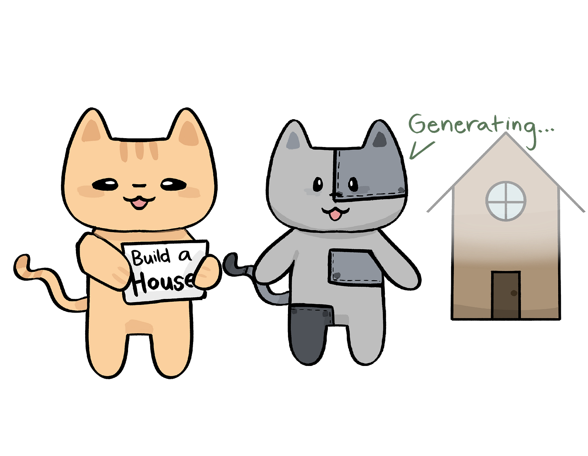
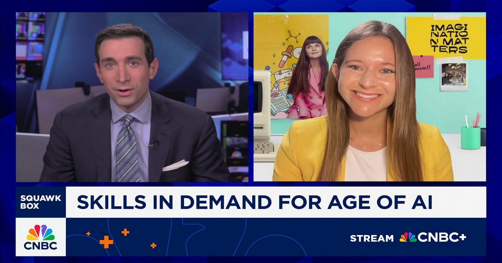
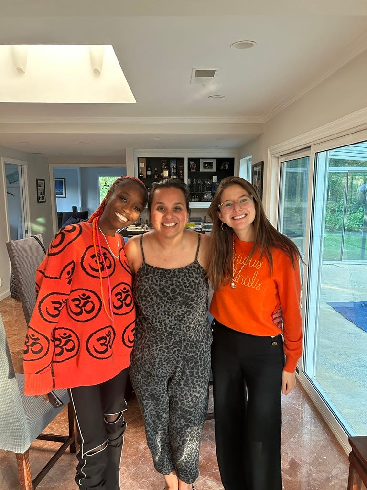
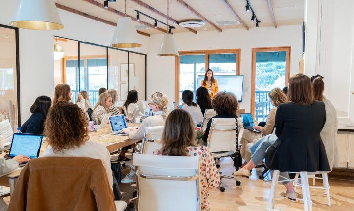

# What Every Parent Should Know About the AI Future

*How AI is Transforming Our World, Your Kid’s Future, and What to Do About It *

**Note from Deb:** From time to time, I invite interesting people to guest post. Audrey has been gracious enough to write her point of view on AI and its impact on our kids. As a mom and someone who is seeing the new AI revolution firsthand, it is hard to understate just how transformative the technology is and how little we understand about what is to come. I am an advisor to Curious Cardinals and an active Curious Cardinals mom. I love Audrey’s thought leadership on AI, and I wanted her to share her thoughts. [I have written about AI from a worker’s perspective](https://debliu.substack.com/p/future-ready-thriving-in-the-age), and now she shares her insights from those growing up during this revolution.

---

"Your work feels AI-sloppy."

I said this to a recent Harvard graduate on the team at my startup, [Curious Cardinals](https://www.curiouscardinals.com/). She had seen firsthand how AI-positive we are, and assumed that meant letting AI do the heavy lifting.

I told her, "I hired you for your perspective. AI should amplify your thinking, not replace it."

Our company is a mentorship platform that connects college near-peer mentors with K-12 students, serving thousands of learners worldwide. I have taught nearly 100 AI workshops for over 1,000 parents, traveling all across the US in the past two years. In these conversations, I hear AI sentiments that are all over the place. Some schools are banning AI entirely, while some in Silicon Valley ask why we haven’t replaced our human mentors with tutor bots yet.

Neither extreme serves the next generation.

### **The Problem: We're Teaching Yesterday's Skills**

Recently, [CNBC’s Andrew Ross Sorkin](https://www.linkedin.com/posts/audrey-wisch_education-backtoschool-press-activity-7366824103854485506-rmmX?utm_source=share&utm_medium=member_desktop&rcm=ACoAADGeZqYBrz7w93bFxVD95e4Xfltx6Hcfn_8) asked me: "If ChatGPT is going to be smarter than all of us, what do we do?"

I echo the words of Stanford professor Rob Reich, who declared, “*Use AI to amplify, not replace.”*

Our education system is stuck in the past. We still ask kids to memorize and regurgitate information from textbooks. Well before the internet put the world’s information in our pockets, Albert Einstein urged us “don’t memorize what you can already look up.” But what do we tell kids when that same device in their pocket can access, synthesize, and explain any information instantly?

We must teach them how to leverage their *uniquely human* capabilities that AI amplifies, but never replaces.

[Share](https://debliu.substack.com/p/what-every-parent-should-know-about?utm_source=substack&utm_medium=email&utm_content=share&action=share)

### **The Four Human Superpowers in an AI Era**

#### **1. Motivation: The Greatest Unlock**

Kids today have unlimited access to information: endless feeds of hot takes, in-depth examinations, and even silly memes. They can consume content 24/7 and never run out.

But this abundance creates a new chasm between the motivated and unmotivated kids.

A [Harvard study](https://www.threads.com/@carnage4life/post/DOTo9E1kduA?xmt=AQF0i4s9P4vP3_m-S2qkMWo1Rms1VpAMbVoJKAe3IqIXEg&slof=1) of 62 million workers reveals that since Q1 2023, AI-adopting companies have reduced junior hiring by 7.7% while continuing to hire senior talent. The retail sector saw junior positions drop by 40%, particularly in customer service and document processing roles. Meanwhile, [unemployment for new graduates has hit 5.8%](https://www.wsj.com/economy/jobs/ai-entry-level-job-impact-5c687c84?st=n4ZPJg&reflink=article_copyURL_share), the highest since 2013. The Wall Street Journal reports that the headcount of 22-25 year olds has fallen nearly 20% since late 2022.

The message is clear: degrees alone won't cut it anymore.

When AI can tackle entry-level tasks and knowledge is a commodity, what’s necessary not just to survive, but actually thrive?

The answer? Motivation channeled into passion and proof of impact. In an era where words are cheap, the numbers that show impact are priceless. Students who can show what they’ve created, demonstrated skills and impact in tangible ways, whether through passion projects or portfolios, will set themselves apart.

Take [Matthew](https://www.curiouscardinals.com/case-studies/matthew-d), who came to us as a disengaged 10th grader. "What interests you?" we asked. "Nothing." His dad rolled his eyes when Matthew admitted he loved playing video games.

"What if we taught you to code your own game?"

Matthew lit up. Today, he's studying engineering at Michigan, pursuing game design, because we found what motivated him and nurtured it into something he can show the world. Matthew transformed from a passive consumer to an active creator.

The gap isn't between kids who use AI and kids who don't. It's between those motivated to leverage AI to learn and create—*to get ahead*—versus those who turn to it simply to *get by,* scrolling without direction, letting their skills atrophy.

#### **2. Human Connection: Getting a PhD in Being Human**

Motivation alone isn't enough. In an AI era, human connection is the ultimate differentiator.

From [Building Executive Presence](https://debliu.substack.com/p/building-executive-presence) to [Networking, Reframed](https://debliu.substack.com/p/networking-reframed), Deb has written about this priceless skill time and time again: the ability to forge genuine connections.

Take Natalie, our summer intern who worked with us from 8th grade through senior year. At first, my co-founder resisted the idea of bringing on an intern, worried it would be a costly distraction. By the end of summer, I was crying on her goodbye Zoom. We were devastated to see her go.

What set her apart wasn’t just her excellent output. It was her humanity. She asked genuine questions, supported teammates when they were overwhelmed, and brought warmth to every interaction. She did the job, yes, but she did it in a way that made everyone want to include her and seek her counsel. Her absence was immediately felt.

That’s what endures in an AI world. As Maya Angelou said, *“People will forget what you said, people will forget what you did, but people will never forget how you made them feel.”* Be the person whose absence is felt and whose presence others seek out.

#### **3. Originality & Problem-Solving: Work Only Humans Can Do**

AI is an accumulation of human knowledge, but requires human originality to push it to new frontiers. Take [Armaan](https://www.instagram.com/p/DN1FReQ5KgA/), a third-grader who invented a copper soap that never runs out and doesn’t require water. He ran experiments at home, solving real problems from sustainability to chemical safety. He saw a need and did the work to find out if it could work for a community with limited access to water and cleaning products.

At the end of his pitch, Armaan thanked his parents, his mentor [Akash](https://app.curiouscardinals.com/mentors/akash-shah-1), and ChatGPT.

But here’s what’s most important: AI didn’t come up with the idea. AI didn’t do the thinking. It didn’t replace the hard work or necessary human guidance he received from his mentor. Instead, AI was an accelerant that helped him move further, faster.

The kids who will thrive are the ones motivated enough to do the work themselves and curious enough to ask AI how they can take it to the next level.

[Leave a comment](https://debliu.substack.com/p/what-every-parent-should-know-about/comments)

#### **4. Curiosity & Adaptability: The Only Constant**

Which leads to the paradox parents face: 85% of jobs that will exist in 2030 don't exist today. Yet we still ask kids, "What do you want to be when you grow up?"

When ChatGPT launched, my mentor [Desiree Motamedi](https://www.linkedin.com/in/desireemotamedi/) (whom I met through Deb) called me; she said, "Audrey, you want to change the future of education? Get on the AI bandwagon!"

No questions asked, I dove in. I saw how AI could transform what we were building at Curious Cardinals, but also how it would change the lives of the kids we serve and the future of education. Today, we integrate AI throughout our platform to transform every mentorship interaction into structured insights, so each learner’s journey becomes more personalized and impactful over time. But the heart of our work remains the same: facilitating human connection between a mentor and student. AI is simply a powerful tool helping us do just that.

In the midst of so much anxiety about how AI will change the world, the only thing we know for certain is that the ability to learn will never go out of style!

If we hold ourselves accountable to never stop learning, I am optimistic that we can harness AI to build a better future. As Deb wrote, [we should not be afraid of AI](https://debliu.substack.com/p/future-ready-thriving-in-the-age), but instead learn how to use it to achieve more than we could have imagined. And this all begins with one essential trait: curiosity.

### **How Parents Can Model This Balance**

“Why aren’t you building a mentor bot?” the folks in Silicon Valley ask me. Meanwhile, on the other end of the spectrum, parents ask why we are not pushing for schools to ban AI entirely. There is a middle ground here, which is where we fall. Use AI to amplify, but only a human can instill confidence, ignite motivation, and activate inspiration in kids!

I use AI every hour of my workday. It's my thought partner, my editor, my researcher. What do I do when I need real guidance? Or when I am struggling to make a strategic decision? I call my mentors like Deb or Des. Sure, I ask AI all these questions first, but the advice lands differently coming from a trusted role model who has walked this path to see the nuance of the choices I have in front of me. And arguably most powerful of all: the advice means all the more to me coming from mentors who know me and believe in me.

[Subscribe now](https://debliu.substack.com/subscribe?)

That's the model we need to show our kids: AI as a powerful tool, humans as irreplaceable guides.

#### **Four Things You Can Do Today:**

1. **Use AI together.**

   * Show your kids how you use it to amplify (not replace) your thinking. Let them see you edit AI's output, question its suggestions, and add your perspective. Teach them not to fear AI, but also not to overly rely on it. It is a tool like any other, and has appropriate uses, but also can be misused.
2. **Teach them to do hard things.**

   * The reality is that many are turning to AI to take shortcuts. But growth comes from wrestling with hard work, not outsourcing it. Model resilience as a parent. Show your child that you put in the effort first, and don’t hand off the hardest thinking or the messy iteration cycles that fuel breakthroughs. Deb took a vibe coding class with her kids, and they worked on projects together. That showed them what is possible, but also how much hard work it takes to bring a vision to life.
3. **Find their spark.**

   * Help your child discover what truly excites them. Expose them to different topics, interests, and pathways. Cookie-cutter school options can be limiting. It serves no one to join Model UN or robotics just for the sake of adding an activity to their college list. Instead, empower them to find something that marries their interest and motivation. A mentor can help, especially if the topic area is one you are less familiar with.
4. **Don't let them do it alone.**

   * Don’t let AI become the substitute for your child’s deepest questions, struggles, or dreams. From CEOs to Olympic athletes, the common denominator is always coaches and mentors. They have families who facilitate their success. Help your child see that real human relationships are what provide wisdom, accountability, and inspiration.

---

Being AI-positive doesn’t mean being human-negative. It means knowing when to lean on the machine and when to lead with your humanity.

**The future doesn’t belong to kids who can out-compute AI. It belongs to kids who can out-human it.**