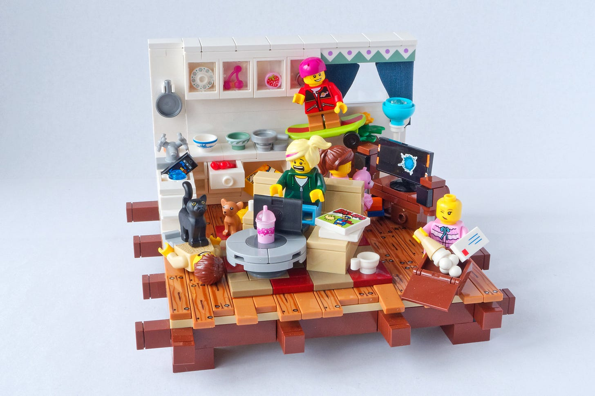

# Managing Remotely

*Collected tips on working from home during lockdown *

👋*Hi! I’m Julie Zhuo. I [help companies scale and build](http://inspirit.work/) products of value. I’m the author of a [popular management book](https://www.amazon.com/Making-Manager-What-Everyone-Looks/dp/0735219567). I used to lead design for the Facebook app. **The Looking Glass** is my once-a-month-ish musings on products, teams, and ourselves.*

I read over the past weekend that about half the world is in lockdown—nearly 4 billion people asked to stay at home in order to slow the spread of COVID-19. That's a mind-boggling number.

For those of us lucky enough to be able to do our work from home, this means getting thrown head-first into the Great Remote Work Experiment along with the rest of our colleagues. Some folks have it easier (natural introverts with great home office setups) and some have it on Super Challenge Mode (folks simultaneously running a school or daycare; folks in a small space with multiple roommates; folks with bad Internet; folks who do their best work in the presence of other people’s energy).

We're all scrambling to learn and adapt. In that vein, here are some tips for how to manage working remotely during this crazy period.

### **Tips when interacting with others:**

* **Exercise kindness**. Everyone is processing this situation in their own way. For some of your colleagues, this period is exceedingly difficult—they're anxious, lonely, having to deal with kids, worried about family or friends, affected by a job loss in their household, etc. Don't assume that just because they're able to continue to work or meet with you that they're fine. This is the time for generous interpretations in assuming best intent. If someone is late to a call, feels harried, snaps at you, seems less energetic than usual—resist meeting them with the same. Forgive some of the balls that get dropped in the name of trying our best to get through the days. This is not the time to come across as a hard-ass colleague or boss. We could all use a little understanding right now.
* **Do frequent chat check-ins with your teammates or reports**. Since you won't as easily be able to ask in person or discern through body language, get in the habit of frequent chat check-ins: *How are you doing? What can I help you with?* The good news is that this is extremely scalable—you can do this with 1, 5, 10, or even 20+ people every single day, way more than you could do in person. Even if the most common answer you hear is *I'm doing okay* it's meaningful to ask and show that you care. If you hear that someone is not doing okay, listen and give space to their feelings.
* **Find your team's unique way of sprinkling in moments of celebration and levity**. It's not appropriate for every team, scenario or meeting, but these times are tough and anxious enough that if you can create an outlet for creativity and fun, do so. Maybe it's doing a custom Zoom background competition where the winner gets to select a charitable organization that gets a donation. Maybe it's by challenging people to wear costumes or funny hats to a VC meeting. Maybe it's posting the funniest social isolation stories or memes that your team comes across. Maybe it's mailing out a small package of familiar office snacks to everyone. Do what feels authentic to your team.

### **Tips when in a remote video meeting:**

* **Cancel as many meetings as you can**. Video meetings seem to sap more energy than in-person meetings and require more effort to stay focused, especially if your primary job is to listen. I read an interesting explanation that this may be because we don't *feel* the bodily presence of others in the room (through eye contact, etc.) so our brains have to work harder to convince ourselves to behave as we normally would. It could also be that it's easier to sneak in a distraction like opening a new browser tab, or simply that a bunch of pixels on the screen are less compelling than a full, real-life human in holding our attention. Regardless, take a hard look at your recurring meetings—do you still need that series? Do you still need to call a meeting to disseminate information, or can you share a doc? Do you need 3 back-and-forth reviews, or can you do a majority of the discussions via comments and chats and just call one meeting to make a decision?
* **Send out a clear agenda for meetings ahead of time to give everyone time to prepare**. If it's hard to come up with an agenda, or the agenda looks sparse, consider cancelling the meeting.
* **More documents, less powerpoints and keynotes**. A document's more narrative structure makes it easier to pass around and consume asynchronously. We can all do with fewer in-person presentations right now.
* **Establish team norms for getting airtime**. For example, have the organizer go "around-the-room" and specifically call on individuals for their thoughts, or establish a system where folks who want to ask a question or share a comment raise their hand on camera or type 🙋🏻‍♀️or Q in the video call's chat thread.
* **Mute** if you don't expect to be saying much or you're in a noisy environment.
* **Smile or nod more vigorously when someone speaks if you're in a smaller meeting where you'll be seen on the screen**. It makes a big difference to that person who otherwise feels they're sharing to an empty room.
* **Take advantage of one benefit of remote meetings—taking notes**! Don't do it if it prevents you from paying attention to what's being said, obviously, but typing as someone is talking is no longer the distraction it otherwise would be.
* **Turn off video cameras if anyone on the meeting has a bad Internet connection.**

### **Tips for your work-from-home environment:**

* **If you do a lot of video calls, consider upgrading to a standalone camera**. My husband found his posture to be terrible when using his laptop's build-in camera since he was hunching low to get into view. He got a $30 camera to position right on his face and is much happier as a result. [Wirecutter is my trusted source for camera reviews](https://thewirecutter.com/reviews/the-best-webcams/).
* **For those in need of a good desk, including a very space-efficient standing desk, my friend Rose Yao suggests checking out the [office line Fully](https://www.fully.com/)**.
* **If you are in a noisy environment (say, sharing an office with your significant other, as I am) my friend Susan Li tipped me off to the [Jabra Evolve headset](https://www.jabra.com/business/office-headsets/jabra-evolve)**. It's used in call centers and works wonder in drowning out the sounds of your environment (including the person sitting next to you having a full-on conversation.) It's a bit pricey, but potentially could be a work expense.
* **A good office chair makes a big difference in comfort and ergonomics**. While it’s expensive to replicate the comfort of office-quality Herman Miller chairs (though [Herman Miller is having a sale right now](https://www.dwr.com/workspace-chairs?lang=en_US)), you can still get a more comfortable task chair for less. [Some good options here](https://nymag.com/strategist/article/best-office-chairs-home-office-chairs.html).
* **Lounge pants are comfy**. Enough friends poked fun at my wearing the same things at home as I do in the office that I caved to social media advertising and bought some lounge pants. Verdict so far: excellent.
* **Prep lunch and snacks the night before.** Having to "figure out" lunch every day felt like a big distraction in the middle of the workday so it helped me to check off that task the night before. Make a sandwich or put aside some leftovers in the fridge so you can grab, heat and eat the next day without thinking too much about it.

### **Tips for remaining active:**

* **Turn some meetings into walking meetings**. Ask if you can turn some 1:1s into phone calls so you can go for a walk while chatting. Or if there's a meeting where you're largely listening, put on your shoes and get some fresh air.
* **Do a round of the 7-minute-workout in the mornings or in between meetings to get your blood pumping.** I dig this video:

### **Tips for better focus:**

* **Do your toughest work when you have the most energy**. If you're a morning person, do your hard work tasks in the morning. If you're a night owl, save your biggest problems for when the rest of the house is dark and quiet.
* **Make small daily commitments**: I found myself checking news or Twitter way too often during the day, which would always break my flow. I made a rule for myself that I would only do so before 10am and after 4:00pm and not get sucked in in-between. (I ended up breaking that rule a bunch, but all in all still ended up doing less of it.)
* **Invest in sleep and exercise.** Saved yourself an hour or two on the daily commute? Channel that back into sleep and exercise, two activities that always reap a bounty when it comes to energy and focus.
* **Don't beat yourself up if you're not as productive as you used to**. You don't need to "take advantage" of every minute you have at home. If you need to cut your "productive working day" in half to spend time with your kids (as I am) or to check in with friends and family or simply to keep yourself staying well, know that it doesn't reflect on your abilities or integrity. Let your colleagues know what they should expect. Be kind to others, but also be kind to yourself.

*Top image of lego people by: https://flickr.com/photos/33774513@N08/*