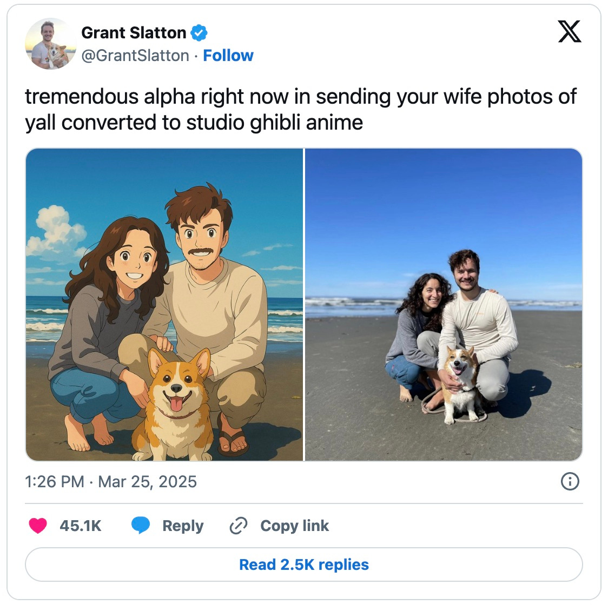
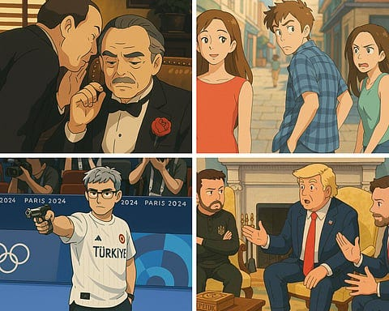
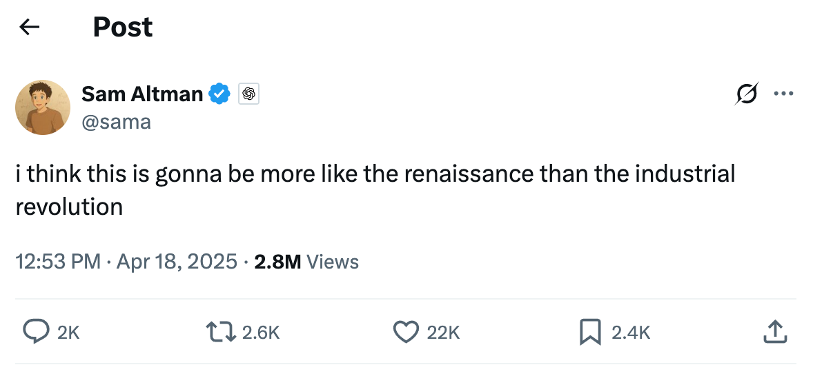
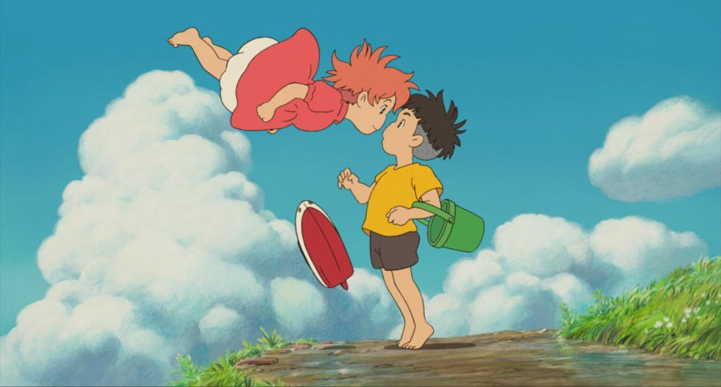
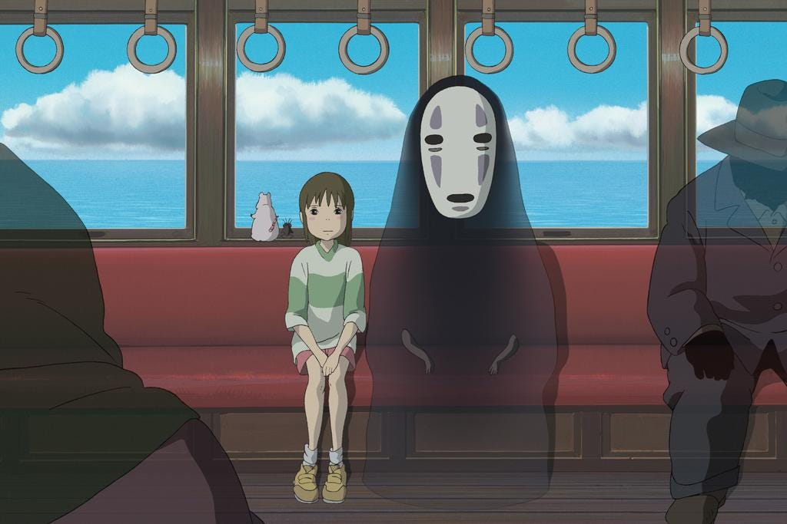
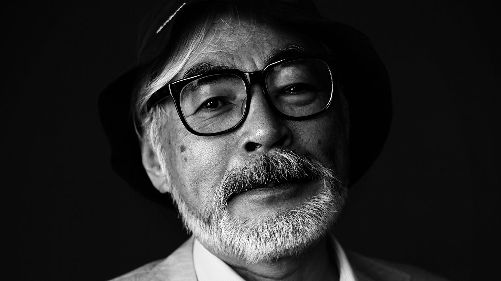
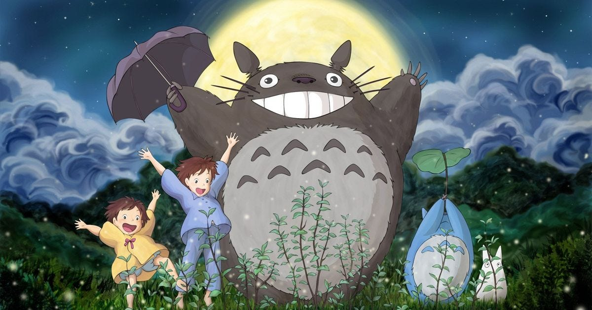

# The AI Quality Coup

*What exactly is "great" work nowadays? *

*What is quality work nowadays, in the era of AI? Traditional definitions are being upended, and it’s up to us to find the new precipice.*  
  
*This post was co-created with gems of insight from [Guillermo Rauch](https://rauchg.com/), Founder and CEO of [Vercel](https://vercel.com/) and [v0](https://v0.dev/). I admire Guillermo for his wonderful taste and creative passion; his body of contributions, from open source frameworks like [next.js](https://nextjs.org/) to platforms like Vercel and v0 speak to a pattern of elegance and exploration.*

---

i.

Less than a month ago, the Internet went ablaze with ChatGPT’s [new 4o image launch](https://openai.com/index/introducing-4o-image-generation/). The killer use case was seeded first in an OpenAI launch video, and then by one Grant Slatton: Turning photos into an art style made distinctive by Japanese animation studio [Studio Ghibli](https://en.wikipedia.org/wiki/Studio_Ghibli).

Within a day, legendary movie moments, Olympic highlights, photo memes and world leaders were were all rendered in the dreamy, gentle style of Hayao Miyazaki.

[“Art just became accessible.”](https://x.com/KrishRShah/status/1904786452170342466) one X user declared.

Unfortunately, this statement confuses the definition of art. It supposes that quality work comes from the power to recreate an artistic style.

But art is not *style*. Quality work has always been preoccupied with hovering at the precipice’s edge. It’s arresting because it’s *novel*. It’s striking because it’s rare.

Rather than making the art of Studio Ghibli accessible, ChatGPT’s launch has turned it into something else entirely: a *commodity*.

It has staged a coup on quality work, erasing and redrawing the lines for where the edges of greatness now lie. Let’s investigate how.

---

ii.

It’s been a month. Ask yourself: how do you feel *now* when you see an image rendered in Studio Ghibli style as you scroll along your merry way? (Say, for example, catching a glimpse of [Sam Altman’s profile pic](https://x.com/sama) out of the corner of your eye?)

Do you still marvel to yourself, “*Wow!*”

Do you muse at the decades of advancements that made such an avatar possible?

Do you take the time to appreciate the delicate lines and expressive eyes?

Or do you breeze past, dismissing it as *another person late to the trend*, the whimsy and color now registering as background noise while your eyes dart around searching for a more thrilling [next hit of dopamine](https://lg.substack.com/p/the-looking-glass-our-souls-need)?

The second watching never commands the same awe as the first. The 20th bite doesn’t dance on the tongue as exquisitely. And the 200th anime portrait certainly no longer impresses the way it once did.

The sad truth is that oversaturation strangles quality. [Nothing too easy can truly be tasteful.](https://lg.substack.com/p/the-looking-glass-our-souls-need)

---

iii.

What made Studio Ghibli so *quality* to begin with?

There are a few reasons. The first is that when you see an actual Studio Ghibli still, it cuts differently.

Whereas the ChatGPT versions traffic in the mundane — people at the park, at home, at a restaurant—stills from an actual Studio Ghibli film feel otherworldly.

There are translucent ghosts keeping company with children, adorable bunny(?)-like creatures romping in a garden, determined protectors scowling next to their badass mythical sidekicks.

And they’re not really *still* images. As any Studio Ghibli fan will tell you, much of the magic of the pictures come from the actual movies they are a part of.

Grant Slatton's wife, presumably a Studio Ghibli fan, would likely have seen the image he created within the backdrop of its moving epics—ones where troubled children convene with spirits, where colorful characters are swept away by the magic of the everyday, where blades of grass rippling in the wind evokes a feeling of emotional presence. She might have imagined the [soaring soundtracks of Joe Hisaishi](https://open.spotify.com/track/2ZJ28Rm7OXMYJshLtp5uff?si=b5450ee12a7947ed) in her ears.

The quality of seeing a Studio Ghibli image can't be separated from the quality of the movies themselves.

Of course, part of the awe surrounding Studio Ghibli comes from how its films are made. Director Hayao Miyazaki, often called the world’s greatest living animator, personally storyboards each film by hand and oversees every stage of production. Now in his 80s, he remains deeply involved in the studio’s creative process.

A typical Ghibli film may take over 100,000 hand-drawn frames, crafted over years by teams of skilled animators. (A single 4-second scene may take months!) In an era dominated by CGI, the studio remains committed to the traditional, painstaking beauty of 2D animation. The reverence many fans have for Ghibli is not just for the stories it tells, but for the rare artistry behind them.

And let us not forget the prestige the studio has earned. *Spirited Away* claimed an Oscar. *The Wind Rises* drew crowds at Venice. *Princess Mononoke* turned heads in Berlin. At the Studio Ghibli office, fan letters from Pixar Animation Studio are on displayed. Billie Eilish quoted *Spirited Away* as her favorite movie. Guillermo del Toro and James Cameron cited its influence in their own work. Many who apprenticed under Miyazaki have gone on to found studios of their own. Like wind through grass, his influence ripples across generations.

AI-generated images in the “Ghibli style” may borrow its surface features but they don’t capture the soul of what makes Studio Ghibli exceptional in quality. They lack the narrative depth, the handcrafted devotion, and the cultural resonance.

Like a celebrity impersonator, the ChatGPT images borrow from the cache of the original. But sadly, hollowly, it’s not the same. What made the original shimmer is lost in translation.

---

iv.

But aren’t the ChatGPT-generated Studio Ghibli images also *quality*?

Yes, but of a different sort, in a dimension that’s inherent to its technological innovation.

You see, ChatGPT could offer a flavor of magic that Studio Ghibli could never achieve, the magic of *personalization*.

Placing oneselfwithin the context of another world is cutting edge, novel, rare. After all, one of the noblest purposes of art is connection. Around Japan, you can't go a block without stumbling across Totoro merchandise enticing you to take home a piece of a beloved story. But how much more exhilarating, how much more connective, is seeing yourself as a *part of* that world?

The quality of Ghibli-fication is the quality of the new image model itself, one that could produce so convincing an on-the-fly facsimile of a photograph in a particular style that it created a "moment" in public consciousness. ChatGPT 4o beat out a number of other image foundational models for this prize.

And let us not forget Grant Slatton's insight, for it is quality also — being among the firstto discover a use case for an emerging technology that not only won points with his wife, but also inspired widespread mimicry. (His post saw more than 50M views and inspired many thousands of others to try Ghibli-fication). He himself recognized this as *alpha*, the secret knowledge before it becomes mainstream, borne from an *aha moment* of exploration and discovery.

There are scores of these novel discoveries made every day with each new AI model. Collectively, the world is learning which models are precisely better for which tasks when directed in which specific manner. Every discovery grants its originator a fleeting advantage—a window to create something more useful, delightful, or efficient. Yet, as knowledge disseminates and competitors copy, this edge diminishes, leveling the playing field.​

This is the game of technology, and why playing at the cutting edge offers abundant opportunities to find and deliver exceptional quality.

The key is not confusing the quality of a technology with what it makes easy. What we are seeing is a quality coup. Producing a Ghibli-fied image or a Mona-Lisa-style portrait or a Picasso-like painting will not create quality art; those islands are already too well mapped. In fact, all visual imagery as a category may soon feel tired for this very reason.

Perhaps here we can learn from Studio Ghibli itself. To ascend to the next plane of quality-hunting, we need the richness of a narrative, commitment to a specific craft, and multiple mediums of expression.

Quality, like a dazzling sunset, is dynamic. Ever second it is changing and receding until it flickers out. You cannot grasp it for long. You can only keep turning a new corner of exploration and hope you're lucky enough to encounter it again.

---

v.

Was it *good* for OpenAI to enable Ghibli-fication of images?

Some called it “[AI slop](https://aftermath.site/studio-ghibli-ai-art-openai-gpt-sam-altman-is-just-the-biggest-pile-of-shit).” Artists decried AI being trained on copyrighted work. Any new disruptive technology threatens the livelihoods of countless humans.

Hayao Miyazaki himself, in a 2016 documentary, said after seeing [a demo of AI-generated art](https://www.youtube.com/watch?v=ngZ0K3lWKRc&t=17s): “You can make horrible things if you want, but I want nothing to do with it… It is an insult to life itself.” (Granted, the demo *was* extremely grotesque — exactly why those guys decided to show it to Miyazaki is a head-scratcher).

If this is still how he broadly feels today, one imagines he must have been shocked and appalled by last month’s events. The wound must have cut deep—oh, the cruel irony that his life's devotion to hand-crafted art would culminate in a flash-in-the-pan AI meme!

Yet others call this progress. There are those that argue the exposure Studio Ghibli has gotten, even if it *hadn’t* been compensated for the model training, is likely worth untold millions in new revenue. The exposure further cements Studio Ghibli's legacy! (Would any of us be writing these essays otherwise?)

Miyazaki is at the twilight of his life, without a clear successor for the studio. Another way to tell the story is to view AI as humanity's collective brain, allowing individual creations to live on in the ever-changing tides of evolution.

We don't yet know the facts of how OpenAI’s anime images came to look so similar to Studio Ghibli’s style. Did they explicitly train on Ghibli’s work? Did they have permission? No one has said anything definitive. For many, knowing these facts may change their judgements of whether this was morally "right”.

Yet a similarly important question is: how much does it matter? What's past is past. Studio Ghibli had its AI meme moment. There will be many more to come in the days and weeks ahead.

The Pandora's box of technology cannot be slammed shut. AI will continue to grow more powerful. Like any tool, it can be used poorly or wisely.​

It's up to us now to make like explorers and discover all the quality ways to harness it.