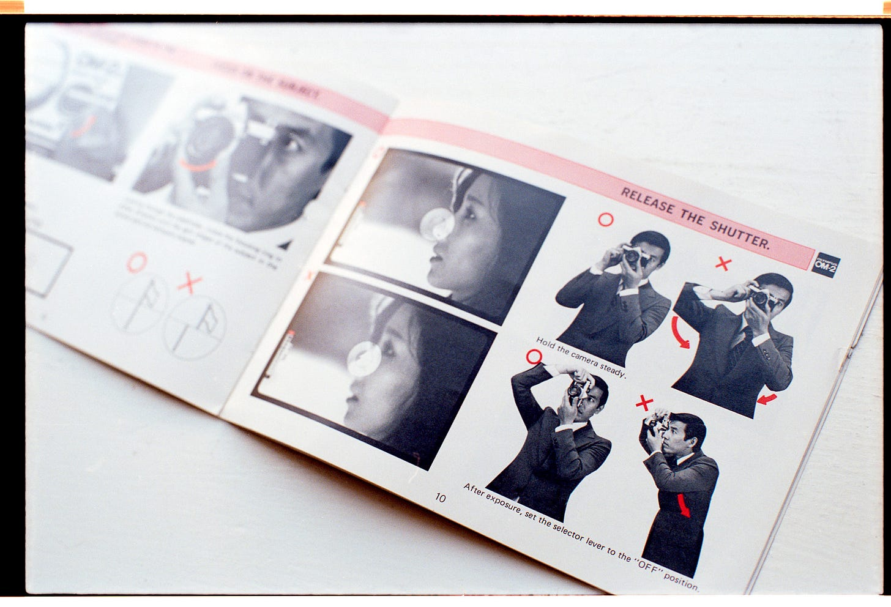

# A User Guide To Working With You

*What makes you tick? And what ticks you off?*

👋 *Hi! I’m Julie Zhuo. I [help companies scale and build](http://inspirit.work/) people-centric products informed by data. I’m the author of a [popular management book](https://www.amazon.com/Making-Manager-What-Everyone-Looks/dp/0735219567). I used to lead design for the Facebook app. **The Looking Glass** is my once-a-month-ish musings on products, teams, and our journey as builders.*

---

Once upon a time, I received an important email in my inbox that alerted me to some distressing news.

Every six months, our company ran a wide-scale anonymous satisfaction survey that pretty much every single employee answered. If your team was big enough, you’d get your own breakout of the results for how your immediate team was feeling. I always looked forward to diving in and seeing what was going well and what wasn’t.

As my eyes scanned the various questions, graphs, and answers, one result in particular stopped me in my tracks.

Under the question “How often does your manager show care for you?” the chart that displayed the responses from my team was a mass of red. I had to read it a few times to ensure I wasn’t misunderstanding: *the majority of my team thought I didn’t show care for them?!*

This was hard to process because of course I cared. I cared a lot! I took pride in helping my reports grow and thrive. I gave them challenging projects and frequent feedback because I wanted to see them succeed. And if there were ways in which I could help them—by hiring for their team, advocating for issues on their behalf, or pitching in on a tough project—I always showed up. How could they possibly think that I didn’t care?!

That night, I met a manager friend for dinner and poured my heart out to him. He listened and then gave me a diagnosis. “Julie,” he said, “Have you ever told your reports that you care about them? Or asked them how they’d like to be cared for?”

I searched my memories and came up short. He had a point. “Everyone’s wired differently,” he said. “So sometimes we struggle to understand each other. Maybe the way you show care and the way your reports perceive care are different. Everyone has their own preferences for how they like to operate and be treated.”

He was absolutely right. I took the feedback to better understand what “being cared for” meant to my reports. And I would learn this lesson time and time again--that even if you’re a good, experienced manager, even if you show up to work every day with confidence, you’re still going to fail to connect with others from time to time. You’ll still have misunderstandings or talk past each other.

Some of this will be due to cultural differences, or contrasting personalities, or because we simply have different perspectives and life experiences. Whatever the source, the more I understood about what mattered to my the people I worked with, the better of a colleague and manager I’d be. Similarly, the more my colleagues understood about how *I* worked, the fewer misunderstandings we’d have.

That’s where the exercise of creating a user manual comes in.

### A User Guide for You

I started writing a “How to work with Julie” guide for my team about three or four years ago, and heard the phrase *User Guide* some time later. Instantly it stuck with me. When you buy a new camera, it comes with a little booklet that teaches you about the specifics of the gadget—what each button means, how to select the appropriate lighting, how to review the images.

A User Guide for a Person works in a similar way. It creates clarity on how you work—what you value, how you look at problems, what your blind spots or areas of growth are, and how to build trust with you.

It’s something you can give to your manager, the folks you work the closest with, or—if you are a manager—every new report who joins your team.

The key to a good User Guide is to make it as *specific to you as possible* ([check out this post on why that matters](https://lg.substack.com/p/the-looking-glass-candidates-companies)). Leave out the generic fluff that everyone would agree with, like “*I get motivated when my work has impact.*” That doesn’t tell us anything, except that you’re not a cat. Can you be more specific and tell us what *kind* of impact is motivating to you (and what kind isn’t?)

The most effective User Guides contain snippets that might make you feel vulnerable, like you’re letting the team see you unplugged, in your PJs with rumpled hair. But vulnerability is the secret ingredient to trust. When you acknowledge your imperfections, you will receive far more rewards in the form of support, mentorship, and empathy. And you invite others to be more open with you as well.

I’ve included a User Guide template and my personal example as a starting point—feel free to modify to best suit your needs. Mine has been a living document over the years, honed through continual feedback that has shined new light on how I understand myself and my relationships. I hope yours gives you a similar gift.

Happy team-working!

---

### **Template: A User Guide To Working With <Your Name>**

*[Use this template on Coda.io](https://coda.io/@joulee/meet-julie)*

#### **Introduction**

*Why are you writing this user guide? What do you hope will be the result of writing and sharing this?*

#### **How I view success**

*What does being good at your job mean to you? What are your values that underpin your understanding of success?*

#### **How I communicate**

*How have other people described your communication style? What have you gotten feedback about in the past? How should others interpret what you do or say? What do you struggle to express? How do you like to stay in sync with others (email, chat, in-person)? What’s your availability outside of work hours?*

#### **Things I do that may annoy you**

*What’s the cause of misunderstandings that you’ve had in the past? What are some things about your style that other people have given you critical feedback on? What quirks or mannerisms might unintentionally annoy a different personality type?*

#### **What gains and loses my trust**

*What actions can a person take to gain your trust? Conversely, what triggers you?*

#### **My strengths**

*What do you love to do and are good at? What can you help others with?*

#### **My growth areas**

*What are your blind spots? What are you working on? What can others help you with?*

#### ***Additional Optional Sections**:*

#### **What I expect from people I manage**

What do you consider a stellar job for someone who reports to you? What do you consider a mediocre or bad job? What’s unique about your expectations that may differ from other managers?

#### **How I give and receive feedback**

What is your philosophy around feedback? What can others expect in receiving feedback from you? How would you prefer to receive feedback from others?

---

### **Sample: A User Guide To Working With Julie Zhuo**

I’m delighted to be working with you! And I’m excited for all we’ll learn from each other! I already have high expectations that our collaboration together will yield some wonderful things :) That said, we are unique people shaped by our respective life experiences, and we likely have different preferences and styles for how we like to work.

I’m writing this user guide to give you a better handle on me and my values, quirks, and growth areas so that we can develop the strongest relationship possible. I encourage you to do the same and share your user guide with me as well!

#### **How I view success**

* A manager’s job is to continually aim for better and better outcomes for her team. If my team is not happy or not producing good work, then I am not doing a good job. A manager’s three major levers for better outcomes are people—hiring, coaching, and matching the right person with the right role; purpose—clarity on what success looks like; and process—clarity on how to best work. Of these three levers, I believe people is the most important.
* Success is constantly learning and getting better. We can’t always control the results, and if we aim high we will sometimes fail. But no matter the outcome, there are always lessons to be mined. Those learnings are ours to keep forever.
* The path to success matters as much as the outcome. Everyone gets lucky and unlucky sometimes. But if we’re good, our success will be sustainable because it’s our process that works.
* It’s better to set ambitious goals that we don’t always meet, than to sell ourselves short.
* We can always do and be better.
* Success without integrity is like a car without an engine.

#### **How I communicate**

* I am clearer in writing than in person. In person, I may talk my thoughts out loud which can feel rambling. If my point is not absolutely clear, please ask me to clarify or to be precise with action items.
* Because a lot of my job is nurturing creativity, my preference is for others to come to the right solution with their own conviction, not to tell others what I think the right solution is. However, I recognize that sometimes the most pragmatic and efficient thing is to be clear with my opinion early on so we can resolve major misalignments. If I am not being clear and you worry we may not be seeing eye to eye, please let me know.
* I like to be engaged in conversations and presentations and show respect to the speaker. I will often smile and nod along to encourage the speaker. It doesn’t mean I agree with everything that is being said.
* I am continually working on being more direct, especially about concerns or things I don’t think are going well. I commit to giving you frequent feedback or suggestions that I think may help you. If it doesn’t feel like I am being direct enough, or if my feedback is not helpful, please let me know.
* I place a lot of value on having a clear big-picture narrative and being able to to speak to the meaning behind the work, as well as what’s exciting about it. If you aren’t sure why we are working on something, please let me know.
* I prefer email for asynchronous team communication. Please use email if you’re describing an issue with a good deal with context. I respond to most things within 2 work days, so if I’ve been slow, re-ping me as I do sometimes miss things. If something is urgent or easy to respond to, feel free to message me over chat, and allow me the rest of the day to respond.
* If you feel something is better discussed with me in person, don’t hesitate to drop a note with what you’d like to talk about. If you are a direct report, I will try my best to move things around so we can meet as soon as possible--it’s extremely important to me that you feel you always have time when you need it. If you are not a direct report but I can be of help to you, then we’ll schedule time during the next available office hours block. Occasionally, I’ll lack the necessary context to be useful, and in those cases I will decline the meeting and suggest another person who would be better able to assist you.

#### **Things I do that may annoy you**

* I am that archetype of the “high expectations Asian parent,” so I can seem demanding, critical, and never satisfied rather than supportive, encouraging, or empathetic. Since then, I've come to learn that different people respond better to different styles. Please know that I am always in your corner, and I care about you, even as I work on showing that better.

* I am on the hyper-rational end of the emotional spectrum. This can be annoying when you share a problem or feeling with me, and I respond with a bunch of rationalized suggestions, when what the situation called for was listening and empathy. I am working on being better attuned to this.
* I am generally more focused on inputs than outputs. This means that if there is a positive outcome, but the process in getting there didn't seem sound or intentional to me, I might not see it as cause for celebration. This can be frustrating if you are more focused on outputs than inputs.
* I am frequently late to meetings, like 1-5 minutes late. Sometimes there is a good reason, but 80% of the time, the reason is that I suck at punctuality, and need to get better at it. You should call me out when this happens.
* I can fall into the bias of assuming everyone has the same context as I do, and as a result, not communicate the context or my perspective as clearly or as broadly as I should. Please remind me to provide more context if I do this.
* Being a designer, I am very comfortable with ambiguity and living in the gray zone where there is potentially a better idea just around the corner. This can be annoying to people who want to nail down specifics quickly, or who want to commit to plans and not change them.
* Because I have a tendency to think long-term, I might give you impractical or complex suggestions when what you’re looking for is pragmatic, short-term options. Please remind me of the problem context if you feel my feedback is unhelpful or if you observe that I am trying to boil the ocean.
* I'm optimistic and see the best in others, and sometimes that may strike you as naive or unrealistic when I'm convinced a tough situation can be fixed with greater effort versus a structural change.

#### **What gains and loses my trust**

* The easiest way to win my trust is to care about getting high-quality outcomes and to be transparent about what you think is going well or not well. I admire people with keen self-awareness, who are constantly looking to learn, and who admit their challenges and growth areas. I also admire people who go out of their way to ask others for feedback—whether about a piece of design work, a project proposal, or their own behavior—and use it to improve. Conversely, if I hear about a big problem involving you from someone else, I will assume either a) you are oblivious to the issue, or b) you didn’t want me to know, both of which will erode my trust. I am suspicious of those trying to sell me a narrative that everything is perfect, or that there is nothing they could have done any better.
* Another thing that builds my trust is extreme ownership of a problem. I am impressed when someone goes out of her way not just to identify a problem, but to rally the right people and processes in solving it. I love it when people use all the resources at their disposal—including me!—to overcome challenges in their path. Conversely, my trust is lost with those who frequently act like victims and who complain about problems and expect them to be solved by others.
* I appreciate people who make commitments and stick to them. If you are the overly optimistic type (like me), who tends to overcommit to more than can be reasonably done, I expect you to come to recognize and improve on this over time, and to reset expectations as soon as you realize a commitment cannot be fulfilled. I lose trust in people who repeatedly fail to honor their commitments to do X by Y.
* I build trust easily with those who dream big, who skew toward optimism, and who manage to translate that optimism into actionable plans.
* If you give me critical feedback about a colleague and you have not yet delivered the message to that person directly, I will suggest you do that first. I am happy to help you work through the best way to share feedback, but I have little tolerance for office politics and espousing a culture where people complain about their colleagues behind their back. If I observe you frequently saying things that you'd be embarrassed to have someone else overhear (or be printed in the press), it will erode my trust in you. I have low tolerance for drama, unprofessional behavior, or disrespect among senior members of the team.
* If I give you repeated feedback about your work or your behavior and nothing changes as a result, it will diminish my trust in you. I will do my best to debug why this is happening, as perhaps my feedback was unclear, or my expectations are unrealistic, but please help me to understand this as well.
* It’s easier for me to build trust with you if you treat me like a human and a peer, versus someone you are trying to impress. I will trust you more if you give me good feedback, or if you thoughtfully challenge what I say.

#### **My strengths**

* **Strong relationships**. I get along well with most everyone and have built up strong credibility and trust with many leaders across the company. I am excited to meet new people and learn from them. If I can help you have more impact through my relationships, please let me know.
* **Staying calm, collected, and optimistic**. I don't get overly emotional, and I do a good job of staying balanced. I like to look for the good in everyone and in every situation, and I believe we can make things great if we put our minds to it. This makes me effective at pitching projects, dealing with crises, and selling candidates.
* **Long-term focus**. I think long-term when it comes to prioritizing people, processes, and strategy. I generally have a clear vision of where I'd like things to be in the future, and lots of ideas on how we might get there.
* **Thoughtful intentionality**: I seek to understand a problem and its context before venturing a solution or opinion. This means that I typically have a well-framed rationale for why I think what I think, or a framework in mind when working through a problem.

#### **My growth areas**

* **Directness and simplicity in communication**: I am working on cutting through the noise, and closing the gap between what I want to express and what others hear. I'd like to get better at quickly diving into the heart of complex issues and turning them into principled frameworks.
* **Execution/follow-through**: I have no shortage of new ideas but what I need to focus on instead is tighter execution, especially diligent and speedy follow-through.
* **Meta-prioritization**: Though I have reliable tools for prioritizing well when it comes to specific projects, I am still struggling to figure out better prioritization systems at a higher level--how to best juggle relationships (old and new), doing specific work, learning, thinking, and meeting.
* **Expanding domains of knowledge**: there’s so much I want to better understand. I feel like a novice in many, many areas, including investing, healthcare, education, social justice reform, economics, finance -- the list goes on and on.
* **Storytelling**: I tend to remember lessons, not stories. But stories are one of the most effective ways of imparting lessons. I’m working on becoming a better storyteller in my communication.

---

*Image by [Miemo Penttinen](https://www.flickr.com/photos/miemo/)*