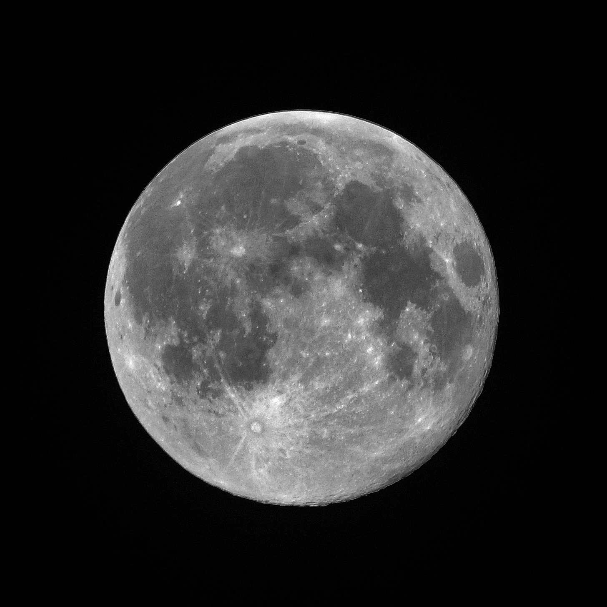

# The Looking Glass: The Curse of Perfect

*In the house that I grew up in, there was a formula for the American Dream.*

*Dear Readers, I’m working on 2 new pieces that are in varying states of draftiness. Instead of rushing them out, I’m going to sit with them a bit longer and in the meantime, pull out one of my favorite personal pieces from the archives. Have a lovely week!*

#### In the house that I grew up in, there was a formula for the American Dream.

My parents believed this so deeply that they left China with a one-way plane ticket and hundreds of dollars in folded bills, their mouths full of broken English.

Subscribe to The Looking Glass for musings on how we grow our careers, our teams, and ourselves

Here is how the formula went: learn English. Get the top marks in your class. Stay at least a grade level or two ahead on math and science. Enter and win academic competitions (science fair, math tournaments, etc). Ace the SATs. Become the valedictorian of your high school. Attend an Ivy League school. Study medicine or law. Afford a life of security and comfort.

The formula was not for my parents, who arrived to the game in the third quarter, too late to score a decisive victory. Their eventual middle class livelihood was built from the ground up waiting tables, losing sleep, and the continual habit of sacrifice.

But for me, my lips still loose enough to adopt perfect English, my eyes acute enough to observe and adopt the guise of American culture, it became my Gatsbian green light. My parents spoke of it with an unshakeable fervor. “Zhuo Li,” they’d point out to me every time we stopped at a red light and somebody tapped our window to see if we wanted to buy the day’s paper, “If you don’t study hard and get good grades, you too will have to sell newspapers on the street corner.”

In our circles, examples of children who had followed this formula to wild success were repeated like myths: “Auntie Wenfang’s daughter Sophia got a 1590 on her SATs and was just accepted into Harvard.” “The Tao’s son Frank did an internship at Dow Chemical lab and won first place at the science fair.” “Pam from church recently won a state piano award for her concerto performance.” Success was as uncomplicated as the times table — an unblemished report card; a Sunday dusting of the glittering trophy shelf that grew year over year; another line to add to the future resume that would transform into the entry card into the Promised Land of the Ivies.

In my parents’ mind, the concept of “perfect” existed. There was a right way to go about things. 99 was not as good as 100.

The American Dream, as I was taught, was less a spectrum than a binary switch.

---

I read Plato’s *Dialogues* in high school, and in it I was introduced to the concept of Forms. Instantly I was transfixed. In the book, Socrates suggests that for everything we can think of, tangible or not — dogs, grace, friendship — there is a true ideal form of that thing.

Yet the true ideal form is not something we mere mortals can behold. We are like prisoners tied down in a cave, a fire burning behind us as we stare straight ahead at the smooth grey walls. There, shadows dance — the outline of a dog wagging his tale, the dancing body of a ballerina, the swaying silhouettes of friends in song.

If this were all that the prisoners saw, would they not think the shadows were everything? That the dark shapes moving across the wall represented dogs, grace, and friendship in all their essence and beauty?

But no, we who are wiser, who are outside of the cave, who are a dimension apart, pity the cavemen. We see the real three-dimensional objects and know that they are so much more colorful, textured, and rich than shadows could ever be.

I could understand the allegory perfectly. It described my life: always in search of the brilliance of these Forms that I could never truly attain.

A worthy goal, surely? A foot, an inch, a nudge closer out of the cave and toward the true light.

---

I am sitting in a sunny conference room, my stomach fluttering. It is performance review season, and my manager is about to walk in and deliver my assessment.

I have sat in this chair every six months for the past few years, feeling this same cocktail of emotions: anticipation, dread, and expectation. I am equal parts Christmas kid — *Will there be a strong review or promotion under the tree? —* beaming cheerleader — *Come on, Rah! Rah! You know you are awesome!* — and nervous defendant waiting for the prosecution’s argument — *in what ways have I failed as a person*?

The door opens. My manager sits across from me. He is smiling. He hands me a sheet of paper. My eyes quickly skim the headline. I’ve done well — I’ve exceeded expectations. Relief floods through me. I allow myself 5 seconds to savor the feeling — I’ve done it! I’ve passed the test!

Then, I flip past the first page, barely giving a second glance toward my strengths or the nice things colleagues have said about me.

The second page is my quest. Here are all the things I could be doing better. Tallied here are the projects that weren’t up to par, the sloppy mistakes, and the blind spots.

My manager see this. “You’re always so eager to focus on your areas of growth, but I think you’re going to go farther with your strengths.”

“Of course,” I mutter.

But I am not hearing him. The message won’t sink in for another few years.

All I can think of at this time is how to build a better version of myself by ironing out what’s defective.

---

At a church event, among a cluster of mothers catching up after the last hymn is sung, my mom learned something that rocked her world.

It was the concept of *math camp*. She listened to another mother recount how her daughter spent weeks every summer out of state, in the woods somewhere, communing with a group of other precocious students over competitive math concepts.

After the camp was over and the students dispersed back to their homes, they would still see each other on the *circuit —* the network of math competitions that happened all over the country. The mothers sighed, imagining the aptitude in those cabins, the clink of medals during the award ceremonies.

My mother shook her head ruefully as she relayed this to me. “This starts at age 10!” she exclaimed.

I shrugged. I was already in high school. My math skills were fine but nothing to write home about. The part that sounded fun was the camp portion. I’d never spent weeks away from home with other students. But I knew my mother was thinking of something else.

Her formula was flawed. It hadn’t accounted for this. How much would the error cost?

---

At my high school graduation, I am seated in in the first row, in the first chair.

It’s a prime position with an amazing view of the stage, and I’m wearing my too-big crinkled blue robes and hat. The mood is equal parts festive and impatient. We know this milestone — *graduation —* is, like, a big deal. We know our parents and friends are in the audience, many working to dam the tears that will inevitably flow at seeing us cross this threshold into adulthood. Yet, we are also *so over* this — the waiting, the speeches, the *still being here* instead of having embarked already on that ship to our future lives.

Almost half a year ago, I received the fat acceptance letter to my top choice university. In the spring, I flew on a plane by myself for my first three day taste of university life at a “prospective freshmen” weekend. There, I pulled my first all-nighter talking about life and movies with people I’d never met before. The freedom was breathtaking — students just a few years ahead of me waxing about what to study next year, whether they wanted waffles or omelets for breakfast, creating their own formulas for the rest of their lives.

I felt suddenly awake, like Dorothy seeing color for the first time. I could go out and spread my arms, grasp the infinite, step into being the protagonist at the true start of my story.

You would have thought that this meant I’d return changed. That I could have sailed through the rest of my months in high school. That I could have eased off from the studying, the fanatic desire for the flawless scores.

But the prevailing thought in my mind as I sit in that first row, in that first chair, is that I am not up on stage, where the valedictorian and salutatorian sit, waiting to give their speeches.

I am number three.

---

My husband has a saying that if you’re satisfied with your life today, then every decision you’ve made in the past is a good one.

I disagree. We’ve had this conversation dozens of times. *You can always learn something from your past mistakes*, I say. *And knowing what I know now, I’d do so many things differently.*

*Like what?* he asks.

*I would have had a completely different college experience. Taken more classes I was genuinely interested in instead of optimizing for my resume.*

He grins. *But we met in college*. *And if you’d been taking calligraphy or underwater basket weaving, maybe wouldn’t have the relationship we have now.*

It’s hard to argue with that. And I know what he means — I wouldn’t change any part of the past even if I had the opportunity to. I’ve watched enough time travel movies to know that if you help more butterflies flap their wings, you might start a tsunami on the side of the world.

But I find an opening anyway. *It’s not about changing the past. It’s about doing it differently the next time.*

He rolls his eyes. *The next time you do college?*

He knows what I mean.

Looking back, even college felt structured and formulaic against the real world. After all, we still had the sturdy drumbeats of midterms and finals, the steady climb towards “graduation,” the finite set of classes and clubs.

But working over a decade in Silicon Valley has taught us that formulas are unreliable.

How can anything be perfect when the assumptions of the past are so often wrong in predicting the future?

How can you believe you have control when, depending on whether you were at the right place at the right time, fortune smiles and bestows upon you green light after green light to wealth, prestige and power?

Every day, there are examples. This investment went to zero. This other one multiplied like bunnies. These four years of blood, sweat and tears crumpled into nothing. This idea took two years to change an industry. This asshole guy you knew is suddenly the keynote speaker at every conference. This brilliant friend is struggling to get momentum for her next new idea.

But really, what does perfect even mean? Is it impact, is it wealth, is it having the right manners or the right clothes? Is it the adoration of your children or your parents or your spouse? Is it being liked or talked about in the right circles? Is it the number of followers or retweets? Is it the lack of suffering, or the overcoming of suffering, or the act of suffering nobly? Is it your capacity to savor the luxury of individual moments? Is it simply the feeling that you are going up instead of down?

On every metric, there are those above and below you. Examples are a dime a dozen.

I look back at my parents’ American Dream. Security and comfort. I have reached it, and more.

But what is mine?

---

I am a new mother, my first child curled into the crook of my arm. I marvel at her tiny eyelashes and fists, scarcely believing I have helped bring to life a full, perfect human being.

The days have blurred together. It’s been only a few weeks, but it has felt like a year. My universe has expanded, supernovas exploding silently in my heart. The quiet moments stretch out as delicate as the spaces between a spider’s web.

It’s time to breastfeed. My baby grunts and roots as I gently nudge her into position, wincing as she first latches on before relaxing as she gets into a steady suck. I’m thinking about my mother and mother-in-law, who have both welcomed me into the moms club with stories of their own journeys.

I had asked them if they breastfed.

My mother said she did, but it was a new concept at the time in China. She was part of an experimental group of mothers encouraged to try a new process at the hospital. The babies from their ward would all get wheeled in every few hours to be breastfed. “I was so nervous,” she told me. “I couldn’t tell which one was my baby, so I’d wait until all the other moms picked up theirs first and assumed the remaining one was mine. Thankfully, you turned out to look like me, so that’s how I know I hadn’t messed up.”

I asked her why the babies weren’t with the moms. After I gave birth, the hospital kept her in a little bassinet right next to me.

“Oh no,” my mother said. “That wasn’t the protocol. They wanted the mother to get plenty of rest.”

My mother-in-law had a similar story. She didn’t breastfeed her older kids, but did with her younger. “It just wasn’t the thing back when I had my first,” she said. “The prevailing wisdom was that formula was better. Then, suddenly, breastfeeding became the recommended thing.”

I reflect on the differences in new motherhood in just a few decades. How back then, the men stayed in the hospital waiting rooms during labor, smoking their cigarettes which we now know to kill you. How babies were advised to sleep on their stomachs, which today we’ve associated with a higher risk of sudden infant death syndrome. How immediate skin-to-skin contact for newborns was deemed less important than it is now.

Imagine if you had been following all the rules perfectly as a new mother in the 1960s.

How little we knew of the complexities of the human body. How little we know still of all that we don’t yet know.

The thing is, the rules of perfect are always changing.

---

I purchased a teak table earlier this year for my patio, loving the warm honey color that reminded me of the long rays of summer. A season later, the surface was a dull brown and riddled with stains, remnants of dinners involving buttered corn and grilled salmon and dollops of tartar sauce.

Last week, I grimaced when I saw the table, the stains like a patch of disease. *Of course I can fix this*, I thought. A few Youtube videos and Amazon purchases later, I felt like a warrior-sage of teak, armed with speciality cleaners to battle the stains.

The sun was high in the sky. I scrubbed the table with the cleaner, and to my delight, the dull brown lightened a few shades. My brush was the color of soot. *Go me!* Energized, I did a second round, then a third. The honey tones began revealing themselves.

But the stains persisted. I switched to a stronger brush and attacked a particularly egregious dark patch shaped like New Mexico. I put all my weight into the most vigorous scrub I could muster. To my satisfaction, I could see it weakening. I doubled down, slashing the bristles back and forth. A few minutes later, huffing, I stepped back. The stain had disappeared! One dragon down.

Across the table, there were dozens more. I felt a giddy satisfaction. I could tackle all of these. I could make the table like new, erase all these past accidents. I stretched my back and readied myself.

“Mommy, what are you doing?” My daughter’s face peeked out from the patio door. I hadn’t noticed that the sun had scooted across the sky, and now she was home from school.

“I’m cleaning the table, Baby.”

She couldn’t be less interested in my battle, the one I am poised to win. “Let me show you this drawing I did today!” she said waving a large blue piece of construction paper.

I looked back at my spotted table. Twenty more minutes was all I needed. I opened my mouth to tell her, then paused.

Is perfect a noble truth we pursue, or an illusion of control that blinds us?

I peel off my gloves and throw my weapons in the corner.

Life will always have stains.

Maybe it’s just about trading one kind of perfect for another.

---

The Looking Glass is a reader-supported publication. To receive new posts and support my work, consider becoming a free or paid subscriber.