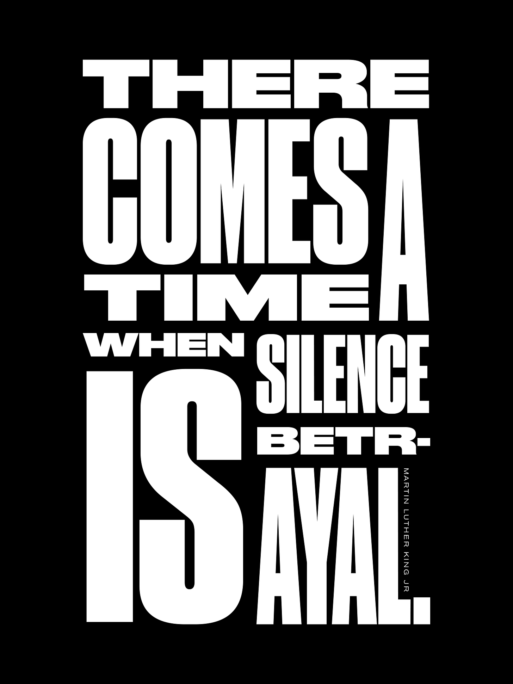

# Seven Reminders about Racism

👋 *Hi! I’m Julie Zhuo. I [help companies scale and build](http://inspirit.work/) people-centric products informed by data. I’m the author of a [popular management book](https://www.amazon.com/Making-Manager-What-Everyone-Looks/dp/0735219567). On the side, I’m currently [match-making designers to start-ups](https://lg.substack.com/p/the-looking-glass-candidates-companies). I used to lead design for the Facebook app. **The Looking Glass** is my once-a-month-ish musings on products, teams, and our journey as builders.*

---

I've had a number of different essays bouncing around in my head over the past few months, on the topic of personal kryptonite and social media context and product frameworks and some-such.

But the truth is, I've found it hard to write about building products with everything that's happening around us. Especially with the killing of George Floyd and the naked displays of racism that have been brought to light. Our world feels sick right now, its cells fighting each other, the cancer spreading malignant ideas one tweet after another.

And writing about racism—well, what [hasn't already been said](https://www.ibramxkendi.com/), [with data and context](https://www.beverlydanieltatum.com/about/), with [eloquence and fire](https://ta-nehisicoates.com/), by those I continue to learn from? It seemed the best thing I could do with my hours was read rather than write. Gain wisdom to move things forward rather than perpetuate the status quo. Examine my own past contributions to racial injustice and the biases I hold deep as a yellow-skinned “model minority” immigrant. More importantly, figure out: *What can I do from here*?

And yet. Every once in a while, I'm reminded of why I started writing in the first place. Writing is *thinking*. These are letters to my heart. The act of committing words to paper is a critical part of how I learn.

So here are some things I need to tell myself, repeatedly, in no particular order.

1. Being called a "racist" conjures up images of atrocity-committing white supremacists, their faces twisted with hateful anger or evil glee. We've been socialized to think of "those racists" as morally horrible, so we want to avoid being labelled *racist* at any cost. But this cost is astronomically high: we’ve been living under a veil of ignorance that whispers: *"Good" people (such as ourselves!) are not racists*. Therefore, we don't talk about racism. We don't talk about racism *so much* that it feels uncomfortable to bring up race up at all. But you can’t fix a problem if you don’t talk about it.
2. Doing something "racist" does not automatically mean that you are a morally horrible person. It means you've said or done things that perpetuate systems benefitting certain races—*your race*—at the expense of others. Instead of hearing *You said something racist* as *You just called me a shitty person*, we need to retrain ourselves to hear it as we would any other useful criticism—*Your statement had a negative impact on X person or group*. If you’re embarrassed about having that kind of negative impact, great! It means you care to do better (and are not a morally horrible person. )
3. The vast majority of conflicts are two-way streets, where each side can easily point out something the other side did that "wasn't right." For example, Person A calls Person B out for saying something racist, and Person B calls out Person A for saying it in an attacking manner. If you are Person C seeking to be a neutral mediator, you may think that both sides make reasonable points and could stand to improve by listening to the other. That seems fair, right? Well, only if Person B and Person A are in relatively equal positions of power. However, if they are not, *the person with greater power in the scenario holds greater responsibility to resolve (rather than escalate) the conflict.* If tensions escalate between a manager and her report, who would you expect to stay calm and collected? If a child and their parent both say "You're awful" in a moment of anger to one another, who do you think needs to apologize first?
4. People with power often don't recognize the power they have, especially if it’s afforded by the color of their skin. We tend to think of ourselves as "normal people," "human, just like everyone else." This is not wrong. None of us are exempt from joy, suffering, pain, fear, self-loathing, and the entire spectrum of the human condition. We all have moments when we feel trapped or suffocated by those who hold power over us. At the same time, *all* of us will be in contexts where we have more power than someone else. Some folks are in that position far more often due to the color of their skin (whiter), their gender (male), or their economic status (wealthier). Reflecting on your power is similar to the exercise of giving thanks: there is always something to be grateful for in your life (that somebody else doesn't have); there is always something you have more power to change than somebody else.
5. Privilege is all the good stuff you get that others don't because of the circumstances of your birth. Power is your ability to influence how the rules of our man-made society work. Both are hard to see in the same way that air is hard to see—you don't notice it until there's not enough. Black and Brown people have felt this lack for a long, long time. It started 400 years ago when they were enslaved, killed and treated as “less than” human. This lack continues today. Compared to a White or Asian person, it’s harder for them to be trusted, to be hired, to borrow money, to be believed, to be celebrated, to be in positions of power, or to be seen. We need to seek out, listen to and understand the stories of groups with less power and privilege to truly appreciate what we do have, and how we can apply that towards a more just society.
6. When someone calls you out for saying or doing something racist, your response can be very simple: 1) thank them for bringing it to your attention 2) apologize for the hurt you caused 3) commit to reflecting and improving. Thank them because feedback is a gift that will make your future self better. Apologize because you choose to believe people when they tell you they are hurt. Apologize even if your intentions were good, because good intentions don't negate the negative impact of your actions. (You still say *Sorry* when you accidentally bump into someone, don't you?) Reflect and strive for better because even if you don't think you did anything wrong in that moment, you will likely find lessons to take away upon further processing. If you have feedback about how the other person’s message could have been better delivered, now's not the time to share because it's probably coming from a place of defensiveness. Save it for when you’ve built trust with that person and can share it with *their* best intentions in mind.
7. Don't be afraid to acknowledge, talk about, and act on race and racism. You will make mistakes and say the wrong things. But that's true for anything worthwhile in life. At the end of the day, actions matter. What can you do with your power? Interrupt racism when you see it unfolding in front of you? Change the mind of a family member or friend? Elevate talent that is underrepresented? Invest energy into a BIPOC’s success? Vote for policies and leaders that will make our systems more just? To those with power in Silicon Valley, let the words of [Tiffani Ashley Bell](https://twitter.com/tiffani?ref_src=twsrc%5Etfw%7Ctwcamp%5Etweetembed%7Ctwterm%5E1268211598226841605%7Ctwgr%5E&ref_url=https%3A%2F%2Fzoronews.info%2F2020%2F06%2F09%2Fanalysis-the-technology-202-make-the-hire-send-the-wire-has-emerged-as-a-rallying-cry-for-silicon-valleys-black-leaders%2F) keep us focused on actions that count: “*Make the hire, send the wire.*”

---

[Poster graphic by Edinah](https://www.instagram.com/wildlogic/) - download and print it [here](https://fineacts.co/blm).