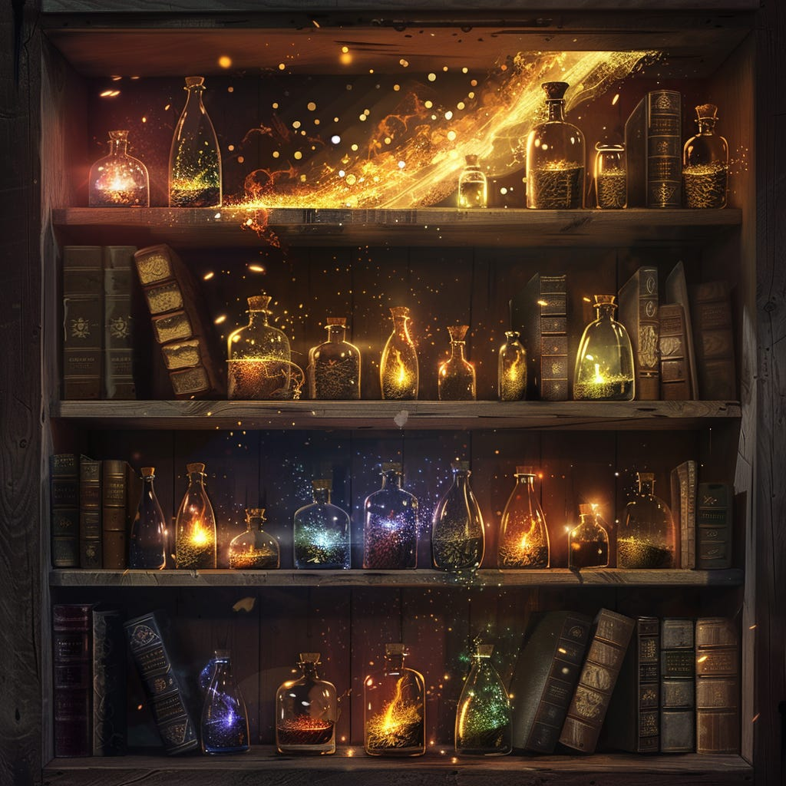

# The gifts of 40

*Unintuitive life lessons I wish I'd learned earlier*

Dear Readers,

I have consumed a thousand remixes of *Thing I’d wish I’d known when I was younger.* I gobble them up — every tweet, every tarnished cliche.

At first, it was because I wanted somebody else’s hard-earned wisdom to rub off a bit on me, so I might skate by life’s obstacles with a little more song and ease. Alas, someone should have told me then that [wisdom cannot really be told](https://lg.substack.com/p/the-looking-glass-you-cannot-teach).

The Looking Glass is a reader-supported publication. To receive new posts and support my work, consider becoming a free or paid subscriber.

Later, I read these lists for the nods of solidarity. Ah yes, I’ve gotten that tattoo also, a momento of some wild tragic story. It’s fun to compare the collections within our skins.

Every year that passes, my vault of life lessons grows ever more precious to me. Some turn sour and get discarded. Some take on more complex notes. Some get blended together. The task of labelling and organizing them overwhelms me. I won’t do it justice; I’ll spend years trying.

Every once in a while, to mark the spin of another year, I’ll pull a few out to try and capture in my own words.

Here I present them in a pithy form. Subscribers who want a more detailed explanation — write me your questions in this issue’s subscriber thread!   
  
Warmly,

~Julie

---

1. For whatever action scares you (and isn’t life-threatening), remember this surefire way to eliminate the fear: do it 100 times.
2. Taking advantage of youthful invulnerability is like taking out a loan. Over decades, your body eventually comes to call the debt.
3. The dimension of time explains why you are not your thoughts, your emotions, or your capabilities. None of these persist against the ticking of the clock.
4. You can only optimize what you can measure. This explains both why it’s impossible to optimize for happiness (not measurable), and why we so often optimize for things that don’t actually make us happy (money, social media likes, how much you can deadlift, etc—all easy to measure!)
5. Irritation and frustration shields anger. Anger shields sadness. Sadness is the thing we fear most. But sadness also connects us deepest. Seek the roots to sadness, and find the route to connection.

   ---
6. Your conscious mind is the CEO of your being. Like most CEOs, it *thinks* it has a good understanding of what’s happening on the ground. Like most CEOs, it rarely does.
7. Your worst nightmare or greatest dream is rarely what is *actually* happening in front of you; it’s the story you believe about what it means. Remember that we are fanciful storytellers. The later the hour, the hotter our emotional spark — the more fanciful our story.
8. If you want to change how you feel, learn to either change your actions or change the story you believe.
9. To learn how to change the story you believe, treat yourself like a black box (hello self-GPT!) Then, do repeated experiments (“prompt engineer”) until you figure out what changes your beliefs.
10. Every journey you take in life — whether in work or in love, for leisure or for achievement — masquerades a journey to understand yourself. The earlier you accept this, the more fruitful your adventures.

    ---
11. Satisfaction does not come from money, rewards, status or praise; it comes from impressing yourself. Mistaking the former for the latter is a source of enormous misery.
12. You impress yourself when you do something you care about that is hard. Remember: there is no pride without struggle.
13. What’s hard for you is defined by your brain and your brain only. If you can do something unconsciously, it is no longer hard for you.
14. What’s hard for you yesterday may no longer be hard for you today, and vice versa. Pay attention and be honest.
15. Walk towards what you’re afraid of, and you’ll always find your greatest learning opportunity.

    ---
16. The truth of anything is multidimensional and impossible to fully grasp. So a better question than “Is this <opinion / suggestion / advice> true?” is “In what scenario is this <opinion / suggestion / advice> true?”
17. Everything you hear is coated with the speaker’s bias. Identifying that bias makes you better at understanding in what scenario something is true.
18. Everything you say will be massively wrong in some scenario. Remember this and stay humble.
19. It’s easier to see the bias in others’ advice if you assume what they tell you is really what they’re trying to tell themselves.
20. Whenever a situation appears black or white to you, be wary. You’re either highly stressed, or you’re lacking context, or both.

    ---
21. The number one meta-skill for success is learning to be an exceptional learner.
22. The knowledge to solve practically all of the problems you encounter already exists somewhere in the world. But the vast majority of people would rather reinvent a shitty wheel than conduct a thorough search.
23. There are only 3 methods to learning: 1) increase your exposure to new knowledge (conversations, blogs, books, podcasts, etc.) 2) improve retention of knowledge (active listening, highlighting, reflecting, teaching, etc.) 3) increase your pace of personal experimentation (try doing new things). Most people focus on 1, but 2 and 3 yield more gains.
24. You tend to get better tactical advice from someone 2-5 years ahead of you than from your field’s top expert. You tend to get better wisdom from the expert.
25. The biggest detriment to learning is your pride. Once you believe you’re pretty good at something, prepare for your rate of growth to slow drastically.

    ---
26. The best analogy for the art of life is riding a rickety bicycle. At any moment, you need to lean some direction so you don’t fall. But which exact direction depends on where you are at that exact moment.
27. The qualities that make you exemplary will simultaneously be the qualities that make you miserable.
28. There is no love without loss. There is no gain without risk. Shielding yourself from pain is closing yourself off to joy.
29. Every glamour has its price; it’s not freedom of choice if you don’t understand what you’re paying.
30. If you believe your own story is interesting, you’ll naturally believe everyone else’s story will be interesting too. This one belief will make you a 10x better conversationalist.

    ---
31. The closest thing we have to a superpower is the bright gaze of our attention.
32. The kindest gift you can give is being a loving and truthful mirror for another.
33. The worst competition to take part in is who hurt who more.
34. The most irritating people are the ones who remind you of what you don’t like about yourself.
35. The most painful insult is what you believe yet feel ashamed to believe.

    ---
36. Never attribute to lying that which is adequately explained by self-unawareness.
37. The most effective way to grow a network is to: a) be fascinated by other people and b) enjoy helping for the sake of it.
38. Your hand’s skill can never surpass your eye’s taste. The world will try to turn your tastes average, so to sharpen your eye, choose to spend your time in communities of outlier tastes.
39. Whenever you hear yourself saying “I have to…”, change it to “I choose to…” Remembering you have choices does wonders for your well-being.
40. Advice does not give you wisdom; life gives you wisdom. If advice is ever useful, it’s only because it tidies up your messy house and helps you locate the key you’ve been searching for. Never forget: you already possess the key.

    ---

Thank you for reading The Looking Glass. This post is public so feel free to share it.

[Share](https://lg.substack.com/p/the-gifts-of-40?utm_source=substack&utm_medium=email&utm_content=share&action=share)

---

Subscribers, want me to go deeper into any of the above? Let’s chat!