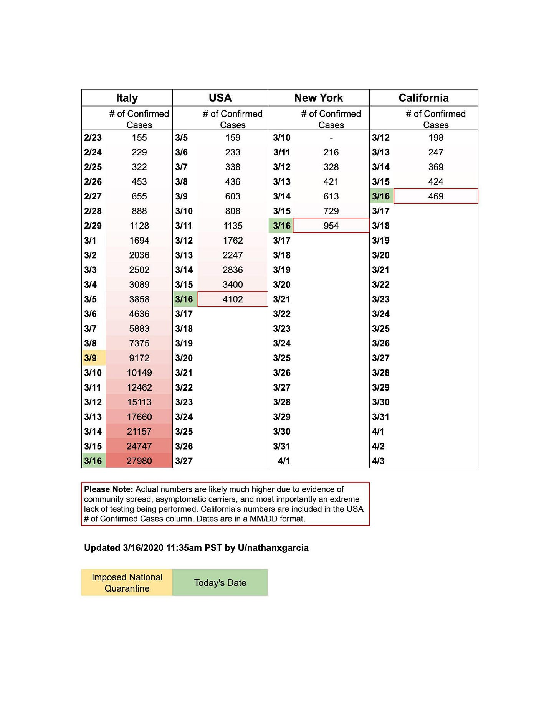

# Stay Healthy. Stay Data-Informed. 

👋*Hi! I’m Julie Zhuo. I [help companies scale and build](http://inspirit.work/) products of value. I’m the author of a [popular management book](https://www.amazon.com/Making-Manager-What-Everyone-Looks/dp/0735219567). I used to lead design for the Facebook app. **The Looking Glass** is my once-a-month-ish musings on products, teams, and ourselves.*

---

I have a confession to make.

As a designer, for years my primary goal was striving to improve my product intuition.

You see, I believed:

* The most wonderful products are that way because of a leader's keen insights borne of their intuition.
* People in suits and ties looking at sheets and sheets of numbers are missing the critical point—what it *feels* like. What’s the *story* that's going around. Where the *culture* is pointed.
* The main difference between senior and junior designers was the strength and quality of their intuition.

I believed the above with a deep and abiding fervor. The best designers I knew at the time had an alluring confidence borne of their well-honed sense of what was good and wasn't. I strove to be like them, listening and inhaling and jumping obstacles on the quest for that holy grail of *taste*. In fact, I wore my early-adoptnerness as a lifestyle, a badge of pride. I joined Facebook over Microsoft in 2006 because it was a product my friends and I used everyday. I sang the praises of my Welsh Airbnb hosts' hearty breakfast when most people were like, *You stayed in a stranger's house in another country?* I never advanced my poor cooking skills because I switched to getting meals delivered every day as soon as food delivery services got started.

As such, I regarded the use of big data to make judgements the way I would an attractive peddler with a golden voice coming to town to sell cures for a broken heart: with extreme skepticism.

And—it was true!—I saw misuses under the banner of “be data-driven!” everywhere. (And while we are at it, let’s retire the term “data-driven,” shall we? It implies spreadsheets are at the wheel of your decisions, not humans.) Hordes of A/B tests that had teams running on treadmills busily shipping, but doing little to truly improve things. Hours of analyses that focused on micro-optimizations. Data being used to justify decisions that plain and simply felt incorrect, only to later find—*oops, the logging was wrong*. I wrote lots of articles [here](https://medium.com/the-year-of-the-looking-glass/metrics-versus-experience-a9347d6b80b) and [here](https://medium.com/the-year-of-the-looking-glass/the-agony-and-ecstasy-of-building-with-data-56215764d67c) and [here](https://medium.com/the-year-of-the-looking-glass/metrics-a-story-df6699e9a685) to broadcast the message of "practice safe data-informedness!"

But really, I thought we were all really overdoing it. I nodded vigorously when Jeff Bezos said that in his experience, when anecdotes and data diverge, he believes the anecdotes. Here, in the living breathing world, we are not all perfectly rational beings. It's stories that brings tears to our eyes, not numbers.

We follow our hearts and guts, not kanban boards and excel sheets.

---

I don't know exactly when this started changing for me, but it did. Maybe it was one too many experiences [like this one](https://medium.com/@joulee/whatevers-best-for-the-people-thats-what-we-do-ed75a0ee7641). Maybe it was the Nth time my intuition turned out to be wrong in some small way, like *Wow, as much as I love me an aesthetically pleasing uncluttered set of icons with no labels, somehow the vast majority of the world appreciates and finds things easier to use with labels.* Or maybe I just wised up and realized that data is no different than a sword or a hammer or that excel sheet I keep bashing—it can be used well or it can be used poorly. Whatever the reason, I'm now firmly on the other side. I believe that most people, teams, companies, industries could function better by using *more data better*.

One of the best things about working at Facebook-scale, where every day millions or billions of people interact with what you design, is that you quickly become humbled by how little you can intuit about what works for someone who just got on the Internet for the first time and is trying to set up their first profile and make their first post. The world is soaringly vast in its complexity. To think our little molecule of an individual experience can be relied on help us understand the nuances of its evolution and ecosystems and weather formations is hubris. Taste, that lovely thing, is simply an ability to make a small ripple in the small pond we are familiar with; sometimes, luck takes that ripple and propels it across other ponds and oceans.

These past few weeks, with the weight of the coronavirus situation, I've felt all this so much more keenly. How easy is it to dismiss the risk of contagion when it was happening on the other side of the globe? How simple is it to tell ourselves—especially those of us who are young and healthy—that going to that party, or grabbing that coffee down the street, or hopping onto that train—is no big deal?

The enemy is invisible. The greatest defenses against this threat are classic "[slow ideas](https://www.newyorker.com/magazine/2013/07/29/slow-ideas)" as described by writer and doctor Atul Gawande—actions where the impact is not immediately seen or felt. You will not know that you were infected for maybe a week, if at all. You will not go to the hospital or die until two weeks after that, if at all. By the time the hospitals have sounded the alarms, it will be too late.

Our brains don't do well with slow ideas. For years, I have been waging a war with myself to get more sleep and exercise. We've heard the refrain over and over again—this is good for us. And yet, my health in 5, 10, 25 years constantly loses battles to the immediate satisfaction of time spent with friends, the completion of an episode, a new check on the to-do list, or simply the allure of words across a bright screen.

But this is the beauty and power of data. As new and scary as the coronavirus is, we are not flying blind. We know things from Wuhan and Italy, from the H1N1 flu of 2009 and the H2N2 flu of 1957. My understanding of our current situation has been made all the more tangible with well-articulated analyses written by those who study numbers and make excel spreadsheets. For example, [this chart](https://www.reddit.com/r/dataisbeautiful/comments/fjqroc/oc_updated_comparison_of_italy_usa_california_and/) (pasted below) makes it exceedingly clear that the US is on a similar trajectory to Italy and that we too will be fast approaching the red zone without greater steps (which luckily states and counties are starting to take.)

As another example, these two articles, [Coronavirus: Why You Must Act Now](https://medium.com/@tomaspueyo/coronavirus-act-today-or-people-will-die-f4d3d9cd99ca) and [Don't flatten the Curve, Stop it!](https://medium.com/@joschabach/flattening-the-curve-is-a-deadly-delusion-eea324fe9727) both left a deep impression on me because they get specific with their estimates based on well-founded numbers—how many hospital beds and respirators we have today, what the infection rate might be, what the transmission timeline looks like. As a result, you can critique the process, double-check the numbers, and judge the trustworthiness of the conclusion.

Many of you know that I've partnered with my friend Chandra Narayanan to start an advising company called [Inspirit](http://inspirit.work/). Chandra ran data at Facebook and Sequoia, and I think of him as one of the best data leaders in the world. Besides the fact that I am forever trying to emulate his wisdom and depth of care, I feel so lucky to work with Chandra because I get a first-row seat into how he approaches problems.

One thing he said about data and design has always been on my mind:

### **Diagnose with data. Treat with design.**

How wonderfully simple and powerful that statement is.

Great solutions are built upon solid and accurate assumptions about the world. You can't solve jack if your assumptions are off. And they are likely to be off in any scenario that involves millions or billions of people, involve a topic you haven't studied deeply, or where you don't have good data.

Rather than surfing by on intuition and taste, the data-informed individual adopts a beginner's mindset: Assume you know *nothing*.

Then, frame what you believe as *assumptions* or *hypotheses*. These are incredibly empowering words to help you get to great design. *I am assuming... My hypothesis is...* These words make it okay to be wrong, because they paint you as a truth-seeker rather than an egoist. These words invite contribution and follow-up questions from others, including the ever-critical *Why?*

These wordsopens the door for your assumptions or hypotheses to be validated through data, like what [Coronavirus: Why You Must Act Now](https://medium.com/@tomaspueyo/coronavirus-act-today-or-people-will-die-f4d3d9cd99ca) and [Don't flatten the Curve, Stop it!](https://medium.com/@joschabach/flattening-the-curve-is-a-deadly-delusion-eea324fe9727) have done. Are hospitals going be over capacity with the coronavirus? What would convince us one way or another? Let's calculate the number of bed or special equipment needed to treat COVID-19 cases. Let's calculate the number of people who are likely to be at the hospital for non-COVID-19 cases. Let's calculate the likely rate of spread and hospitalization based on what we know from other countries. Trust the process, and you can trust the conclusion.

Furthermore, looking at data helps you spot opportunities for new hypotheses. Chandra noticed a few weeks ago that infections seemed greater in places that were cold. He hypothesized that perhaps the virus doesn't spread as easily in hot temperatures. Chinese scientists had a similar hypothesis, and [their preliminary study results from analyzing 100 Chinese cities seem to indicate a relationship between lower transmission rate and higher temperature and humidity](https://papers.ssrn.com/sol3/Papers.cfm?abstract_id=3551767).

Once you have a believable diagnosis of the problem, that's where design jumps in.

Data cannot *solve* problems. It can only help you identify and understand them.

Design is the treatment, the phase where you brainstorm all the ways that the problem can be solved. Social distancing. Government policies that incentivize social distancing. Investments in faster production of critical supplies like masks and respirators. Greater and more efficient testing. Better ways for important information to get to the right people. Online learning. Giving aid to those most deeply affected. Developing and experimenting with new treatments. (If you are interested in how you can get involved, I just heard of this list of [COVID-19 projects looking for volunteers here](https://helpwithcovid.com/).)

There are also the things we must do for ourselves and our loved ones, to get through each day. Get a full night's sleep. Count the blessings we do have. Text or call hello. Let nature rejuvenate our souls. Be kind to one another, especially those who are the most vulnerable or are the hardest hit.

There is a surreal quality to such massive disruption on a global scale, like an entire year's (decade's?) worth of drama compressed into one sychronized dance, where health systems, stock markets, sports, work, schools and elections are all spinning wildly in chaos together.

There's a lot more to weather in the days, weeks and months ahead.

Stay healthy. Stay calm.

Let's make the best decisions we can by seeking out the best data we have.

---

### Some useful data sites related to COVID-19:

* [Dashboard - Coronavirus disease outbreak](https://avatorl.org/covid-19/) - focused on daily breakdowns and trends across the world. I check this every morning.
* [WSJ Coronavirus simulator](https://www.washingtonpost.com/graphics/2020/world/corona-simulator/) - wonderful animated visualization of how infections spread to explain why hunkering down at home and limiting social contact helps reduce the number of infections.
* [COVID Tracking Project](https://covidtracking.com/data/) - tracking cumulative positive and negative cases across the U.S. in every state
* [JHU Global Cases](https://www.arcgis.com/apps/opsdashboard/index.html#/bda7594740fd40299423467b48e9ecf6) - one of more well-known global dashboards showing data from across the world
* [Dashboard of the COVID-19 Virus Outbreak in Singapore](https://co.vid19.sg/dashboard) - Singapore doesn't have many cases but this is a well-designed and comprehensive breakdown of those cases, by gender, age, cluster, etc. I wish we had this for every country.