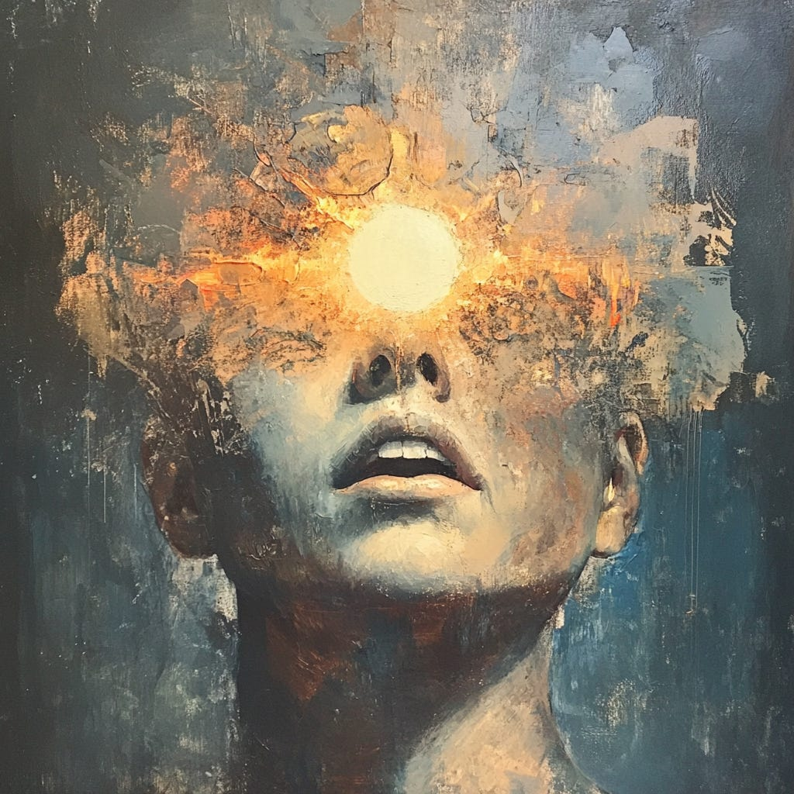

# Our Souls Need Proof of Work

*On wanting and comfort in the era of AI*

*Dear Readers: I’m starting a series exploring AI and how it might change us — the way we work and learn and relate to the world. There is so much to explore! Expect more frequency of posts going forward.*

---

#### i.

A prominent billionaire gave a graduation speech the other day. The key message? *Work hard to be successful.*

Another prominent billionaire gave a graduation speech a year later. The key message? *Working hard is bad advice. Do what feels fun for you to be successful.*

Europeans mock Americans for working too hard. Boomers lament Millenials for laziness and entitlement. Republicans fume that the work ethic America was built on is eroding like cliffs against crashing waves of handouts. Democrats believe that too much work is making us sicker and lonelier.

Today, hustling competes with YOLO. The search for spirituality wrestles with the quest for commercial success. *Slow down and meditate! Hurry up and embrace AI!* Technology will reduce our toil. Technology will kill our spirit.

At the heart of these debate lies the ever-pulsing question: what is the merit of hard work?

I don’t care to argue here whether hard work leads to material success.

What I want to suggest instead is that ***hard work*** **is necessary for our happiness and well-being**.

As it turns out, our souls needs proof of work.

---

#### ii.

What exactly is hard work?

I’m going to go with the simplest definition: hard work is whatever you personally feel is hard for you.

*Hard* means effortful; hard means discomfort; it takes something out of you to do it.

*Hard* is deeply personal.

For some people, the repetitive labor of digging weeds under the hot sun would be considered *hard.* For others, gardening is a relaxing hobby. For some, being in front of a crowd feels like chewing glass. For others, it’s as effortless as breathing.

You know what’s hard for you.

---

#### iii.

Let me ask you — what do you *want* for?

Perhaps you aspire for the keys to a gorgeous house with amazing light. Perhaps you wish to sample croissants in Paris and curry in Kyoto. Or perhaps your dreams are simpler — a rocking chair with a good book, cat purring on your lap.

I have gone through a million incantations of wants. When I was younger, I wanted what I saw on every fifth cartoon commercial — the doll that could whirl through the air when you pulled a string, the dog stuffed with three or four or five babies (surprise!), the miniature playground that fit in a compact (hi Polly!). I wanted the honey-blessed cereals and the jiggling jellos. I wanted freedom in a shopping cart.

As I grew older, those wants switched styles. Now it was bell-bottom jeans and tiny backpacks. Now it was tickets to the latest shows, the smile of a cute boy, the privacy of my own space. My wanting was ferocious; some call it ambition. I was the cliched American dreamer, wanting the lives I read about on glossy pages, in young adult novels, on rich people shows.

You know what they say. Be careful what you wish for, because you just might get it.

---

#### iv.

> *My father wasn't around  
> I swear that I'll be around for you  
> I'll do whatever it takes  
> I'll make the world safe and sound for you*
>
> Alexander Hamilton and Aaron Burr, *Hamilton* the musical

It is a tale as old as time: loving parents who have suffered want nothing more than to shield their children from pain.

Those who labor tirelessly to put food on the table push their kids onto certain paths (competition, college, medicine/law/engineering/mba) so they can attain the North Star of *being comfortable*.

Comfort is our religion. We hear its seductive whisper everywhere: *Isn’t your life stressful enough?* Why keep talking to people you disagree with? Why endure inconvenience when groceries, meals, and weed can come straight to your door? Why brave the hassle of your car when you can Zoom from home, fuzzy bunny slippers and all?

And if you must travel, why not let a car drive you? And if you want intimacy, why expose yourself to awkward introductions when you can effortlessly swipe? And if even swiping feels tedious, why not dig into the infinite carousel of graphic videos just a few clicks away?

And let’s not forget our new friend, AI. Humanity is about to be made over by the power of intelligence. Why should only the privileged have assistants? AI will plan your week, do your shopping, write your emails, curate your movies, gather your research.

This is just the start. Soon, AI-driven robots will tackle our cleaning, dishes, and childcare. AI therapists will say exactly what we crave to hear. AI will craft films tailored precisely to our personal tastes, and write novels so perfectly attuned to our desires that disappointment becomes obsolete.

Every new technology, service, and business promises to sweep away life's inconveniences. With a magician’s sleight of hand, they dangle attractive people and catchy jingles at every turn, beckoning you towards an endless buffet of fulfilled wants.

The siren song of the world’s largest corporations echoes the enduring message of devoted parents throughout history: *to be comfortable is to be happy.*

Yet this just might be the greatest lie we tell ourselves.

---

#### v.

*Wanting* has a mascot, and its name is dopamine—those tiny carriers of motivational signals zipping around our brains.

When dopamine first captured scientific attention, it was dubbed the chemical of pleasure. We believed that more dopamine equaled more happiness, but that’s only partly true. Dopamine is less about experiencing pleasure and more about driving us to seek future rewards. It's the thrill of anticipation rather than satisfaction itself.

Normally, our brains maintain a balanced dopamine state. But when something rewarding happens—the sweetness of honeyed cereal melting on your tongue, the joyful cha-ching of the register as you clutch a shiny new purchase—dopamine floods your system, spiking above your usual baseline. Suddenly, you're on cloud nine; angels sing and life feels incredible!

Soon enough, however, that sensation fades. Dopamine levels return to baseline, leaving behind a lingering whisper in your brain: *Didn’t that feel great? Do it again!* And so you do.

The Looking Glass is a reader-supported publication. To receive new posts and support my work, consider becoming a free or paid subscriber.

Yet each subsequent reward tends to deliver a slightly weaker dopamine spike—a phenomenon economists call diminishing marginal utility, explaining why the tenth bite never tastes as delicious as the first.

But dopamine has another, darker trick up its sleeve. Repeated dopamine surges alters the brain's wiring, reducing sensitivity to natural rewards. Each surge, like a crooked accountant skimming profits, subtly changes the way your brain responds, reducing your ability to feel pleasure and increasing your craving for more.

When dopamine hits are few and far between, your brain has time to reset. But constant dopamine stimulation starts changing your brain's chemistry, lowering its sensitivity to rewards. You begin to feel worse by default, craving increasingly intense stimulation just to achieve your original baseline of pleasure.

This destructive cycle is at the core of addiction, explaining why addicts become increasingly irritable and desperate without their fix. Their brain chemistry now needs the addictive substance or behavior just to feel "normal." Feeling pleasure demands ever-higher stakes.

Even if we’re not talking about heroin or slot machines, this pattern is everywhere. Remember when 12 likes on social media felt amazing? But then you posted a puppy hugging a koala—10,000 likes! You’re ecstatic! Yet future posts garner just 300 likes, leaving you disappointed, even though 12 once thrilled you.

Like an insatiable investor, dopamine constantly screams for *Bigger! Better! More!*

Satisfying dopamine’s demands is a losing game. The only way to win is to .

---

#### vi.

In Japan, often seen as a harbinger of the future, birth rates are declining sharply. Family units are unraveling, and there is the troubling rising of *hikikomori*—people who choose to no longer leave their homes.

These individuals, ensconced in the womb of modern conveniences—limitless internet, endless food deliveries, on-demand entertainment—have relinquished real-world connections. Yet this group is six times more likely to experience mood disorders than the general population.

This is the hidden trap of comfort: the easier and quicker our desires are fulfilled, the more our brains recalibrate. Getting what we want, without struggle or delay, numbs our ability to experience real joy and satisfaction.

In short, being too comfortable actually makes us miserable.

---

#### vii.

Have you heard of the Ikea effect?

In one study, subjects were willing to pay 63% more for furniture they assembled with their own hands than for an identical pre-assembled piece.

We tend to love what we pour effort into.

Comfort and convenience are valuable for the time it frees up. But how we use that time matters. We need voluntary challenge, not the empty victory of quick dopamine hits. Research into discomfort—like ice baths or cold showers—shows these short bursts of voluntary hardship boost mood, reduce stress, and build greater resilience.

Similarly, intermittent fasting — voluntarily making yourself hungry – has been linked to better emotional stability. Individuals experienced in fasting show greater resilience to negative events than non-fasters.

Paradoxically, doing hard things makes us happier. Putting ourselves through struggle makes us better equipped to enjoy life.

---

#### viii.

After my first big payday, I treated myself to all the things I’d ever wanted.

I flew to Paris and Tokyo. I ate the croissants and curries. I got a cat and read books with her. I found a gorgeous house with amazing light.

With each want fulfilled, my dopamine soared. But you know the story by now—it always came crashing back down, sometimes lower than before.

I became a food snob, I complained about my cat’s shedding, I declared I could no longer work productively in rooms with poor lighting.

And the list of wants never shrunk; as soon as something was checked off, the next one zipped in to take its place.

I designed and shipped countless iterations of software promising comfort and ease. My best works were greeted enthusiastically for about a week. And then the world moved on, sniffing for the next innovation. Nothing lasts except the hunger.

It took me far too long to spot the pattern: nothing I ever attained satisfied the fundamental wanting; ergo there is *no thing* that ever would.

But I noticed something else: there *was* long-term satisfaction to be found in my journey. It wasn’t in the attaining but in the *becoming*.

The process itself, of becoming the kind of person who could make useful things and earn a living doing so, was a joy. As was the process of deepening the craft of exploring or reading or writing.

A new type of wanting crept into my mind.

What if, instead of easy comfort, we wanted for challenges that transform us into better version of ourselves?

I want to be a person of warmth and depth and courage. Perhaps you want to be the kind of person who can run a marathon, or make a room belly-laugh, or be a young kid’s superhero.

We’re going to have to change something of ourselves. And this capacity for change is rooted in the extraordinary plasticity of the human brain. Can you guess what it takes for our brains to learn new skills?

Yep—effort and strain. Growth demands focus, alertness, and perseverance. We must embrace mistakes and grind through the hard. Only through discomfort can we feel the pride of accomplishment.

Don’t work hard for the money, or the promotion, or the accolades. All of that fades.

Don’t work hard because some authority figure said so. Life’s too short to live someone else’s script.

But ignore the whispers that beckon you towards the easy wins. The deepest human relationships come from accepting the best and worst of one another. The greatest love for a craft comes from discovering all the endless ways to be humbled by it.

Work hard for yourself, for the joy you feel when you’re one step closer to the person you’ve always wanted to be, whether it’s getting in the dirt to make things grow, getting in front of a crowd to speak your truth, or going out to find love behind all those brambles.

Our souls needs proof of work to sing.

---

#### **Other essays in the Looking Glass AI series**