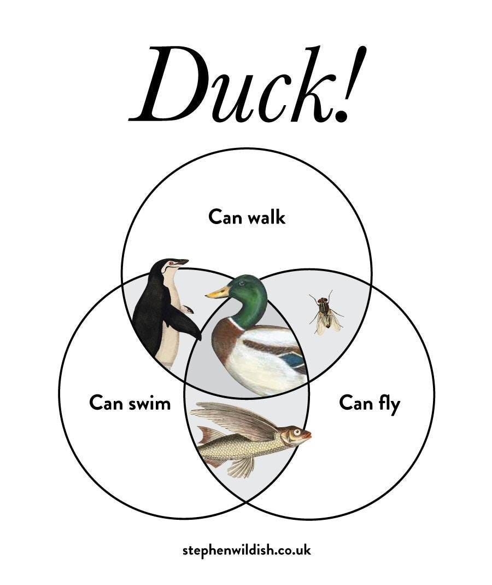

# Candidates, Companies, and the Matchmaking Problem

*What Makes you Different is also What Makes you Super*

👋 *Hi! I’m Julie Zhuo. I [help companies scale and build](http://inspirit.work/) people-centric products informed by data. I’m the author of a [popular management book](https://www.amazon.com/Making-Manager-What-Everyone-Looks/dp/0735219567). I used to lead design for the Facebook app. **The Looking Glass** is my once-a-month-ish musings on products, teams, and our journey as builders.*

---

Quarantining at home during a pandemic is, as I'm learning from my friends and the Internet, a great time to bake bread and meditate and remind ourselves why Michael Jordan is GOAT and adopt a new pet (in our case: chickens.) It's also a great time to engage in the sometimes exhausting and sometimes exhilarating process of "rethinking your life."

In all seriousness, so much has changed in astonishingly little time. Some people find themselves abruptly without a job. Some are realizing they could do their job just as well from home. Some are basking in a greater appreciation of the quiet of the woods, or lunch with the toddler, or the feeling of dirt beneath the fingernails. Some are unearthing new causes they will invest time and money into for years to come. Some will never again take for granted the simple gesture of a hug.

We were free to discover such things before, but so often we live in the prison of our minds. Sometimes it takes a circumstantial prison to make us reinvent ourselves. If your job no longer tethers you somewhere, where on Earth would you choose to live? If you've experienced a new way of passing your days, what will you no longer choose to tolerate? If you're discovered a gleaming new truth about yourself, how will you self-identify when this is all said and done?

During the past few weeks, I got the itch to start a side project connecting senior designers and design managers to opportunities with San Francisco Bay Area start-ups. A long-time secret aspiration of mine was to be like one of those old Chinese matchmakers who help young 'uns find their forever partners, but since I suck at that (the one time I tried) and I'm at that life stage where I don't know many single people, connecting designers seemed a better route. I suspect I enjoy matchmaking because I'm drawn to people's (and companies') stories, and there's no satisfaction like seeding a relationship that you believe may bear fruit for years to come. (You can tell I've taken up gardening, can't you?)

Perusing a bunch of design portfolios and start-up profiles recently as part of this matchmaking process, I'm reflecting a lot on how we talk about ourselves when we are trying to appeal to others, whether a prospective employee or employer.

Here was my approach for many years, which I'll call the ***Check all Boxes*** method: I'd round up a comprehensive list of what I felt were the most appealing qualities to a hiring manager, and then I'd make sure to hit upon each one in my resume, portfolio, or interview.

Hiring managers want a technical designer?

*Allow me to present my github repo!*

What about someone with mobile expertise?

*Sure, check out these mobile UIs from my comprehensive portfolio.*

Looking for someone who is "strategic," "systems-oriented," a "big-picture thinker," who knows their "best practices" and is "collaborative"?

*Don't mind if I do throw all these words into my profile soup of qualifiers!*

I did my homework. I'd peek at other people's resumes or portfolios, and made sure that I showcased myself similarly. After all, I reasoned, there were many fabulous opportunities swimming in the great Silicon Valley ocean, and I wanted to cast my net as wide as possible. I wanted suitors (or recruiters, in this case) knocking on my inbox, thinking I was perfect for their "fabulous opportunity to join a well-funded and mission-driven team." *I wanted to be wanted*.

Years later, I followed the exact same playbook on the hiring manager side. I presented my team as chock full of positive attributes that I thought would win us the most bites. We were *dynamic* and *innovative* and *open* and *collaborative* and all that sweet, corporate culture jazz.

I think we can all guess where this strategy ends, because we've seen the other side. The one where every company's values start sounding the same and jargon gets tossed around like a deflating balloon until it ceases to have useful meaning. The one where design portfolios start to blend together, everything from the aesthetics to the words that describe a unique soul coming off as overly familiar.

#### From my current perch as an aspiring matchmaker, I can tell you that the question I am most interested in, above all others, is: *What makes you (or your company) different?*

What are you passionate about that most others aren't? What past experiences have shaped your future motivations? If you were a member of the design Avengers, what would be your design superpower? What's your Kryptonite? (I'm crossing metaphors, but you get me.) What's recently left such an impression on you that you find yourself mulling on it days later? What stops you in your tracks and makes you go, "I wish I could have made that?"

And conversely, as a company: what kinds of people are a fit for your team but maybe not for some other team? Or have been extremely successful at other places but you don't think would be right for yours? In what ways do you hope to leave your mark on the world? What hoops are willing to jump through for that? What lines are you not willing to cross that you believe another company would choose differently?

Of course there is a baseline. Nobody wants to work with crooks or assholes. Everyone wants to work with talented, reliable people. A designer should show off projects that speak to her skills and expertise. Employees and employers both need to make money. We can assume these things to be true for everyone.

Beyond that, what makes you different?

Some of the above questions are hard to answer because "different" is a shifting target that requires comparison. Fifteen years ago, having an "open" culture was novel and Google and Facebook raised eyebrows with their Friday CEO Q&As and sprawling floor plans. Now, owing to their successes, so many tech companies describe themselves as "open" that you kind of gloss over it. Even while true, what's become a norm no longer registers.

The questions might also be hard to answer because each of us may only know ourselves and not how we compare in our fields. I might think I'm top notch at visual design, but my manager, or a colleague who has worked with many more designers than I have, may disagree.

### The Venn Diagram of Competences and Interests

Another way to think about your superpowers is to look at your Venn Diagram of Competencies and Interests and identify combinations that make you more uniquely suited for certain roles than others in your field.

For example, in the discipline of design: I can code. I'm decent at systems and interaction design. I've had experience hiring and managing. I know my way around a camera. I write quickly and can distill things into a readable essay. I am known as "easy to work with." I love ramen and video games.

In each of those specific skills I listed, I'm far from being the best. There are millions of people better at writing code or taking photos than me. I can name hundreds of writers whose prose and thinking I can only aspire to match. There are endless numbers of designers who leave me in the dust when it comes to their craft, execution, or ingenuity.

But draw the Venn diagram, and the intersection is where things get interesting.

As a designer-photographer, I don't stand out. Tons of designers are also photographers, many of them more skilled than me.

As a designer-coder, though, suddenly I have a rarer skillset that makes me appealing for certain jobs. Many start-ups appreciate designer-coders because they can move quickly by getting into implementation details. Additionally, companies that work on designing tools for developers would find that kind of background attractive.

I'm not terribly distinguished in the field of managers, nor in the arena of writers, but it's the intersection of the two that landed me a book deal for [The Making of a Manager](https://www.amazon.com/Making-Manager-What-Everyone-Looks/dp/0735219567). It turns out there aren't that many people who can do both well AND want to do it.

Indeed, interest can be a key distinguishing feature. Many designers got into the game because they love to imagine how they might improve the things they use—design tools, communication and social media apps, entertainment services, etc. There are fewer designers interested in, say, improving construction work flow, or shipping and agricultural logistics, or infrastructure and data tools. If you happen to be one of them, make that known!

Of course, you don't *have* to seek out career opportunities that take advantage of what you can do or love that others can't (or don’t). Even if I were one of the rare designers with an unreasonable love of ramen (I’m pretty sure this isn’t rare!), I wouldn't really look for opportunities in that space. Still, reflecting on your Venn Diagram of Competencies and Interests is a useful way to identify what's unique about your story.

(Check out this venn diagram from [Stephen Wildish](https://www.stephenwildish.co.uk/) that I love. Can you imagine Duck pitching itself? *Not only can I walk, I can also swim! AND I CAN FLY!*)

Some examples that would make the job of an aspiring matchmaking way easier:

* *I'm a curious designer who picks up new things quickly. In past 3 years, I worked at and became proficient in X, Y and Z...*
* *I'm a designer who loves tackling complex systems problems. I don't equate simplicity with doing less, but rather with making powerful tools easier to understand and master.*
* *I'm a designer that straddles product and brand design.*

* *Our company believes one of the most important factors to success is personal growth and development. As a result, we do X, Y, and Z.*
* *Our company values the power of storytelling. We believe every interaction we design, every chart we show people, and every notification we send should convey a story that inspires action.*
* *We believe our company will eventually be a great business, but there are a few things we're going to put ahead of business implications in any big decision: X, Y, and Z.*

### **But wait! If I don't present a checklist of everything that an employer/employee might want to see, won't I end up with fewer prospects?**

To that I say: the best relationships are long-term. When you and a company decide to join forces, you probably both have the expectation that it'll last more than a few months. During that time, you'll get to see each other's superpowers and kryptonites. There's no hiding them; every strength contains a weakness, and every weakness a strength. If the fit isn't good, sooner or later it comes out, and both sides suffer.

Help the world understand what makes you *you*. Talk about yourself specifically, in a way that's authentic to your values and talents. This is true both with finding love as well as finding a good employer or employee—you don't need to check a bunch of boxes to make yourself as broadly appealing as possible. You only need to find one fantastic match for who you are and what you need at this time.

### **This matchmaking thing you're doing sounds intriguing! Will you match me?**

I don't want to overpromise and underdeliver so I'm scoping this narrowly right now. Does the following describe you?

#### Designers:

* Senior Product Designers: 4 or more years professional design experience AND multiple interaction-heavy projects where you led end-to-end design.
* Product Design Manager: 2+ or more years management experience
* Ability to live and work in the U.S.
* Interest in working with a SF Bay-Area based company (could be in a remote capacity if the start-up is okay with remote)
* Interest in working with start-ups and smaller design teams.
* You don’t need to be actively looking for your next role to participate. It’s fine if you’d just like to be aware of if a dream opportunity comes along, or you think you might be interested in a new role within the next year.

#### Start-up founders/hiring managers:

* Your start-up is headquartered in the SF Bay Area or you are targeting hiring designers in the SF Bay Area (fine if you are open to remote employees)
* You have less than <25 designers currently on your team

If so, send me a note at [match@juliezhuo.com](mailto:match@juliezhuo.com) with the subject line *Designer/Start-up interested in D.Match*. No need to provide any other info beyond that initially—I'll respond with details on what I'd like to know about you.